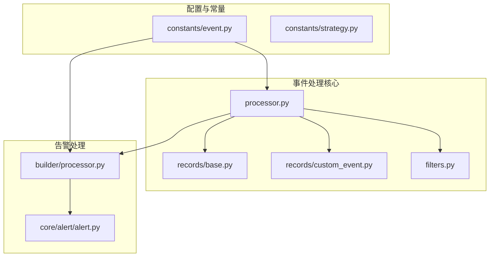
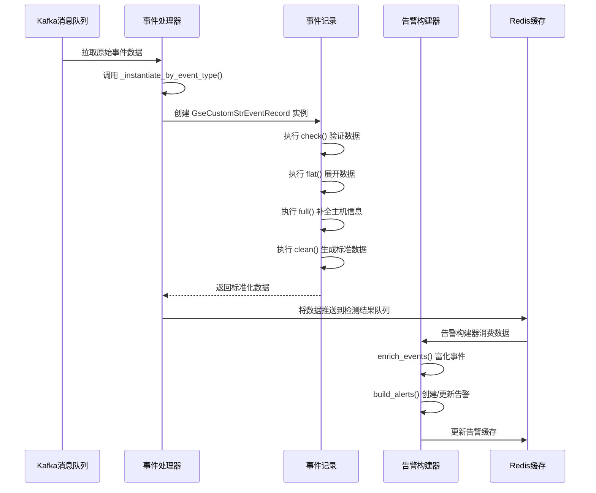
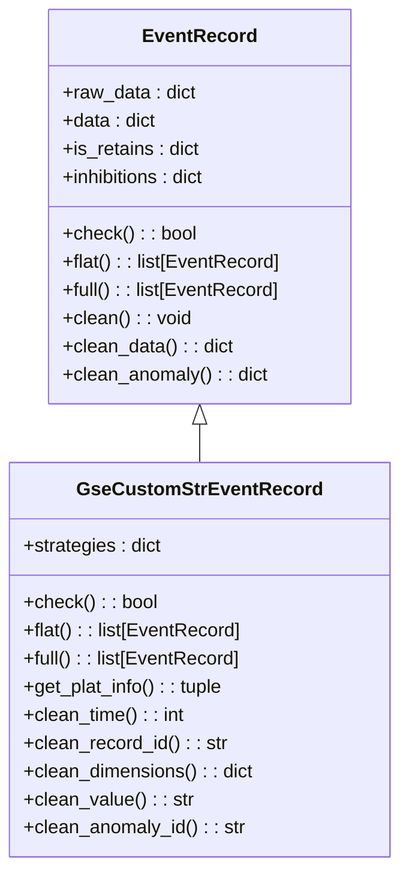
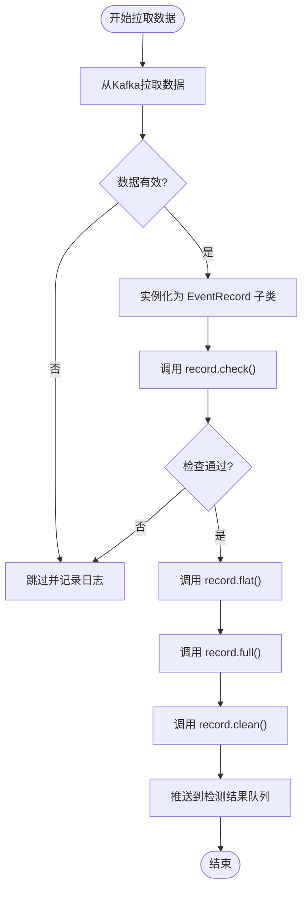
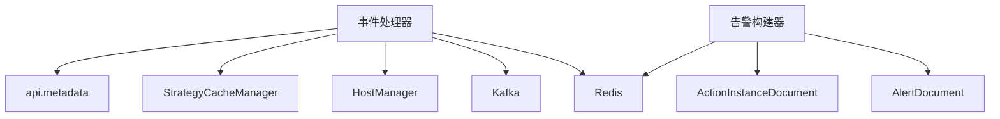

# 事件处理规则

<cite>
**本文档引用的文件**   
- [processor.py](file://bkmonitor/alarm_backends/service/access/event/processor.py)
- [custom_event.py](file://bkmonitor/alarm_backends/service/access/event/records/custom_event.py)
- [base.py](file://bkmonitor/alarm_backends/service/access/event/records/base.py)
- [event.py](file://bkmonitor/constants/event.py)
- [alert.py](file://bkmonitor/alarm_backends/core/alert/alert.py)
- [processor.py](file://bkmonitor/alarm_backends/service/alert/builder/processor.py)
</cite>

## 目录
1. [简介](#简介)
2. [项目结构](#项目结构)
3. [核心组件](#核心组件)
4. [架构概述](#架构概述)
5. [详细组件分析](#详细组件分析)
6. [依赖分析](#依赖分析)
7. [性能考量](#性能考量)
8. [故障排除指南](#故障排除指南)
9. [结论](#结论)

## 简介
本文档详细阐述了蓝鲸监控平台中事件处理规则的实现机制。事件处理是监控系统的核心功能，负责接收、解析、标准化、富化和处理来自不同数据源的原始事件数据。文档将深入分析事件处理流程，包括事件解析、标准化、富化等环节，描述事件处理规则的定义方法，如条件匹配、字段映射、数据转换等，并介绍事件级别的处理策略，包括告警升级、自动分类、优先级判定等。

## 项目结构
事件处理功能主要分布在`bkmonitor`模块下的`alarm_backends`子模块中。核心的事件处理逻辑位于`alarm_backends/service/access/event/`目录下，而告警的构建和管理则在`alarm_backends/service/alert/builder/`和`alarm_backends/core/alert/`目录中实现。常量定义则分散在`constants/`目录下。



**图源**
- [processor.py](file://bkmonitor/alarm_backends/service/access/event/processor.py)
- [base.py](file://bkmonitor/alarm_backends/service/access/event/records/base.py)
- [custom_event.py](file://bkmonitor/alarm_backends/service/access/event/records/custom_event.py)
- [processor.py](file://bkmonitor/alarm_backends/service/alert/builder/processor.py)
- [alert.py](file://bkmonitor/alarm_backends/core/alert/alert.py)
- [event.py](file://bkmonitor/constants/event.py)

**节源**
- [processor.py](file://bkmonitor/alarm_backends/service/access/event/processor.py)
- [event.py](file://bkmonitor/constants/event.py)

## 核心组件
事件处理系统的核心组件包括事件处理器（Event Processor）、事件记录（Event Record）和告警构建器（Alert Builder）。事件处理器负责从Kafka等消息队列中拉取原始事件数据，通过一系列过滤器进行预处理，并根据事件类型实例化为具体的事件记录对象。事件记录对象是事件处理的中心，它定义了事件的标准化流程，包括数据清洗、维度提取和异常信息生成。告警构建器则负责将处理后的事件与策略进行匹配，创建或更新告警，并执行后续的收敛、通知等操作。

**节源**
- [processor.py](file://bkmonitor/alarm_backends/service/access/event/processor.py)
- [base.py](file://bkmonitor/alarm_backends/service/access/event/records/base.py)
- [processor.py](file://bkmonitor/alarm_backends/service/alert/builder/processor.py)

## 架构概述
整个事件处理流程遵循一个清晰的管道模式。首先，`AccessCustomEventGlobalProcess`处理器从Kafka中拉取原始事件数据。然后，通过`_instantiate_by_event_type`方法，根据事件的类型（如自定义字符型、进程事件等）将其转换为对应的`EventRecord`子类实例（如`GseCustomStrEventRecord`）。接着，该实例会经过`flat`和`full`等方法进行数据展开和补全，最终通过`clean`方法生成符合标准格式的输出数据。这些标准化后的数据被推送到检测结果队列，由告警构建器消费，进行去重、富化和告警创建。



**图源**
- [processor.py](file://bkmonitor/alarm_backends/service/access/event/processor.py#L200-L352)
- [custom_event.py](file://bkmonitor/alarm_backends/service/access/event/records/custom_event.py#L0-L200)
- [base.py](file://bkmonitor/alarm_backends/service/access/event/records/base.py#L0-L151)
- [processor.py](file://bkmonitor/alarm_backends/service/alert/builder/processor.py#L0-L200)

## 详细组件分析

### 事件记录分析
事件记录（`EventRecord`）是事件处理的核心数据结构，它定义了所有事件处理的通用接口和基础功能。

#### 类图


**图源**
- [base.py](file://bkmonitor/alarm_backends/service/access/event/records/base.py#L0-L151)
- [custom_event.py](file://bkmonitor/alarm_backends/service/access/event/records/custom_event.py#L0-L200)

**节源**
- [base.py](file://bkmonitor/alarm_backends/service/access/event/records/base.py#L0-L151)
- [custom_event.py](file://bkmonitor/alarm_backends/service/access/event/records/custom_event.py#L0-L200)

### 事件处理流程分析
事件处理流程始于`AccessCustomEventGlobalProcess`类的`pull`方法。该方法从Kafka获取原始数据，然后调用`_instantiate_by_event_type`根据事件的`alarm_type`选择合适的`EventRecord`子类进行实例化。

#### 流程图


**节源**
- [processor.py](file://bkmonitor/alarm_backends/service/access/event/processor.py#L200-L352)

### 告警升级与自动分类分析
告警的升级和状态管理主要在`Alert`类中实现。当一个新的异常事件到来时，`update`方法会被调用。如果新事件的严重级别高于当前告警的级别，系统会自动提升告警的级别，并记录`SEVERITY_UP`日志。

#### 代码片段
```python
# 在 alert.py 的 update 方法中
if event.status == EventStatus.ABNORMAL and event.severity < self.data["severity"]:
    # 事件级别更高，提升告警级别
    self.data["severity"] = event.severity
    self.data["event"] = event.to_dict()
    self._refresh_db = True
    # 记录级别上升日志
    default_log = dict(
        op_type=AlertLog.OpType.SEVERITY_UP,
        event_id=event.id,
        severity=event.severity,
        description=event.description,
        time=event.time,
    )
```

**节源**
- [alert.py](file://bkmonitor/alarm_backends/core/alert/alert.py#L0-L200)

## 依赖分析
事件处理系统高度依赖于多个外部组件和内部服务。它依赖`api.metadata`服务来获取数据ID的元信息，依赖`StrategyCacheManager`来缓存和获取策略配置，依赖`HostManager`来查询主机的CMDB信息。在数据存储方面，它使用Kafka作为消息队列进行数据传输，使用Redis缓存检测结果、最后检查点和告警快照。这些依赖关系确保了系统的可扩展性和高性能。



**图源**
- [processor.py](file://bkmonitor/alarm_backends/service/access/event/processor.py#L0-L352)
- [alert.py](file://bkmonitor/alarm_backends/core/alert/alert.py#L0-L200)

## 性能考量
事件处理系统在设计时充分考虑了性能。它通过批量拉取和处理数据（`MAX_RETRIEVE_NUMBER`）来减少I/O开销。使用`cached_property`装饰器对`event_time`、`md5_dimension`等计算开销大的属性进行缓存，避免重复计算。同时，系统通过`service_lock`机制防止同一数据ID被多个进程同时处理，保证了数据处理的幂等性。告警构建器使用多锁机制（`multi_service_lock`）来精细化地控制对不同告警的并发访问，提高了处理效率。

## 故障排除指南
当事件处理出现问题时，可以按照以下步骤进行排查：
1.  **检查日志**: 首先查看`access.event`和`alert.builder`的日志，寻找`ERROR`或`WARNING`级别的日志信息。
2.  **验证Kafka连接**: 确认`topic`和`data_id`配置正确，并且Kafka服务正常运行。
3.  **检查策略配置**: 确保相关的事件处理策略已启用，并且其配置的`metric_id`与事件的`METRIC_ID`匹配。
4.  **排查主机信息**: 如果事件无法补全主机信息，检查`HostManager`是否能正常从CMDB获取数据。
5.  **监控指标**: 查看`ACCESS_EVENT_PROCESS_PULL_DATA_COUNT`和`ALERT_PROCESS_COUNT`等Prometheus指标，判断数据流是否正常。

**节源**
- [processor.py](file://bkmonitor/alarm_backends/service/access/event/processor.py)
- [alert.py](file://bkmonitor/alarm_backends/core/alert/alert.py)

## 结论
本文档详细解析了蓝鲸监控平台的事件处理规则。该系统通过一个模块化、可扩展的管道架构，实现了从原始事件接收到告警创建的完整流程。其核心在于`EventRecord`的标准化机制和`Alert`的状态管理逻辑。通过理解这些组件和流程，用户可以更好地配置和优化事件处理规则，确保监控系统能够高效、准确地响应各类事件。