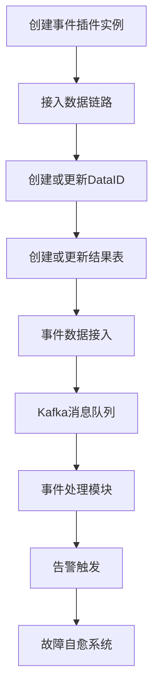
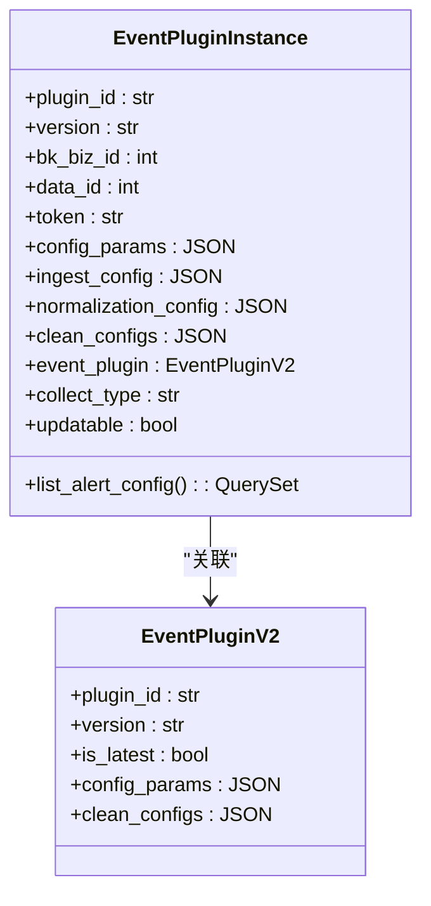
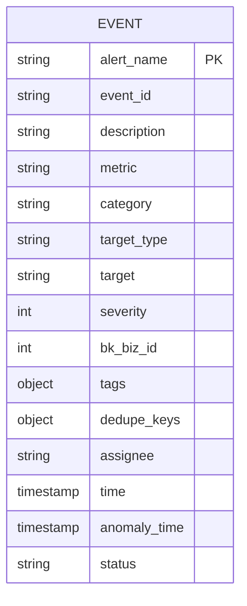
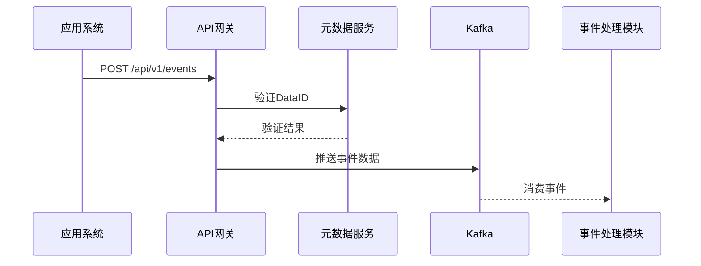
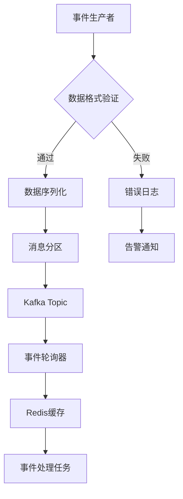

# 事件接入配置

<cite>
**本文档引用的文件**
- [accessor.py](file://bkmonitor/bkmonitor/event_plugin/accessor.py)
- [constant.py](file://bkmonitor/bkmonitor/event_plugin/constant.py)
- [plugin.py](file://bkmonitor/bkmonitor/models/fta/plugin.py)
- [event_poller.py](file://alarm_backends/service/access/event/event_poller.py)
- [kafka.md](file://wiki/kafka.md)
</cite>

## 目录
1. [简介](#简介)
2. [事件接入流程](#事件接入流程)
3. [事件数据格式](#事件数据格式)
4. [接入方式与配置](#接入方式与配置)
5. [安全机制](#安全机制)
6. [测试与验证](#测试与验证)
7. [常见问题排查](#常见问题排查)

## 简介
本文档详细介绍了蓝鲸监控平台中事件系统的接入配置方法。事件系统是监控平台的核心组件之一，负责接收、处理和分发来自不同数据源的事件数据。通过本配置，用户可以将自定义应用事件或第三方系统事件接入到监控平台，实现统一的告警管理和故障自愈。

**Section sources**
- [accessor.py](file://bkmonitor/bkmonitor/event_plugin/accessor.py#L1-L127)
- [kafka.md](file://wiki/kafka.md#L1-L56)

## 事件接入流程
事件接入的核心是事件插件实例（EventPluginInstance）的注册和配置。整个流程包括事件源注册、数据链路创建和结果表配置三个主要步骤。



**Diagram sources**
- [accessor.py](file://bkmonitor/bkmonitor/event_plugin/accessor.py#L1-L127)
- [event_poller.py](file://alarm_backends/service/access/event/event_poller.py#L1-L206)

**Section sources**
- [accessor.py](file://bkmonitor/bkmonitor/event_plugin/accessor.py#L1-L127)

### 事件源注册
事件源通过事件插件实例进行注册。每个事件源对应一个唯一的插件实例，包含插件ID、版本号、业务ID等关键信息。



**Diagram sources**
- [plugin.py](file://bkmonitor/bkmonitor/models/fta/plugin.py#L165-L244)

**Section sources**
- [plugin.py](file://bkmonitor/bkmonitor/models/fta/plugin.py#L165-L244)

## 事件数据格式
事件数据遵循预定义的JSON Schema规范，包含一系列标准字段和可选字段。

### 标准字段定义
事件数据必须包含以下标准字段，这些字段定义了事件的基本属性和元数据。



**Diagram sources**
- [constant.py](file://bkmonitor/bkmonitor/event_plugin/constant.py#L1-L101)

**Section sources**
- [constant.py](file://bkmonitor/bkmonitor/event_plugin/constant.py#L1-L101)

### 字段说明
| 字段名 | 类型 | 必填 | 描述 |
|-------|------|------|------|
| alert_name | string | 是 | 告警名称，事件去重的重要依据 |
| event_id | string | 是 | 事件的唯一标识符 |
| description | string | 是 | 事件的详细描述 |
| metric | string | 是 | 事件对应的指标项 |
| category | string | 是 | 事件所属的数据分层 |
| target_type | string | 是 | 产生事件的目标类型 |
| target | string | 是 | 产生事件的目标 |
| severity | int | 是 | 事件严重程度（1:致命; 2:预警; 3:提醒） |
| time | timestamp | 是 | 事件产生的时间 |
| status | string | 否 | 事件状态，默认为"ABNORMAL" |

## 接入方式与配置
事件系统支持多种接入方式，主要通过HTTP和Kafka协议进行数据传输。

### HTTP接入
HTTP接入是事件上报的主要方式之一，通过API网关接收事件数据。



**Diagram sources**
- [accessor.py](file://bkmonitor/bkmonitor/event_plugin/accessor.py#L1-L127)
- [event_poller.py](file://alarm_backends/service/access/event/event_poller.py#L1-L206)

### Kafka接入
Kafka作为核心消息中间件，承担事件数据的缓冲和分发。



**Diagram sources**
- [event_poller.py](file://alarm_backends/service/access/event/event_poller.py#L1-L206)
- [kafka.md](file://wiki/kafka.md#L1-L56)

**Section sources**
- [event_poller.py](file://alarm_backends/service/access/event/event_poller.py#L1-L206)

## 安全机制
事件接入过程包含多层次的安全控制，确保数据的安全性和完整性。

### 认证与授权
系统采用基于Token的认证机制，每个事件插件实例都有唯一的Token用于身份验证。

```python
# 示例：事件接入认证
def authenticate_event(data_id, token):
    """
    验证事件接入的合法性
    :param data_id: 数据ID
    :param token: 认证Token
    :return: 是否通过验证
    """
    plugin_inst = EventPluginInstance.objects.get(data_id=data_id)
    return plugin_inst.token == token
```

### 数据加密
敏感数据在传输过程中采用SSL/TLS加密，确保数据不被窃听或篡改。

**Section sources**
- [accessor.py](file://bkmonitor/bkmonitor/event_plugin/accessor.py#L1-L127)

## 测试与验证
接入完成后，需要进行充分的测试以确保事件能够正确上报和处理。

### 测试方法
1. **数据格式验证**：使用`validate_custom_event_group_name`接口验证事件数据格式
2. **链路连通性测试**：通过API发送测试事件，验证整个处理链路
3. **性能压力测试**：模拟高并发场景，测试系统的处理能力

```json
// 测试事件数据示例
{
  "alert_name": "CPU使用率过高",
  "event_id": "event-001",
  "description": "服务器CPU使用率持续超过90%",
  "metric": "cpu_usage",
  "category": "os",
  "target_type": "host",
  "target": "192.168.1.100",
  "severity": 1,
  "time": "2023-10-01T12:00:00Z"
}
```

**Section sources**
- [accessor.py](file://bkmonitor/bkmonitor/event_plugin/accessor.py#L1-L127)
- [test_records.py](file://alarm_backends/tests/service/access/event/test_records.py#L29-L61)

## 常见问题排查
### 事件未被处理
**可能原因**：
- DataID配置错误
- Kafka连接失败
- 事件格式不符合规范

**排查步骤**：
1. 检查事件轮询器日志
2. 验证Kafka消费者组状态
3. 确认事件数据格式是否符合标准

### 数据延迟
**可能原因**：
- Kafka队列堵塞
- 消费者处理能力不足
- 网络延迟

**解决方案**：
- 增加消费者实例
- 优化事件处理逻辑
- 检查网络状况

**Section sources**
- [event_poller.py](file://alarm_backends/service/access/event/event_poller.py#L1-L206)
- [kafka.md](file://wiki/kafka.md#L1-L56)