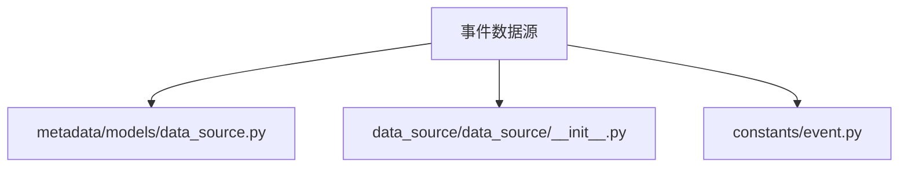
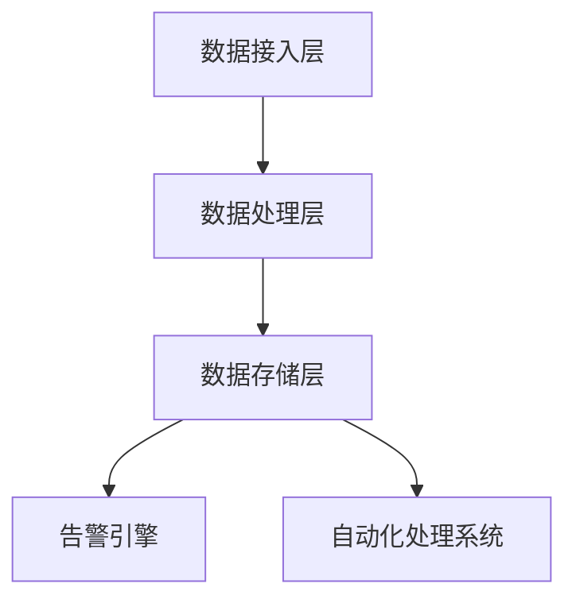
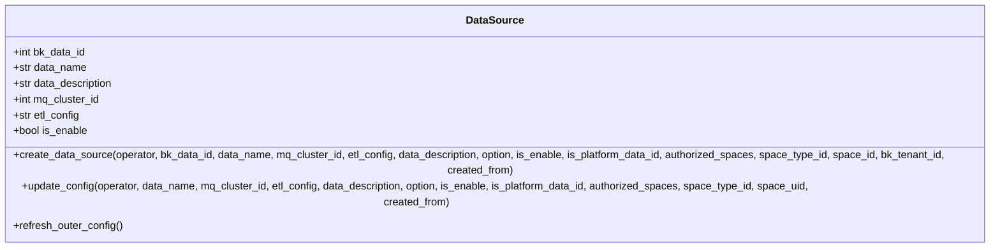
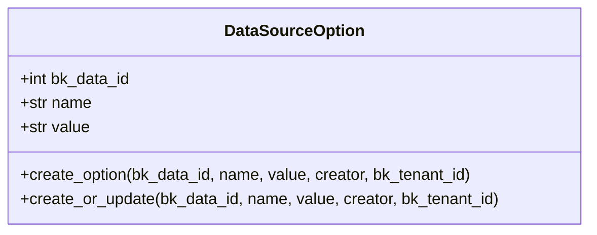
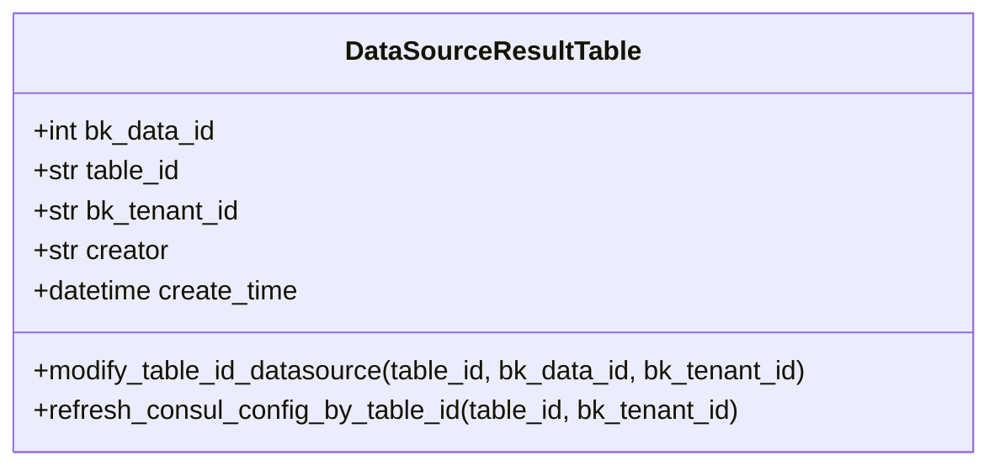
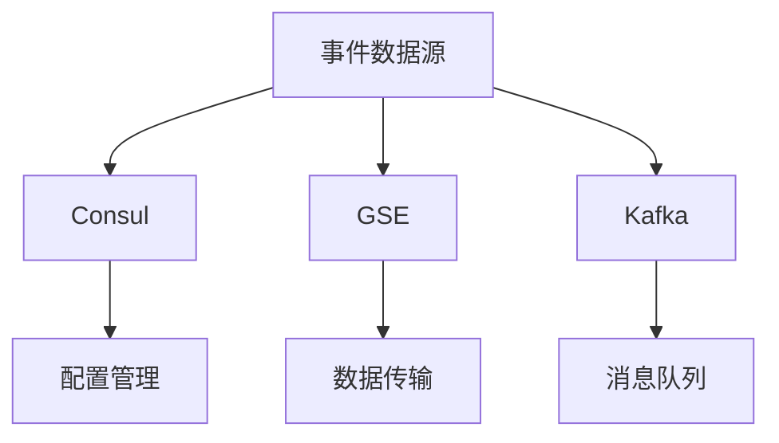

# 事件数据源

<cite>
**本文档引用的文件**   
- [data_source.py](file://bkmonitor\metadata\models\data_source.py)
- [__init__.py](file://bkmonitor\bkmonitor\data_source\data_source\__init__.py)
- [constants.py](file://bkmonitor\constants\event.py)
</cite>

## 目录
1. [简介](#简介)
2. [项目结构](#项目结构)
3. [核心组件](#核心组件)
4. [架构概述](#架构概述)
5. [详细组件分析](#详细组件分析)
6. [依赖分析](#依赖分析)
7. [性能考虑](#性能考虑)
8. [故障排除指南](#故障排除指南)
9. [结论](#结论)

## 简介
本文档详细介绍了蓝鲸监控平台中的事件数据源系统。该系统负责接收、处理和存储来自不同来源的事件数据，为告警引擎、自动化处理系统等下游服务提供可靠的数据支持。文档重点阐述了事件系统的接入方式、事件处理机制、数据结构定义、配置方法、查询过滤功能以及存储策略和性能优化方法。

## 项目结构
事件数据源相关代码主要分布在`bkmonitor/metadata/models/`和`bkmonitor/data_source/`目录下。`data_source.py`文件定义了数据源的核心模型和业务逻辑，而`data_source/__init__.py`文件则提供了数据源的抽象基类和具体实现。

**图源**
- [data_source.py](file://bkmonitor\metadata\models\data_source.py)
- [__init__.py](file://bkmonitor\bkmonitor\data_source\data_source\__init__.py)
- [event.py](file://bkmonitor\constants\event.py)

## 核心组件
事件数据源系统的核心组件包括数据源模型（DataSource）、数据源配置选项（DataSourceOption）和数据源与结果表的关系（DataSourceResultTable）。这些组件共同构成了事件数据的存储和管理基础。

**节源**
- [data_source.py](file://bkmonitor\metadata\models\data_source.py#L1-L1534)

## 架构概述
事件数据源系统采用分层架构，包括数据接入层、数据处理层和数据存储层。数据接入层负责接收来自不同来源的事件数据，数据处理层负责对数据进行清洗和转换，数据存储层负责将处理后的数据持久化存储。

**图源**
- [data_source.py](file://bkmonitor\metadata\models\data_source.py#L1-L1534)

## 详细组件分析

### 数据源模型分析
数据源模型是事件数据源系统的核心，它定义了数据源的基本属性和行为。模型包括数据源ID、数据源名称、数据源描述、消息队列配置、ETL配置等字段。

**图源**
- [data_source.py](file://bkmonitor\metadata\models\data_source.py#L1-L1534)

### 数据源配置选项分析
数据源配置选项用于存储数据源的额外配置信息，如时间单位、是否启用指标切分等。这些选项通过键值对的形式存储，便于灵活扩展。

**图源**
- [data_source.py](file://bkmonitor\metadata\models\data_source.py#L1400-L1534)

### 数据源与结果表关系分析
数据源与结果表的关系定义了数据源与存储表之间的映射关系。一个数据源可以对应多个结果表，这种关系通过`DataSourceResultTable`模型来维护。

**图源**
- [data_source.py](file://bkmonitor\metadata\models\data_source.py#L1400-L1534)

## 依赖分析
事件数据源系统依赖于多个外部组件，包括Consul、GSE、Kafka等。这些组件为数据源提供了配置管理、数据传输和消息队列等服务。

**图源**
- [data_source.py](file://bkmonitor\metadata\models\data_source.py#L1-L1534)

## 性能考虑
为了提高事件数据源的性能，系统采用了多种优化策略，包括使用事务外处理空间关系、批量刷新Consul配置、使用哈希Consul等。这些策略有效减少了数据库事务的长度，提高了系统的响应速度。

## 故障排除指南
在使用事件数据源时，可能会遇到一些常见问题，如数据源无法启用、配置同步失败等。这些问题通常可以通过检查日志、验证配置和重启服务来解决。

**节源**
- [data_source.py](file://bkmonitor\metadata\models\data_source.py#L1-L1534)

## 结论
事件数据源系统是蓝鲸监控平台的重要组成部分，它为平台提供了稳定可靠的数据支持。通过本文档的介绍，用户可以更好地理解和使用事件数据源系统，充分发挥其在监控和告警中的作用。