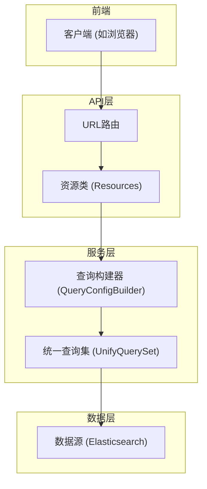
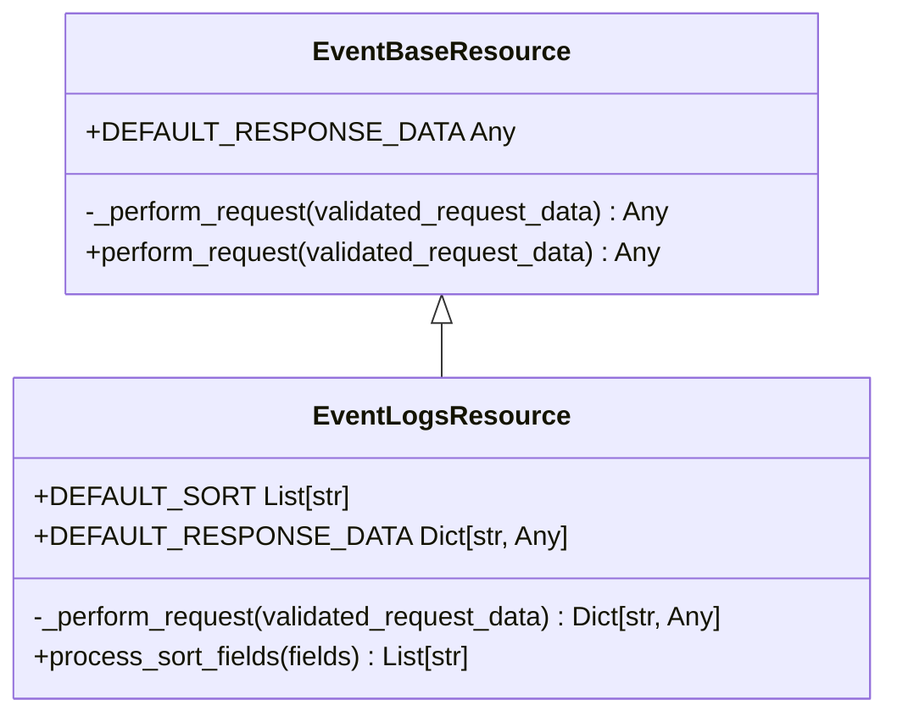
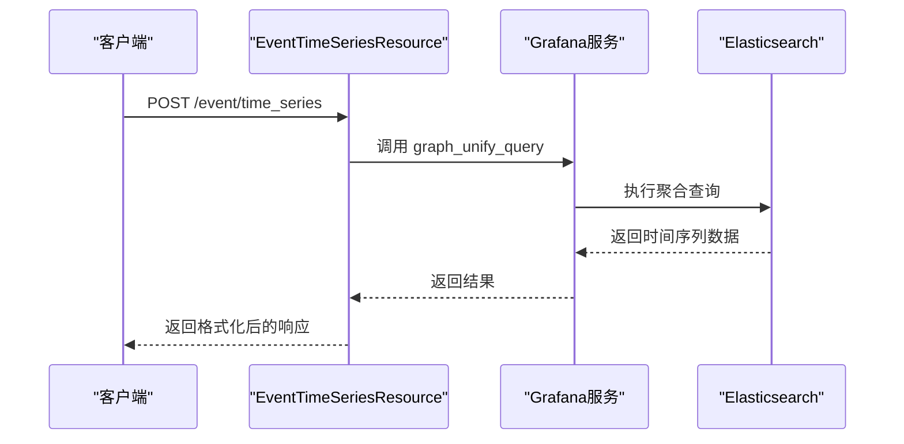
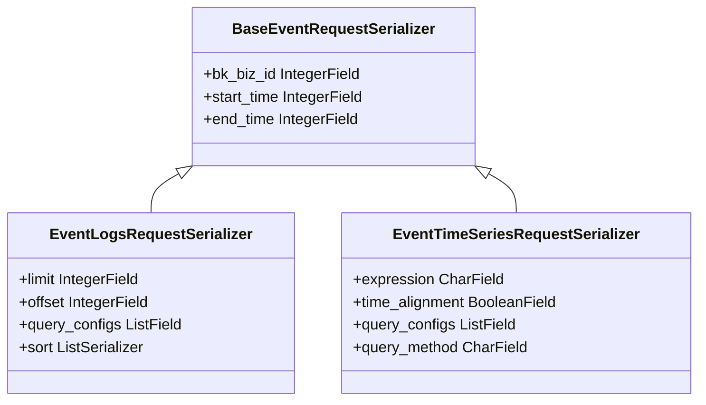
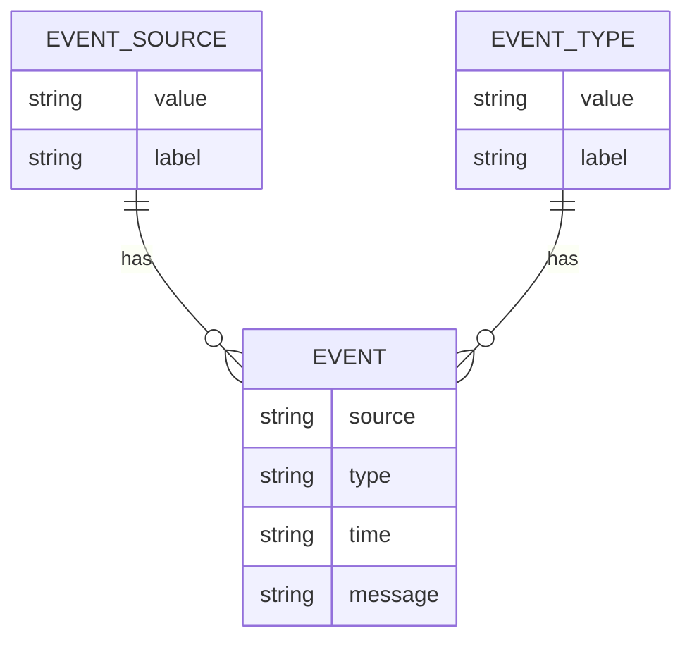
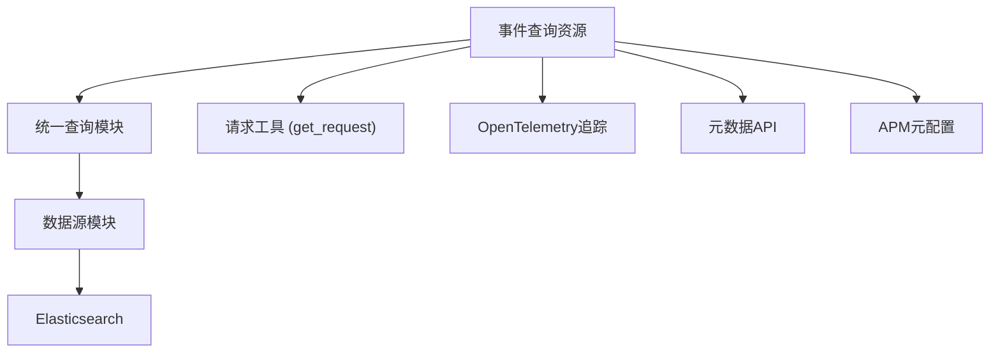

# 事件查询接口

<cite>
**本文档引用的文件**  
- [bkmonitor\packages\apm_web\event\urls.py](file://bkmonitor\packages\apm_web\event\urls.py)
- [bkmonitor\packages\monitor_web\data_explorer\views.py](file://bkmonitor\packages\monitor_web\data_explorer\views.py)
- [bkmonitor\packages\apm_web\event\resources.py](file://bkmonitor\packages\apm_web\event\resources.py)
- [bkmonitor\packages\monitor_web\data_explorer\event\resources.py](file://bkmonitor\packages\monitor_web\data_explorer\event\resources.py)
- [bkmonitor\packages\monitor_web\data_explorer\event\serializers.py](file://bkmonitor\packages\monitor_web\data_explorer\event\serializers.py)
- [bkmonitor\packages\monitor_web\data_explorer\event\constants.py](file://bkmonitor\packages\monitor_web\data_explorer\event\constants.py)
- [bkmonitor\packages\monitor_web\data_explorer\event\utils.py](file://bkmonitor\packages\monitor_web\data_explorer\event\utils.py)
</cite>

## 目录
1. [简介](#简介)
2. [项目结构](#项目结构)
3. [核心组件](#核心组件)
4. [架构概览](#架构概览)
5. [详细组件分析](#详细组件分析)
6. [依赖分析](#依赖分析)
7. [性能考虑](#性能考虑)
8. [故障排除指南](#故障排除指南)
9. [结论](#结论)

## 简介
本文档详细介绍了蓝鲸监控平台中的事件查询接口。该接口为用户提供了一套强大的RESTful API，用于查询、过滤、聚合和分析系统中产生的各类事件数据。文档涵盖了查询语言的语法、API端点、请求/响应结构、典型使用场景以及性能优化建议，旨在帮助开发者和运维人员高效地利用事件查询功能。

## 项目结构
事件查询功能主要分布在`bkmonitor`仓库的`packages`目录下，特别是`apm_web`和`monitor_web`两个包中。`apm_web`包提供了API的路由和资源入口，而`monitor_web`包则包含了核心的查询逻辑、数据处理和序列化器。

**文档来源**
- [bkmonitor\packages\apm_web\event\urls.py](file://bkmonitor\packages\apm_web\event\urls.py)
- [bkmonitor\packages\monitor_web\data_explorer\event\resources.py](file://bkmonitor\packages\monitor_web\data_explorer\event\resources.py)

## 核心组件
事件查询功能的核心组件包括：
- **资源类 (Resources)**: 定义了API的业务逻辑，如`EventLogsResource`、`EventTimeSeriesResource`等。
- **序列化器 (Serializers)**: 负责验证和序列化API的请求与响应数据。
- **常量 (Constants)**: 定义了事件类型、来源、领域等枚举值。
- **工具函数 (Utils)**: 提供了查询构建、字段处理、排序等辅助功能。

**文档来源**
- [bkmonitor\packages\monitor_web\data_explorer\event\resources.py](file://bkmonitor\packages\monitor_web\data_explorer\event\resources.py)
- [bkmonitor\packages\monitor_web\data_explorer\event\serializers.py](file://bkmonitor\packages\monitor_web\data_explorer\event\serializers.py)
- [bkmonitor\packages\monitor_web\data_explorer\event\constants.py](file://bkmonitor\packages\monitor_web\data_explorer\event\constants.py)

## 架构概览
事件查询接口采用分层架构，从上至下依次为：
1.  **API路由层**: 接收HTTP请求，将其分发到对应的资源视图。
2.  **资源层**: 实现具体的业务逻辑，调用底层服务。
3.  **服务/查询层**: 使用`UnifyQuerySet`构建和执行底层查询。
4.  **数据源层**: 与Elasticsearch等后端数据存储进行交互。

**图示来源**
- [bkmonitor\packages\apm_web\event\urls.py](file://bkmonitor\packages\apm_web\event\urls.py#L1-L22)
- [bkmonitor\packages\monitor_web\data_explorer\event\resources.py](file://bkmonitor\packages\monitor_web\data_explorer\event\resources.py#L0-L199)
- [bkmonitor\packages\monitor_web\data_explorer\event\utils.py](file://bkmonitor\packages\monitor_web\data_explorer\event\utils.py#L0-L199)

## 详细组件分析

### 事件查询资源分析
`EventBaseResource`是所有事件查询资源的基类，它提供了统一的异常处理和默认响应机制。具体的查询功能由其子类实现。

#### 事件日志查询资源
`EventLogsResource`用于查询原始事件日志，支持分页、排序和多条件过滤。

**图示来源**
- [bkmonitor\packages\monitor_web\data_explorer\event\resources.py](file://bkmonitor\packages\monitor_web\data_explorer\event\resources.py#L0-L199)

#### 事件时间序列查询资源
`EventTimeSeriesResource`用于查询事件在时间轴上的聚合趋势，通常用于生成折线图。

**图示来源**
- [bkmonitor\packages\apm_web\event\resources.py](file://bkmonitor\packages\apm_web\event\resources.py#L0-L165)
- [bkmonitor\packages\monitor_web\data_explorer\event\resources.py](file://bkmonitor\packages\monitor_web\data_explorer\event\resources.py#L0-L199)

### 事件查询序列化器分析
序列化器定义了API的输入和输出结构，确保数据的正确性和一致性。

#### 基础请求序列化器
`BaseEventRequestSerializer`定义了所有事件查询API共有的基础参数。

**图示来源**
- [bkmonitor\packages\monitor_web\data_explorer\event\serializers.py](file://bkmonitor\packages\monitor_web\data_explorer\event\serializers.py#L0-L188)

### 事件查询常量分析
`constants.py`文件定义了事件相关的枚举类型，是理解事件数据模型的关键。

#### 事件来源与类型

**图示来源**
- [bkmonitor\packages\monitor_web\data_explorer\event\constants.py](file://bkmonitor\packages\monitor_web\data_explorer\event\constants.py#L0-L199)

## 依赖分析
事件查询功能依赖于多个内部和外部组件。

**图示来源**
- [bkmonitor\packages\apm_web\event\resources.py](file://bkmonitor\packages\apm_web\event\resources.py#L0-L165)
- [bkmonitor\packages\monitor_web\data_explorer\event\resources.py](file://bkmonitor\packages\monitor_web\data_explorer\event\resources.py#L0-L199)
- [bkmonitor\packages\monitor_web\data_explorer\event\utils.py](file://bkmonitor\packages\monitor_web\data_explorer\event\utils.py#L0-L199)

## 性能考虑
- **查询范围**: 应尽量缩小`start_time`和`end_time`的时间范围，避免全表扫描。
- **分页**: 对于日志查询，应使用`limit`和`offset`进行分页，避免一次性返回过多数据。
- **聚合**: 使用`EventTimeSeriesResource`进行时间序列聚合，比获取原始日志更高效。
- **索引**: 确保在Elasticsearch中对常用的查询字段（如`time`, `type`, `source`）建立了合适的索引。

## 故障排除指南
- **查询无结果**: 检查`bk_biz_id`、`start_time`、`end_time`是否正确，确认数据源中是否存在符合条件的数据。
- **响应超时**: 检查查询时间范围是否过大，或`limit`值是否过高。
- **参数验证失败**: 检查请求体中的JSON格式和字段类型是否符合序列化器定义。
- **权限错误**: 确认调用API的用户或应用具有访问指定业务（bk_biz_id）的权限。

**文档来源**
- [bkmonitor\packages\monitor_web\data_explorer\event\serializers.py](file://bkmonitor\packages\monitor_web\data_explorer\event\serializers.py#L0-L188)
- [bkmonitor\packages\monitor_web\data_explorer\event\resources.py](file://bkmonitor\packages\monitor_web\data_explorer\event\resources.py#L0-L199)

## 结论
本文档全面介绍了蓝鲸监控平台的事件查询接口。通过RESTful API，用户可以灵活地查询和分析各类事件数据。理解其核心组件、API结构和性能优化点，对于高效利用该功能至关重要。开发者应参考提供的示例和最佳实践来构建稳定、高效的查询应用。