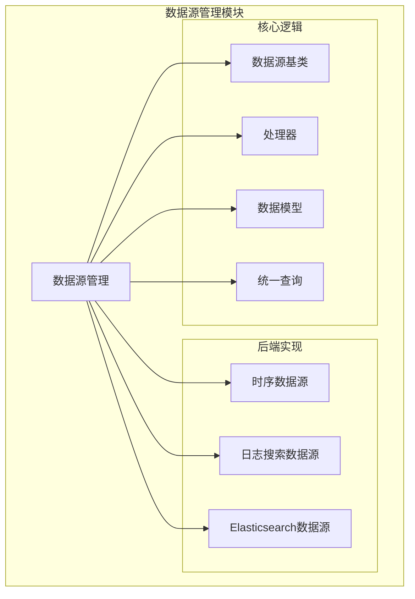
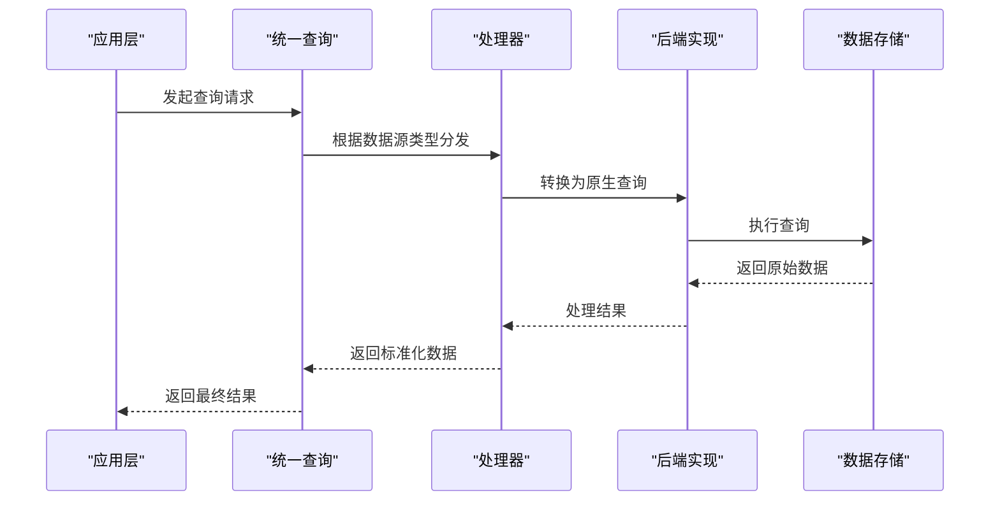
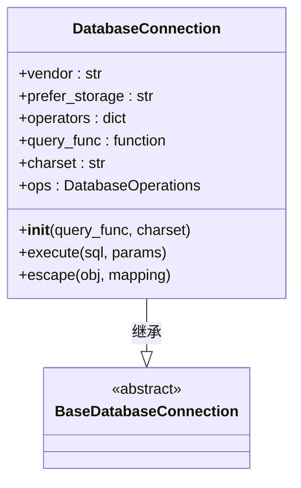
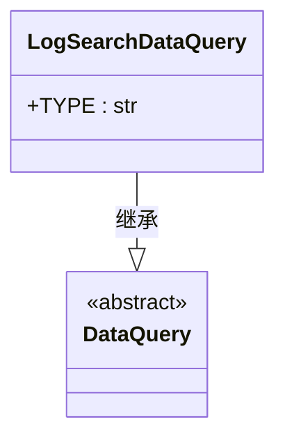
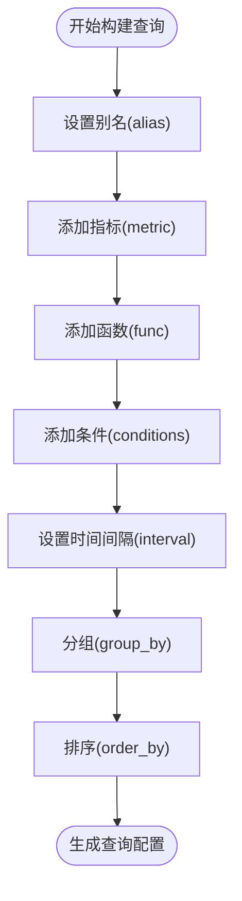
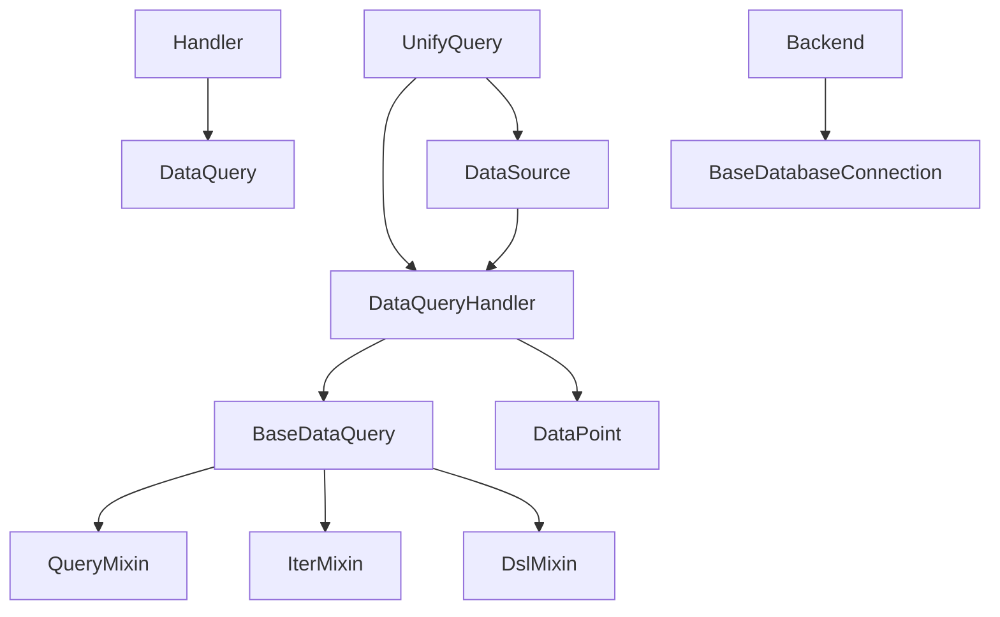

# 数据源管理

<cite>
**本文档引用的文件**   
- [data_source.py](file://bkmonitor\constants\data_source.py)
- [query.py](file://bkmonitor\bkmonitor\data_source\unify_query\query.py)
- [builder.py](file://bkmonitor\bkmonitor\data_source\unify_query\builder.py)
- [query.py](file://bkmonitor\bkmonitor\data_source\models\query.py)
- [data_structure.py](file://bkmonitor\bkmonitor\data_source\models\data_structure.py)
- [__init__.py](file://bkmonitor\bkmonitor\data_source\data_source\__init__.py)
- [time_series.py](file://bkmonitor\bkmonitor\data_source\handler\time_series.py)
- [log_search.py](file://bkmonitor\bkmonitor\data_source\handler\log_search.py)
- [elastic_search.py](file://bkmonitor\bkmonitor\data_source\handler\elastic_search.py)
- [connection.py](file://bkmonitor\bkmonitor\data_source\backends\time_series\connection.py)
- [connection.py](file://bkmonitor\bkmonitor\data_source\backends\log_search\connection.py)
</cite>

## 目录
1. [引言](#引言)
2. [项目结构](#项目结构)
3. [核心组件](#核心组件)
4. [架构概述](#架构概述)
5. [详细组件分析](#详细组件分析)
6. [依赖分析](#依赖分析)
7. [性能考虑](#性能考虑)
8. [故障排除指南](#故障排除指南)
9. [结论](#结论)

## 引言
本文档旨在提供关于“数据源管理”功能的全面技术文档。该功能是监控平台的核心组成部分，负责接入和管理多种类型的数据源，包括时序数据、日志数据和事件数据等。文档将详细介绍系统支持的数据源类型、统一查询接口的设计与实现、各类数据源的配置与查询方法，并提供配置和查询示例以及性能优化的最佳实践，帮助用户快速上手并高效使用该功能。

## 项目结构
数据源管理功能的代码主要位于`bkmonitor/bkmonitor/data_source/`目录下。该模块采用分层架构，核心组件包括：
- `backends`: 包含不同数据源后端（如时序、日志搜索、Elasticsearch）的具体实现。
- `data_source`: 定义数据源的基类和通用逻辑。
- `handler`: 处理不同类型数据源的查询逻辑。
- `models`: 定义查询相关的数据结构和模型。
- `unify_query`: 实现统一查询接口的核心模块。



**图示来源**
- [data_source](file://bkmonitor\bkmonitor\data_source)

**本节来源**
- [data_source](file://bkmonitor\bkmonitor\data_source)

## 核心组件
数据源管理的核心组件包括数据源类型定义、统一查询引擎和数据模型。系统通过`constants/data_source.py`文件中的枚举类定义了所有支持的数据源和数据类型。统一查询引擎`UnifyQuery`提供了一个抽象层，允许通过单一API查询不同后端的数据。`models`模块中的`DataPoint`类则定义了查询结果的标准化数据结构。

**本节来源**
- [data_source.py](file://bkmonitor\constants\data_source.py)
- [query.py](file://bkmonitor\bkmonitor\data_source\unify_query\query.py)
- [data_structure.py](file://bkmonitor\bkmonitor\data_source\models\data_structure.py)

## 架构概述
系统采用分层架构，将数据源的接入、查询和结果处理分离。上层应用通过统一查询接口发起请求，该接口根据数据源类型选择相应的后端处理器。后端处理器负责将查询请求转换为特定数据存储（如TSDB、Elasticsearch）的原生查询语言，并处理返回结果。



**图示来源**
- [query.py](file://bkmonitor\bkmonitor\data_source\unify_query\query.py)
- [handler](file://bkmonitor\bkmonitor\data_source\handler)
- [backends](file://bkmonitor\bkmonitor\data_source\backends)

## 详细组件分析

### 数据源类型与配置
系统支持多种数据源类型，主要分为三大类：时序数据、日志数据和事件数据。每种数据源由`数据来源标签`（DataSourceLabel）和`数据类型标签`（DataTypeLabel）共同标识。

#### 支持的数据源类型
根据`constants/data_source.py`文件的定义，系统支持以下主要数据源：

**数据来源标签 (DataSourceLabel):**
- **BK_MONITOR_COLLECTOR**: 监控采集器
- **BK_DATA**: 计算平台
- **CUSTOM**: 自定义指标
- **BK_LOG_SEARCH**: 日志平台
- **PROMETHEUS**: Prometheus

**数据类型标签 (DataTypeLabel):**
- **TIME_SERIES**: 时序数据
- **EVENT**: 事件数据
- **LOG**: 日志数据

例如，一个由监控采集器产生的时序数据源，其标识为 `(DataSourceLabel.BK_MONITOR_COLLECTOR, DataTypeLabel.TIME_SERIES)`。

#### 时序数据源配置
时序数据源的配置和查询主要通过`backends/time_series`模块实现。其核心是`DatabaseConnection`类，它负责与底层时序数据库（TSDB）进行通信。



**图示来源**
- [connection.py](file://bkmonitor\bkmonitor\data_source\backends\time_series\connection.py)

**本节来源**
- [data_source.py](file://bkmonitor\constants\data_source.py)
- [connection.py](file://bkmonitor\bkmonitor\data_source\backends\time_series\connection.py)

#### 日志数据源接入
日志数据源的接入由`backends/log_search`模块处理。该模块通过`LogSearchDataQuery`处理器与日志平台进行交互，支持复杂的日志查询和分析。



**图示来源**
- [log_search.py](file://bkmonitor\bkmonitor\data_source\handler\log_search.py)

**本节来源**
- [log_search.py](file://bkmonitor\bkmonitor\data_source\handler\log_search.py)

### 统一查询接口设计与实现
统一查询接口是数据源管理功能的核心，它通过`unify_query/query.py`文件中的`UnifyQuery`类实现。

#### 核心类 `UnifyQuery`
`UnifyQuery`类是统一查询的入口，它封装了查询的初始化、参数处理和结果返回。

```python
class UnifyQuery:
    def __init__(self, bk_biz_id, data_sources, expression, functions=None, bk_tenant_id=None):
        # 初始化查询参数
        self.bk_biz_id = bk_biz_id
        self.data_sources = data_sources
        self.expression = expression
        self.functions = functions or []
        self.bk_tenant_id = bk_tenant_id

    def query_data(self, start_time, end_time, ...):
        # 执行数据查询
        pass

    def query_log(self, start_time, end_time, ...):
        # 执行日志查询
        pass
```

#### 查询构建器
为了简化查询的构造，系统提供了`unify_query/builder.py`中的`QueryConfigBuilder`，它允许使用类似ORM的链式调用语法来构建查询。



**图示来源**
- [builder.py](file://bkmonitor\bkmonitor\data_source\unify_query\builder.py)

**本节来源**
- [query.py](file://bkmonitor\bkmonitor\data_source\unify_query\query.py)
- [builder.py](file://bkmonitor\bkmonitor\data_source\unify_query\builder.py)

### 配置与查询示例

#### 时序数据源查询示例
```python
from bkmonitor.data_source.unify_query.query import UnifyQuery
from bkmonitor.data_source.data_source import TimeSeriesDataSource

# 创建数据源
data_source = TimeSeriesDataSource(
    table="system.cpu_usage",
    metrics=[{"field": "usage", "method": "AVG"}],
    group_by=["host"],
    interval=60
)

# 创建统一查询
unify_query = UnifyQuery(
    bk_biz_id=123,
    data_sources=[data_source],
    expression="A",
    functions=[{"id": "sum", "params": []}]
)

# 执行查询
results = unify_query.query_data(start_time=1672531200000, end_time=1672617600000)
```

#### 日志数据源查询示例
```python
from bkmonitor.data_source.handler import DataQueryHandler

# 使用DataQueryHandler构建日志查询
query = (DataQueryHandler("bk_log_search", "log")
         .table("log_index_123")
         .dsl_raw_query_string("error AND 500")
         .limit(100)
         .order_by("_time desc"))

results = query.execute()
```

**本节来源**
- [query.py](file://bkmonitor\bkmonitor\data_source\unify_query\query.py)
- [__init__.py](file://bkmonitor\bkmonitor\data_source\data_source\__init__.py)

## 依赖分析
数据源管理模块依赖于多个外部组件和内部服务。其核心依赖关系如下：



**图示来源**
- [query.py](file://bkmonitor\bkmonitor\data_source\unify_query\query.py)
- [builder.py](file://bkmonitor\bkmonitor\data_source\unify_query\builder.py)
- [query.py](file://bkmonitor\bkmonitor\data_source\models\query.py)
- [data_structure.py](file://bkmonitor\bkmonitor\data_source\models\data_structure.py)

**本节来源**
- [query.py](file://bkmonitor\bkmonitor\data_source\unify_query\query.py)
- [builder.py](file://bkmonitor\bkmonitor\data_source\unify_query\builder.py)
- [query.py](file://bkmonitor\bkmonitor\data_source\models\query.py)

## 性能考虑
为了优化数据源查询的性能，建议遵循以下最佳实践：
1. **合理设置时间范围**：避免查询过长的时间跨度，应根据实际需求精确设置`start_time`和`end_time`。
2. **使用合适的聚合间隔**：对于长时间范围的查询，应使用较大的`interval`值以减少返回的数据点数量。
3. **精确的过滤条件**：在`where`条件中使用尽可能多的维度进行过滤，以缩小查询范围。
4. **限制返回结果数量**：通过`limit`参数控制返回的记录数，避免一次性获取过多数据。

## 故障排除指南
当遇到数据源查询问题时，可以按照以下步骤进行排查：
1. **检查数据源配置**：确认`data_source_label`和`data_type_label`是否正确。
2. **验证查询参数**：检查时间范围、过滤条件和聚合函数是否符合预期。
3. **查看日志**：检查`bkmonitor`服务的日志，特别是`bksql`查询日志，以获取详细的执行信息。
4. **测试连接**：确保后端数据存储（如TSDB、Elasticsearch）连接正常。

**本节来源**
- [connection.py](file://bkmonitor\bkmonitor\data_source\backends\time_series\connection.py)
- [query.py](file://bkmonitor\bkmonitor\data_source\unify_query\query.py)

## 结论
本文档详细介绍了数据源管理功能的架构、实现和使用方法。该功能通过一个统一的接口，成功地整合了多种异构数据源，为上层应用提供了强大而灵活的数据查询能力。通过理解其核心组件和最佳实践，用户可以更有效地配置和利用各种数据源，为监控和分析提供坚实的数据基础。