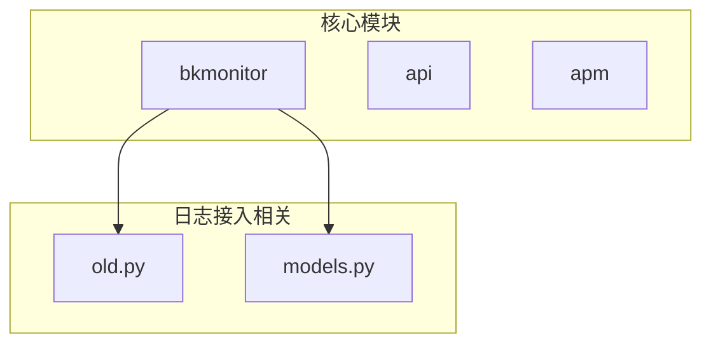
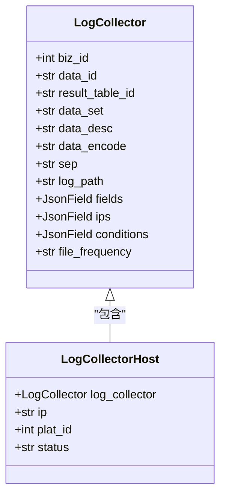
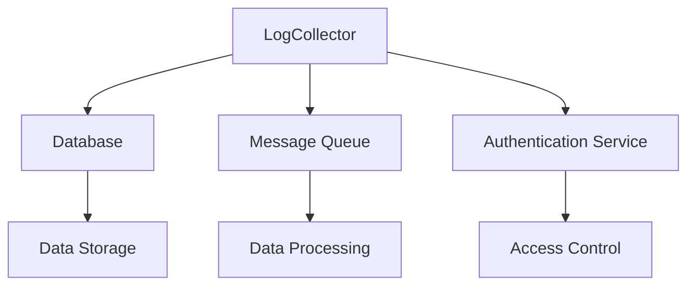

# 日志接入配置

<cite>
**本文档引用的文件**   
- [old.py](file://bkmonitor/packages/monitor/models/old.py#L791-L866)
- [cluster.py](file://bkmonitor/metadata/models/bcs/cluster.py#L121-L320)
- [selfmonitor\README.md](file://bkmonitor/alarm_backends/service/selfmonitor/README.md#L0-L6)
- [models.py](file://bkmonitor/packages/monitor/models/models.py#L0-L199)
</cite>

## 目录
1. [简介](#简介)
2. [项目结构](#项目结构)
3. [核心组件](#核心组件)
4. [架构概述](#架构概述)
5. [详细组件分析](#详细组件分析)
6. [依赖分析](#依赖分析)
7. [性能考虑](#性能考虑)
8. [故障排除指南](#故障排除指南)
9. [结论](#结论)

## 简介
本文档详细介绍了日志接入配置的相关内容，重点涵盖日志数据源的接入方式和配置参数。文档详细说明了如何配置日志采集路径、日志文件格式、编码方式、采集频率等参数；描述了日志源的认证和权限配置方法，包括API密钥、账号密码等安全配置；介绍了日志接入的监控和告警机制，以及如何检测日志接入异常和性能瓶颈。同时，文档提供了不同场景下的日志接入配置示例，如文件日志、系统日志、应用日志等，帮助用户根据实际需求进行配置。此外，还阐述了日志接入的性能优化建议和最佳实践，以及与其他系统（如日志解析模块）的集成方式。

## 项目结构
本项目采用分层架构设计，主要包含多个功能模块，如ai_agent、bkmonitor、api、apm等。其中，与日志接入配置直接相关的模块主要集中在bkmonitor目录下，特别是packages/monitor/models/old.py文件中定义了日志接入的核心模型。项目结构清晰，各模块职责分明，便于维护和扩展。

**图示来源**
- [old.py](file://bkmonitor/packages/monitor/models/old.py#L791-L866)
- [models.py](file://bkmonitor/packages/monitor/models/models.py#L0-L199)

**本节来源**
- [old.py](file://bkmonitor/packages/monitor/models/old.py#L791-L866)
- [models.py](file://bkmonitor/packages/monitor/models/models.py#L0-L199)

## 核心组件
日志接入配置的核心组件主要包括LogCollector和LogCollectorHost两个模型。LogCollector模型定义了日志接入的主要配置参数，如业务ID、数据源ID、结果表ID、日志路径、字符编码、数据分隔符、字段配置、采集对象IP列表、采集条件和日志生成频率等。LogCollectorHost模型则用于记录日志采集主机的状态信息，包括所属采集器、采集对象IP、平台ID和数据上报状态等。

**本节来源**
- [old.py](file://bkmonitor/packages/monitor/models/old.py#L791-L866)

## 架构概述
日志接入配置的架构设计遵循了模块化和可扩展的原则。通过LogCollector模型统一管理日志接入的配置信息，而LogCollectorHost模型则负责记录每个采集主机的具体状态。这种设计使得日志接入配置既具有良好的灵活性，又便于进行集中管理和监控。

**图示来源**
- [old.py](file://bkmonitor/packages/monitor/models/old.py#L791-L866)

## 详细组件分析
### LogCollector 分析
LogCollector模型是日志接入配置的核心，它定义了日志采集所需的所有基本信息。通过该模型，可以配置日志文件的路径、编码方式、分隔符等，同时还可以设置采集的频率和条件。这些配置项共同决定了日志数据的采集方式和质量。

#### 配置参数说明
- **biz_id**: 业务ID，用于标识日志所属的业务。
- **data_id**: 数据源ID，唯一标识一个数据源。
- **result_table_id**: 结果表ID，用于存储采集到的日志数据。
- **data_set**: 数据源表名，日志数据在数据库中的表名。
- **data_desc**: 数据源中文名，便于用户识别。
- **data_encode**: 字符编码，指定日志文件的编码格式。
- **sep**: 数据分隔符，用于解析日志文件中的字段。
- **log_path**: 日志路径，指定日志文件的存储位置。
- **fields**: 字段配置，定义日志文件中各字段的名称和类型。
- **ips**: 采集对象IP列表，指定需要采集日志的服务器IP地址。
- **conditions**: 采集条件，用于过滤不需要的日志条目。
- **file_frequency**: 日志生成频率，描述日志文件的生成周期。

**本节来源**
- [old.py](file://bkmonitor/packages/monitor/models/old.py#L791-L866)

### LogCollectorHost 分析
LogCollectorHost模型用于跟踪每个日志采集主机的状态。通过该模型，可以实时了解各个主机的日志采集情况，及时发现并处理异常。

#### 状态管理
- **log_collector**: 所属采集器，关联到具体的LogCollector实例。
- **ip**: 采集对象IP，标识具体的服务器。
- **plat_id**: 平台ID，用于区分不同的云平台或数据中心。
- **status**: 数据上报状态，反映当前主机的日志采集状态，包括启用中、正常、停用中、停用和异常等。

**本节来源**
- [old.py](file://bkmonitor/packages/monitor/models/old.py#L791-L866)

## 依赖分析
日志接入配置依赖于多个外部系统和服务，如数据库、消息队列、认证服务等。通过合理的依赖管理，确保了日志数据的可靠传输和安全访问。

**图示来源**
- [old.py](file://bkmonitor/packages/monitor/models/old.py#L791-L866)
- [cluster.py](file://bkmonitor/metadata/models/bcs/cluster.py#L121-L320)

**本节来源**
- [old.py](file://bkmonitor/packages/monitor/models/old.py#L791-L866)
- [cluster.py](file://bkmonitor/metadata/models/bcs/cluster.py#L121-L320)

## 性能考虑
为了保证日志接入的高效性和稳定性，系统在设计时充分考虑了性能因素。例如，通过合理设置采集频率和条件，避免不必要的资源消耗；利用缓存机制提高数据读取速度；采用异步处理方式减少对主线程的影响。

**本节来源**
- [old.py](file://bkmonitor/packages/monitor/models/old.py#L791-L866)

## 故障排除指南
当遇到日志接入问题时，可以通过检查LogCollector和LogCollectorHost模型中的配置和状态信息来定位问题。常见的问题包括配置错误、网络不通、权限不足等。针对这些问题，应逐一排查相关配置，并确保所有依赖服务正常运行。

**本节来源**
- [old.py](file://bkmonitor/packages/monitor/models/old.py#L791-L866)
- [selfmonitor\README.md](file://bkmonitor/alarm_backends/service/selfmonitor/README.md#L0-L6)

## 结论
本文档全面介绍了日志接入配置的相关内容，从配置参数到架构设计，再到性能优化和故障排除，为用户提供了一套完整的解决方案。通过遵循本文档的指导，用户可以有效地配置和管理日志接入，确保日志数据的准确性和完整性。