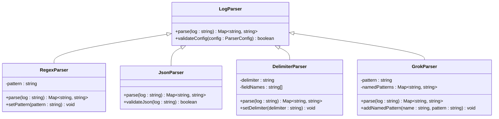

# 日志解析规则

<cite>
**本文档引用的文件**   
- [log_search.py](file://bkmonitor\alarm_backends\core\api_cache\log_search.py)
- [log_search.py](file://bkmonitor\bkmonitor\data_source\handler\log_search.py)
- [log.py](file://bkmonitor\bkmonitor\documents\log.py)
- [log_trace.py](file://bkmonitor\bkmonitor\trace\log_trace.py)
- [logging.py](file://bkmonitor\bkmonitor\trace\logging.py)
- [log.py](file://bkmonitor\metadata\models\custom_report\log.py)
- [log_datalink.py](file://bkmonitor\metadata\resources\log_datalink.py)
- [log_handler.py](file://bkmonitor\packages\apm_web\handlers\log_handler.py)
- [log_trace_plugin_config.py](file://bkmonitor\packages\apm_web\meta\plugin\log_trace_plugin_config.py)
- [log.py](file://bkmonitor\packages\common\log.py)
- [log.py](file://bkmonitor\packages\monitor_web\grafana\resources\log.py)
- [log.py](file://bkmonitor\packages\monitor_web\plugin\manager\log.py)
- [log.py](file://bkmonitor\packages\monitor_web\scene_view\resources\log.py)
- [clustering.py](file://bkmonitor\alarm_backends\service\new_report\handler\clustering.py#L114-L146)
- [new_strategy.py](file://bkmonitor\bkmonitor\strategy\new_strategy.py#L2174-L2208)
- [plugin.py](file://bkmonitor\core\errors\plugin.py#L158-L175)
- [base.py](file://bkmonitor\packages\monitor_web\plugin\manager\base.py#L596-L629)
- [main.go](file://bkmonitor\packages\monitor_web\plugin\process_matcher\main.go#L73-L119)
- [utils.py](file://bkmonitor\packages\monitor_web\promql_import\utils.py#L58-L85)
- [tail_sampling_flink.java](file://bkmonitor\apm\core\handlers\bk_data\tail_sampling_flink.java#L28-L69)
- [Application-K8s-Ingress.json](file://bkmonitor\packages\monitor_web\grafana\dashboards\apm_ebpf\Application-K8s-Ingress.json#L1444-L1486)
- [test_compose_data_link_configs.py](file://bkmonitor\metadata\tests\data_link\test_compose_data_link_configs.py#L214-L252)
- [Application-DNS-Monitoring.json](file://bkmonitor\packages\monitor_web\grafana\dashboards\apm_ebpf\Application-DNS-Monitoring.json#L1891-L1927)
- [test_es_resources.py](file://bkmonitor\metadata\tests\resources\test_es_resources.py#L176-L214)
- [get_collect_log_detail.md](file://bkmonitor\docs\api\apidocs\zh_hans\get_collect_log_detail.md#L43-L55)
- [get_collect_log_detail.md](file://bkmonitor\support-files\apigw\docs\zh\get_collect_log_detail.md#L40-L52)
- [alert_log.py](file://bkmonitor\packages\fta_web\alert\handlers\alert_log.py#L199-L227)
- [README.md](file://bkmonitor\alarm_backends\service\trigger\README.md#L196-L200)
- [V3.2.1066_20200622.md](file://bkmonitor\version_logs_md\zh-cn\V3.2.1066_20200622.md#L12-L16)
- [test_data_source.py](file://bkmonitor\bkmonitor\data_source\tests\test_data_source.py#L406-L577)
- [data.py](file://bkmonitor\tests\web\strategies\data.py#L1316-L1362)
- [event_related_info.py](file://bkmonitor\bkmonitor\utils\event_related_info.py#L353-L412)
- [data_source.py](file://bkmonitor\constants\data_source.py)
- [data_source.py](file://bkmonitor\metadata\models\data_source.py)
</cite>

## 目录
1. [引言](#引言)
2. [日志解析流程](#日志解析流程)
3. [日志解析方法](#日志解析方法)
4. [日志字段映射与转换](#日志字段映射与转换)
5. [常见日志格式解析配置](#常见日志格式解析配置)
6. [性能优化与错误处理](#性能优化与错误处理)
7. [系统集成](#系统集成)
8. [结论](#结论)

## 引言
日志解析规则是监控系统中至关重要的组成部分，负责将原始日志数据转换为结构化、可查询的信息。本系统通过多种解析技术，包括正则表达式、JSON解析、分隔符解析和Grok模式匹配，实现了对各种日志格式的高效处理。日志解析不仅涉及格式识别，还包括时间戳提取、日志级别识别、字段映射和转换等复杂操作。系统设计充分考虑了性能优化和错误处理机制，确保在高并发场景下的稳定运行。此外，日志解析功能与查询引擎等其他系统紧密集成，为用户提供完整的日志分析解决方案。

## 日志解析流程

日志解析流程是将原始日志数据转换为结构化信息的关键过程。该流程从日志行分割开始，将连续的日志流按行进行分割，为后续处理提供基础单元。随后进行时间戳提取，从每行日志中识别并提取时间信息，这是日志数据排序和查询的基础。日志级别识别是另一个重要步骤，通过识别如INFO、ERROR、WARN等关键字来确定日志的严重程度，便于后续的告警和分析。

**图示来源**
- [clustering.py](file://bkmonitor\alarm_backends\service\new_report\handler\clustering.py#L114-L146)

**本节来源**
- [clustering.py](file://bkmonitor\alarm_backends\service\new_report\handler\clustering.py#L114-L146)
- [new_strategy.py](file://bkmonitor\bkmonitor\strategy\new_strategy.py#L2174-L2208)

## 日志解析方法

系统支持多种日志解析方法，以适应不同格式的日志数据。正则表达式提取是最灵活的方法，通过预定义的正则模式匹配日志中的特定字段。JSON解析用于处理结构化的JSON日志，能够直接将JSON对象转换为结构化数据。分隔符解析适用于以固定字符（如空格、逗号）分隔的日志格式，通过分隔符将日志行拆分为多个字段。Grok模式匹配是一种高级的模式匹配技术，结合了正则表达式的强大功能和预定义模式的便利性，特别适合解析复杂的日志格式。

**图示来源**
- [plugin.py](file://bkmonitor\core\errors\plugin.py#L158-L175)
- [base.py](file://bkmonitor\packages\monitor_web\plugin\manager\base.py#L596-L629)

**本节来源**
- [plugin.py](file://bkmonitor\core\errors\plugin.py#L158-L175)
- [base.py](file://bkmonitor\packages\monitor_web\plugin\manager\base.py#L596-L629)
- [main.go](file://bkmonitor\packages\monitor_web\plugin\process_matcher\main.go#L73-L119)

## 日志字段映射与转换

日志字段映射与转换是将解析后的原始字段转换为标准化字段的关键步骤。系统支持多种转换规则配置，包括字段类型转换、字段重命名和字段过滤。字段类型转换确保数据的一致性，如将字符串类型的时间戳转换为日期时间类型。字段重命名允许用户根据业务需求自定义字段名称，提高数据的可读性。字段过滤功能可以排除不需要的字段，减少存储开销和查询复杂度。

**图示来源**
- [utils.py](file://bkmonitor\packages\monitor_web\promql_import\utils.py#L58-L85)
- [tail_sampling_flink.java](file://bkmonitor\apm\core\handlers\bk_data\tail_sampling_flink.java#L28-L69)
- [Application-K8s-Ingress.json](file://bkmonitor\packages\monitor_web\grafana\dashboards\apm_ebpf\Application-K8s-Ingress.json#L1444-L1486)

**本节来源**
- [utils.py](file://bkmonitor\packages\monitor_web\promql_import\utils.py#L58-L85)
- [tail_sampling_flink.java](file://bkmonitor\apm\core\handlers\bk_data\tail_sampling_flink.java#L28-L69)
- [Application-K8s-Ingress.json](file://bkmonitor\packages\monitor_web\grafana\dashboards\apm_ebpf\Application-K8s-Ingress.json#L1444-L1486)
- [test_compose_data_link_configs.py](file://bkmonitor\metadata\tests\data_link\test_compose_data_link_configs.py#L214-L252)
- [Application-DNS-Monitoring.json](file://bkmonitor\packages\monitor_web\grafana\dashboards\apm_ebpf\Application-DNS-Monitoring.json#L1891-L1927)
- [test_es_resources.py](file://bkmonitor\metadata\tests\resources\test_es_resources.py#L176-L214)

## 常见日志格式解析配置

系统提供了对常见日志格式的解析配置示例，帮助用户快速上手。对于Nginx日志，系统支持解析访问日志中的IP地址、时间戳、请求方法、状态码等关键字段。Apache日志解析配置类似，能够提取客户端IP、请求时间、HTTP方法、URL和响应状态等信息。系统日志（如syslog）解析则重点关注时间戳、主机名、进程名和日志消息等内容。这些预定义的配置模板大大简化了用户的配置工作，提高了日志解析的效率。

**图示来源**
- [test_data_source.py](file://bkmonitor\bkmonitor\data_source\tests\test_data_source.py#L406-L577)
- [data.py](file://bkmonitor\tests\web\strategies\data.py#L1316-L1362)

**本节来源**
- [test_data_source.py](file://bkmonitor\bkmonitor\data_source\tests\test_data_source.py#L406-L577)
- [data.py](file://bkmonitor\tests\web\strategies\data.py#L1316-L1362)

## 性能优化与错误处理

日志解析系统的性能优化和错误处理机制是确保系统稳定运行的关键。性能优化方面，系统采用多线程并发处理、批量查询和缓存机制来提高处理效率。错误处理机制则包括详细的错误日志记录、异常捕获和恢复策略。系统定义了多种错误类型，如正则表达式解析错误、JSON解析错误等，便于快速定位和解决问题。此外，系统还提供了完善的日志记录功能，帮助运维人员监控系统状态和排查问题。

**图示来源**
- [get_collect_log_detail.md](file://bkmonitor\docs\api\apidocs\zh_hans\get_collect_log_detail.md#L43-L55)
- [get_collect_log_detail.md](file://bkmonitor\support-files\apigw\docs\zh\get_collect_log_detail.md#L40-L52)
- [alert_log.py](file://bkmonitor\packages\fta_web\alert\handlers\alert_log.py#L199-L227)
- [README.md](file://bkmonitor\alarm_backends\service\trigger\README.md#L196-L200)
- [V3.2.1066_20200622.md](file://bkmonitor\version_logs_md\zh-cn\V3.2.1066_20200622.md#L12-L16)

**本节来源**
- [get_collect_log_detail.md](file://bkmonitor\docs\api\apidocs\zh_hans\get_collect_log_detail.md#L43-L55)
- [get_collect_log_detail.md](file://bkmonitor\support-files\apigw\docs\zh\get_collect_log_detail.md#L40-L52)
- [alert_log.py](file://bkmonitor\packages\fta_web\alert\handlers\alert_log.py#L199-L227)
- [README.md](file://bkmonitor\alarm_backends\service\trigger\README.md#L196-L200)
- [V3.2.1066_20200622.md](file://bkmonitor\version_logs_md\zh-cn\V3.2.1066_20200622.md#L12-L16)

## 系统集成

日志解析功能与查询引擎等其他系统紧密集成，形成完整的监控解决方案。系统通过统一的API接口与查询引擎通信，支持复杂的日志查询和分析操作。数据源配置管理模块负责维护日志解析规则和配置，确保解析规则的一致性和可管理性。集成架构采用模块化设计，各组件之间通过标准接口通信，提高了系统的可扩展性和可维护性。这种集成方式不仅提高了日志数据的利用效率，还为用户提供了统一的操作界面和体验。

**图示来源**
- [event_related_info.py](file://bkmonitor\bkmonitor\utils\event_related_info.py#L353-L412)
- [data_source.py](file://bkmonitor\constants\data_source.py)
- [data_source.py](file://bkmonitor\metadata\models\data_source.py)

**本节来源**
- [event_related_info.py](file://bkmonitor\bkmonitor\utils\event_related_info.py#L353-L412)
- [data_source.py](file://bkmonitor\constants\data_source.py)
- [data_source.py](file://bkmonitor\metadata\models\data_source.py)

## 结论
日志解析规则是监控系统的核心功能之一，通过多种解析技术和灵活的配置选项，实现了对各种日志格式的高效处理。系统设计充分考虑了性能优化和错误处理，确保在高并发场景下的稳定运行。与查询引擎等其他系统的紧密集成，为用户提供了完整的日志分析解决方案。未来，系统可以进一步增强对复杂日志格式的支持，提高解析准确率，并优化资源利用率，为用户提供更强大的日志分析能力。