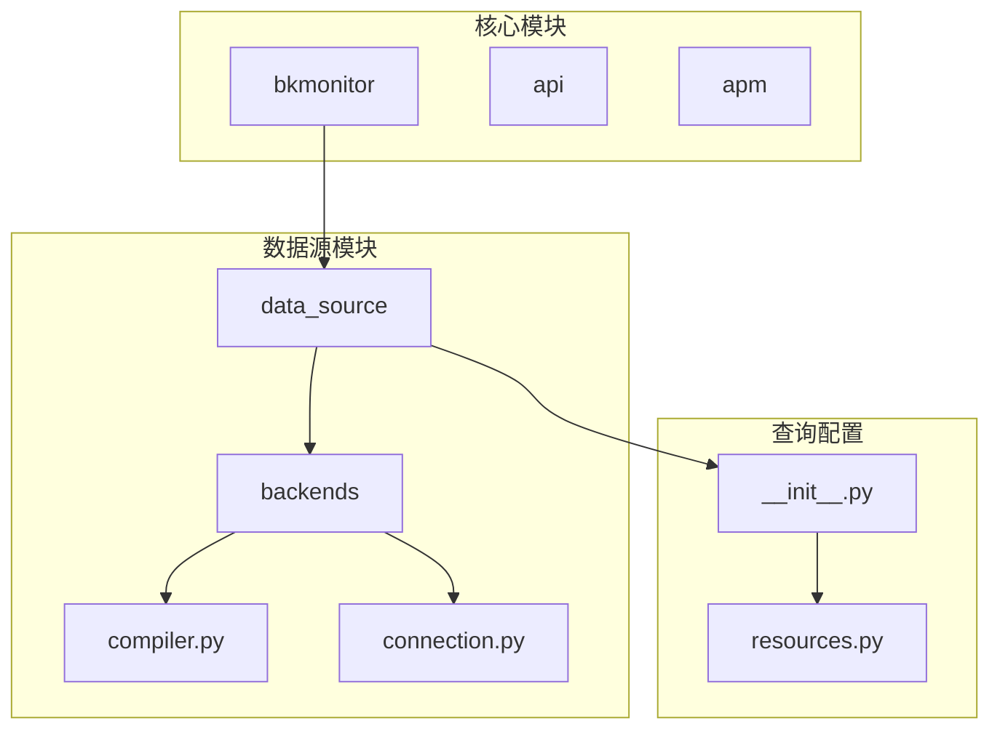
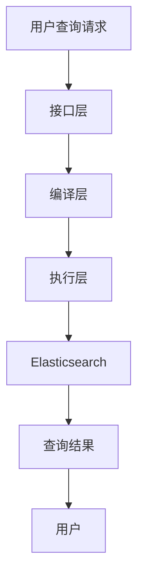
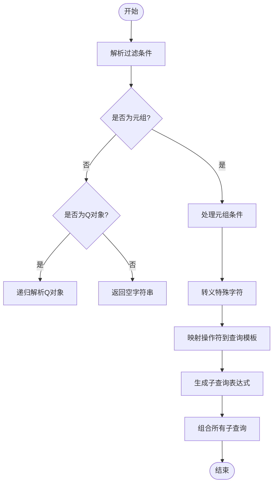
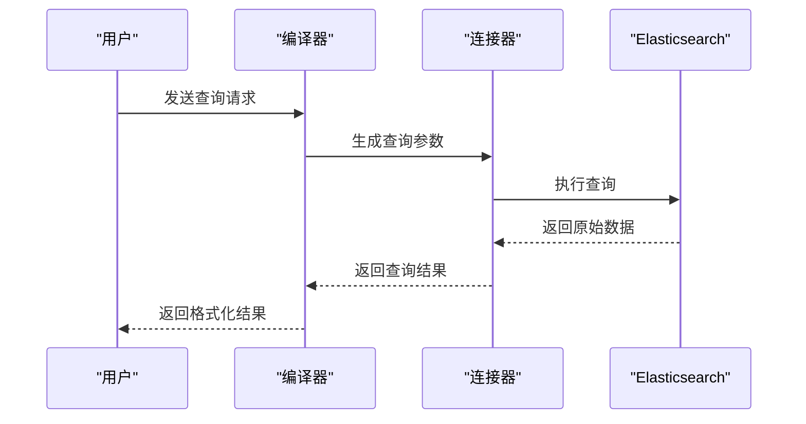
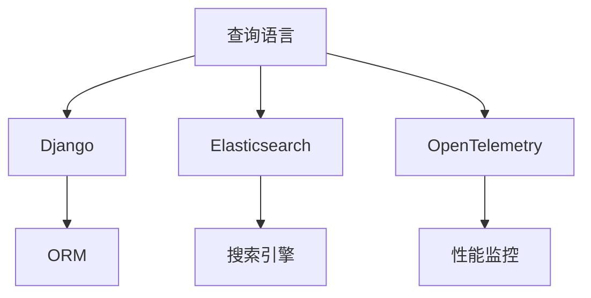

# 查询语言支持

<cite>
**本文档引用的文件**   
- [grafana_log_query.md](file://bkmonitor/support-files/apigw/docs/zh/grafana_log_query.md)
- [compiler.py](file://bkmonitor/bkmonitor/data_source/backends/log_search/compiler.py)
- [connection.py](file://bkmonitor/bkmonitor/data_source/backends/log_search/connection.py)
- [__init__.py](file://bkmonitor/bkmonitor/data_source/data_source/__init__.py)
- [resources.py](file://bkmonitor/packages/monitor_web/data_explorer/resources.py)
</cite>

## 目录
1. [简介](#简介)
2. [项目结构](#项目结构)
3. [核心组件](#核心组件)
4. [架构概述](#架构概述)
5. [详细组件分析](#详细组件分析)
6. [依赖分析](#依赖分析)
7. [性能考虑](#性能考虑)
8. [故障排除指南](#故障排除指南)
9. [结论](#结论)

## 简介
本文档详细介绍了蓝鲸监控平台中日志查询语言的语法结构、功能特性、性能优化技巧以及与其他系统的集成方式。文档重点阐述了查询语言的全文检索、字段过滤、布尔运算、通配符搜索等基本功能，以及聚合分析、统计计算、时间序列分析、关联查询等高级功能。同时，文档还提供了典型查询场景的示例，并介绍了查询语言的扩展机制和自定义函数支持。

## 项目结构
蓝鲸监控平台的项目结构清晰，主要模块包括 `ai_agent`、`bkmonitor`、`api`、`apm` 等。其中，日志查询功能主要集中在 `bkmonitor` 模块下的 `data_source` 子模块中。该模块负责处理数据源的定义、查询编译、连接和执行。

**图示来源**
- [compiler.py](file://bkmonitor/bkmonitor/data_source/backends/log_search/compiler.py)
- [connection.py](file://bkmonitor/bkmonitor/data_source/backends/log_search/connection.py)
- [__init__.py](file://bkmonitor/bkmonitor/data_source/data_source/__init__.py)

**本节来源**
- [compiler.py](file://bkmonitor/bkmonitor/data_source/backends/log_search/compiler.py)
- [connection.py](file://bkmonitor/bkmonitor/data_source/backends/log_search/connection.py)

## 核心组件
日志查询语言的核心组件包括查询编译器（`compiler.py`）、连接器（`connection.py`）和数据源类（`__init__.py`）。这些组件共同协作，将用户输入的查询语句转换为底层存储系统（如Elasticsearch）可执行的查询请求。

**本节来源**
- [compiler.py](file://bkmonitor/bkmonitor/data_source/backends/log_search/compiler.py)
- [connection.py](file://bkmonitor/bkmonitor/data_source/backends/log_search/connection.py)
- [__init__.py](file://bkmonitor/bkmonitor/data_source/data_source/__init__.py)

## 架构概述
日志查询语言的架构分为三层：接口层、编译层和执行层。接口层接收用户查询请求，编译层将查询语句转换为底层查询结构，执行层负责与数据存储系统交互并返回结果。

**图示来源**
- [compiler.py](file://bkmonitor/bkmonitor/data_source/backends/log_search/compiler.py)
- [connection.py](file://bkmonitor/bkmonitor/data_source/backends/log_search/connection.py)

## 详细组件分析

### 查询编译器分析
查询编译器负责将高级查询语句转换为底层查询结构。它支持多种查询操作符，如等于（eq）、不等于（neq）、大于（gt）、小于（lt）等，并能处理复杂的嵌套查询条件。

#### 查询条件解析

**图示来源**
- [compiler.py](file://bkmonitor/bkmonitor/data_source/backends/log_search/compiler.py#L100-L200)

**本节来源**
- [compiler.py](file://bkmonitor/bkmonitor/data_source/backends/log_search/compiler.py#L100-L200)

### 查询连接器分析
查询连接器负责执行编译后的查询请求，并与底层数据存储系统进行交互。它还集成了性能监控功能，可以记录查询的执行时间和资源消耗。

#### 查询执行流程

**图示来源**
- [connection.py](file://bkmonitor/bkmonitor/data_source/backends/log_search/connection.py#L30-L45)

**本节来源**
- [connection.py](file://bkmonitor/bkmonitor/data_source/backends/log_search/connection.py#L30-L45)

## 依赖分析
日志查询语言的实现依赖于多个外部组件和库，包括Django框架、Elasticsearch客户端、OpenTelemetry等。这些依赖关系确保了查询功能的稳定性和可扩展性。

**图示来源**
- [compiler.py](file://bkmonitor/bkmonitor/data_source/backends/log_search/compiler.py)
- [connection.py](file://bkmonitor/bkmonitor/data_source/backends/log_search/connection.py)

**本节来源**
- [compiler.py](file://bkmonitor/bkmonitor/data_source/backends/log_search/compiler.py)
- [connection.py](file://bkmonitor/bkmonitor/data_source/backends/log_search/connection.py)

## 性能考虑
为了提高查询性能，系统采用了多种优化策略，包括索引优化、查询条件优化和结果集控制。例如，查询编译器会自动将查询条件转换为最有效的查询结构，并利用Elasticsearch的聚合功能来减少数据传输量。

## 故障排除指南
当遇到查询性能问题时，可以检查以下几个方面：
1. 确认查询条件是否过于宽泛
2. 检查索引配置是否正确
3. 验证时间范围是否合理
4. 查看系统日志以获取详细的错误信息

**本节来源**
- [compiler.py](file://bkmonitor/bkmonitor/data_source/backends/log_search/compiler.py)
- [connection.py](file://bkmonitor/bkmonitor/data_source/backends/log_search/connection.py)

## 结论
蓝鲸监控平台的日志查询语言提供了强大而灵活的查询功能，能够满足各种复杂的日志分析需求。通过合理的架构设计和性能优化，系统能够高效地处理大规模日志数据，为用户提供快速准确的查询结果。