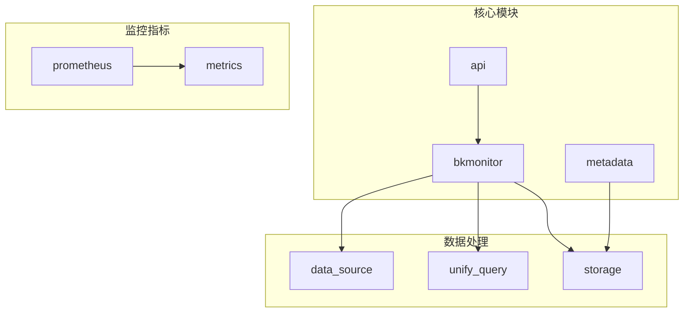
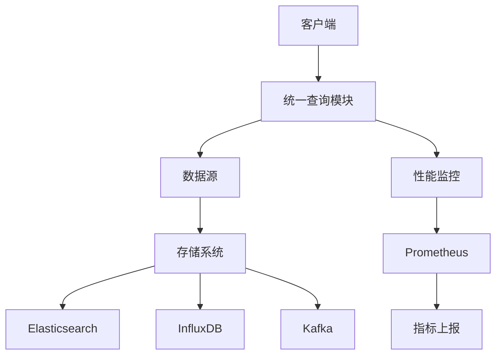
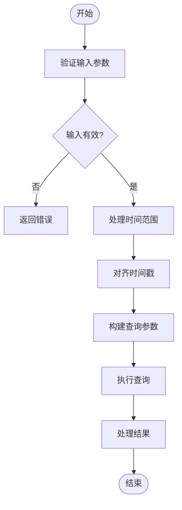
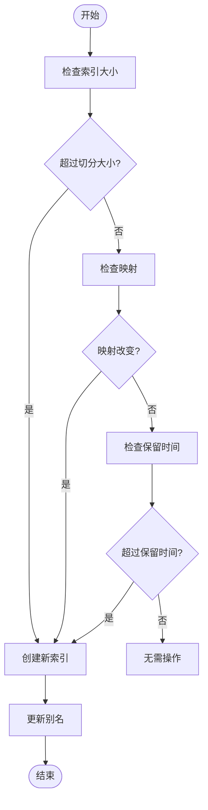
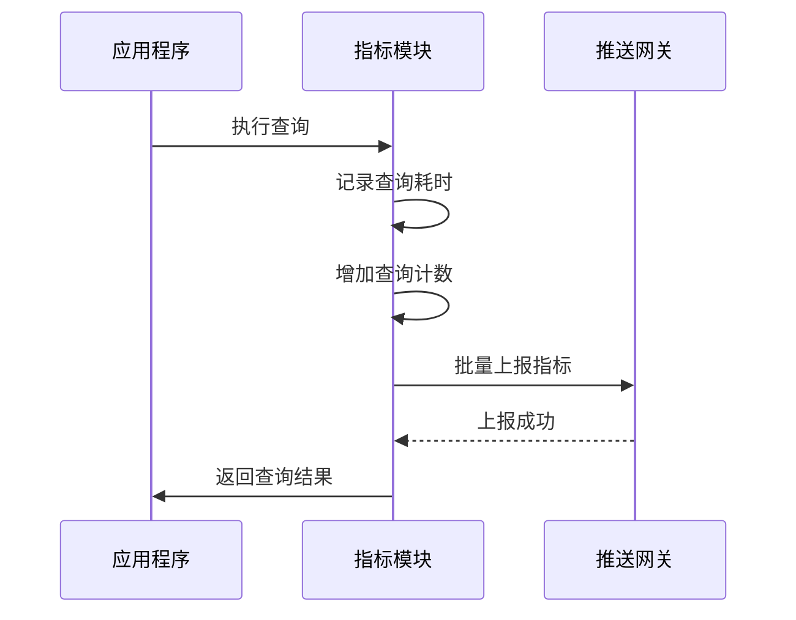
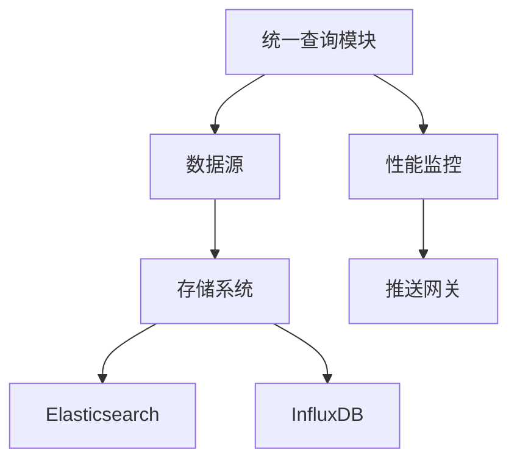

# 性能优化

<cite>
**本文档引用的文件**   
- [query.py](file://bkmonitor/bkmonitor/data_source/unify_query/query.py)
- [metrics.py](file://bkmonitor/core/prometheus/metrics.py)
- [storage.py](file://bkmonitor/metadata/models/storage.py)
- [result_table.py](file://bkmonitor/metadata/models/result_table.py)
- [compiler.py](file://bkmonitor/bkmonitor/data_source/backends/log_search/compiler.py)
</cite>

## 目录
1. [引言](#引言)
2. [项目结构](#项目结构)
3. [核心组件](#核心组件)
4. [架构概述](#架构概述)
5. [详细组件分析](#详细组件分析)
6. [依赖分析](#依赖分析)
7. [性能考虑](#性能考虑)
8. [故障排除指南](#故障排除指南)
9. [结论](#结论)

## 引言
本文档旨在深入探讨蓝鲸监控平台中时序数据源的性能优化策略。重点分析查询性能优化、存储优化方法、索引机制、数据分区策略、缓存机制以及大规模数据查询的处理机制。通过详细的技术分析和最佳实践建议，帮助开发者和运维人员提升系统性能，优化资源利用。

## 项目结构
蓝鲸监控平台的项目结构清晰，模块化设计良好。核心功能分布在多个目录中，如`bkmonitor`、`api`、`metadata`等。`bkmonitor`目录包含监控核心逻辑，`api`目录提供各种API接口，`metadata`目录管理元数据和存储配置。

**图示来源**
- [query.py](file://bkmonitor/bkmonitor/data_source/unify_query/query.py)
- [storage.py](file://bkmonitor/metadata/models/storage.py)
- [metrics.py](file://bkmonitor/core/prometheus/metrics.py)

**本节来源**
- [query.py](file://bkmonitor/bkmonitor/data_source/unify_query/query.py)
- [storage.py](file://bkmonitor/metadata/models/storage.py)

## 核心组件
本文档的核心组件包括统一查询模块、存储模型、性能监控指标和结果表模型。这些组件共同协作，实现高效的时序数据查询和存储优化。

**本节来源**
- [query.py](file://bkmonitor/bkmonitor/data_source/unify_query/query.py)
- [storage.py](file://bkmonitor/metadata/models/storage.py)
- [metrics.py](file://bkmonitor/core/prometheus/metrics.py)
- [result_table.py](file://bkmonitor/metadata/models/result_table.py)

## 架构概述
蓝鲸监控平台的架构设计充分考虑了高性能和可扩展性。通过统一查询模块、多级存储策略和精细化的性能监控，实现了对大规模时序数据的高效处理。

**图示来源**
- [query.py](file://bkmonitor/bkmonitor/data_source/unify_query/query.py)
- [storage.py](file://bkmonitor/metadata/models/storage.py)
- [metrics.py](file://bkmonitor/core/prometheus/metrics.py)

## 详细组件分析

### 统一查询模块分析
统一查询模块是蓝鲸监控平台的核心组件之一，负责处理各种数据查询请求。它通过优化查询参数、使用缓存机制和分页处理，显著提升了查询性能。

#### 查询参数处理

**图示来源**
- [query.py](file://bkmonitor/bkmonitor/data_source/unify_query/query.py#L300-L500)

**本节来源**
- [query.py](file://bkmonitor/bkmonitor/data_source/unify_query/query.py#L300-L500)

### 存储模型分析
存储模型负责管理时序数据的存储和索引。通过合理的数据分区策略和索引机制，实现了高效的存储和查询性能。

#### 索引创建和轮转

**图示来源**
- [storage.py](file://bkmonitor/metadata/models/storage.py#L3200-L3400)

**本节来源**
- [storage.py](file://bkmonitor/metadata/models/storage.py#L3200-L3400)

### 性能监控指标分析
性能监控指标模块通过Prometheus客户端收集和上报各种性能指标，为系统优化提供数据支持。

#### 指标收集和上报

**图示来源**
- [metrics.py](file://bkmonitor/core/prometheus/metrics.py)

**本节来源**
- [metrics.py](file://bkmonitor/core/prometheus/metrics.py)

## 依赖分析
各组件之间的依赖关系清晰，通过合理的接口设计和依赖注入，降低了模块间的耦合度。

**图示来源**
- [query.py](file://bkmonitor/bkmonitor/data_source/unify_query/query.py)
- [storage.py](file://bkmonitor/metadata/models/storage.py)
- [metrics.py](file://bkmonitor/core/prometheus/metrics.py)

**本节来源**
- [query.py](file://bkmonitor/bkmonitor/data_source/unify_query/query.py)
- [storage.py](file://bkmonitor/metadata/models/storage.py)
- [metrics.py](file://bkmonitor/core/prometheus/metrics.py)

## 性能考虑
在设计和实现时序数据源时，需要考虑多个性能因素，包括查询性能、存储效率和系统可扩展性。

### 查询性能优化
- **合理设置时间范围**：避免查询过长时间范围的数据，减少数据量。
- **使用适当的聚合函数**：根据需求选择合适的聚合函数，减少计算开销。
- **避免全表扫描**：通过索引和分区策略，减少不必要的数据扫描。

### 存储优化
- **数据降采样**：对历史数据进行降采样，减少存储空间占用。
- **数据过期策略**：设置合理的数据保留时间，自动清理过期数据。
- **索引优化**：通过合理的索引策略，提高查询效率。

**本节来源**
- [query.py](file://bkmonitor/bkmonitor/data_source/unify_query/query.py)
- [storage.py](file://bkmonitor/metadata/models/storage.py)

## 故障排除指南
当遇到性能问题时，可以通过以下步骤进行排查和优化。

### 常见问题及解决方案
- **查询响应慢**：检查查询时间范围是否过大，是否使用了全表扫描。
- **存储空间不足**：检查数据过期策略是否合理，是否需要调整降采样策略。
- **指标上报失败**：检查推送网关是否正常运行，网络连接是否稳定。

**本节来源**
- [query.py](file://bkmonitor/bkmonitor/data_source/unify_query/query.py)
- [storage.py](file://bkmonitor/metadata/models/storage.py)
- [metrics.py](file://bkmonitor/core/prometheus/metrics.py)

## 结论
通过对蓝鲸监控平台的深入分析，我们了解了其在时序数据源性能优化方面的多种策略和实现方法。通过合理使用统一查询模块、优化存储模型和利用性能监控指标，可以显著提升系统的整体性能和稳定性。建议在实际应用中，根据具体需求和场景，灵活运用这些优化策略，以达到最佳效果。