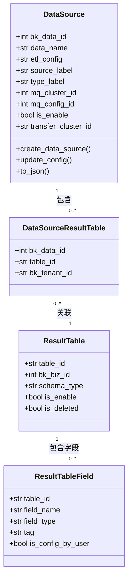
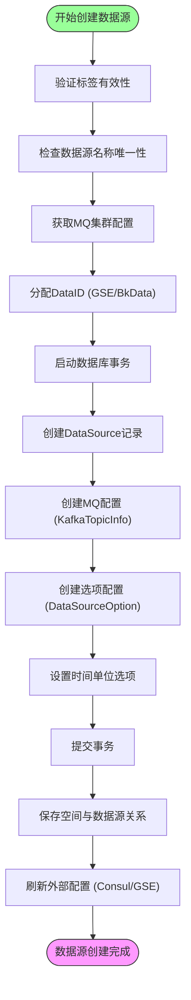
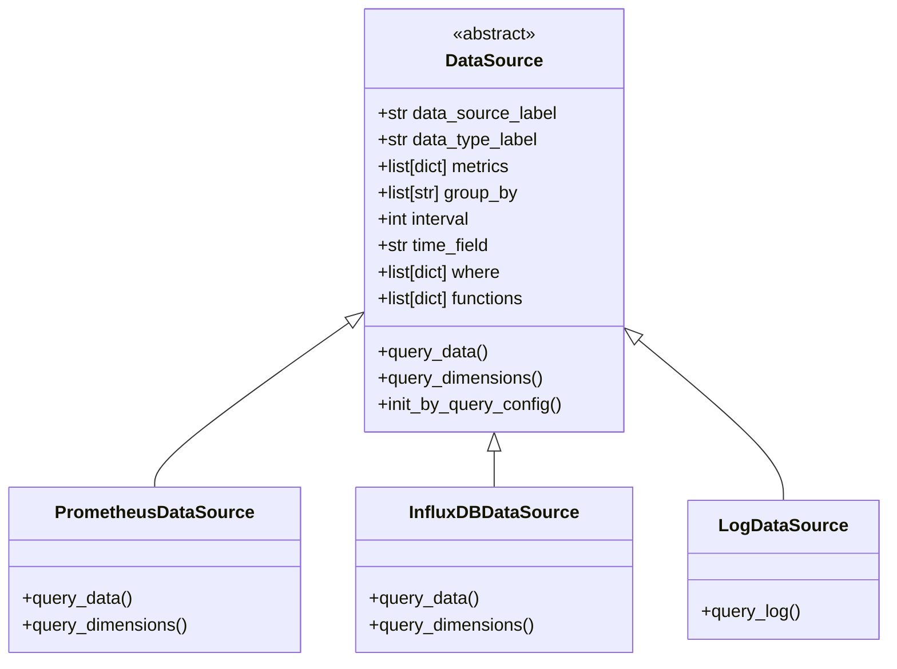
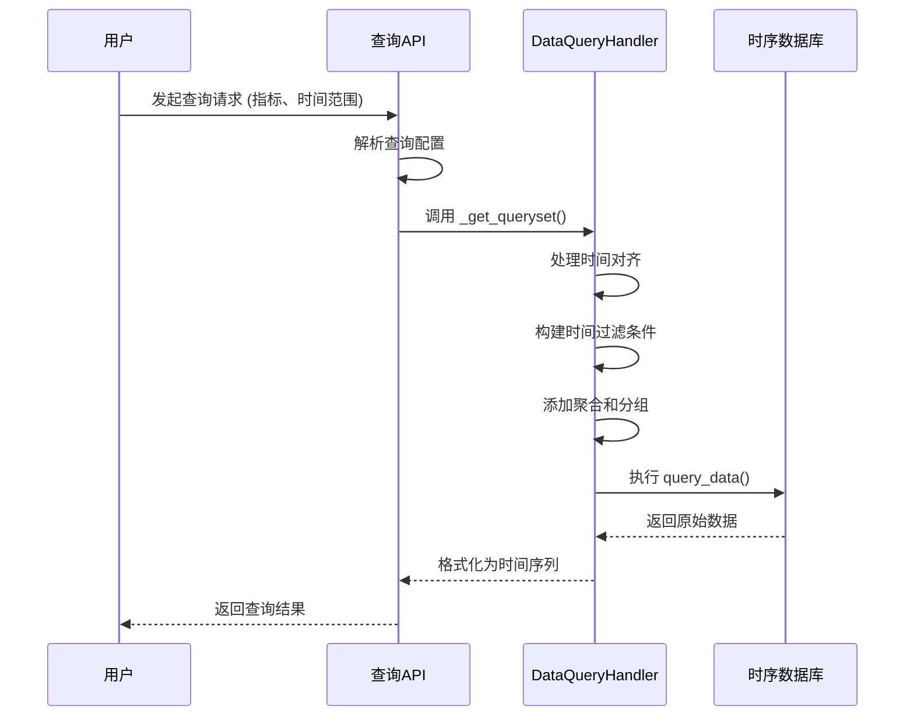

# 时序数据源

<cite>
**本文档引用的文件**
- [DataSource (bk_dataview/models.py)](file://bkmonitor/bk_dataview/models.py#L110-L140)
- [DataSource (metadata/models/data_source.py)](file://bkmonitor/metadata/models/data_source.py#L63-L1369)
- [DataSource (bkmonitor/data_source/data_source/__init__.py)](file://bkmonitor/bkmonitor/data_source/data_source/__init__.py#L545-L821)
</cite>

## 目录
1. [简介](#简介)
2. [核心数据模型](#核心数据模型)
3. [数据源配置与管理](#数据源配置与管理)
4. [查询语言与数据查询](#查询语言与数据查询)
5. [时序数据存储与索引](#时序数据存储与索引)
6. [监控与告警集成](#监控与告警集成)
7. [总结](#总结)

## 简介
本文档详细介绍了时序数据源的架构、配置、查询语言支持及与其他系统的集成方式。时序数据源是监控系统的核心组件，负责接入、存储和查询时序数据。文档重点分析了PromQL等查询语言的实现、数据源的配置参数、查询性能优化以及与告警引擎的协同工作模式。

## 核心数据模型

时序数据源的核心数据模型定义了数据源的配置、元数据和关联关系。主要包含两个关键模型：`DataSource` 和 `ResultTable`。



**图示来源**
- [metadata/models/data_source.py](file://bkmonitor/metadata/models/data_source.py#L63-L1369)

**本节来源**
- [metadata/models/data_source.py](file://bkmonitor/metadata/models/data_source.py#L63-L1369)

## 数据源配置与管理

### 配置参数
时序数据源的配置参数定义了其连接信息、认证方式和行为特性。主要参数包括：

- **基础信息**:
  - `data_name`: 数据源名称，租户内唯一。
  - `data_description`: 数据源描述。
  - `type_label`: 数据类型标签（如时序、事件）。
  - `source_label`: 数据源标签（如BK_MONITOR、CUSTOM）。
- **连接与存储**:
  - `mq_cluster_id`: 消息队列（Kafka）集群ID。
  - `transfer_cluster_id`: 数据传输（Transfer）集群ID。
  - `etl_config`: ETL清洗配置，决定数据处理流程。
- **安全与权限**:
  - `token`: 上报校验Token，防止恶意上报。
  - `is_enable`: 是否启用该数据源。
  - `is_platform_data_id`: 是否为平台级ID，决定访问范围。
- **多租户与空间**:
  - `bk_tenant_id`: 租户ID。
  - `space_type_id` / `space_uid`: 所属空间类型和唯一标识。

### 创建与更新流程
数据源的创建 (`create_data_source`) 是一个复杂的事务性过程，确保了数据的一致性和完整性。



**图示来源**
- [metadata/models/data_source.py](file://bkmonitor/metadata/models/data_source.py#L63-L1369)

**本节来源**
- [metadata/models/data_source.py](file://bkmonitor/metadata/models/data_source.py#L63-L1369)

## 查询语言与数据查询

### 查询语言支持
系统通过抽象的 `DataSource` 类来支持多种查询语言。核心的查询方法是 `query_data`，具体的实现由子类完成。



**图示来源**
- [bkmonitor/data_source/data_source/__init__.py](file://bkmonitor/bkmonitor/data_source/data_source/__init__.py#L545-L821)

### 查询构建与执行
查询的构建通过 `DataQueryHandler` 链式调用完成，最终生成特定于数据源的查询语句。



**图示来源**
- [bkmonitor/data_source/data_source/__init__.py](file://bkmonitor/bkmonitor/data_source/data_source/__init__.py#L545-L821)

**本节来源**
- [bkmonitor/data_source/data_source/__init__.py](file://bkmonitor/bkmonitor/data_source/data_source/__init__.py#L545-L821)

## 时序数据存储与索引

### 存储架构
时序数据采用分层存储架构，数据首先写入Kafka，再由Transfer组件写入后端存储。

```mermaid
graph LR
A[数据上报] --> B[Kafka]
B --> C[Transfer]
C --> D[Elasticsearch]
C --> E[InfluxDB]
C --> F[Kafka (归档)]
```

数据源模型中的 `get_transfer_storage_conf` 方法决定了数据写入哪些后端存储。

### 索引机制
- **Elasticsearch**: 基于 `ResultTable` 的 `schema_type` 进行索引，支持全文搜索和复杂聚合。
- **InfluxDB**: 基于 `measurement` 和 `tag` 进行索引，优化时间序列查询。
- **Consul**: 存储数据源的动态配置，如字段发现结果 (`get_consul_fields`)。

## 监控与告警集成

### 告警数据来源
告警引擎通过 `alarm_backends` 模块消费时序数据。数据源的 `is_enable` 状态直接影响告警的触发。

### 协同工作模式
1. **数据接入**: 数据源配置完成后，数据开始流入系统。
2. **策略配置**: 用户基于数据源中的指标创建监控策略。
3. **数据查询**: 告警引擎定期查询数据源，执行策略中的检测逻辑。
4. **告警触发**: 当查询结果满足告警条件时，触发告警事件。

## 总结
本文档深入分析了时序数据源的实现。数据源模型是核心，管理着从接入到存储的完整生命周期。系统通过抽象的查询接口支持多种查询语言，并通过Consul等外部系统实现配置的动态同步。与告警引擎的集成确保了监控闭环的形成。理解这些组件的交互对于优化查询性能和排查问题至关重要。