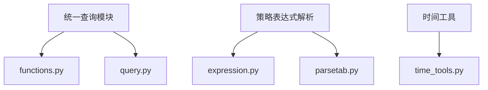
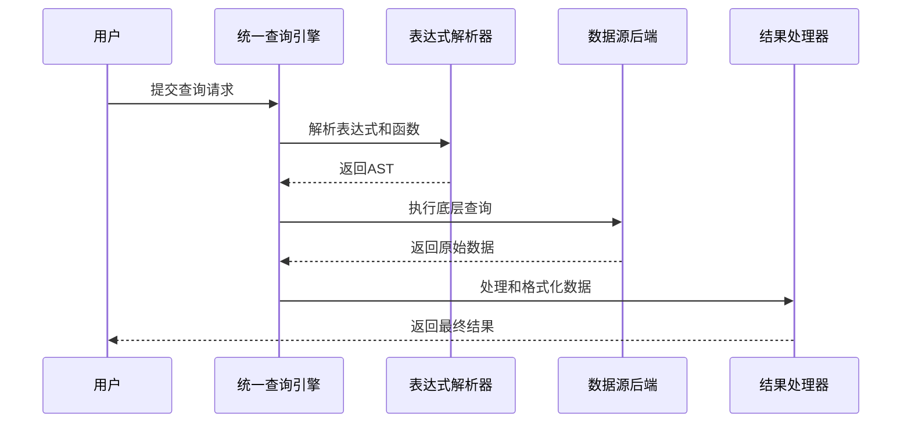
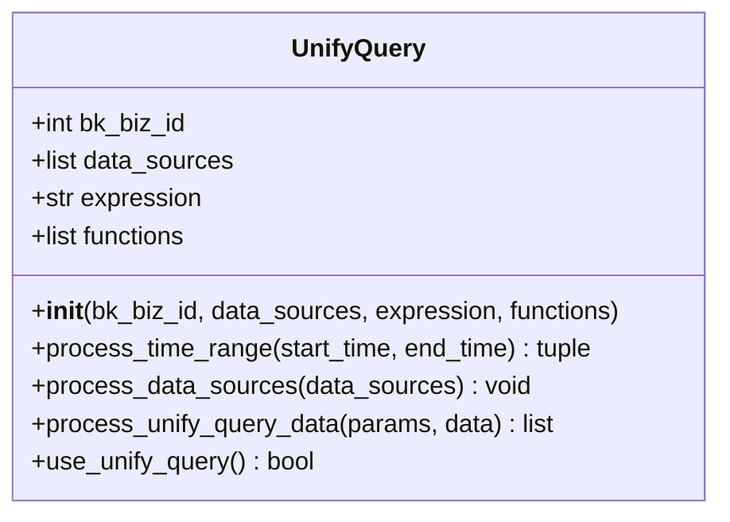
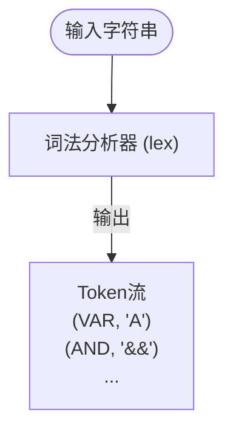
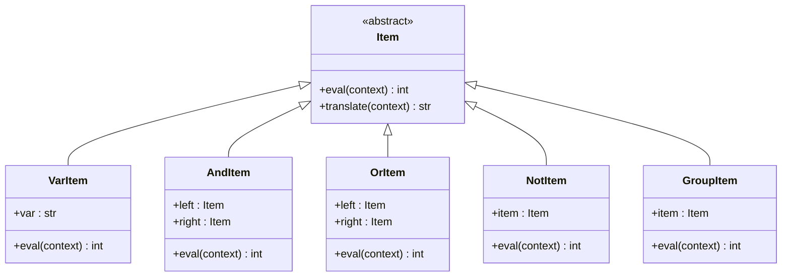
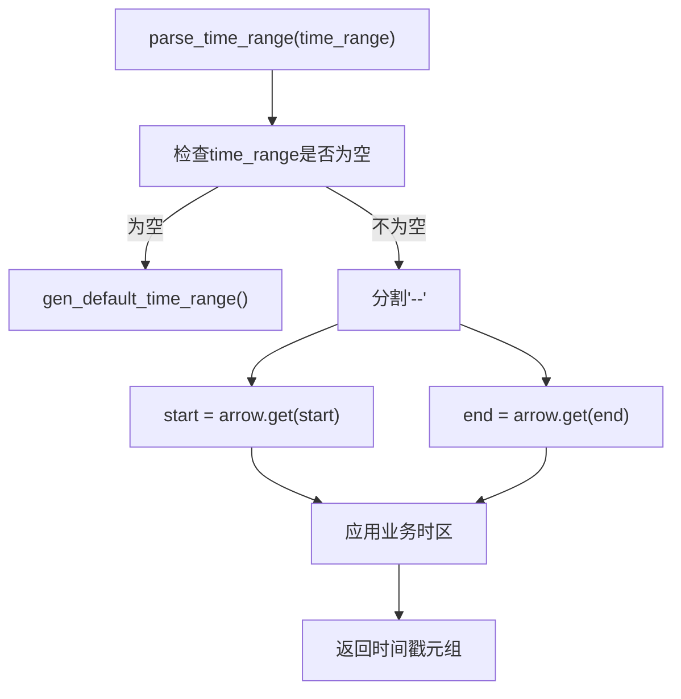
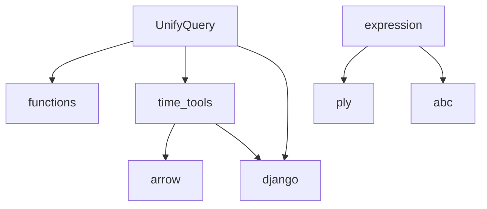

# 查询语言支持

<cite>
**本文档引用的文件**  
- [functions.py](file://bkmonitor/bkmonitor/data_source/unify_query/functions.py)
- [query.py](file://bkmonitor/bkmonitor/data_source/unify_query/query.py)
- [expression.py](file://bkmonitor/bkmonitor/strategy/expression.py)
- [time_tools.py](file://bkmonitor/bkmonitor/utils/time_tools.py)
- [parsetab.py](file://bkmonitor/bkmonitor/strategy/parsetab.py)
</cite>

## 目录
1. [简介](#简介)
2. [项目结构](#项目结构)
3. [核心组件](#核心组件)
4. [架构概览](#架构概览)
5. [详细组件分析](#详细组件分析)
6. [依赖分析](#依赖分析)
7. [性能考量](#性能考量)
8. [故障排查指南](#故障排查指南)
9. [结论](#结论)

## 简介
本文档旨在全面介绍蓝鲸监控平台中时序数据源查询语言的支持能力，重点涵盖PromQL与InfluxQL的语法特性、时间范围设置、聚合函数、数学与逻辑运算、复杂查询语句、解析执行机制以及最佳实践。文档基于对`bk-monitor`代码库的深入分析，确保技术细节的准确性与实用性。

## 项目结构
蓝鲸监控平台的代码库采用模块化设计，主要功能集中在`bkmonitor`目录下。与查询语言支持直接相关的模块位于`bkmonitor/data_source/unify_query`，负责统一查询的实现。策略表达式解析功能位于`bkmonitor/strategy`，而时间处理工具则位于`bkmonitor/utils`。这种清晰的分层结构有助于维护和扩展查询功能。

**图示来源**  
- [functions.py](file://bkmonitor/bkmonitor/data_source/unify_query/functions.py)
- [query.py](file://bkmonitor/bkmonitor/data_source/unify_query/query.py)
- [expression.py](file://bkmonitor/bkmonitor/strategy/expression.py)
- [parsetab.py](file://bkmonitor/bkmonitor/strategy/parsetab.py)
- [time_tools.py](file://bkmonitor/bkmonitor/utils/time_tools.py)

## 核心组件
本系统的核心组件包括统一查询引擎、策略表达式解析器和时间处理工具。统一查询引擎（`UnifyQuery`类）是处理多数据源、多指标查询的核心，它集成了表达式解析、函数执行和结果聚合。策略表达式解析器（基于PLY库）负责解析告警关联规则中的逻辑表达式。时间处理工具提供了时间范围解析和时区转换等基础服务。

**组件来源**  
- [query.py](file://bkmonitor/bkmonitor/data_source/unify_query/query.py#L1-L50)
- [expression.py](file://bkmonitor/bkmonitor/strategy/expression.py#L1-L50)
- [time_tools.py](file://bkmonitor/bkmonitor/utils/time_tools.py#L1-L50)

## 架构概览
系统的查询语言支持架构围绕“解析-执行-返回”流程构建。用户输入的查询语句首先被解析为抽象语法树（AST），然后根据AST生成针对底层数据源（如Prometheus、InfluxDB）的特定查询。执行结果返回后，再经过统一的处理和格式化，最终呈现给用户。

**图示来源**  
- [query.py](file://bkmonitor/bkmonitor/data_source/unify_query/query.py#L1-L100)
- [expression.py](file://bkmonitor/bkmonitor/strategy/expression.py#L1-L100)

## 详细组件分析

### 统一查询引擎分析
`UnifyQuery`类是整个查询系统的核心。它接收业务ID、数据源列表、表达式和函数列表作为输入，通过`process_data_sources`等方法预处理数据源，并通过`use_unify_query`方法判断是否启用统一查询。

**图示来源**  
- [query.py](file://bkmonitor/bkmonitor/data_source/unify_query/query.py#L1-L100)

### 策略表达式解析器分析
该组件使用PLY（Python Lex-Yacc）库实现了一个完整的词法和语法解析器。它能够将形如`A && (B || C) && !D`的逻辑表达式解析成一个由`Item`对象构成的抽象语法树。

#### 词法分析
词法分析器定义了`VAR`（变量）、`AND`（与）、`OR`（或）、`NOT`（非）、`LPAREN`（左括号）、`RPAREN`（右括号）等Token。

**图示来源**  
- [expression.py](file://bkmonitor/bkmonitor/strategy/expression.py#L50-L100)

#### 语法分析
语法分析器根据预定义的语法规则（如`p_expression_and`）将Token流构建成AST。

**图示来源**  
- [expression.py](file://bkmonitor/bkmonitor/strategy/expression.py#L100-L200)

### 时间处理工具分析
`time_tools.py`模块提供了丰富的时间处理函数，是解析时间范围的基础。

**图示来源**  
- [time_tools.py](file://bkmonitor/bkmonitor/utils/time_tools.py#L200-L300)

## 依赖分析
系统内部组件依赖关系清晰。`UnifyQuery`依赖于`functions.py`中的函数定义和`time_tools.py`中的时间处理工具。`expression.py`依赖于PLY库进行语法解析。外部依赖主要为Django框架、Arrow时间库和OpenTelemetry追踪库。

**图示来源**  
- [query.py](file://bkmonitor/bkmonitor/data_source/unify_query/query.py#L1-L20)
- [functions.py](file://bkmonitor/bkmonitor/data_source/unify_query/functions.py#L1-L20)
- [time_tools.py](file://bkmonitor/bkmonitor/utils/time_tools.py#L1-L20)
- [expression.py](file://bkmonitor/bkmonitor/strategy/expression.py#L1-L20)

## 性能考量
- **查询解析**：使用PLY库进行语法解析，性能稳定，但对于极其复杂的表达式可能存在性能瓶颈。
- **数据处理**：`UnifyQuery`使用多线程池（`ThreadPool`）来处理并发查询，提高了整体吞吐量。
- **时间对齐**：`time_interval_align`函数确保了查询时间范围的对齐，避免了因时间偏移导致的性能问题。

## 故障排查指南
- **语法错误**：检查表达式是否符合语法规则，如括号是否匹配，运算符是否正确。错误信息通常来自`p_error`或`t_error`函数。
- **语义错误**：确保引用的变量（如告警ID）在上下文中已定义。错误信息来自`VarItem.eval`中的`KeyError`。
- **时间范围错误**：检查`time_range`参数格式是否正确，是否包含有效的开始和结束时间。
- **函数不支持**：确认使用的函数是否在`Functions`字典中定义，且`support_expression`属性为`True`。

**故障来源**  
- [expression.py](file://bkmonitor/bkmonitor/strategy/expression.py#L200-L240)
- [functions.py](file://bkmonitor/bkmonitor/data_source/unify_query/functions.py#L1-L50)

## 结论
蓝鲸监控平台的查询语言支持功能强大且设计精良。通过集成PromQL等标准查询语言的特性，并结合自定义的表达式解析和统一查询引擎，为用户提供了灵活、高效的时序数据查询能力。深入理解其内部机制有助于更好地利用该平台进行监控和告警配置。