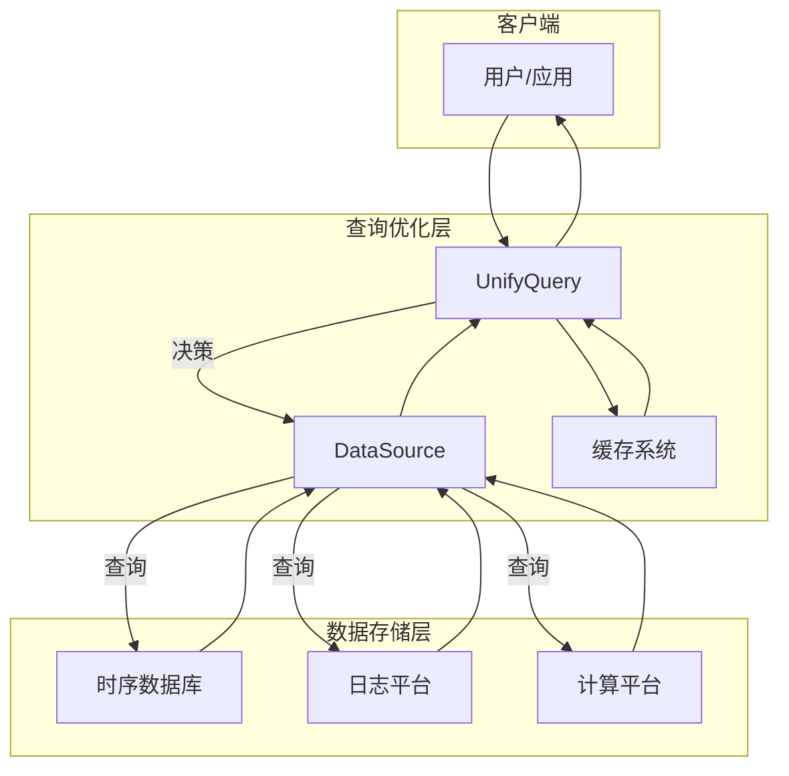
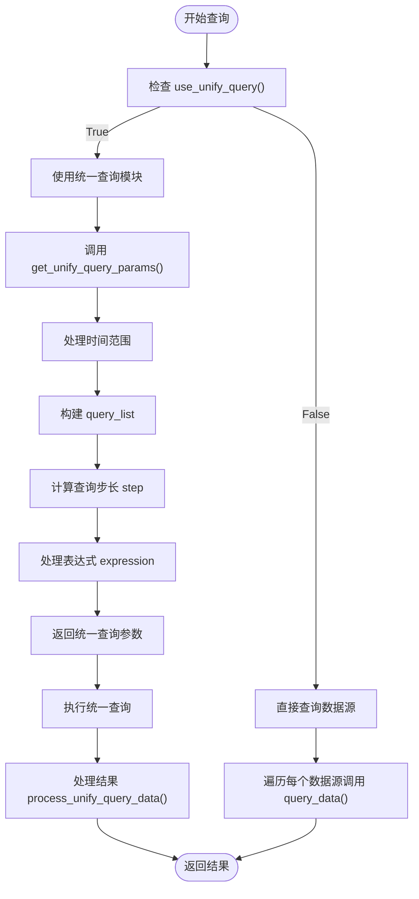
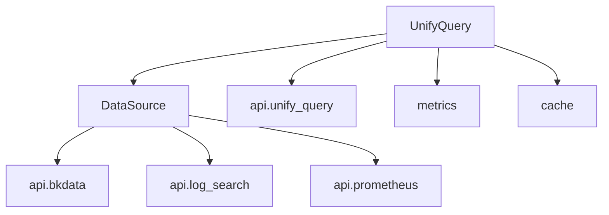

# 查询优化策略

<cite>
**本文档引用的文件**
- [query.py](file://bkmonitor\bkmonitor\data_source\unify_query\query.py)
- [data_source.py](file://bkmonitor\bkmonitor\data_source\data_source\__init__.py)
- [cache.py](file://bkmonitor\bkmonitor\utils\cache.py)
- [data_source.py](file://bkmonitor\constants\data_source.py)
</cite>

## 目录
1. [简介](#简介)
2. [项目结构](#项目结构)
3. [核心组件](#核心组件)
4. [架构概述](#架构概述)
5. [详细组件分析](#详细组件分析)
6. [依赖分析](#依赖分析)
7. [性能考量](#性能考量)
8. [故障排除指南](#故障排除指南)
9. [结论](#结论)

## 简介
本文档旨在深入解析蓝鲸监控平台中的查询优化策略，重点阐述如何通过一系列技术手段提升跨数据源查询的性能。文档将详细说明查询重写规则、索引选择策略、并行与分布式查询优化机制、缓存策略的应用，以及如何利用性能分析工具进行慢查询的诊断与优化。目标是为开发者和运维人员提供一份全面、实用的查询优化指南。

## 项目结构
蓝鲸监控平台（bk-monitor）是一个功能丰富的监控系统，其项目结构清晰地划分了不同的功能模块。核心的查询优化逻辑主要集中在`bkmonitor`目录下的`data_source`子模块中，特别是`unify_query`包，它负责处理统一查询的核心逻辑。此外，`utils`目录下的`cache.py`文件实现了关键的缓存机制，对查询性能有重要影响。

```mermaid
graph TD
bkmonitor[bkmonitor]
subgraph data_source
data_source[unify_query]
data_source --> query[query.py]
data_source --> builder[builder.py]
end
subgraph utils
utils[utils]
utils --> cache[cache.py]
end
subgraph constants
constants[constants]
constants --> data_source[data_source.py]
end
bkmonitor --> data_source
bkmonitor --> utils
bkmonitor --> constants
```

**图示来源**
- [query.py](file://bkmonitor\bkmonitor\data_source\unify_query\query.py)
- [cache.py](file://bkmonitor\bkmonitor\utils\cache.py)
- [data_source.py](file://bkmonitor\constants\data_source.py)

## 核心组件
查询优化策略的核心组件包括`UnifyQuery`类、`DataSource`类、缓存管理器和统一查询构建器。`UnifyQuery`类是查询执行的入口，负责协调数据源、应用查询重写规则、决定查询策略（使用统一查询或直接数据源查询）并处理结果。`DataSource`类封装了对不同数据源（如监控采集器、计算平台）的访问细节。缓存管理器则通过多级缓存机制显著减少对后端数据源的重复查询。

**组件来源**
- [query.py](file://bkmonitor\bkmonitor\data_source\unify_query\query.py#L150-L755)
- [data_source.py](file://bkmonitor\bkmonitor\data_source\data_source\__init__.py#L1-L1500)

## 架构概述
整个查询优化架构遵循一个分层设计。最上层是`UnifyQuery`，它接收查询请求。中间层是`DataSource`，它负责与具体的数据源进行交互。底层是实际的数据存储，如时序数据库、日志平台等。在`UnifyQuery`和`DataSource`之间，存在一个关键的决策点`use_unify_query`，它根据查询的复杂度、数据源类型等因素，决定是走统一查询模块还是直接查询数据源。缓存机制贯穿于整个架构，对查询结果和元数据进行缓存，以加速后续的相同或相似查询。



**图示来源**
- [query.py](file://bkmonitor\bkmonitor\data_source\unify_query\query.py)
- [data_source.py](file://bkmonitor\bkmonitor\data_source\data_source\__init__.py)

## 详细组件分析

### UnifyQuery 类分析
`UnifyQuery`类是整个查询优化策略的核心。它通过`use_unify_query`方法来决定查询路径。该方法的决策逻辑非常关键，它会检查多个条件，如是否为多指标查询、是否使用了表达式、是否使用了特定的聚合函数等。一旦决定使用统一查询，`get_unify_query_params`方法会将各个`DataSource`的配置合并成一个标准化的查询参数字典，这个过程本身就包含了查询重写的初步思想。

#### 查询重写规则
查询重写是优化查询性能的第一步。在`UnifyQuery`中，主要的重写规则体现在`get_unify_query_params`方法中：
*   **谓词下推 (Predicate Pushdown)**：虽然代码中没有显式的“下推”字样，但`DataSource`对象在构建查询时，会将`filter_dict`（过滤条件）直接包含在生成的查询配置中。这意味着过滤条件会被尽可能地传递到数据源层面执行，而不是在应用层获取所有数据后再过滤，这正是谓词下推的核心思想。
*   **投影剪裁 (Projection Pruning)**：`metrics`属性会收集所有需要的指标字段，并最终在结果中只保留这些字段和`_result_`字段。这避免了获取不必要的数据列，减少了网络传输和内存占用。
*   **常量折叠 (Constant Folding)**：虽然在提供的代码片段中没有直接体现，但`expression`参数允许传入复杂的表达式。系统在解析和执行这些表达式时，理论上会进行常量折叠优化，将表达式中的常量部分预先计算，以减少运行时的计算开销。



**图示来源**
- [query.py](file://bkmonitor\bkmonitor\data_source\unify_query\query.py#L150-L755)

**组件来源**
- [query.py](file://bkmonitor\bkmonitor\data_source\unify_query\query.py#L150-L755)

### 索引选择与数据源适配
索引选择策略与数据源的类型紧密相关。`constants/data_source.py`文件定义了不同数据源的标签（`DataSourceLabel`），如`BK_MONITOR_COLLECTOR`（监控采集器）、`BK_DATA`（计算平台）等。`UnifyQuery`类通过`use_unify_query`方法，根据数据源的ID来判断其是否支持统一查询。

*   **适配方法**：对于支持统一查询的数据源（如`UnifyQueryDataSources`列表中的数据源），系统会走统一查询流程。对于不支持或处于灰度阶段的数据源（如`GrayUnifyQueryDataSources`），系统会根据`switch_unify_query`等开关进行判断。这种基于数据源标签的适配方法，使得系统能够灵活地支持多种数据源，并为不同数据源应用不同的优化策略。

**组件来源**
- [data_source.py](file://bkmonitor\constants\data_source.py#L1-L249)
- [query.py](file://bkmonitor\bkmonitor\data_source\unify_query\query.py#L500-L550)

### 并行执行与分布式查询
在提供的代码片段中，直接的并行执行逻辑并不明显。然而，在`_query_log_using_datasource`方法中，可以看到一个潜在的并行执行模式：
```python
params_list: list[tuple] = [(datasource,) for datasource in self.data_sources]
for partial_data, partial_total in ThreadPool().map_ignore_exception(_query_log, params_list):
    total += partial_total
    data.extend(partial_data)
```
这段代码使用了`ThreadPool`来并行地对多个数据源执行日志查询任务（`_query_log`），然后将结果合并。这体现了并行执行的思想，可以显著缩短对多个数据源进行查询的总耗时。分布式查询的优化则更多地依赖于后端数据源（如Elasticsearch、Doris）自身的分布式能力，`UnifyQuery`模块主要负责将查询请求正确地分发到这些分布式系统。

**组件来源**
- [query.py](file://bkmonitor\bkmonitor\data_source\unify_query\query.py#L400-L420)

### 缓存策略
缓存是提升查询性能最有效的手段之一。`utils/cache.py`文件实现了一个精巧的两级缓存系统。

*   **一级缓存 (Local Cache)**：基于线程本地存储（`local`），在单个请求（线程）的生命周期内有效。它能避免在同一个请求中对同一函数的重复调用。
*   **二级缓存 (Mem/Redis Cache)**：基于Django的缓存框架，可以是内存缓存（`locmem`）或分布式缓存（如Redis），具有较长的超时时间（由`CacheType`定义）。

`UsingCache`装饰器是缓存机制的核心，它提供了`cached`、`refresh`和`cacheless`三种模式。`UnifyQuery`在执行查询时，会通过`metrics.DATASOURCE_QUERY_TIME`等监控指标来记录查询耗时和次数，这些数据可以用于分析缓存的有效性。

**组件来源**
- [cache.py](file://bkmonitor\bkmonitor\utils\cache.py#L1-L417)

## 依赖分析
`UnifyQuery`模块的依赖关系清晰。它直接依赖于`DataSource`类来获取数据源配置，依赖于`api.unify_query`模块来发起实际的查询请求，依赖于`metrics`模块进行性能监控，并依赖于`cache`模块进行结果缓存。`DataSource`类本身又依赖于具体的后端API（如`api.bkdata`、`api.log_search`）来与不同的数据平台交互。



**图示来源**
- [query.py](file://bkmonitor\bkmonitor\data_source\unify_query\query.py)
- [data_source.py](file://bkmonitor\bkmonitor\data_source\data_source\__init__.py)

## 性能考量
查询性能受到多种因素的影响：
1.  **查询复杂度**：多指标、复杂表达式、大量聚合函数会显著增加查询时间。
2.  **时间范围**：查询的时间跨度越大，需要扫描的数据量就越多。
3.  **数据源性能**：后端数据存储的性能是瓶颈所在。
4.  **缓存命中率**：高缓存命中率能极大提升性能。

`UnifyQuery`通过`use_unify_query`的决策逻辑和`ThreadPool`的并行查询，主动优化了前两点。通过集成`metrics`，系统能够对每次查询进行计时和计数，为性能分析提供了数据基础。

## 故障排除指南
当遇到慢查询时，可以按照以下步骤进行诊断和优化：
1.  **检查日志**：查看`query.py`中的`logger.info(f"UNIFY_QUERY: {json.dumps(params)}")`日志，确认实际执行的查询参数，检查是否有不必要的大范围查询或复杂条件。
2.  **分析决策逻辑**：确认`use_unify_query`的返回值。如果一个本应走统一查询的复杂查询走了直接查询，可能会导致性能问题。
3.  **检查缓存**：确认相关的`CacheType`（如`DATA`、`BIZ`）是否正常工作，超时时间是否合理。
4.  **后端诊断**：如果问题出在特定数据源，需要深入到该数据源的后端（如ES、Doris）进行更详细的性能分析。

**组件来源**
- [query.py](file://bkmonitor\bkmonitor\data_source\unify_query\query.py#L600-L650)
- [cache.py](file://bkmonitor\bkmonitor\utils\cache.py)

## 结论
蓝鲸监控平台的查询优化策略是一个综合性的解决方案，它通过查询重写、智能的查询路径决策、并行执行和多级缓存等多种技术手段，有效地提升了跨数据源查询的性能。理解`UnifyQuery`类的决策逻辑和`cache`模块的实现，是掌握和优化系统查询性能的关键。未来可以进一步探索更高级的查询优化技术，如基于代价的优化器（CBO），以实现更智能的查询计划选择。