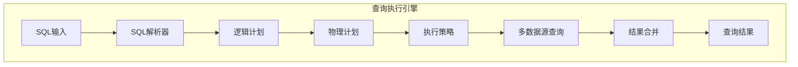
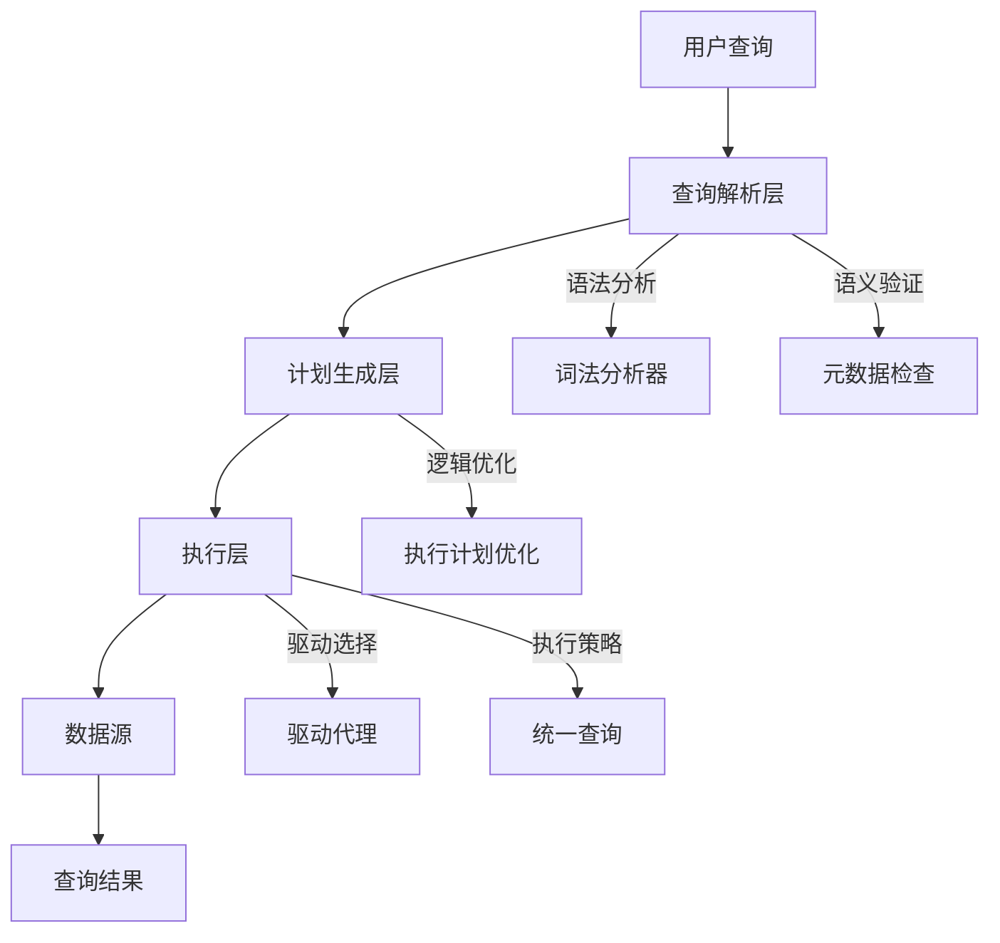
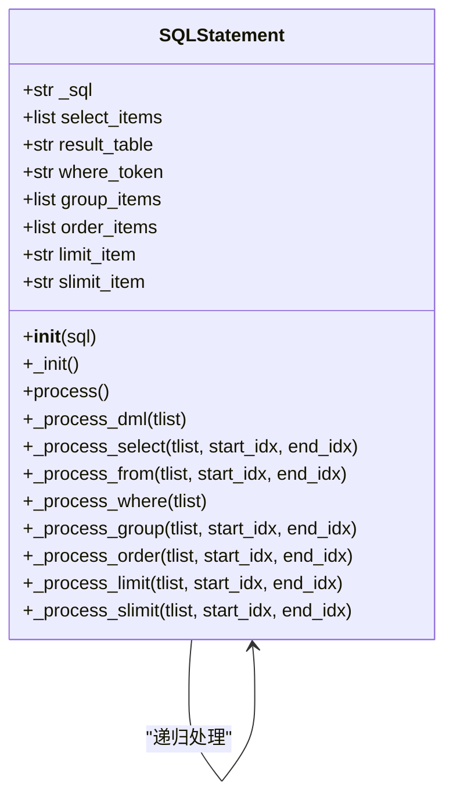
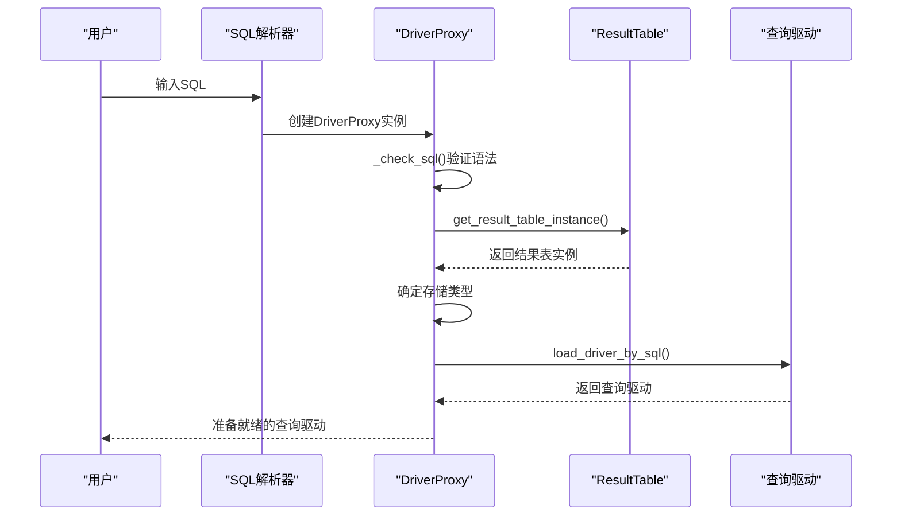
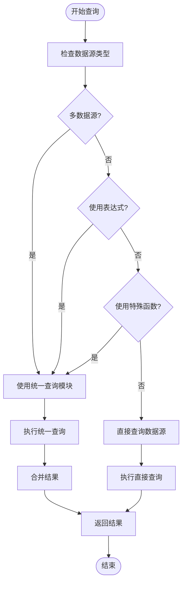
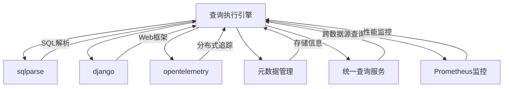

# 查询执行引擎

<cite>
**本文档引用的文件**   
- [statement.py](file://bkmonitor/query_api/sql_parse/statement.py)
- [proxy.py](file://bkmonitor/query_api/drivers/proxy.py)
- [query.py](file://bkmonitor/bkmonitor/data_source/unify_query/query.py)
- [README.md](file://bkmonitor/query_api/README.md)
- [README.md](file://bkmonitor/core/prometheus/README.md)
- [expression.py](file://bkmonitor/bkmonitor/strategy/expression.py)
</cite>

## 目录
1. [简介](#简介)
2. [项目结构](#项目结构)
3. [核心组件](#核心组件)
4. [架构概述](#架构概述)
5. [详细组件分析](#详细组件分析)
6. [依赖分析](#依赖分析)
7. [性能考量](#性能考量)
8. [故障排除指南](#故障排除指南)
9. [结论](#结论)

## 简介
本文档旨在深入解析蓝鲸监控平台中的查询执行引擎，重点阐述其跨数据源查询的执行机制。文档详细说明了查询解析器的工作流程，包括词法分析、语法分析和语义验证等阶段；描述了执行计划的生成过程，涵盖逻辑计划与物理计划的转换；介绍了多数据源查询的执行策略，如联邦查询、数据拉取和结果合并等；阐述了错误处理和超时控制机制。此外，文档还提供了执行引擎的性能指标监控方法，以及在复杂查询场景下的执行优化建议。

## 项目结构
蓝鲸监控平台的查询执行引擎主要分布在`bkmonitor`目录下的多个子模块中。核心功能集中在`query_api`和`data_source`目录。`query_api`模块负责SQL解析和驱动管理，而`data_source`模块则处理统一查询和多数据源集成。整体结构体现了分层设计原则，将查询解析、计划生成和执行策略分离，提高了系统的可维护性和扩展性。

**图示来源**
- [statement.py](file://bkmonitor/query_api/sql_parse/statement.py)
- [proxy.py](file://bkmonitor/query_api/drivers/proxy.py)
- [query.py](file://bkmonitor/bkmonitor/data_source/unify_query/query.py)

**本节来源**
- [README.md](file://bkmonitor/query_api/README.md)

## 核心组件
查询执行引擎的核心组件包括SQL解析器、驱动代理和统一查询模块。SQL解析器负责将用户输入的SQL语句解析为内部数据结构；驱动代理根据结果表的存储类型选择合适的查询驱动；统一查询模块则协调多数据源查询的执行和结果合并。这些组件共同构成了查询执行引擎的基础，确保了查询的正确性和高效性。

**本节来源**
- [statement.py](file://bkmonitor/query_api/sql_parse/statement.py)
- [proxy.py](file://bkmonitor/query_api/drivers/proxy.py)
- [query.py](file://bkmonitor/bkmonitor/data_source/unify_query/query.py)

## 架构概述
查询执行引擎采用分层架构，从上到下分为查询解析层、计划生成层和执行层。查询解析层负责语法和语义分析；计划生成层将解析后的查询转换为可执行的物理计划；执行层则根据物理计划调用相应的数据源驱动执行查询。这种分层设计使得各组件职责清晰，便于维护和扩展。

**图示来源**
- [statement.py](file://bkmonitor/query_api/sql_parse/statement.py)
- [proxy.py](file://bkmonitor/query_api/drivers/proxy.py)
- [query.py](file://bkmonitor/bkmonitor/data_source/unify_query/query.py)

## 详细组件分析

### SQL解析器分析
SQL解析器是查询执行引擎的第一道关卡，负责将用户输入的SQL语句解析为内部数据结构。解析过程分为词法分析、语法分析和语义验证三个阶段。

#### 词法分析和语法分析
SQL解析器使用`sqlparse`库进行词法和语法分析。`SQLStatement`类是解析器的核心，它通过递归下降的方式遍历SQL语句的语法树，提取SELECT、FROM、WHERE等子句的信息。

**图示来源**
- [statement.py](file://bkmonitor/query_api/sql_parse/statement.py)

**本节来源**
- [statement.py](file://bkmonitor/query_api/sql_parse/statement.py)

### 执行计划生成分析
执行计划的生成是查询执行引擎的关键环节，它将解析后的逻辑查询转换为具体的物理执行计划。

#### 逻辑计划到物理计划的转换
`DriverProxy`类负责执行计划的生成。它首先验证SQL语法的正确性，然后根据结果表的元数据信息确定物理存储类型，最后加载相应的查询驱动。

**图示来源**
- [proxy.py](file://bkmonitor/query_api/drivers/proxy.py)

**本节来源**
- [proxy.py](file://bkmonitor/query_api/drivers/proxy.py)

### 多数据源查询分析
多数据源查询是查询执行引擎的重要特性，它支持跨不同数据源的联邦查询。

#### 联邦查询执行策略
`UnifyQuery`类是多数据源查询的核心。它根据查询条件决定使用统一查询模块还是直接查询原始数据源。当查询涉及多个指标、使用表达式或特殊函数时，会自动启用统一查询模块。

**图示来源**
- [query.py](file://bkmonitor/bkmonitor/data_source/unify_query/query.py)

**本节来源**
- [query.py](file://bkmonitor/bkmonitor/data_source/unify_query/query.py)

## 依赖分析
查询执行引擎依赖于多个外部模块和库。核心依赖包括`sqlparse`用于SQL解析，`django`用于Web框架集成，`opentelemetry`用于分布式追踪。此外，引擎还依赖于元数据管理模块来获取结果表的存储信息，以及统一查询服务来执行跨数据源查询。

**图示来源**
- [statement.py](file://bkmonitor/query_api/sql_parse/statement.py)
- [proxy.py](file://bkmonitor/query_api/drivers/proxy.py)
- [query.py](file://bkmonitor/bkmonitor/data_source/unify_query/query.py)
- [README.md](file://bkmonitor/core/prometheus/README.md)

**本节来源**
- [statement.py](file://bkmonitor/query_api/sql_parse/statement.py)
- [proxy.py](file://bkmonitor/query_api/drivers/proxy.py)
- [query.py](file://bkmonitor/bkmonitor/data_source/unify_query/query.py)

## 性能考量
查询执行引擎的性能监控主要通过Prometheus指标系统实现。引擎定义了多种指标来监控查询性能，包括查询耗时、查询次数和数据拉取条数等。

### 性能指标监控
核心性能指标包括：
- `bkmonitor_datasource_query_time`: 各数据源查询请求耗时 (histogram)
- `bkmonitor_datasource_query_count`: 各数据源查询请求次数 (counter)
- `bkmonitor_access_data_process_pull_data_count`: access(data)模块数据拉取条数 (counter)

这些指标通过`core.prometheus.metrics`模块进行统计和上报，为系统性能优化提供了数据支持。

**本节来源**
- [README.md](file://bkmonitor/core/prometheus/README.md)

## 故障排除指南
查询执行引擎的错误处理机制主要体现在以下几个方面：
1. **语法错误**: 在SQL解析阶段捕获，返回详细的语法错误信息。
2. **语义错误**: 在元数据检查阶段捕获，如结果表不存在或未配置物理存储。
3. **执行错误**: 在查询执行阶段捕获，包括驱动加载失败和查询超时等。

错误处理代码分布在`exceptions.py`和各个核心组件中，确保了错误信息的准确性和可追溯性。

**本节来源**
- [statement.py](file://bkmonitor/query_api/sql_parse/statement.py)
- [proxy.py](file://bkmonitor/query_api/drivers/proxy.py)
- [query.py](file://bkmonitor/bkmonitor/data_source/unify_query/query.py)

## 结论
蓝鲸监控平台的查询执行引擎通过分层架构和模块化设计，实现了高效、可靠的跨数据源查询功能。引擎的SQL解析器、执行计划生成器和统一查询模块协同工作，为用户提供了强大的数据查询能力。通过完善的性能监控和错误处理机制，确保了系统的稳定性和可维护性。未来可以进一步优化查询计划的生成算法，提高复杂查询的执行效率。