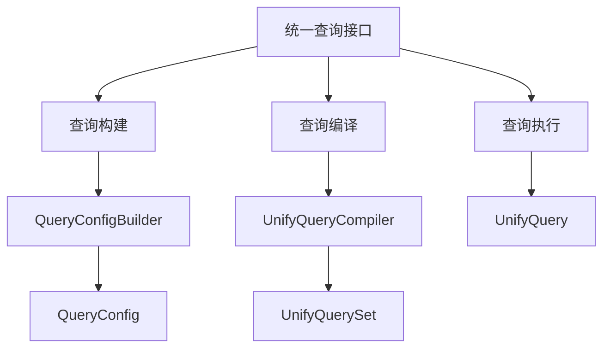
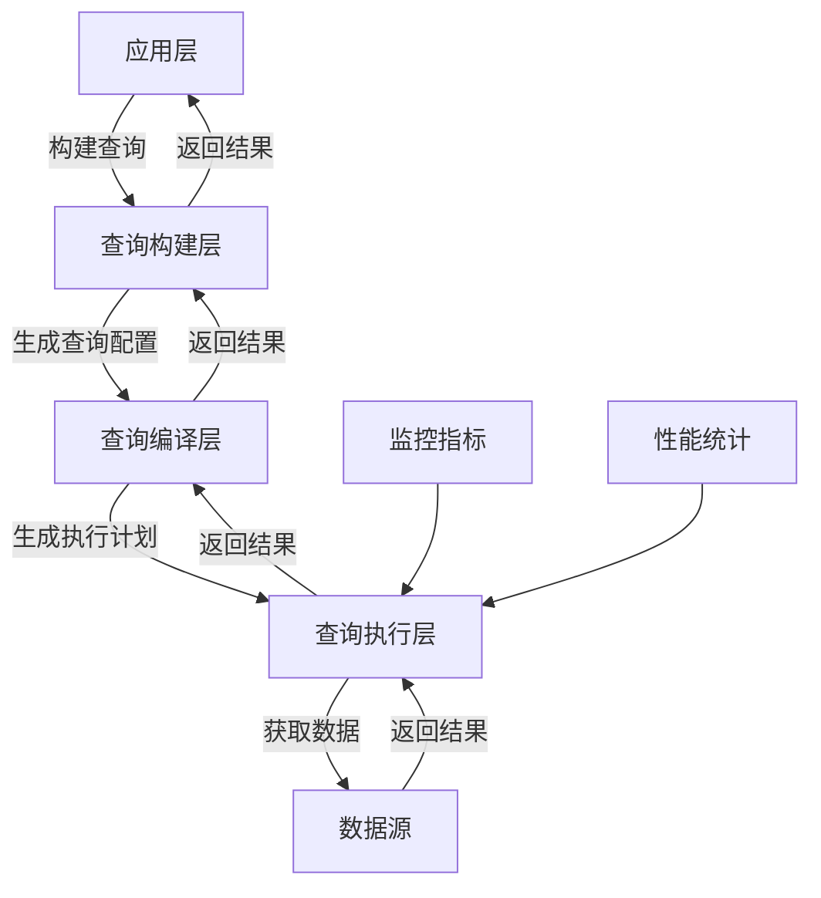
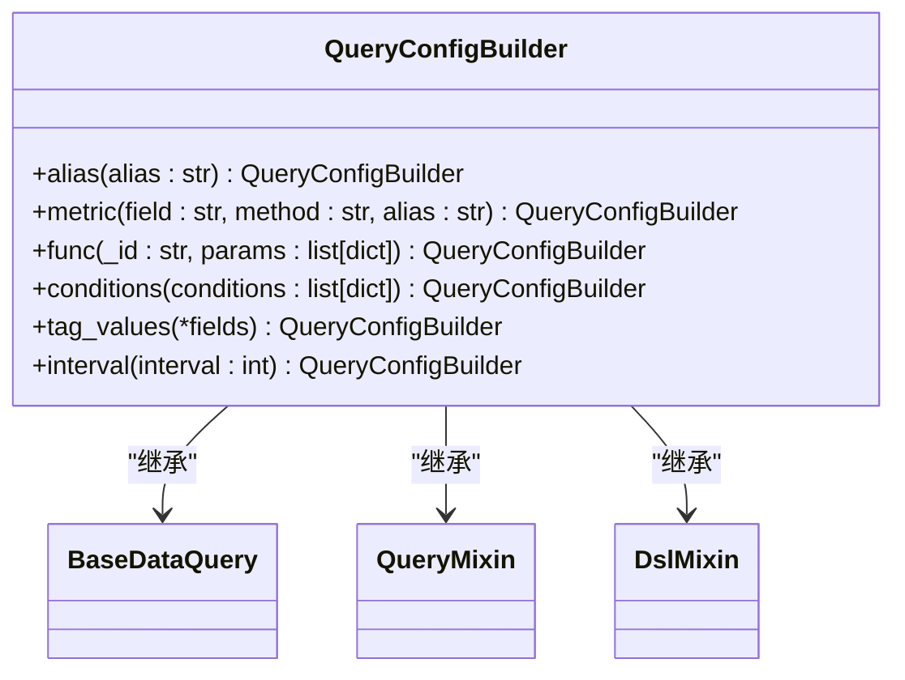
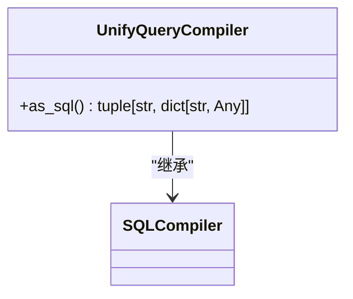
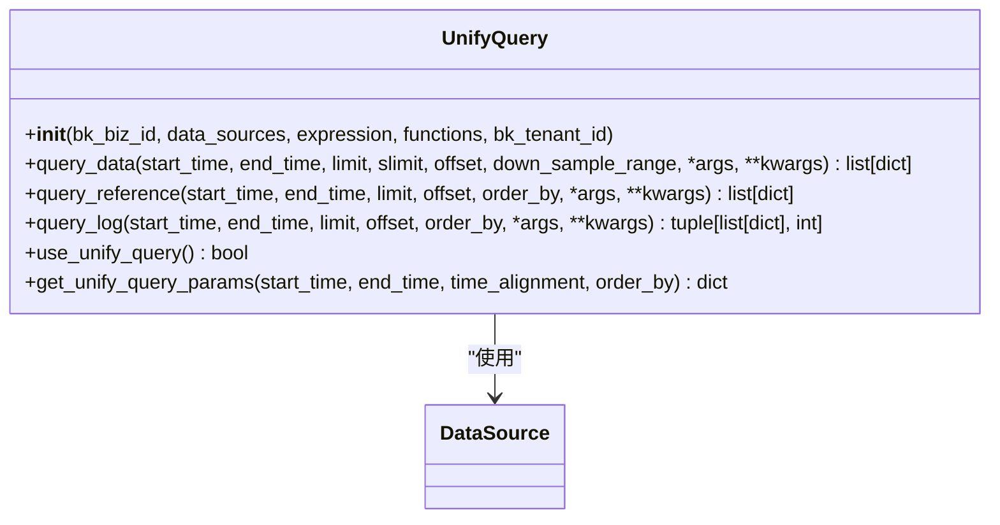
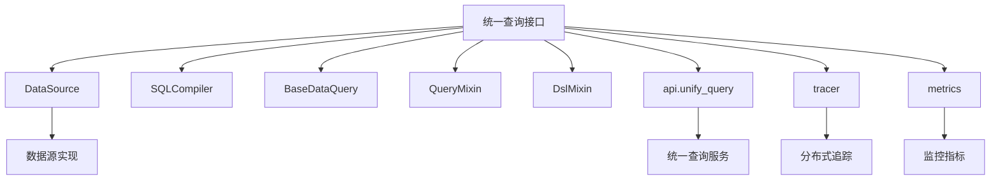

# 统一查询接口

<cite>
**本文档引用的文件**   
- [builder.py](file://bkmonitor/bkmonitor/data_source/unify_query/builder.py)
- [query.py](file://bkmonitor/bkmonitor/data_source/unify_query/query.py)
</cite>

## 目录
1. [简介](#简介)
2. [项目结构](#项目结构)
3. [核心组件](#核心组件)
4. [架构概述](#架构概述)
5. [详细组件分析](#详细组件分析)
6. [依赖分析](#依赖分析)
7. [性能考虑](#性能考虑)
8. [故障排除指南](#故障排除指南)
9. [结论](#结论)

## 简介
本文档详细介绍了统一查询接口的设计与实现，重点阐述了跨数据源查询的功能。该接口旨在提供一个统一的查询语言和执行机制，支持多数据源的联合查询、数据类型转换、函数映射等高级功能。文档将深入解析查询解析器的工作机制，包括语法分析、语义验证和执行计划生成，并介绍查询优化策略如查询重写、索引选择和并行执行。此外，还将提供丰富的使用示例和性能监控方法。

## 项目结构
该项目采用模块化设计，主要功能集中在`bkmonitor/data_source/unify_query`目录下。该目录包含构建统一查询的核心组件，包括查询构建器、编译器和执行器。整体结构清晰，遵循了分层设计原则，将查询构建、编译和执行逻辑分离。

**图示来源**
- [builder.py](file://bkmonitor/bkmonitor/data_source/unify_query/builder.py)

**本节来源**
- [builder.py](file://bkmonitor/bkmonitor/data_source/unify_query/builder.py)

## 核心组件
统一查询接口的核心组件包括`UnifyQuery`、`UnifyQuerySet`、`QueryConfigBuilder`和`UnifyQueryCompiler`。这些组件共同协作，实现了从查询构建到结果返回的完整流程。`UnifyQuery`作为顶层入口，负责协调整个查询过程；`UnifyQuerySet`提供了链式调用的查询构建接口；`QueryConfigBuilder`用于构建具体的查询配置；而`UnifyQueryCompiler`则负责将高级查询转换为底层可执行的格式。

**本节来源**
- [builder.py](file://bkmonitor/bkmonitor/data_source/unify_query/builder.py)
- [query.py](file://bkmonitor/bkmonitor/data_source/unify_query/query.py)

## 架构概述
统一查询接口采用分层架构设计，从上到下分为查询构建层、查询编译层和查询执行层。查询构建层提供用户友好的API，允许通过链式调用构建复杂查询；查询编译层负责将高级查询语法转换为统一的查询协议；查询执行层则负责与底层数据源交互，获取并处理查询结果。这种分层设计使得系统具有良好的扩展性和可维护性。

**图示来源**
- [query.py](file://bkmonitor/bkmonitor/data_source/unify_query/query.py)

## 详细组件分析

### 统一查询构建器分析
`QueryConfigBuilder`类提供了构建统一查询的API，支持链式调用方式。它继承自`BaseDataQuery`、`QueryMixin`和`DslMixin`，集成了多种查询功能。通过`alias`、`metric`、`func`等方法，用户可以逐步构建复杂的查询配置。

**图示来源**
- [builder.py](file://bkmonitor/bkmonitor/data_source/unify_query/builder.py#L96-L152)

**本节来源**
- [builder.py](file://bkmonitor/bkmonitor/data_source/unify_query/builder.py#L96-L152)

### 统一查询编译器分析
`UnifyQueryCompiler`是查询编译的核心组件，负责将高级查询语法转换为底层可执行的格式。它继承自`SQLCompiler`，重写了`as_sql`方法，将查询配置转换为统一查询协议所需的参数结构。编译器会处理查询配置中的各种参数，如数据类型标签、数据源标签、时间字段、选择字段、条件、函数等，并生成最终的查询请求。

**图示来源**
- [builder.py](file://bkmonitor/bkmonitor/data_source/unify_query/builder.py#L259-L310)

**本节来源**
- [builder.py](file://bkmonitor/bkmonitor/data_source/unify_query/builder.py#L259-L310)

### 统一查询执行器分析
`UnifyQuery`类是统一查询的执行入口，负责协调整个查询过程。它接收业务ID、数据源列表、表达式和函数等参数，根据配置决定是否使用统一查询模块。该类提供了`query_data`、`query_reference`和`query_log`等方法，支持不同类型的数据查询。执行器会根据查询类型选择合适的执行策略，并处理查询结果的标准化和后处理。

**图示来源**
- [query.py](file://bkmonitor/bkmonitor/data_source/unify_query/query.py#L47-L754)

**本节来源**
- [query.py](file://bkmonitor/bkmonitor/data_source/unify_query/query.py#L47-L754)

## 依赖分析
统一查询接口依赖于多个核心模块和外部服务。在代码层面，它依赖于`DataSource`基类、`SQLCompiler`、`BaseDataQuery`等组件，这些组件提供了基础的查询功能和数据处理能力。在服务层面，它依赖于`api.unify_query`服务进行实际的数据查询操作，并通过`tracer`和`metrics`模块进行性能监控和追踪。这种依赖关系确保了系统的模块化和可扩展性。

**图示来源**
- [builder.py](file://bkmonitor/bkmonitor/data_source/unify_query/builder.py)
- [query.py](file://bkmonitor/bkmonitor/data_source/unify_query/query.py)

**本节来源**
- [builder.py](file://bkmonitor/bkmonitor/data_source/unify_query/builder.py)
- [query.py](file://bkmonitor/bkmonitor/data_source/unify_query/query.py)

## 性能考虑
统一查询接口在设计时充分考虑了性能因素。通过`metrics.DATASOURCE_QUERY_TIME`和`metrics.DATASOURCE_QUERY_COUNT`等监控指标，系统能够实时跟踪查询性能和调用次数。查询执行过程中使用了`with metrics.DATASOURCE_QUERY_TIME.labels(**labels).time()`上下文管理器来精确测量查询耗时。此外，系统还支持并行查询执行，通过`ThreadPool().map_ignore_exception`方法可以同时查询多个数据源，提高查询效率。

**本节来源**
- [query.py](file://bkmonitor/bkmonitor/data_source/unify_query/query.py)

## 故障排除指南
在使用统一查询接口时，可能会遇到各种问题。常见的故障包括查询超时、数据源连接失败、查询语法错误等。系统提供了详细的日志记录功能，通过`logger.info(f"UNIFY_QUERY: {json.dumps(params)}")`可以查看实际发送的查询参数。此外，通过监控指标可以快速定位性能瓶颈。建议在排查问题时，首先检查查询参数是否正确，然后查看相关服务的日志，最后通过监控系统分析性能指标。

**本节来源**
- [query.py](file://bkmonitor/bkmonitor/data_source/unify_query/query.py)

## 结论
统一查询接口为跨数据源查询提供了一个强大而灵活的解决方案。通过分层架构设计和模块化实现，系统具有良好的扩展性和可维护性。接口支持复杂的查询操作，包括多数据源联合查询、表达式计算和函数映射。性能监控和错误处理机制确保了系统的稳定运行。未来可以进一步优化查询优化器，支持更多类型的查询重写和执行计划选择，提升查询效率。