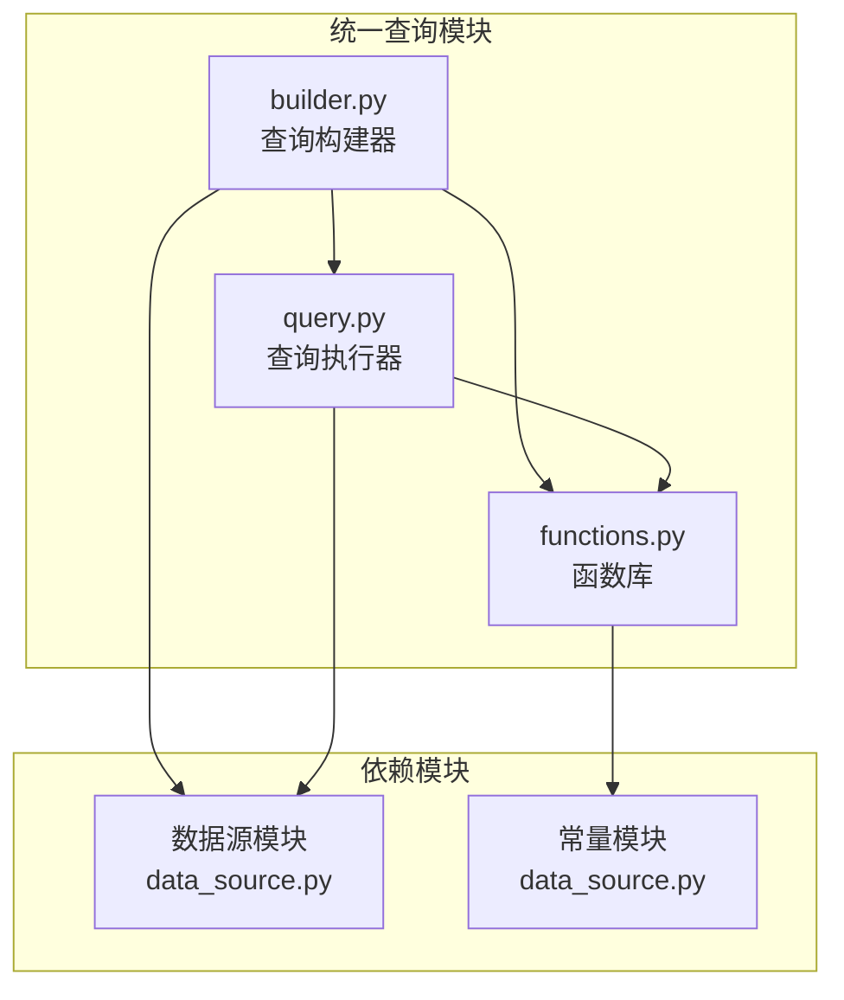
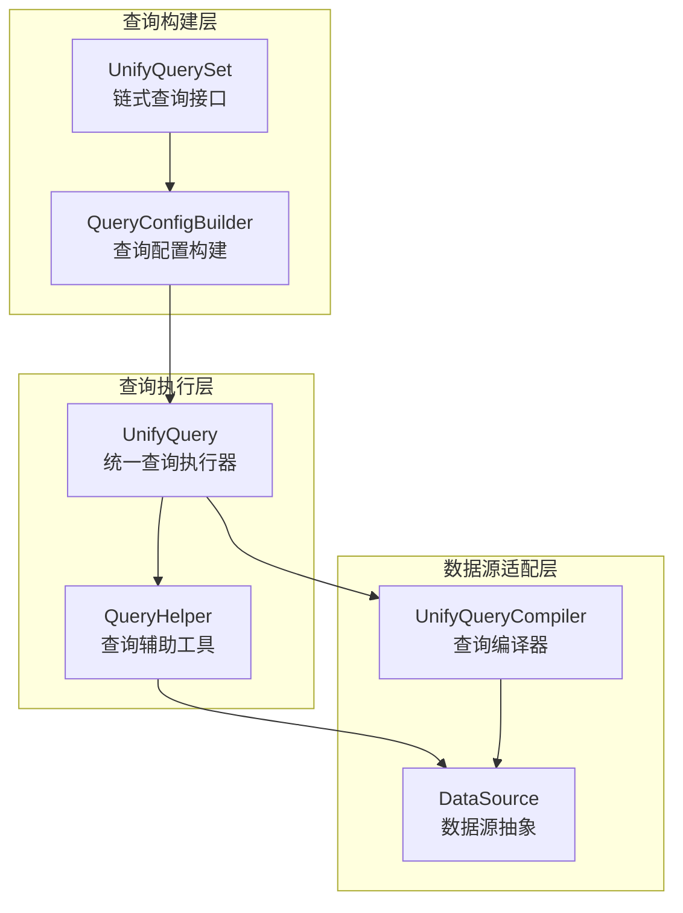
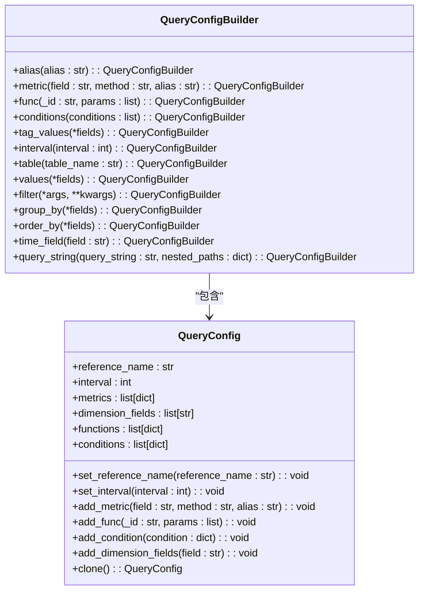
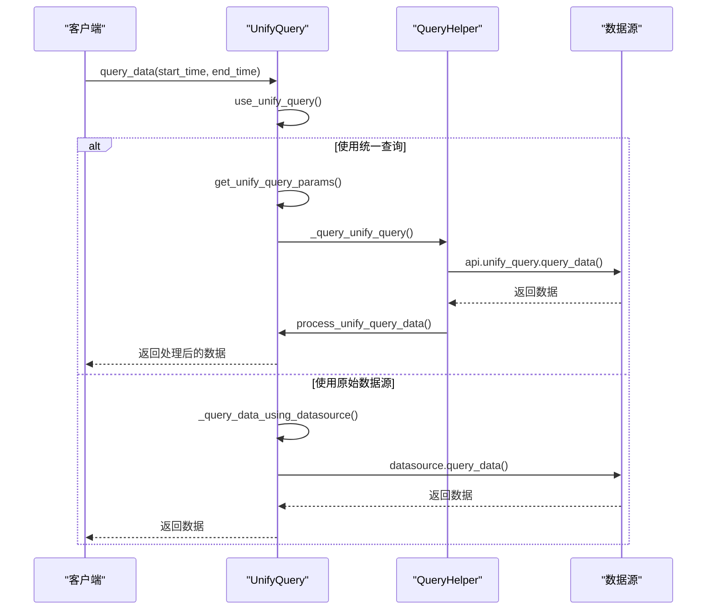
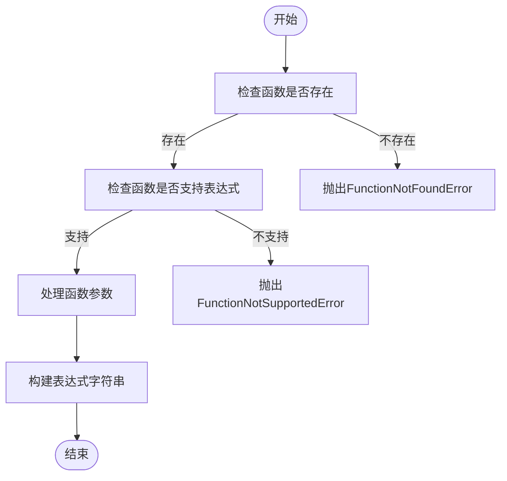
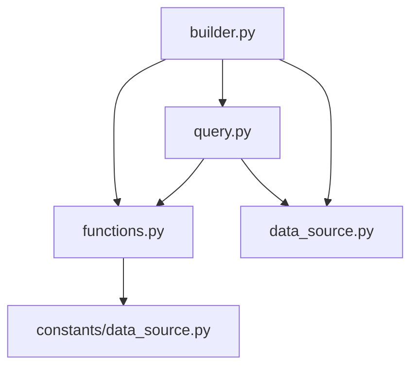

# 统一查询语言

<cite>
**本文档引用的文件**   
- [functions.py](file://bkmonitor/bkmonitor/data_source/unify_query/functions.py)
- [query.py](file://bkmonitor/bkmonitor/data_source/unify_query/query.py)
- [builder.py](file://bkmonitor/bkmonitor/data_source/unify_query/builder.py)
- [constants/data_source.py](file://constants/data_source.py)
- [data_source/data_source.py](file://bkmonitor/data_source/data_source.py)
</cite>

## 目录
1. [简介](#简介)
2. [项目结构](#项目结构)
3. [核心组件](#核心组件)
4. [架构概述](#架构概述)
5. [详细组件分析](#详细组件分析)
6. [依赖分析](#依赖分析)
7. [性能考虑](#性能考虑)
8. [故障排除指南](#故障排除指南)
9. [结论](#结论)

## 简介
本文档详细介绍了统一查询语言的设计与实现，重点阐述了跨数据源查询语法的设计原则和实现机制。文档涵盖了统一查询语言的核心语法结构、数据类型系统、内置函数库、多数据源联合查询支持等关键方面，并通过具体示例说明了查询语句的执行过程。该统一查询语言旨在为监控平台提供一个强大、灵活且易于使用的数据查询接口，支持从多种数据源（如时序数据库、日志系统、APM等）中检索和分析数据。

## 项目结构
统一查询语言的实现主要分布在`bkmonitor/data_source/unify_query`目录下，该模块作为监控平台数据查询的核心组件，提供了跨数据源的统一查询能力。其结构设计遵循了模块化和可扩展的原则，主要包含查询构建、执行、函数库等核心部分。

**图示来源**
- [builder.py](file://bkmonitor/bkmonitor/data_source/unify_query/builder.py)
- [query.py](file://bkmonitor/bkmonitor/data_source/unify_query/query.py)
- [functions.py](file://bkmonitor/bkmonitor/data_source/unify_query/functions.py)

**本节来源**
- [builder.py](file://bkmonitor/bkmonitor/data_source/unify_query/builder.py)
- [query.py](file://bkmonitor/bkmonitor/data_source/unify_query/query.py)
- [functions.py](file://bkmonitor/bkmonitor/data_source/unify_query/functions.py)

## 核心组件
统一查询语言的核心由三个主要组件构成：查询构建器（`QueryConfigBuilder`）、查询执行器（`UnifyQuery`）和内置函数库（`Functions`）。这些组件协同工作，将高级查询语句转换为底层数据源可执行的指令。

**本节来源**
- [builder.py](file://bkmonitor/bkmonitor/data_source/unify_query/builder.py#L1-L535)
- [query.py](file://bkmonitor/bkmonitor/data_source/unify_query/query.py#L1-L756)
- [functions.py](file://bkmonitor/bkmonitor/data_source/unify_query/functions.py#L1-L510)

## 架构概述
统一查询语言的架构采用分层设计，从上至下分为查询构建层、查询执行层和数据源适配层。查询构建层负责将用户友好的查询操作转换为标准化的查询配置；查询执行层负责根据配置选择合适的执行策略并处理结果；数据源适配层则负责与具体的后端数据存储进行交互。

**图示来源**
- [builder.py](file://bkmonitor/bkmonitor/data_source/unify_query/builder.py#L1-L535)
- [query.py](file://bkmonitor/bkmonitor/data_source/unify_query/query.py#L1-L756)

## 详细组件分析

### 查询构建器分析
查询构建器提供了类ORM的链式调用接口，允许开发者以声明式的方式构建复杂的查询语句。其核心是`QueryConfigBuilder`类，它继承了`BaseDataQuery`、`QueryMixin`和`DslMixin`，从而支持SQL和DSL两种查询模式。

#### 类图

**图示来源**
- [builder.py](file://bkmonitor/bkmonitor/data_source/unify_query/builder.py#L1-L535)

**本节来源**
- [builder.py](file://bkmonitor/bkmonitor/data_source/unify_query/builder.py#L1-L535)

### 查询执行器分析
查询执行器是统一查询语言的核心，负责解析查询配置、选择执行策略并返回结果。`UnifyQuery`类是主要的执行入口，它根据查询条件决定是使用统一查询模块还是直接通过数据源查询。

#### 序列图

**图示来源**
- [query.py](file://bkmonitor/bkmonitor/data_source/unify_query/query.py#L1-L756)

**本节来源**
- [query.py](file://bkmonitor/bkmonitor/data_source/unify_query/query.py#L1-L756)

### 内置函数库分析
内置函数库提供了丰富的数据处理和分析函数，分为聚合函数、变化率函数、排序函数和算术函数等类别。这些函数通过`Functions`字典进行注册和管理，支持在查询表达式中直接调用。

#### 流程图

**图示来源**
- [functions.py](file://bkmonitor/bkmonitor/data_source/unify_query/functions.py#L1-L510)

**本节来源**
- [functions.py](file://bkmonitor/bkmonitor/data_source/unify_query/functions.py#L1-L510)

## 依赖分析
统一查询语言模块依赖于多个核心模块，形成了一个紧密耦合但职责分明的系统。其依赖关系清晰地展示了数据流和控制流。

**图示来源**
- [builder.py](file://bkmonitor/bkmonitor/data_source/unify_query/builder.py)
- [query.py](file://bkmonitor/bkmonitor/data_source/unify_query/query.py)
- [functions.py](file://bkmonitor/bkmonitor/data_source/unify_query/functions.py)

**本节来源**
- [builder.py](file://bkmonitor/bkmonitor/data_source/unify_query/builder.py)
- [query.py](file://bkmonitor/bkmonitor/data_source/unify_query/query.py)
- [functions.py](file://bkmonitor/bkmonitor/data_source/unify_query/functions.py)

## 性能考虑
统一查询语言在设计时充分考虑了性能因素。通过`use_unify_query`方法智能地选择查询策略，避免了不必要的性能开销。对于简单的单数据源查询，系统会直接调用底层数据源接口，而对于复杂的多数据源联合查询，则使用统一查询模块进行优化。此外，查询结果的处理和转换也经过精心设计，以减少内存占用和处理时间。

## 故障排除指南
当遇到查询失败或性能问题时，可以按照以下步骤进行排查：
1. 检查`use_unify_query`方法的返回值，确认查询策略是否符合预期。
2. 查看日志中的`UNIFY_QUERY`记录，检查生成的查询参数是否正确。
3. 验证数据源配置，确保`data_source_label`和`data_type_label`正确无误。
4. 检查内置函数的使用，确保函数ID和参数符合规范。

**本节来源**
- [query.py](file://bkmonitor/bkmonitor/data_source/unify_query/query.py#L1-L756)
- [functions.py](file://bkmonitor/bkmonitor/data_source/unify_query/functions.py#L1-L510)

## 结论
统一查询语言通过精心设计的架构和组件，成功实现了跨数据源的统一查询能力。其模块化的设计使得系统易于维护和扩展，而丰富的功能和灵活的接口则满足了多样化的查询需求。未来可以通过增加更多内置函数、优化查询执行计划等方式进一步提升其性能和易用性。