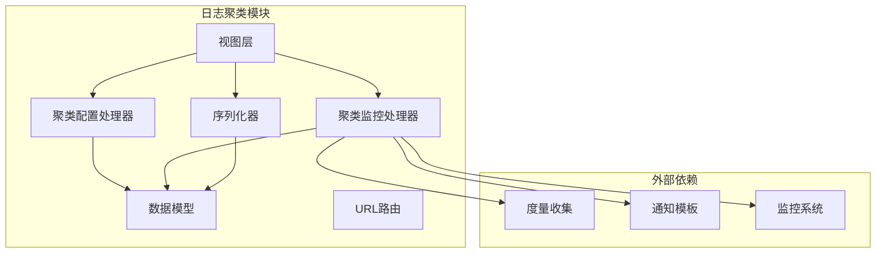
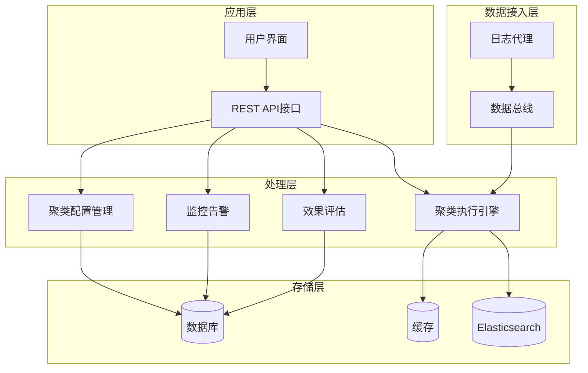
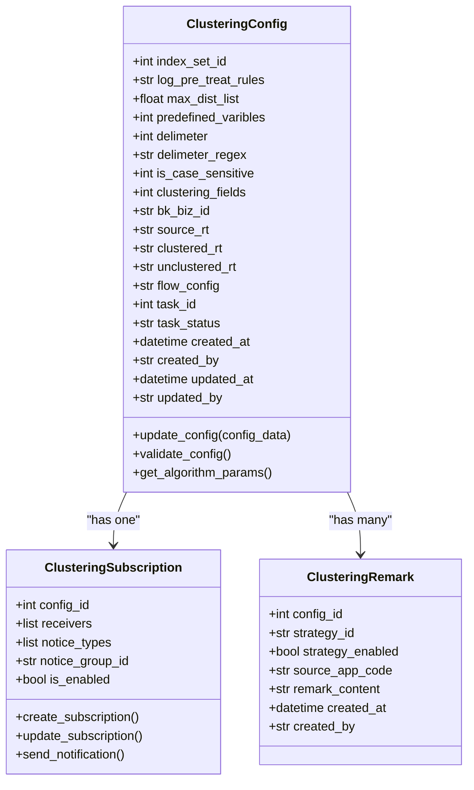
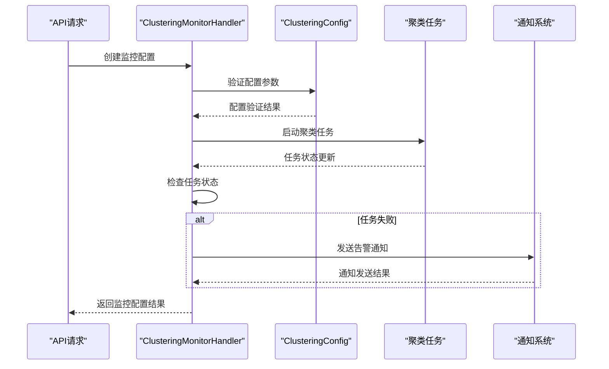
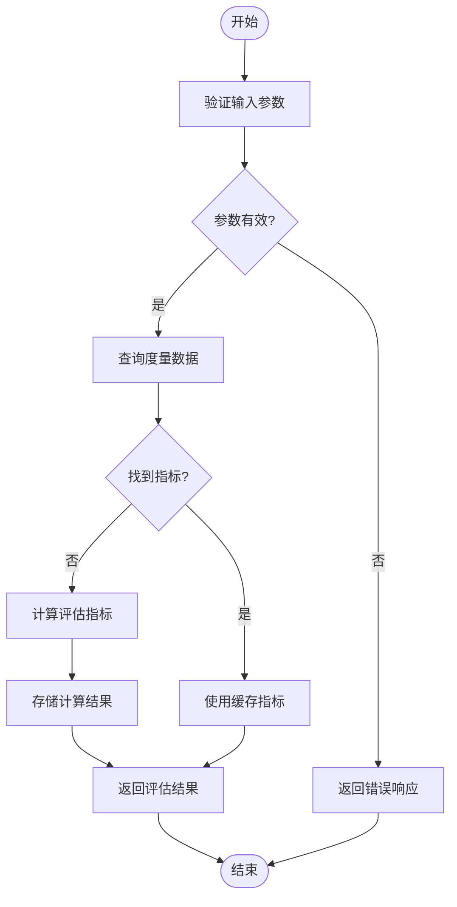
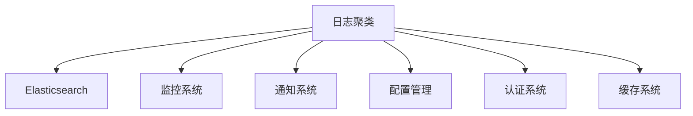

# 日志聚类API

<cite>
**本文档中引用的文件**
- [clustering_config.py](file://bklog/apps/log_clustering/handlers/clustering_config.py)
- [clustering_monitor.py](file://bklog/apps/log_clustering/handlers/clustering_monitor.py)
- [clustering_config_views.py](file://bklog/apps/log_clustering/views/clustering_config_views.py)
- [clustering_monitor_views.py](file://bklog/apps/log_clustering/views/clustering_monitor_views.py)
- [models.py](file://bklog/apps/log_clustering/models.py)
- [serializers.py](file://bklog/apps/log_clustering/serializers.py)
- [urls.py](file://bklog/apps/log_clustering/urls.py)
- [constants.py](file://bklog/apps/log_clustering/constants.py)
- [log_clustering.py](file://bklog/apps/log_measure/handlers/metric_collectors/log_clustering.py)
- [clustering_mail.html](file://bklog/templates/clustering_subscription/clustering_mail.html)
- [clustering_wechat.md](file://bklog/templates/clustering_subscription/clustering_wechat.md)
</cite>

## 目录
1. [简介](#简介)
2. [项目结构](#项目结构)
3. [核心组件](#核心组件)
4. [架构概述](#架构概述)
5. [详细组件分析](#详细组件分析)
6. [依赖分析](#依赖分析)
7. [性能考虑](#性能考虑)
8. [故障排除指南](#故障排除指南)
9. [结论](#结论)

## 简介
本文档详细描述了日志聚类分析API的功能，涵盖聚类配置管理、模式识别、特征提取、订阅通知等接口。文档说明了如何创建和管理聚类任务，包括时间窗口、相似度阈值、算法选择等参数设置。同时，文档化了聚类结果查询API，包括模式列表、样本日志、趋势分析等数据结构，并解释了聚类监控告警的配置方式和通知策略。此外，还提供了聚类效果评估相关的API说明，如准确率、召回率等指标查询，以及聚类模型训练、更新和版本管理的接口文档。

## 项目结构
日志聚类功能主要位于`bklog/apps/log_clustering/`目录下，包含处理程序、视图、模型、序列化器和URL配置。该模块与其他组件如监控、度量收集和通知系统集成，形成完整的日志聚类分析解决方案。

**Diagram sources**
- [clustering_config.py](file://bklog/apps/log_clustering/handlers/clustering_config.py)
- [clustering_monitor.py](file://bklog/apps/log_clustering/handlers/clustering_monitor.py)
- [models.py](file://bklog/apps/log_clustering/models.py)

**Section sources**
- [clustering_config.py](file://bklog/apps/log_clustering/handlers/clustering_config.py)
- [clustering_monitor.py](file://bklog/apps/log_clustering/handlers/clustering_monitor.py)

## 核心组件
日志聚类系统的核心组件包括聚类配置管理、聚类执行引擎、模式识别、特征提取、订阅通知和效果评估。这些组件协同工作，实现从原始日志到可操作洞察的转换过程。

**Section sources**
- [models.py](file://bklog/apps/log_clustering/models.py)
- [serializers.py](file://bklog/apps/log_clustering/serializers.py)

## 架构概述
日志聚类系统采用分层架构，包括数据接入层、处理层、存储层和应用层。系统通过配置驱动的方式，支持多种聚类算法和参数设置，能够灵活适应不同的日志分析需求。

**Diagram sources**
- [urls.py](file://bklog/apps/log_clustering/urls.py)
- [views/clustering_config_views.py](file://bklog/apps/log_clustering/views/clustering_config_views.py)
- [handlers/clustering_config.py](file://bklog/apps/log_clustering/handlers/clustering_config.py)

## 详细组件分析

### 聚类配置管理分析
聚类配置管理组件负责创建、更新和删除聚类任务的配置。配置包括时间窗口、相似度阈值、算法选择等关键参数，这些参数直接影响聚类结果的质量和性能。

#### 类图

**Diagram sources**
- [models.py](file://bklog/apps/log_clustering/models.py)
- [serializers.py](file://bklog/apps/log_clustering/serializers.py)

**Section sources**
- [models.py](file://bklog/apps/log_clustering/models.py)
- [clustering_config.py](file://bklog/apps/log_clustering/handlers/clustering_config.py)

### 聚类监控告警分析
聚类监控告警组件负责监控聚类任务的执行状态，并在异常情况下发送通知。该组件与通知系统集成，支持多种通知渠道，如邮件、企业微信等。

#### 序列图

**Diagram sources**
- [clustering_monitor.py](file://bklog/apps/log_clustering/handlers/clustering_monitor.py)
- [clustering_monitor_views.py](file://bklog/apps/log_clustering/views/clustering_monitor_views.py)

**Section sources**
- [clustering_monitor.py](file://bklog/apps/log_clustering/handlers/clustering_monitor.py)
- [clustering_monitor_views.py](file://bklog/apps/log_clustering/views/clustering_monitor_views.py)

### 聚类效果评估分析
聚类效果评估组件提供API接口，用于查询聚类结果的准确率、召回率等指标。这些指标帮助用户评估聚类算法的性能，并指导参数调优。

#### 流程图

**Diagram sources**
- [log_clustering.py](file://bklog/apps/log_measure/handlers/metric_collectors/log_clustering.py)
- [constants.py](file://bklog/apps/log_clustering/constants.py)

**Section sources**
- [log_clustering.py](file://bklog/apps/log_measure/handlers/metric_collectors/log_clustering.py)

## 依赖分析
日志聚类系统依赖于多个内部和外部组件，包括Elasticsearch用于日志存储和检索，监控系统用于任务状态跟踪，通知系统用于告警发送，以及配置管理系统用于参数管理。

**Diagram sources**
- [clustering_config.py](file://bklog/apps/log_clustering/handlers/clustering_config.py)
- [clustering_monitor.py](file://bklog/apps/log_clustering/handlers/clustering_monitor.py)

**Section sources**
- [clustering_config.py](file://bklog/apps/log_clustering/handlers/clustering_config.py)
- [clustering_monitor.py](file://bklog/apps/log_clustering/handlers/clustering_monitor.py)

## 性能考虑
日志聚类系统的性能受多个因素影响，包括日志量、时间窗口大小、相似度阈值和算法复杂度。系统通过缓存、异步处理和分布式计算等技术优化性能，确保在大规模日志数据上的高效处理。

## 故障排除指南
当遇到聚类任务失败或性能问题时，应首先检查配置参数是否正确，然后查看任务日志以确定具体错误原因。常见的问题包括Elasticsearch连接失败、内存不足和算法参数设置不当。

**Section sources**
- [clustering_config.py](file://bklog/apps/log_clustering/handlers/clustering_config.py)
- [clustering_monitor.py](file://bklog/apps/log_clustering/handlers/clustering_monitor.py)

## 结论
日志聚类API提供了一套完整的日志分析解决方案，从配置管理到结果评估，涵盖了日志聚类分析的各个方面。通过灵活的配置选项和强大的监控告警功能，系统能够满足不同场景下的日志分析需求。