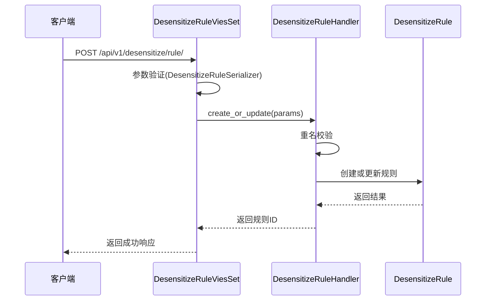
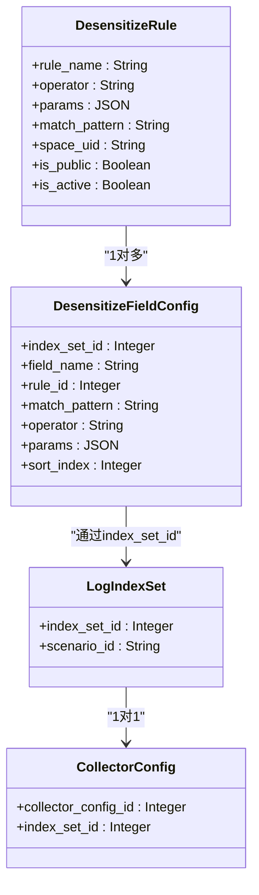
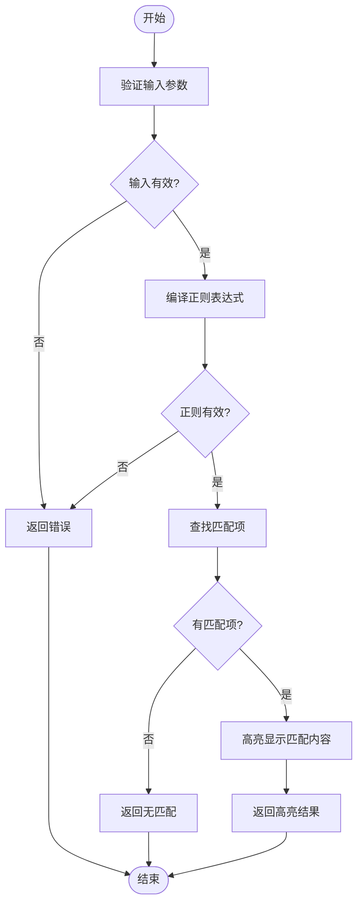
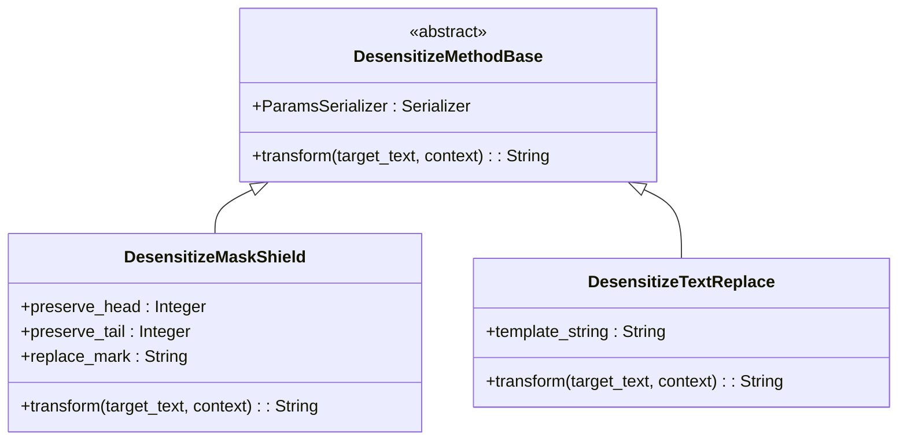
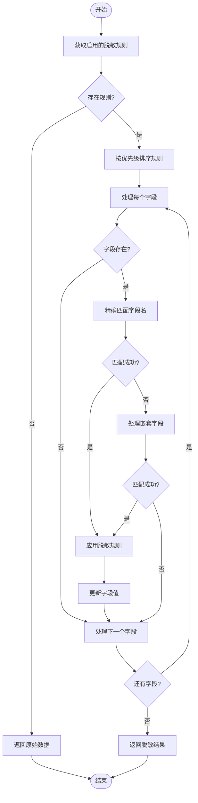

# 日志脱敏API

<cite>
**本文档引用的文件**
- [models.py](file://bklog/apps/log_desensitize/models.py)
- [serializers.py](file://bklog/apps/log_desensitize/serializers.py)
- [desensitize_rule_views.py](file://bklog/apps/log_desensitize/views/desensitize_rule_views.py)
- [constants.py](file://bklog/apps/log_desensitize/constants.py)
- [mask_shield.py](file://bklog/apps/log_desensitize/handlers/desensitize_operator/mask_shield.py)
- [text_replace.py](file://bklog/apps/log_desensitize/handlers/desensitize_operator/text_replace.py)
- [desensitize.py](file://bklog/apps/log_desensitize/handlers/desensitize.py)
- [urls.py](file://bklog/apps/log_desensitize/urls.py)
- [utils.py](file://bklog/apps/log_desensitize/utils.py)
</cite>

## 目录
1. [简介](#简介)
2. [脱敏规则管理API](#脱敏规则管理api)
3. [脱敏字段配置](#脱敏字段配置)
4. [脱敏规则与采集任务关联](#脱敏规则与采集任务关联)
5. [脱敏效果预览API](#脱敏效果预览api)
6. [内置脱敏算法](#内置脱敏算法)
7. [脱敏规则版本管理与灰度发布](#脱敏规则版本管理与灰度发布)

## 简介

日志脱敏API提供了一套完整的日志数据脱敏解决方案，支持创建、管理、应用和测试脱敏规则。系统通过灵活的配置机制，允许用户定义基于字段路径、匹配模式和脱敏算法的规则，确保敏感信息在日志处理过程中的安全性。脱敏规则可与采集任务关联，实现自动化的数据保护机制。

**Section sources**
- [models.py](file://bklog/apps/log_desensitize/models.py#L29-L79)
- [desensitize_rule_views.py](file://bklog/apps/log_desensitize/views/desensitize_rule_views.py#L42-L494)

## 脱敏规则管理API

脱敏规则管理API提供了对脱敏规则的全生命周期管理功能，包括创建、查询、更新和删除操作。

### 创建脱敏规则

通过POST请求创建新的脱敏规则：

```
POST /api/v1/desensitize/rule/
```

请求参数包括：
- `space_uid`: 空间唯一标识
- `rule_name`: 脱敏规则名称
- `match_fields`: 匹配的字段名列表
- `match_pattern`: 匹配表达式（正则表达式）
- `operator`: 脱敏算子（mask_shield, text_replace）
- `operator_params`: 脱敏算子参数
- `is_public`: 是否为全局规则

### 查询脱敏规则列表

通过GET请求获取脱敏规则列表：

```
GET /api/v1/desensitize/rule/?space_uid=$space_uid&rule_type=$rule_type
```

支持按规则类型（public、space、all）进行过滤查询。

### 更新和删除脱敏规则

支持通过PUT请求更新现有规则，通过DELETE请求删除规则。同时提供启用（start）和停用（stop）接口来控制规则的生效状态。



**Diagram sources**
- [desensitize_rule_views.py](file://bklog/apps/log_desensitize/views/desensitize_rule_views.py#L165-L206)
- [desensitize.py](file://bklog/apps/log_desensitize/handlers/desensitize.py#L268-L316)

**Section sources**
- [desensitize_rule_views.py](file://bklog/apps/log_desensitize/views/desensitize_rule_views.py#L93-L296)
- [serializers.py](file://bklog/apps/log_desensitize/serializers.py#L47-L98)

## 脱敏字段配置

脱敏字段配置定义了具体的脱敏规则参数，采用JSON结构进行配置。

### 配置JSON结构

```json
{
  "field_name": "字段名称",
  "rules": [
    {
      "rule_id": 1,
      "operator": "mask_shield",
      "params": {
        "preserve_head": 1,
        "preserve_tail": 2,
        "replace_mark": "*"
      }
    }
  ]
}
```

### 配置参数说明

| 参数 | 说明 | 示例 |
|------|------|------|
| field_name | 要脱敏的字段名称 | "phone" |
| operator | 脱敏算子类型 | "mask_shield" |
| preserve_head | 保留前几位字符 | 3 |
| preserve_tail | 保留后几位字符 | 4 |
| replace_mark | 替换符号 | "*" |
| template_string | 文本替换模板 | "abc${partNum}defg" |

**Section sources**
- [models.py](file://bklog/apps/log_desensitize/models.py#L68-L79)
- [serializers.py](file://bklog/apps/log_desensitize/serializers.py#L163-L167)

## 脱敏规则与采集任务关联

脱敏规则通过索引集与采集任务建立关联关系，实现规则的生效机制。

### 关联机制

1. 脱敏规则通过`DesensitizeFieldConfig`模型与索引集ID关联
2. 索引集与采集任务（CollectorConfig）建立关联
3. 当日志数据进入系统时，根据索引集查找对应的脱敏规则
4. 应用脱敏规则对日志数据进行处理

### 关联查询

通过`list`接口可以获取规则的接入信息，包括：
- 接入项总数（access_num）
- 接入场景信息（access_info）
  - 采集接入
  - 自定义上报
  - 数据平台
  - 第三方ES



**Diagram sources**
- [models.py](file://bklog/apps/log_desensitize/models.py#L29-L79)
- [desensitize.py](file://bklog/apps/log_desensitize/handlers/desensitize.py#L317-L428)

**Section sources**
- [desensitize.py](file://bklog/apps/log_desensitize/handlers/desensitize.py#L317-L428)
- [models.py](file://bklog/apps/log_desensitize/models.py#L29-L79)

## 脱敏效果预览API

提供脱敏效果预览功能，支持输入样例日志验证脱敏规则的正确性。

### 预览接口

```
POST /api/v1/desensitize/config/preview/
```

#### 请求参数

- `logs`: 日志原文列表
- `field_configs`: 字段脱敏配置信息
- `text_fields`: 日志原文字段

#### 使用示例

```json
{
  "logs": [
    {"gseIndex": 0, "path": "/var/log/messages/*.log", "requestMethod": "GET"}
  ],
  "field_configs": [
    {
      "field_name": "path",
      "rules": [
        {
          "rule_id": 1,
          "operator": "mask_shield",
          "params": {
            "preserve_head": 1,
            "preserve_tail": 2,
            "replace_mark": "*"
          }
        }
      ]
    }
  ],
  "text_fields": ["log"]
}
```

### 正则调试功能

提供独立的正则表达式调试接口，用于验证匹配模式的正确性：

```
POST /api/v1/desensitize/rule/regex/debug/
```

请求参数：
- `log_sample`: 日志样例
- `match_pattern`: 正则表达式



**Diagram sources**
- [desensitize_rule_views.py](file://bklog/apps/log_desensitize/views/desensitize_rule_views.py#L297-L319)
- [desensitize.py](file://bklog/apps/log_desensitize/handlers/desensitize.py#L487-L507)

**Section sources**
- [desensitize_rule_views.py](file://bklog/apps/log_desensitize/views/desensitize_rule_views.py#L407-L493)
- [serializers.py](file://bklog/apps/log_desensitize/serializers.py#L163-L167)

## 内置脱敏算法

系统提供多种内置脱敏算法，支持掩码和文本替换等常见脱敏方式。

### 掩码屏蔽算法

实现对敏感信息的部分字符进行掩码处理。

#### 参数配置

| 参数 | 说明 | 默认值 |
|------|------|--------|
| preserve_head | 保留前几位 | 0 |
| preserve_tail | 保留后几位 | 0 |
| replace_mark | 替换符号 | "*" |

#### 处理逻辑

```python
def transform(self, target_text: str = "", context: dict = None):
    if not target_text:
        return ""
    if self.preserve_head == self.preserve_tail == 0:
        return self.replace_mark * len(target_text)
    if self.preserve_head + self.preserve_tail >= len(target_text):
        return target_text
    tail_text = target_text[-self.preserve_tail:] if self.preserve_tail > 0 else ''
    return (target_text[:self.preserve_head] + 
            self.replace_mark * (len(target_text) - self.preserve_head - self.preserve_tail) + 
            tail_text)
```

### 文本替换算法

实现基于模板的文本替换功能。

#### 参数配置

| 参数 | 说明 |
|------|------|
| template_string | 替换模板格式，支持${}变量引用 |

#### 处理逻辑

使用Jinja2模板引擎进行文本替换，支持变量引用和上下文传递。



**Diagram sources**
- [mask_shield.py](file://bklog/apps/log_desensitize/handlers/desensitize_operator/mask_shield.py#L30-L78)
- [text_replace.py](file://bklog/apps/log_desensitize/handlers/desensitize_operator/text_replace.py#L29-L71)
- [base.py](file://bklog/apps/log_desensitize/handlers/desensitize_operator/base.py#L25-L37)

**Section sources**
- [mask_shield.py](file://bklog/apps/log_desensitize/handlers/desensitize_operator/mask_shield.py#L30-L78)
- [text_replace.py](file://bklog/apps/log_desensitize/handlers/desensitize_operator/text_replace.py#L29-L71)

## 脱敏规则版本管理与灰度发布

系统通过规则状态管理和优先级机制实现版本控制和灰度发布策略。

### 版本管理

- 每个脱敏规则具有独立的ID和版本信息
- 支持规则的启用/停用状态控制
- 通过`sort_index`字段控制规则执行优先级

### 灰度发布策略

1. **规则优先级**: 通过`sort_index`字段定义规则执行顺序，值越小优先级越高
2. **匹配模式**: 支持字段名匹配和正则表达式匹配两种方式
3. **作用范围**: 支持全局规则和业务规则两种类型
4. **生效机制**: 规则修改后立即生效，无需重启服务

### 规则匹配流程



**Diagram sources**
- [desensitize.py](file://bklog/apps/log_desensitize/handlers/desensitize.py#L131-L157)
- [utils.py](file://bklog/apps/log_desensitize/utils.py#L25-L44)

**Section sources**
- [desensitize.py](file://bklog/apps/log_desensitize/handlers/desensitize.py#L52-L252)
- [constants.py](file://bklog/apps/log_desensitize/constants.py#L27-L38)