# 日志采集API

<cite>
**本文档引用的文件**   
- [bk_log.py](file://bklog/apps/api/modules/bk_log.py)
- [collector_views.py](file://bklog/apps/log_databus/views/collector_views.py)
- [collector_views.py](file://bklog/apps/log_databus/views/collector_views.py)
- [models.py](file://bklog/apps/log_databus/models.py)
- [serializers.py](file://bklog/apps/log_databus/serializers.py)
- [constants.py](file://bklog/apps/log_databus/constants.py)
- [storage_views.py](file://bklog/apps/log_databus/views/storage_views.py)
- [clean_views.py](file://bklog/apps/log_databus/views/clean_views.py)
- [archive_views.py](file://bklog/apps/log_databus/views/archive_views.py)
- [restore_views.py](file://bklog/apps/log_databus/views/restore_views.py)
- [bcs_views.py](file://bklog/apps/log_bcs/views/bcs_views.py)
- [data_link_views.py](file://bklog/apps/log_databus/views/link_views.py)
- [collector_plugin_views.py](file://bklog/apps/log_databus/views/collector_plugin_views.py)
</cite>

## 目录
1. [简介](#简介)
2. [项目结构](#项目结构)
3. [核心组件](#核心组件)
4. [架构概述](#架构概述)
5. [详细组件分析](#详细组件分析)
6. [依赖分析](#依赖分析)
7. [性能考虑](#性能考虑)
8. [故障排除指南](#故障排除指南)
9. [结论](#结论)
10. [附录](#附录)

## 简介
本文档详细描述了日志采集API的完整功能，覆盖采集任务的全生命周期管理，包括创建、配置、启动、停止和删除等操作。文档重点阐述了主机采集和K8s采集两种场景的API参数差异，详细说明了采集配置的JSON结构，包括日志路径、过滤规则、清洗规则等字段。同时提供了采集任务状态查询接口的响应格式和状态码含义，以及采集插件管理、数据链路配置、归档策略等高级功能的API说明。最后，文档包含curl调用示例和Python客户端代码示例，展示如何自动化管理采集任务。

## 项目结构
日志采集API是蓝鲸日志平台（BK-LOG）的核心功能模块，主要位于`bklog/apps/log_databus`目录下。该模块负责日志数据的采集、清洗、存储和管理，是整个日志平台的数据入口。系统采用Django REST framework构建API，通过模块化设计将不同功能分离到独立的视图集（ViewSet）中。

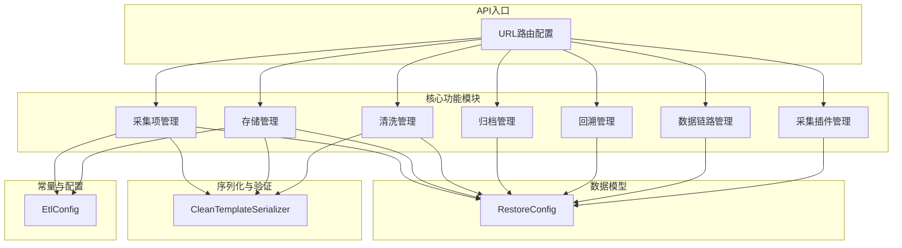

**图源**
- [urls.py](file://bklog/apps/log_databus/urls.py#L38-L51)
- [collector_views.py](file://bklog/apps/log_databus/views/collector_views.py#L98-L105)
- [storage_views.py](file://bklog/apps/log_databus/views/storage_views.py#L22-L29)
- [models.py](file://bklog/apps/log_databus/models.py#L101-L800)
- [serializers.py](file://bklog/apps/log_databus/serializers.py#L394-L800)
- [constants.py](file://bklog/apps/log_databus/constants.py#L282-L398)

**章节源**
- [urls.py](file://bklog/apps/log_databus/urls.py#L1-L56)
- [models.py](file://bklog/apps/log_databus/models.py#L1-L800)

## 核心组件

日志采集API的核心组件包括采集项管理、数据链路配置、存储管理、清洗配置、归档与回溯等功能。采集项管理（CollectorConfig）是核心数据模型，它定义了日志采集的所有配置信息，包括采集目标、日志路径、过滤规则、清洗规则等。数据链路（DataLinkConfig）定义了从数据采集到存储的完整路径，包括Kafka集群、Transfer集群和ES集群。存储管理负责ES集群的配置和状态监控。清洗配置（CleanTemplate）允许用户定义复杂的日志清洗规则。归档与回溯功能则提供了长期存储和历史数据恢复的能力。

**章节源**
- [models.py](file://bklog/apps/log_databus/models.py#L101-L800)
- [constants.py](file://bklog/apps/log_databus/constants.py#L282-L398)

## 架构概述

日志采集API采用分层架构设计，上层为RESTful API接口，中层为业务逻辑处理，底层为数据模型和外部服务调用。API层通过Django REST framework的ViewSet提供标准化的CRUD操作。业务逻辑层封装了复杂的采集流程，如创建采集项时需要申请DataID、通过节点管理订阅采集器、执行部署任务等。数据模型层定义了采集配置、数据链路、存储集群等核心实体。系统通过API模块（如TransferApi、NodeApi）与外部系统（如节点管理、GSE）进行交互。

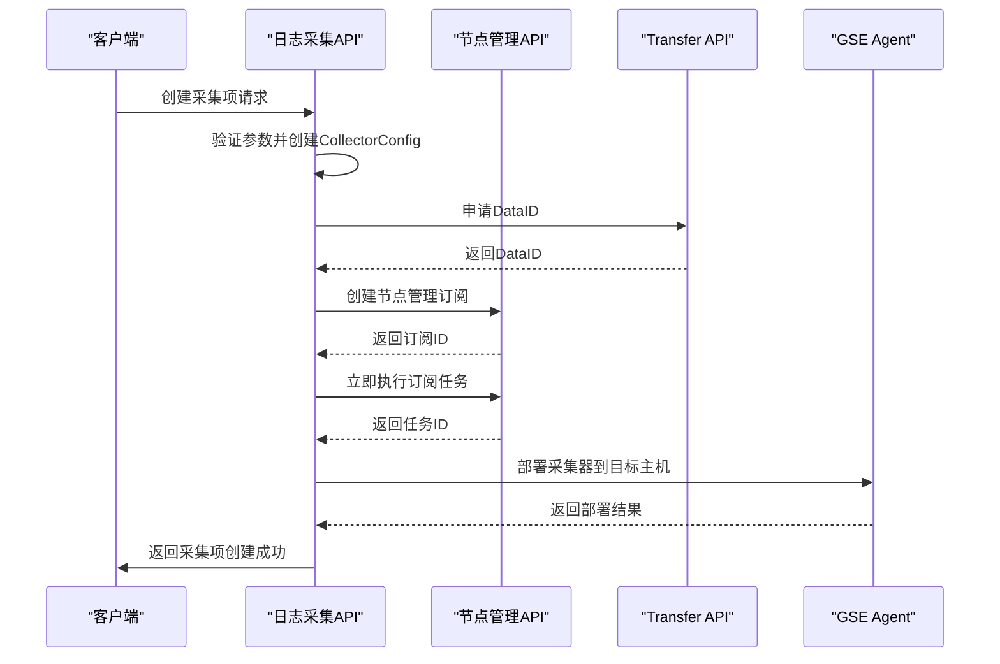

**图源**
- [collector_views.py](file://bklog/apps/log_databus/views/collector_views.py#L201-L2565)
- [models.py](file://bklog/apps/log_databus/models.py#L101-L119)
- [handlers/collector.py](file://bklog/apps/log_databus/handlers/collector.py)

## 详细组件分析

### 采集项管理分析
采集项管理是日志采集API的核心功能，负责采集任务的全生命周期管理。

#### 采集项创建与更新
采集项的创建和更新通过`CollectorCreateSerializer`和`CollectorUpdateSerializer`进行参数验证。这些序列化器定义了创建采集项所需的所有字段，包括业务ID、采集名称、日志类型、数据分类、采集目标、字符集和采集参数等。

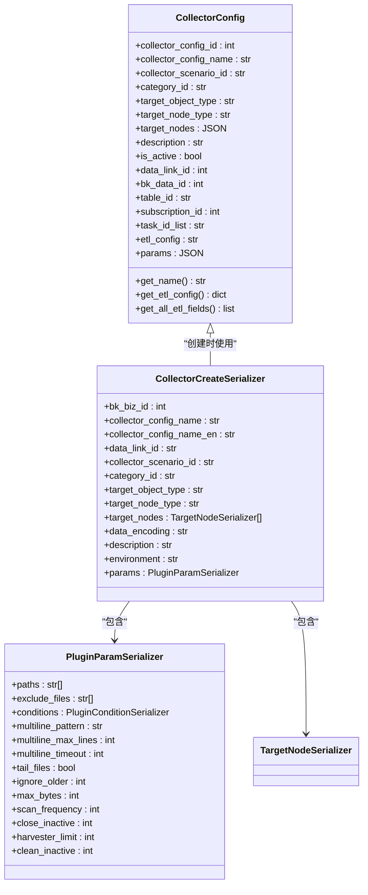

**图源**
- [models.py](file://bklog/apps/log_databus/models.py#L101-L300)
- [serializers.py](file://bklog/apps/log_databus/serializers.py#L394-L438)
- [serializers.py](file://bklog/apps/log_databus/serializers.py#L183-L279)

**章节源**
- [collector_views.py](file://bklog/apps/log_databus/views/collector_views.py#L98-L2565)
- [serializers.py](file://bklog/apps/log_databus/serializers.py#L394-L800)

#### 采集任务状态查询
采集任务的状态由节点管理系统的订阅状态决定。API通过`task_status`和`task_detail`接口查询任务的执行状态。

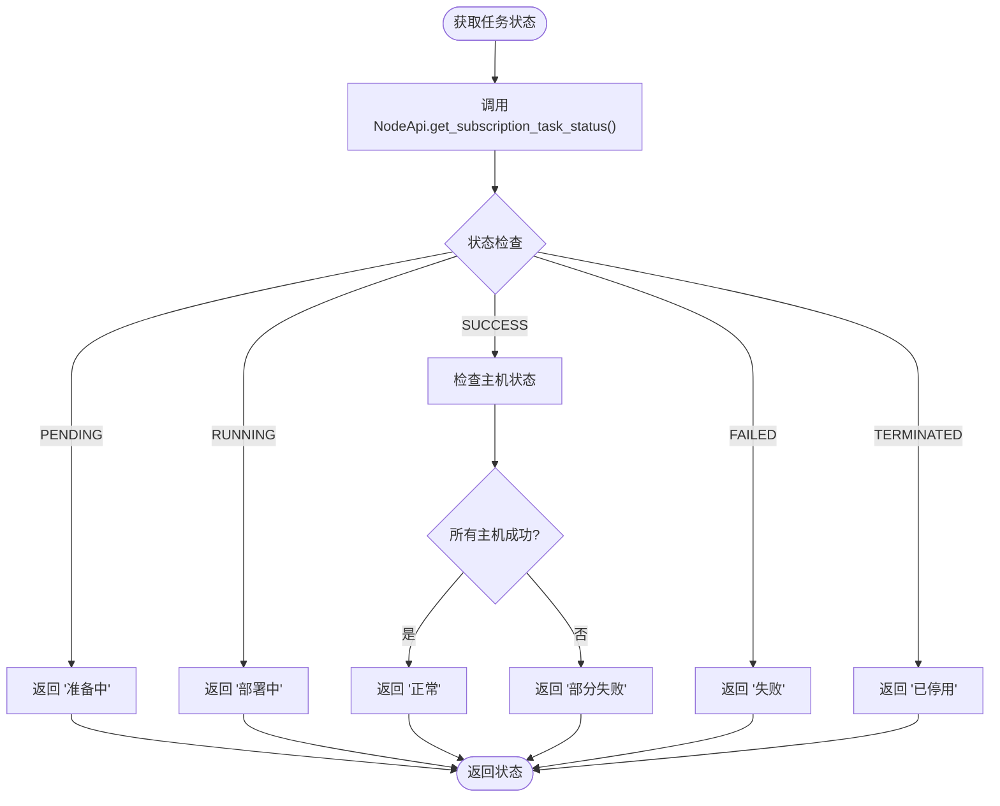

**图源**
- [collector_views.py](file://bklog/apps/log_databus/views/collector_views.py#L1000-L1200)
- [constants.py](file://bklog/apps/log_databus/constants.py#L330-L351)

### 数据链路配置分析
数据链路配置管理采集数据从源头到存储的完整路径。

#### 数据链路创建
数据链路通过`DataLinkCreateUpdateSerializer`进行创建和更新，定义了Kafka集群、Transfer集群和ES集群的关联关系。

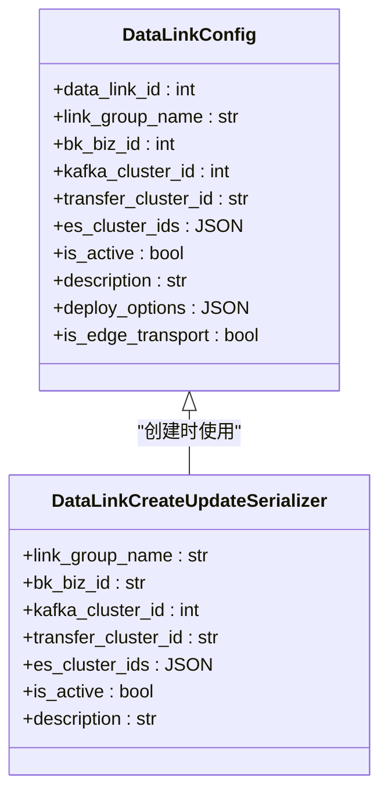

**图源**
- [models.py](file://bklog/apps/log_databus/models.py#L435-L457)
- [serializers.py](file://bklog/apps/log_databus/serializers.py#L289-L303)

**章节源**
- [link_views.py](file://bklog/apps/log_databus/views/link_views.py)
- [models.py](file://bklog/apps/log_databus/models.py#L435-L462)

### 存储管理分析
存储管理负责ES集群的配置和状态监控。

#### 存储集群创建
存储集群通过`StorageCreateSerializer`进行创建，定义了集群的连接信息、认证信息和可见范围。

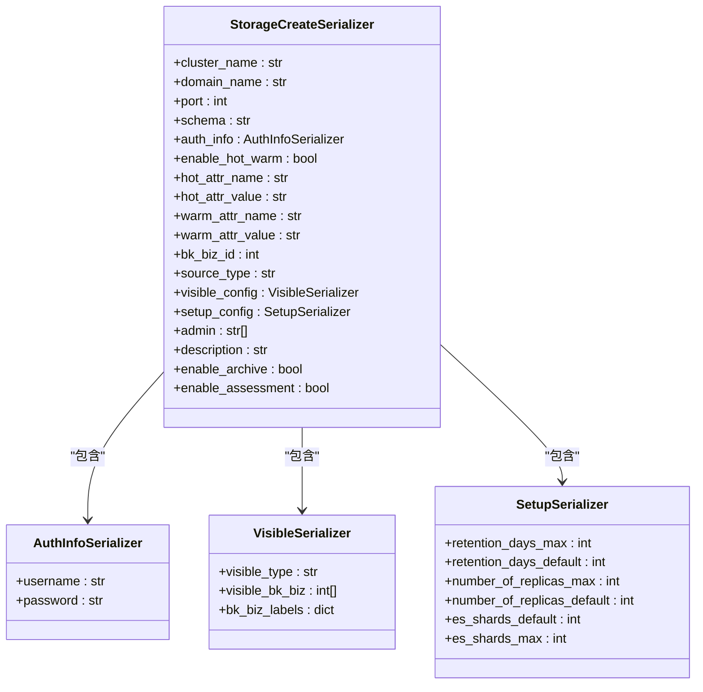

**图源**
- [serializers.py](file://bklog/apps/log_databus/serializers.py#L642-L751)
- [models.py](file://bklog/apps/log_databus/models.py#L435-L457)

**章节源**
- [storage_views.py](file://bklog/apps/log_databus/views/storage_views.py#L22-L29)
- [serializers.py](file://bklog/apps/log_databus/serializers.py#L642-L751)

### 采集插件管理分析
采集插件管理定义了采集器的行为和默认配置。

#### 采集插件创建
采集插件通过`CollectorPlugin`模型进行管理，定义了采集场景、数据分类、清洗配置等默认参数。

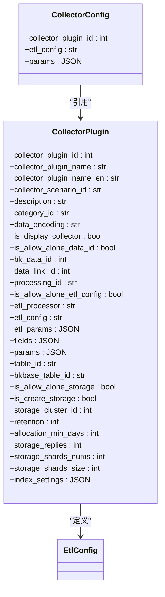

**图源**
- [models.py](file://bklog/apps/log_databus/models.py#L663-L759)
- [constants.py](file://bklog/apps/log_databus/constants.py#L377-L398)

**章节源**
- [collector_plugin_views.py](file://bklog/apps/log_databus/views/collector_plugin_views.py)
- [models.py](file://bklog/apps/log_databus/models.py#L663-L759)

### K8s采集分析
K8s采集通过`CreateContainerCollectorSerializer`和`ContainerConfigSerializer`处理容器环境的特殊配置。

#### K8s采集配置
K8s采集配置支持命名空间、工作负载、容器名称、标签选择器等多种目标选择方式。

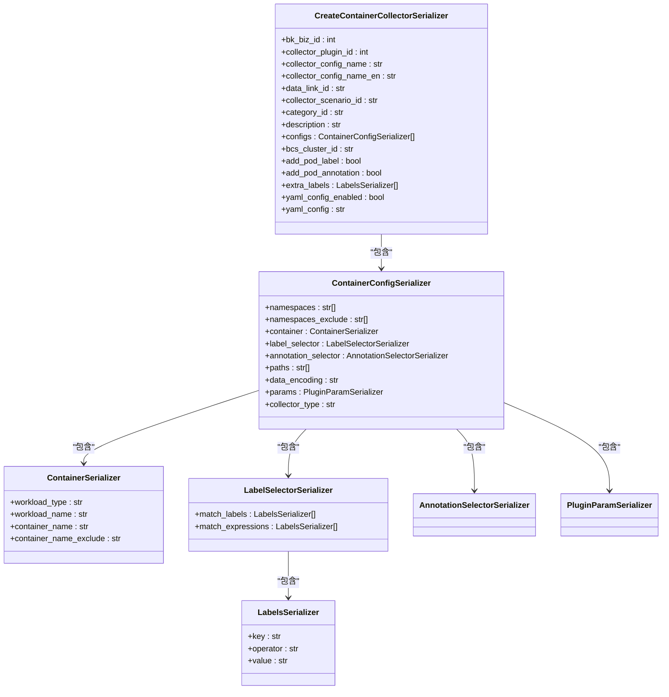

**图源**
- [serializers.py](file://bklog/apps/log_databus/serializers.py#L440-L461)
- [serializers.py](file://bklog/apps/log_databus/serializers.py#L341-L365)

**章节源**
- [bcs_views.py](file://bklog/apps/log_bcs/views/bcs_views.py)
- [serializers.py](file://bklog/apps/log_databus/serializers.py#L440-L515)

### 高级功能分析
高级功能包括数据清洗、归档和回溯等。

#### 数据清洗配置
数据清洗通过`CleanTemplate`模型和`CleanTemplateSerializer`进行管理，支持分隔符、JSON、正则等多种清洗方式。

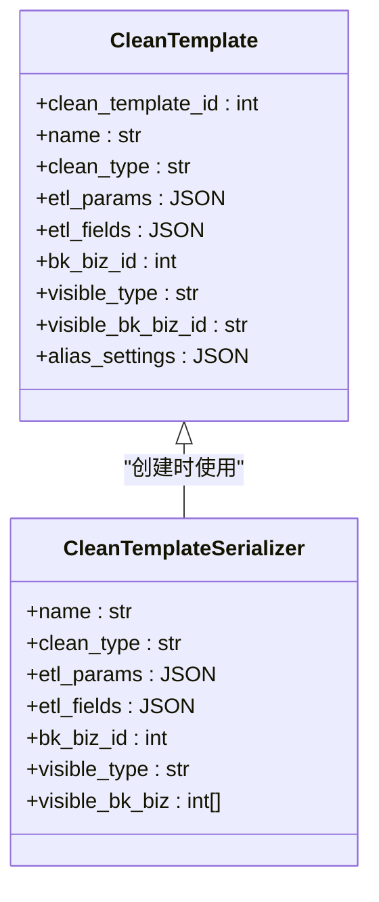

**图源**
- [models.py](file://bklog/apps/log_databus/models.py#L516-L531)
- [serializers.py](file://bklog/apps/log_databus/serializers.py#L801-L850)

**章节源**
- [clean_views.py](file://bklog/apps/log_databus/views/clean_views.py)
- [models.py](file://bklog/apps/log_databus/models.py#L516-L545)

#### 归档与回溯配置
归档与回溯功能通过`ArchiveConfig`和`RestoreConfig`模型实现，支持将历史数据归档到快照仓库并在需要时恢复。

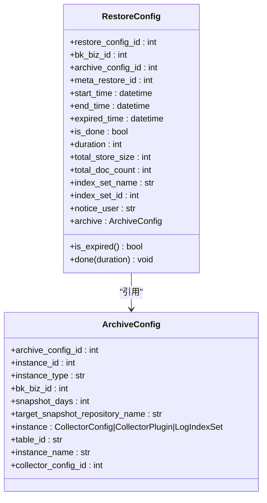

**图源**
- [models.py](file://bklog/apps/log_databus/models.py#L547-L661)
- [models.py](file://bklog/apps/log_databus/models.py#L609-L661)

**章节源**
- [archive_views.py](file://bklog/apps/log_databus/views/archive_views.py)
- [restore_views.py](file://bklog/apps/log_databus/views/restore_views.py)
- [models.py](file://bklog/apps/log_databus/models.py#L547-L661)

## 依赖分析

日志采集API依赖于多个内部和外部系统。内部依赖包括节点管理（NodeApi）、Transfer服务（TransferApi）、GSE Agent等。外部依赖包括Kafka集群、ES集群和CMDB等。系统通过API模块与这些依赖进行交互，实现了松耦合的设计。

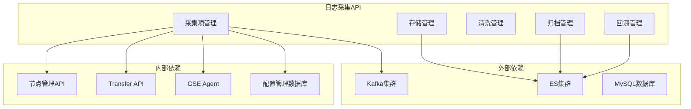

**图源**
- [collector_views.py](file://bklog/apps/log_databus/views/collector_views.py#L30-L48)
- [models.py](file://bklog/apps/log_databus/models.py#L50-L55)
- [constants.py](file://bklog/apps/log_databus/constants.py#L203-L205)

**章节源**
- [collector_views.py](file://bklog/apps/log_databus/views/collector_views.py#L1-L2565)
- [models.py](file://bklog/apps/log_databus/models.py#L1-L800)

## 性能考虑

日志采集API在设计时考虑了多个性能因素。首先，通过缓存机制减少对后端服务的频繁调用，例如使用`@cache_one_hour`装饰器缓存数据。其次，采用批量操作减少API调用次数，如批量查询订阅状态、批量执行部署任务等。此外，系统通过异步任务处理耗时操作，如采集器部署、数据归档等，避免阻塞主线程。最后，通过合理的数据库索引和查询优化，确保在大数据量下的查询性能。

## 故障排除指南

### 采集任务失败排查
当采集任务失败时，应按照以下步骤进行排查：
1. 检查采集项配置是否正确，特别是日志路径、过滤规则等。
2. 检查目标主机的GSE Agent是否正常运行。
3. 检查节点管理订阅任务的详细日志，定位具体失败原因。
4. 检查Transfer服务的监控指标，确认数据链路是否畅通。
5. 检查ES集群的健康状态和存储容量。

### 数据链路连通性测试
系统提供了`connectivity_detect`接口用于测试数据链路的连通性，可以验证Kafka、Transfer和ES集群的连接是否正常。

**章节源**
- [collector_views.py](file://bklog/apps/log_databus/views/collector_views.py#L1000-L1200)
- [constants.py](file://bklog/apps/log_databus/constants.py#L330-L351)

## 结论

日志采集API提供了一套完整的日志采集解决方案，支持主机和K8s两种采集场景，具备灵活的配置选项和强大的管理功能。通过模块化设计和清晰的API接口，系统易于扩展和维护。高级功能如数据清洗、归档和回溯，满足了企业级日志管理的需求。未来可以进一步优化性能，增加更多采集源的支持，并提供更丰富的监控和告警功能。

## 附录

### API端点列表
| 端点 | HTTP方法 | 描述 |
| :--- | :--- | :--- |
| /databus/collectors/ | GET | 获取采集项列表 |
| /databus/collectors/ | POST | 创建采集项 |
| /databus/collectors/{id}/ | GET | 获取采集项详情 |
| /databus/collectors/{id}/ | PUT | 更新采集项 |
| /databus/collectors/{id}/ | DELETE | 删除采集项 |
| /databus/collectors/{id}/start/ | POST | 启动采集任务 |
| /databus/collectors/{id}/stop/ | POST | 停止采集任务 |
| /databus/collectors/{id}/task_status/ | GET | 获取任务状态 |
| /databus/storage/ | GET | 获取存储集群列表 |
| /databus/storage/ | POST | 创建存储集群 |
| /databus/archive/ | GET | 获取归档配置列表 |
| /databus/archive/ | POST | 创建归档配置 |
| /databus/restore/ | GET | 获取回溯配置列表 |
| /databus/restore/ | POST | 创建回溯配置 |

### 状态码含义
| 状态码 | 含义 |
| :--- | :--- |
| 200 | 请求成功 |
| 400 | 请求参数错误 |
| 403 | 权限不足 |
| 404 | 资源不存在 |
| 500 | 服务器内部错误 |

### curl调用示例
```bash
# 创建采集项
curl -X POST http://api.example.com/databus/collectors/ \
  -H "Content-Type: application/json" \
  -d '{
    "bk_biz_id": 123,
    "collector_config_name": "my_collector",
    "collector_scenario_id": "row",
    "category_id": "application_check",
    "target_object_type": "HOST",
    "target_node_type": "INSTANCE",
    "target_nodes": [
      {
        "bk_host_id": 1001
      }
    ],
    "data_encoding": "UTF-8",
    "params": {
      "paths": [
        "/var/log/app.log"
      ],
      "conditions": {
        "type": "match",
        "match_type": "include",
        "match_content": "ERROR"
      }
    }
  }'

# 启动采集任务
curl -X POST http://api.example.com/databus/collectors/1/start/ \
  -H "Content-Type: application/json"
```

### Python客户端代码示例
```python
import requests
import json

class LogCollectorClient:
    def __init__(self, base_url, token):
        self.base_url = base_url
        self.headers = {
            'Content-Type': 'application/json',
            'Authorization': f'Bearer {token}'
        }
    
    def create_collector(self, config):
        url = f'{self.base_url}/databus/collectors/'
        response = requests.post(url, headers=self.headers, data=json.dumps(config))
        return response.json()
    
    def start_collector(self, collector_id):
        url = f'{self.base_url}/databus/collectors/{collector_id}/start/'
        response = requests.post(url, headers=self.headers)
        return response.json()
    
    def get_collector_status(self, collector_id):
        url = f'{self.base_url}/databus/collectors/{collector_id}/task_status/'
        response = requests.get(url, headers=self.headers)
        return response.json()

# 使用示例
client = LogCollectorClient('http://api.example.com', 'your_token')
config = {
    'bk_biz_id': 123,
    'collector_config_name': 'my_collector',
    'collector_scenario_id': 'row',
    'category_id': 'application_check',
    'target_object_type': 'HOST',
    'target_node_type': 'INSTANCE',
    'target_nodes': [{'bk_host_id': 1001}],
    'data_encoding': 'UTF-8',
    'params': {
        'paths': ['/var/log/app.log'],
        'conditions': {
            'type': 'match',
            'match_type': 'include',
            'match_content': 'ERROR'
        }
    }
}
result = client.create_collector(config)
print(result)
client.start_collector(result['collector_config_id'])
status = client.get_collector_status(result['collector_config_id'])
print(status)
```