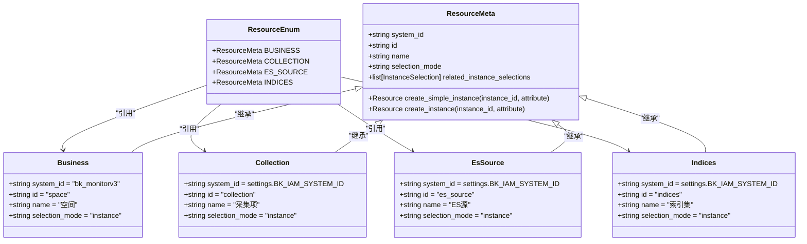

# 权限管理API

<cite>
**本文档引用的文件**
- [permission.py](file://bklog/apps/iam/handlers/permission.py)
- [actions.py](file://bklog/apps/iam/handlers/actions.py)
- [resources.py](file://bklog/apps/iam/handlers/resources.py)
- [meta.py](file://bklog/apps/iam/views/meta.py)
- [resources.py](file://bklog/apps/iam/views/resources.py)
- [urls.py](file://bklog/apps/iam/urls.py)
- [utils.py](file://bklog/apps/iam/utils.py)
- [drf.py](file://bklog/apps/iam/handlers/drf.py)
- [compatible.py](file://bklog/apps/iam/handlers/compatible.py)
- [log_commons/models.py](file://bklog/apps/log_commons/models.py)
- [default.py](file://bklog/config/default.py)
- [cache.py](file://bklog/apps/utils/cache.py)
</cite>

## 目录
1. [简介](#简介)
2. [权限模型](#权限模型)
3. [核心API接口](#核心api接口)
4. [权限校验机制](#权限校验机制)
5. [权限申请与审批流程](#权限申请与审批流程)
6. [高级功能接口](#高级功能接口)
7. [API网关集成](#api网关集成)
8. [缓存机制与性能优化](#缓存机制与性能优化)
9. [错误处理与异常](#错误处理与异常)
10. [总结](#总结)

## 简介

权限管理API是蓝鲸日志平台的核心安全组件，基于IAM（Identity and Access Management）系统实现细粒度的访问控制。该API提供了完整的权限查询、申请、校验和管理功能，确保系统资源的安全访问。API设计遵循RESTful规范，通过HTTP方法和状态码提供清晰的交互语义。

本API主要服务于日志平台的各类资源，包括项目、索引集、采集任务等，支持查看、编辑、删除等多种操作类型的权限控制。系统采用基于角色的访问控制（RBAC）模型，并支持灵活的策略管理和批量授权功能。

**Section sources**
- [permission.py](file://bklog/apps/iam/handlers/permission.py#L1-L444)
- [actions.py](file://bklog/apps/iam/handlers/actions.py#L1-L291)

## 权限模型

### 操作类型

权限系统定义了多种操作类型，每种类型对应不同的权限级别和业务场景：


**Diagram sources**
- [actions.py](file://bklog/apps/iam/handlers/actions.py#L29-L291)

#### 操作类型说明

| 操作类型 | 中文名称 | 英文名称 | 类型 | 描述 |
|---------|--------|--------|-----|------|
| view_business_v2 | 业务访问 | View Business | view | 访问业务的基本权限 |
| search_log_v2 | 日志检索 | Search Log | view | 检索日志数据的权限 |
| view_collection_v2 | 采集查看 | View Collection | view | 查看采集配置的权限 |
| create_collection_v2 | 采集新建 | Create Collection | create | 创建采集配置的权限 |
| manage_collection_v2 | 采集管理 | Manage Collection | manage | 管理采集配置的权限 |
| create_es_source_v2 | ES源配置新建 | Create ES Source | create | 创建ES源配置的权限 |
| manage_es_source_v2 | ES源配置管理 | Manage ES Source | manage | 管理ES源配置的权限 |
| create_indices_v2 | 索引集配置新建 | Create Indices | create | 创建索引集配置的权限 |
| manage_indices_v2 | 索引集配置管理 | Manage Indices | manage | 管理索引集配置的权限 |
| manage_extract_config_v2 | 提取配置管理 | Manage Extract Config | manage | 管理提取配置的权限 |
| view_dashboard_v2 | 仪表盘查看 | View Dashboard | view | 查看仪表盘的权限 |
| manage_dashboard_v2 | 仪表盘管理 | Manage Dashboard | manage | 管理仪表盘的权限 |
| manage_desensitize_rule | 脱敏规则管理 | Manage Desensitize Rule | manage | 管理脱敏规则的权限 |
| manage_global_desensitize_rule | 全局脱敏规则管理 | Manage Global Desensitize Rule | manage | 管理全局脱敏规则的权限 |
| download_client_log | 客户端日志下载 | Download Client Log | view | 下载客户端日志的权限 |
| create_client_log_task | 客户端日志采集任务创建 | Create Client Log Task | manage | 创建客户端日志采集任务的权限 |

### 资源类型

系统定义了多种资源类型，每种资源类型对应平台中的特定实体：



**Diagram sources**
- [resources.py](file://bklog/apps/iam/handlers/resources.py#L34-L240)

#### 资源类型说明

| 资源类型 | 中文名称 | 英文名称 | 系统ID | 描述 |
|---------|--------|--------|-------|------|
| space | 空间 | Space | bk_monitorv3 | 对应CMDB业务，是其他资源的容器 |
| collection | 采集项 | Collection | BK_IAM_SYSTEM_ID | 日志采集配置项 |
| es_source | ES源 | ES Source | BK_IAM_SYSTEM_ID | Elasticsearch数据源 |
| indices | 索引集 | Indices | BK_IAM_SYSTEM_ID | 日志索引集合 |

### 操作与资源对应关系

不同操作类型与资源类型之间存在明确的对应关系，确保权限的精确控制：

```mermaid
erDiagram
BUSINESS ||--o{ COLLECTION : "包含"
BUSINESS ||--o{ ES_SOURCE : "包含"
BUSINESS ||--o{ INDICES : "包含"
ACTION ||--o{ BUSINESS : "需要"
ACTION ||--o{ COLLECTION : "需要"
ACTION ||--o{ ES_SOURCE : "需要"
ACTION ||--o{ INDICES : "需要"
class ACTION {
string id
string name
string type
}
class BUSINESS {
string id
string name
}
class COLLECTION {
string id
string name
}
class ES_SOURCE {
string id
string name
}
class INDICES {
string id
string name
}
```

**Diagram sources**
- [actions.py](file://bklog/apps/iam/handlers/actions.py#L77-L237)
- [resources.py](file://bklog/apps/iam/handlers/resources.py#L80-L216)

## 核心API接口

### 权限查询接口

提供查询用户对特定资源和操作的权限状态。


**Diagram sources**
- [meta.py](file://bklog/apps/iam/views/meta.py#L52-L104)

#### 接口详情

**接口名称**: 检查权限
**请求方法**: POST
**请求路径**: /iam/meta/check_allowed/
**请求参数**:

| 参数名 | 类型 | 必填 | 描述 |
|-------|-----|-----|------|
| action_ids | Array[String] | 是 | 动作ID列表 |
| resources | Array[Object] | 是 | 资源列表 |
| resources.type | String | 是 | 资源类型 |
| resources.id | String | 是 | 资源ID |

**请求示例**:
```json
{
    "action_ids": ["view_business", "create_collection"],
    "resources": [
        {
            "type": "business",
            "id": "2"
        }
    ]
}
```

**响应格式**:
```json
{
    "message": "",
    "code": 0,
    "data": [
        {
            "action_id": "view_business",
            "is_allowed": true
        },
        {
            "action_id": "create_collection",
            "is_allowed": false
        }
    ],
    "result": true
}
```

**Section sources**
- [meta.py](file://bklog/apps/iam/views/meta.py#L52-L104)

### 权限申请接口

提供生成权限申请数据和跳转URL的功能。


**Diagram sources**
- [meta.py](file://bklog/apps/iam/views/meta.py#L106-L194)

#### 接口详情

**接口名称**: 获取权限申请数据
**请求方法**: POST
**请求路径**: /iam/meta/get_apply_data/
**请求参数**:

| 参数名 | 类型 | 必填 | 描述 |
|-------|-----|-----|------|
| action_ids | Array[String] | 是 | 动作ID列表 |
| resources | Array[Object] | 是 | 资源列表 |
| resources.type | String | 是 | 资源类型 |
| resources.id | String | 是 | 资源ID |

**请求示例**:
```json
{
    "action_ids": ["view_business", "create_collection"],
    "resources": [
        {
            "type": "business",
            "id": "2"
        }
    ]
}
```

**响应格式**:
```json
{
    "result": true,
    "data": {
        "apply_data": {
            "system_id": "bk_log_search",
            "system_name": "日志平台",
            "actions": [
                {
                    "id": "view_business",
                    "name": "业务访问",
                    "related_resource_types": [
                        {
                            "system_id": "bk_cmdb",
                            "system_name": "配置平台",
                            "type": "business",
                            "type_name": "业务",
                            "instances": [
                                [
                                    {
                                        "type": "business",
                                        "type_name": "业务",
                                        "id": "2",
                                        "name": "蓝鲸"
                                    }
                                ]
                            ]
                        }
                    ]
                }
            ]
        },
        "apply_url": "http://xxx.com:80/o/bk_iam/apply-custom-perm"
    },
    "code": 0,
    "message": ""
}
```

**Section sources**
- [meta.py](file://bklog/apps/iam/views/meta.py#L106-L194)

### 系统信息接口

提供获取权限系统注册信息的功能。


**Diagram sources**
- [meta.py](file://bklog/apps/iam/views/meta.py#L34-L50)

#### 接口详情

**接口名称**: 获取系统信息
**请求方法**: GET
**请求路径**: /iam/meta/get_system_info/
**请求参数**: 无

**响应格式**:
```json
{
    "message": "",
    "code": 0,
    "data": {
        "system_id": "bk_log_search",
        "system_name": "日志平台",
        "actions": [
            {
                "id": "view_business",
                "name": "业务访问",
                "type": "view"
            }
        ]
    },
    "result": true
}
```

**Section sources**
- [meta.py](file://bklog/apps/iam/views/meta.py#L34-L50)

## 权限校验机制

### 核心校验流程

权限校验是系统安全的核心，通过多层验证确保访问控制的有效性。


**Diagram sources**
- [permission.py](file://bklog/apps/iam/handlers/permission.py#L249-L283)

### 校验API调用方式

权限校验API提供了灵活的调用方式，支持多种场景。

#### 直接调用

通过Permission类直接进行权限校验：

```python
from apps.iam import Permission
from apps.iam.handlers.actions import ActionEnum
from apps.iam.handlers.resources import ResourceEnum

# 创建权限校验实例
client = Permission()

# 校验用户是否有查看业务的权限
is_allowed = client.is_allowed(
    action=ActionEnum.VIEW_BUSINESS,
    resources=[ResourceEnum.BUSINESS.create_instance(2)],
    raise_exception=False
)
```

#### 装饰器调用

使用装饰器在视图层进行权限校验：

```python
from apps.iam.handlers.drf import insert_permission_field
from apps.iam.handlers.actions import ActionEnum
from apps.iam.handlers.resources import ResourceEnum

@insert_permission_field(
    actions=[ActionEnum.SEARCH_LOG],
    resource_meta=ResourceEnum.INDICES,
    id_field=lambda item: item["index_set_id"],
    data_field=lambda data: data["list"] if isinstance(data, dict) else data,
    many=True
)
def get_log_data(request):
    # 返回数据会自动包含权限字段
    return {"list": [...]}
```

#### 批量校验

支持批量资源和操作的权限校验：

```python
from apps.iam import Permission

client = Permission()
actions = [ActionEnum.SEARCH_LOG, ActionEnum.VIEW_COLLECTION]
resources = [
    [ResourceEnum.INDICES.create_instance(1)],
    [ResourceEnum.INDICES.create_instance(2)]
]

result = client.batch_is_allowed(actions, resources)
```

**Section sources**
- [permission.py](file://bklog/apps/iam/handlers/permission.py#L249-L313)
- [drf.py](file://bklog/apps/iam/handlers/drf.py#L198-L268)

### 响应格式

权限校验的响应遵循统一的格式规范：

```json
{
    "result": true,
    "data": {
        "action_id": "view_business",
        "is_allowed": true
    },
    "code": 0,
    "message": ""
}
```

当权限校验不通过时，会抛出`PermissionDeniedError`异常，包含详细的权限申请信息：

```json
{
    "result": false,
    "data": {
        "permission": {
            "system_id": "bk_log_search",
            "system_name": "日志平台",
            "actions": [...]
        },
        "apply_url": "http://xxx.com:80/o/bk_iam/apply-custom-perm"
    },
    "code": "9900403",
    "message": "当前用户无 [业务访问] 权限"
}
```

**Section sources**
- [exceptions.py](file://bklog/apps/iam/exceptions.py#L54-L64)

## 权限申请与审批流程

### 申请流程

权限申请流程涉及多个系统组件的协同工作。


**Diagram sources**
- [log_commons/models.py](file://bklog/apps/log_commons/models.py#L338-L405)
- [meta.py](file://bklog/apps/iam/views/meta.py#L106-L194)

### 审批状态查询

提供查询权限申请审批状态的接口。

#### 接口详情

**接口名称**: 查询审批状态
**请求方法**: GET
**请求路径**: /external/permission/apply/record/
**请求参数**:

| 参数名 | 类型 | 必填 | 描述 |
|-------|-----|-----|------|
| approval_sn | String | 是 | 审批单据号 |

**响应格式**:
```json
{
    "result": true,
    "data": {
        "approval_sn": "ITSN20230801001",
        "status": "approving",
        "approval_url": "http://itsm.example.com/ticket/123",
        "created_by": "admin",
        "created_at": "2023-08-01T10:00:00Z",
        "updated_by": "approver",
        "updated_at": "2023-08-01T11:00:00Z"
    },
    "code": 0,
    "message": ""
}
```

**Section sources**
- [log_commons/models.py](file://bklog/apps/log_commons/models.py#L661-L686)

### API交互示例

#### 创建权限申请

```python
import requests

# 1. 首先检查权限
check_response = requests.post(
    "http://api.example.com/iam/meta/check_allowed/",
    json={
        "action_ids": ["manage_indices_v2"],
        "resources": [{"type": "indices", "id": "1001"}]
    }
)

if not check_response.json()["data"][0]["is_allowed"]:
    # 2. 获取权限申请数据
    apply_response = requests.post(
        "http://api.example.com/iam/meta/get_apply_data/",
        json={
            "action_ids": ["manage_indices_v2"],
            "resources": [{"type": "indices", "id": "1001"}]
        }
    )
    
    apply_data = apply_response.json()["data"]
    print(f"请访问 {apply_data['apply_url']} 申请权限")
```

#### 处理审批回调

```python
def handle_approval_callback(params):
    """
    处理ITSM审批系统的回调
    """
    if params.get("token"):
        # 验证回调token
        verify_data = BkItsmApi.token_verify({"token": params["token"]})
        if not verify_data.get("is_passed", False):
            return {"message": "Error Token", "result": False}
    
    try:
        # 获取审批记录
        apply_record = ExternalPermissionApplyRecord.objects.get(approval_sn=params["sn"])
    except ExternalPermissionApplyRecord.DoesNotExist:
        error_msg = f"更新权限失败，关联单据{params['sn']}审批记录不存在"
        logger.error(error_msg)
        return dict(result=False, message=error_msg)
    
    if not params["approve_result"]:
        # 审批拒绝
        apply_record.status = ITSMStatusChoicesEnum.FAILED.value
        apply_record.save()
        return dict(result=True, message=f"approval failed by {params['updated_by']}")
    
    # 审批通过，创建权限
    create_params = {
        key: value
        for key, value in apply_record.__dict__.items()
        if key in ["space_uid", "action_id", "resources", "expire_time"]
    }
    create_params["authorized_users"] = apply_record.authorized_users
    ExternalPermission.create(**create_params)
    
    # 更新审批记录状态
    apply_record.status = ITSMStatusChoicesEnum.SUCCESS.value
    apply_record.save()
    
    return dict(result=True, message="approval success")
```

**Section sources**
- [log_commons/models.py](file://bklog/apps/log_commons/models.py#L266-L317)
- [log_commons/models.py](file://bklog/apps/log_commons/models.py#L661-L686)

## 高级功能接口

### 权限策略管理

提供对权限策略的高级管理功能。

#### 批量授权接口

**接口名称**: 批量资源实例授权
**请求方法**: POST
**请求路径**: /api/v2/authorization/batch_instance/
**请求参数**:

| 参数名 | 类型 | 必填 | 描述 |
|-------|-----|-----|------|
| system | String | 是 | 系统ID |
| subject | Object | 是 | 被授权主体 |
| subject.type | String | 是 | 主体类型 |
| subject.id | String | 是 | 主体ID |
| actions | Array[Object] | 是 | 动作列表 |
| actions.id | String | 是 | 动作ID |
| resources | Array[Object] | 是 | 资源列表 |
| resources.system | String | 是 | 资源系统ID |
| resources.type | String | 是 | 资源类型 |
| resources.paths | Array[String] | 是 | 资源路径列表 |

**Section sources**
- [iam.py](file://bklog/apps/api/modules/iam.py#L37-L44)

### 角色定义

系统支持基于角色的权限管理，可以定义和管理角色。


**Diagram sources**
- [permission.py](file://bklog/apps/iam/handlers/permission.py#L1-L444)

### 批量授权

支持对多个用户或资源进行批量授权操作。

#### 批量授权流程


**Diagram sources**
- [log_commons/models.py](file://bklog/apps/log_commons/models.py#L338-L405)

**Section sources**
- [log_commons/models.py](file://bklog/apps/log_commons/models.py#L338-L405)

## API网关集成

### 认证流程

API网关与IAM服务的集成确保了请求的安全性。


**Diagram sources**
- [apigw.py](file://bklog/apps/middleware/apigw.py#L22-L124)

### 集成机制

API网关通过JWT（JSON Web Token）实现与IAM服务的集成。

#### JWT验证流程

1. 客户端在请求头中携带JWT Token
2. API网关解析Token并验证签名
3. 根据Token中的信息确定用户身份
4. 将用户信息传递给后端服务
5. 后端服务调用IAM API进行细粒度权限校验

#### 配置示例

```python
class ApiGatewayJWTProvider(DefaultJWTProvider):
    def provide(self, request: HttpRequest) -> DecodedJWT | None:
        jwt_token = request.META.get(self.jwt_key_name, "")
        if not jwt_token:
            return None

        try:
            jwt_header = self._decode_jwt_header(jwt_token)
            gateway_name = jwt_header.get("kid") or self.default_gateway_name
            public_key = CustomCachePublicKeyProvider(
                default_gateway_name=self.default_gateway_name
            ).provide(
                gateway_name=gateway_name, 
                jwt_issuer=jwt_header.get("iss"), 
                request=request
            )
            
            algorithm = jwt_header.get("alg") or self.algorithm
            decoded = self._decode_jwt(jwt_token, public_key, algorithm)
            return DecodedJWT(gateway_name=gateway_name, payload=decoded)
        except jwt.PyJWTError as e:
            if not self.allow_invalid_jwt_token:
                raise_from(JWTTokenInvalid, e)
        return None
```

**Section sources**
- [apigw.py](file://bklog/apps/middleware/apigw.py#L22-L124)

## 缓存机制与性能优化

### 缓存配置

系统采用多级缓存策略提升性能。

```mermaid
graph TD
Client[客户端] --> API[API服务]
API --> Cache[缓存层]
Cache --> |缓存命中| Return[返回结果]
Cache --> |缓存未命中| DB[数据库]
DB --> Cache[写入缓存]
Cache --> Return[返回结果]
class Cache "缓存层"
class DB "持久层"
style Cache fill:#f9f,stroke:#333
style DB fill:#bbf,stroke:#333
```

**Diagram sources**
- [default.py](file://bklog/config/default.py#L1178-L1202)
- [cache.py](file://bklog/apps/utils/cache.py#L57-L147)

### 缓存策略

系统提供了多种缓存策略，满足不同场景的需求：

```python
def using_cache(key: str, duration, need_md5=False, compress=False, refresh=False):
    """
    缓存装饰器
    :param key: 缓存key
    :param duration: 缓存时长（秒）
    :param need_md5: 是否需要MD5加密key
    :param compress: 是否压缩缓存值
    :param refresh: 是否强制刷新缓存
    """
    def decorator(func):
        @functools.wraps(func)
        def inner(*args, **kwargs):
            # 生成缓存key
            actual_key = key.format(*args, **kwargs)
            if need_md5:
                actual_key = md5_sum(actual_key)
            
            # 尝试从缓存获取
            cache_result = cache.get(actual_key)
            if cache_result and not refresh:
                if compress:
                    try:
                        cache_result = zlib.decompress(cache_result)
                    except Exception:
                        pass
                return json.loads(force_bytes(cache_result))
            
            # 执行原函数
            result = func(*args, **kwargs)
            if result:
                value = json.dumps(result, cls=DjangoJSONEncoder)
                if compress:
                    if len(value) > MIN_LEN:
                        value = zlib.compress(value.encode("utf-8"))
                cache.set(actual_key, value, duration)
            return result
        return inner
    return decorator

# 预定义的缓存策略
cache_half_minute = functools.partial(using_cache, duration=0.5 * TimeEnum.ONE_MINUTE_SECOND.value)
cache_one_minute = functools.partial(using_cache, duration=TimeEnum.ONE_MINUTE_SECOND.value)
cache_five_minute = functools.partial(using_cache, duration=5 * TimeEnum.ONE_MINUTE_SECOND.value)
cache_ten_minute = functools.partial(using_cache, duration=10 * TimeEnum.ONE_MINUTE_SECOND.value)
cache_half_hour = functools.partial(using_cache, duration=0.5 * TimeEnum.ONE_HOUR_SECOND.value)
cache_one_hour = functools.partial(using_cache, duration=TimeEnum.ONE_HOUR_SECOND.value)
cache_one_day = functools.partial(using_cache, duration=TimeEnum.ONE_DAY_SECOND.value)
```

**Section sources**
- [cache.py](file://bklog/apps/utils/cache.py#L57-L147)

### 性能优化建议

1. **合理设置缓存时长**：根据数据更新频率选择合适的缓存策略
2. **使用批量查询**：减少数据库查询次数，提高响应速度
3. **避免N+1查询**：使用select_related和prefetch_related优化查询
4. **异步处理**：将耗时操作放入任务队列异步执行
5. **连接池管理**：合理配置数据库和Redis连接池大小

```python
# 示例：使用预定义缓存策略
@cache_one_hour()
def get_system_info():
    """
    获取系统信息，缓存1小时
    """
    result = Permission().get_system_info()
    return result

@cache_five_minute(need_md5=True, compress=True)
def get_resource_instances(resource_type, parent_id=None):
    """
    获取资源实例，缓存5分钟，使用MD5加密key，压缩值
    """
    # 实现获取资源实例的逻辑
    pass
```

**Section sources**
- [cache.py](file://bklog/apps/utils/cache.py#L57-L147)
- [permission.py](file://bklog/apps/iam/handlers/permission.py#L332-L340)

## 错误处理与异常

### 异常类型

系统定义了多种权限相关的异常类型：


**Diagram sources**
- [exceptions.py](file://bklog/apps/iam/exceptions.py#L29-L64)

### 错误码说明

| 错误码 | 异常类型 | 描述 |
|-------|--------|------|
| 001 | ActionNotExistError | 动作ID不存在 |
| 002 | ResourceNotExistError | 资源ID不存在 |
| 003 | GetSystemInfoError | 获取系统信息错误 |
| 004 | NotHaveInstanceIdError | 没有传入鉴权实例id |
| 9900403 | PermissionDeniedError | 权限校验不通过 |

### 异常处理示例

```python
try:
    # 执行权限校验
    client.is_allowed(
        action=ActionEnum.MANAGE_INDICES,
        resources=[ResourceEnum.INDICES.create_instance(1001)],
        raise_exception=True
    )
except ActionNotExistError as e:
    logger.error(f"动作不存在: {e}")
    return {"error": "action_not_exist", "message": str(e)}
except ResourceNotExistError as e:
    logger.error(f"资源不存在: {e}")
    return {"error": "resource_not_exist", "message": str(e)}
except PermissionDeniedError as e:
    logger.warning(f"权限拒绝: {e}")
    return {
        "error": "permission_denied", 
        "message": str(e),
        "permission": e.data["permission"],
        "apply_url": e.data["apply_url"]
    }
except Exception as e:
    logger.exception(f"未知错误: {e}")
    return {"error": "unknown_error", "message": "系统内部错误"}
```

**Section sources**
- [exceptions.py](file://bklog/apps/iam/exceptions.py#L29-L64)
- [permission.py](file://bklog/apps/iam/handlers/permission.py#L269-L282)

## 总结

权限管理API为蓝鲸日志平台提供了全面的安全保障，通过基于IAM的权限模型实现了细粒度的访问控制。系统支持多种操作类型和资源类型的组合，能够满足复杂的业务场景需求。

核心功能包括：
- **资源权限查询**：实时查询用户对特定资源的操作权限
- **权限申请与审批**：完整的权限申请流程，集成ITSM审批系统
- **权限校验**：高效的权限校验机制，支持同步和异步校验
- **高级功能**：支持权限策略管理、角色定义和批量授权

系统通过API网关与IAM服务集成，采用JWT进行身份认证，并通过多级缓存机制优化性能。异常处理机制完善，提供了清晰的错误码和错误信息，便于问题排查和系统维护。

该权限管理API设计合理，扩展性强，能够满足当前和未来业务发展的需求，为平台的安全稳定运行提供了有力保障。