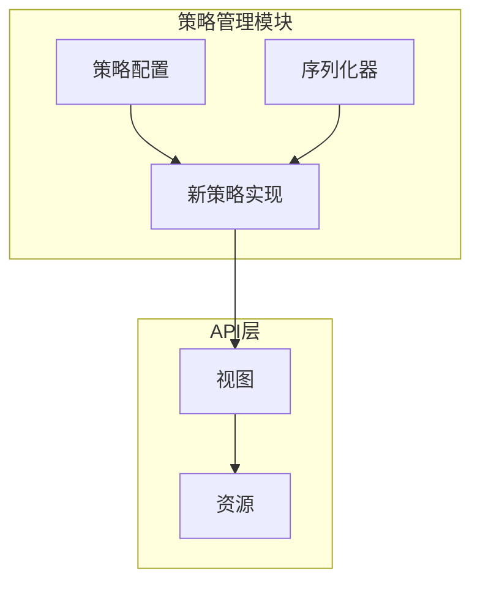
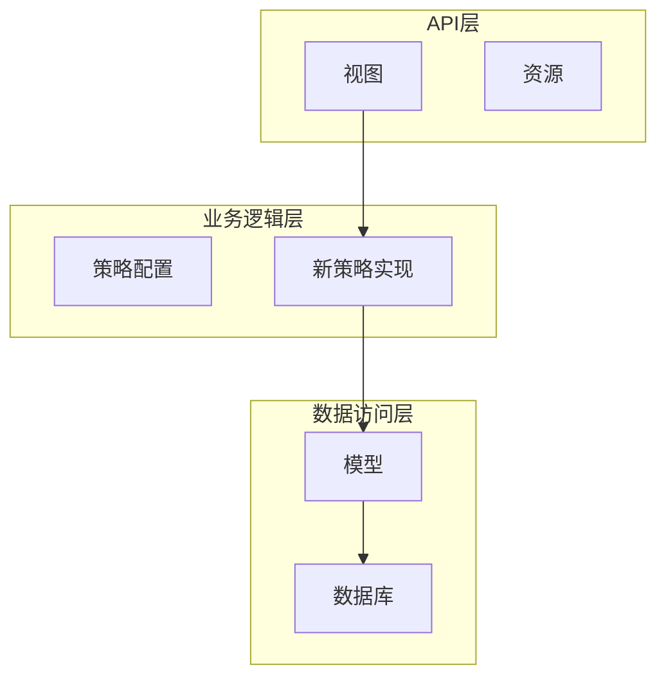
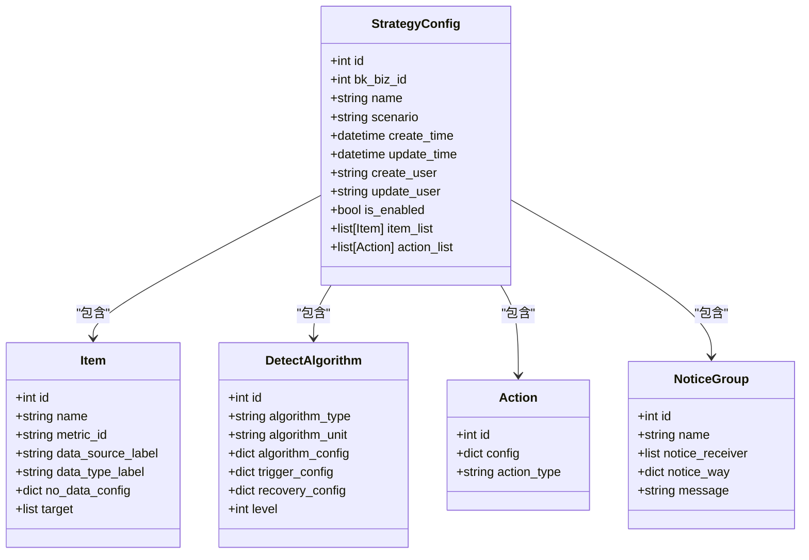
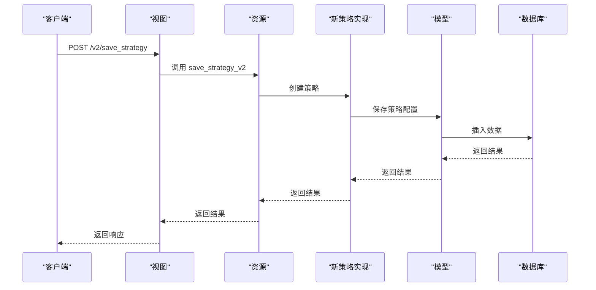

```mermaid
classDiagram
class AdvancedYearRoundSerializer {
+float floor
+int floor_interval
+float ceil
+int ceil_interval
+string fetch_type
}
class AdvancedRingRatioSerializer {
+float floor
+int floor_interval
+float ceil
+int ceil_interval
+string fetch_type
}
class RingRatioAmplitudeSerializer {
+float ratio
+float shock
+float threshold
}
class SimpleRingRatioSerializer {
+float floor
+float ceil
}
class SimpleYearRoundSerializer {
+float floor
+float ceil
}
class ThresholdSerializer {
+list[ThresholdUnit] thresholds
}
class ThresholdUnit {
+float threshold
+string method
}
class NewSeriesSerializer {
+int effective_delay
+int max_series
+int detect_range
}
class IntelligentDetectSerializer {
+dict args
+int plan_id
+string visual_type
+string service_name
}
class TimeSeriesForecastingSerializer {
+dict args
+int plan_id
+list[ThresholdUnit] thresholds
+string bound_type
+int duration
+string visual_type
}
class AbnormalClusterSerializer {
+dict args
+int plan_id
+list[string] group
+string visual_type
}
class YearRoundAmplitudeSerializer {
+float ratio
+float shock
+float threshold
}
AdvancedYearRoundSerializer --> ThresholdUnit : "包含"
AdvancedRingRatioSerializer --> ThresholdUnit : "包含"
RingRatioAmplitudeSerializer --> ThresholdUnit : "包含"
SimpleRingRatioSerializer --> ThresholdUnit : "包含"
SimpleYearRoundSerializer --> ThresholdUnit : "包含"
ThresholdSerializer --> ThresholdUnit : "包含"
NewSeriesSerializer --> ThresholdUnit : "包含"
IntelligentDetectSerializer --> ThresholdUnit : "包含"
TimeSeriesForecastingSerializer --> ThresholdUnit : "包含"
AbnormalClusterSerializer --> ThresholdUnit : "包含"
YearRoundAmplitudeSerializer --> ThresholdUnit : "包含"
```

# 策略API

<cite>
**本文档引用的文件**   
- [strategy.py](file://bkmonitor/bkmonitor/strategy/strategy.py)
- [serializers.py](file://bkmonitor/bkmonitor/strategy/serializers.py)
- [new_strategy.py](file://bkmonitor/bkmonitor/strategy/new_strategy.py)
- [views.py](file://bkmonitor/packages/monitor_web/strategies/views.py)
- [v2.py](file://bkmonitor/packages/monitor_web/strategies/resources/v2.py)
</cite>

## 目录
1. [简介](#简介)
2. [项目结构](#项目结构)
3. [核心组件](#核心组件)
4. [架构概述](#架构概述)
5. [详细组件分析](#详细组件分析)
6. [依赖分析](#依赖分析)
7. [性能考虑](#性能考虑)
8. [故障排除指南](#故障排除指南)
9. [结论](#结论)

## 简介
本文档详细介绍了蓝鲸监控平台的策略管理API，涵盖了策略的创建、查询、修改和删除等操作。文档详细记录了每个端点的HTTP方法、URL路径、请求参数（包括策略条件、触发条件、通知规则等）和响应格式。提供了JSON格式的请求/响应示例，展示了如何配置不同类型的监控策略。此外，文档还说明了策略继承、覆盖等高级功能的API使用方法，记录了API的权限控制和业务校验规则，以及常见的错误码和处理方案。

## 项目结构
蓝鲸监控平台的项目结构清晰，主要分为多个模块，每个模块负责不同的功能。策略管理相关的代码主要位于`bkmonitor/bkmonitor/strategy`目录下，包括策略配置、序列化器、新策略实现等文件。API端点的路由配置在`packages/monitor_web/strategies/views.py`中定义，而具体的资源实现则在`packages/monitor_web/strategies/resources/v2.py`中。

**图示来源**
- [strategy.py](file://bkmonitor/bkmonitor/strategy/strategy.py)
- [serializers.py](file://bkmonitor/bkmonitor/strategy/serializers.py)
- [new_strategy.py](file://bkmonitor/bkmonitor/strategy/new_strategy.py)
- [views.py](file://bkmonitor/packages/monitor_web/strategies/views.py)
- [v2.py](file://bkmonitor/packages/monitor_web/strategies/resources/v2.py)

## 核心组件
策略管理API的核心组件包括策略配置、序列化器、新策略实现、视图和资源。这些组件协同工作，实现了策略的创建、查询、修改和删除等操作。

**组件来源**
- [strategy.py](file://bkmonitor/bkmonitor/strategy/strategy.py)
- [serializers.py](file://bkmonitor/bkmonitor/strategy/serializers.py)
- [new_strategy.py](file://bkmonitor/bkmonitor/strategy/new_strategy.py)
- [views.py](file://bkmonitor/packages/monitor_web/strategies/views.py)
- [v2.py](file://bkmonitor/packages/monitor_web/strategies/resources/v2.py)

## 架构概述
策略管理API的架构分为三层：API层、业务逻辑层和数据访问层。API层负责处理HTTP请求和响应，业务逻辑层负责策略的创建、查询、修改和删除等操作，数据访问层负责与数据库交互。

**图示来源**
- [views.py](file://bkmonitor/packages/monitor_web/strategies/views.py)
- [v2.py](file://bkmonitor/packages/monitor_web/strategies/resources/v2.py)
- [strategy.py](file://bkmonitor/bkmonitor/strategy/strategy.py)
- [new_strategy.py](file://bkmonitor/bkmonitor/strategy/new_strategy.py)
- [models.py](file://bkmonitor/bkmonitor/models.py)

## 详细组件分析
### 策略配置分析
策略配置组件负责处理策略的配置信息，包括策略名称、业务ID、场景、创建时间、更新时间、创建用户、更新用户、是否启用等字段。此外，还包括监控项、检测算法、动作、通知组等子组件的配置。

#### 类图

**图示来源**
- [strategy.py](file://bkmonitor/bkmonitor/strategy/strategy.py)

### 序列化器分析
序列化器组件负责将策略配置信息转换为JSON格式，以便于API传输。序列化器还包括对请求参数的校验，确保数据的完整性和正确性。

#### 类图

**图示来源**
- [serializers.py](file://bkmonitor/bkmonitor/strategy/serializers.py)

### 新策略实现分析
新策略实现组件负责处理策略的创建、修改和删除等操作。该组件通过调用底层的模型和数据库操作，实现了策略的持久化存储。

#### 序列图

**图示来源**
- [views.py](file://bkmonitor/packages/monitor_web/strategies/views.py)
- [v2.py](file://bkmonitor/packages/monitor_web/strategies/resources/v2.py)
- [new_strategy.py](file://bkmonitor/bkmonitor/strategy/new_strategy.py)
- [models.py](file://bkmonitor/bkmonitor/models.py)

## 依赖分析
策略管理API的依赖关系清晰，各组件之间通过接口进行通信。API层依赖于业务逻辑层，业务逻辑层依赖于数据访问层。这种分层架构使得代码更加模块化，易于维护和扩展。

**图示来源**
- [views.py](file://bkmonitor/packages/monitor_web/strategies/views.py)
- [v2.py](file://bkmonitor/packages/monitor_web/strategies/resources/v2.py)
- [strategy.py](file://bkmonitor/bkmonitor/strategy/strategy.py)
- [new_strategy.py](file://bkmonitor/bkmonitor/strategy/new_strategy.py)
- [models.py](file://bkmonitor/bkmonitor/models.py)

## 性能考虑
策略管理API在设计时考虑了性能优化。例如，通过缓存机制减少数据库查询次数，通过异步处理提高响应速度。此外，API还支持批量操作，减少了网络传输的开销。

## 故障排除指南
### 常见错误码
- **400 Bad Request**: 请求参数错误，检查请求参数是否符合要求。
- **401 Unauthorized**: 未授权，检查API密钥或认证信息是否正确。
- **403 Forbidden**: 禁止访问，检查用户权限是否足够。
- **404 Not Found**: 资源未找到，检查请求的URL是否正确。
- **500 Internal Server Error**: 服务器内部错误，检查服务器日志以获取更多信息。

### 处理方案
- **请求参数错误**: 仔细检查请求参数，确保所有必填字段都已填写，且数据类型正确。
- **未授权**: 检查API密钥或认证信息是否正确，必要时重新生成密钥。
- **禁止访问**: 检查用户权限，确保用户具有执行该操作的权限。
- **资源未找到**: 检查请求的URL是否正确，确保资源存在。
- **服务器内部错误**: 查看服务器日志，定位错误原因，必要时联系技术支持。

**组件来源**
- [views.py](file://bkmonitor/packages/monitor_web/strategies/views.py)
- [v2.py](file://bkmonitor/packages/monitor_web/strategies/resources/v2.py)

## 结论
本文档详细介绍了蓝鲸监控平台的策略管理API，涵盖了策略的创建、查询、修改和删除等操作。通过详细的代码分析和图示，帮助开发者更好地理解和使用该API。希望本文档能为开发者提供有价值的参考。