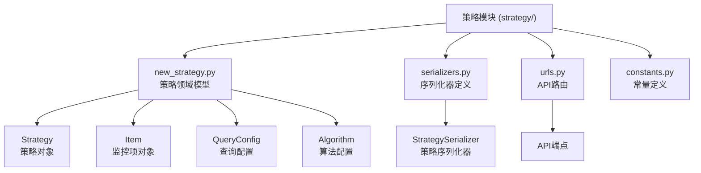
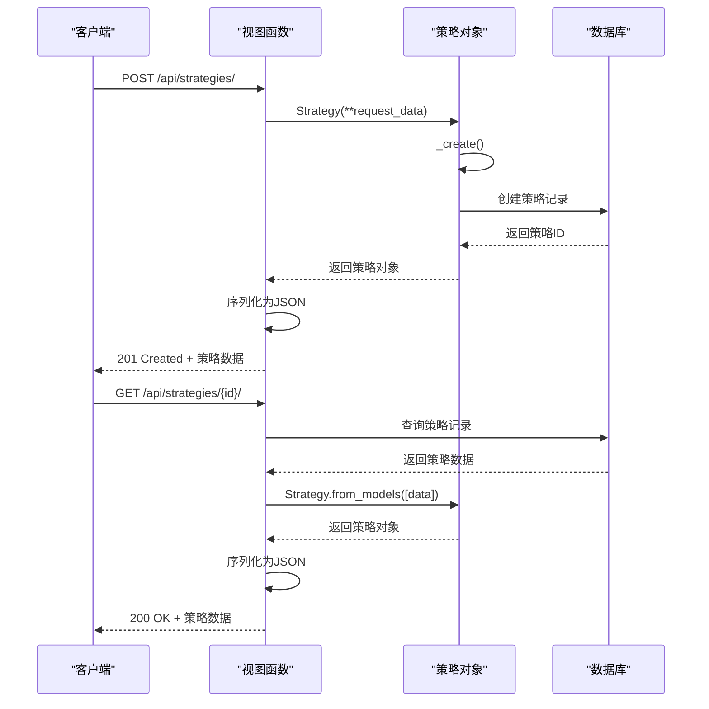
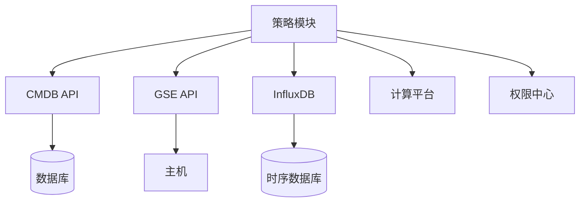

# 策略基础操作

<cite>
**本文档引用的文件**  
- [new_strategy.py](file://bkmonitor/bkmonitor/strategy/new_strategy.py#L1500-L3234)
- [serializers.py](file://bkmonitor/bkmonitor/strategy/serializers.py)
- [strategy.py](file://bkmonitor/bkmonitor/strategy/strategy.py)
- [urls.py](file://bkmonitor/bkmonitor/urls.py)
- [constants.py](file://bkmonitor/constants/strategy.py)
</cite>

## 目录
1. [简介](#简介)
2. [项目结构](#项目结构)
3. [核心组件](#核心组件)
4. [架构概览](#架构概览)
5. [详细组件分析](#详细组件分析)
6. [依赖分析](#依赖分析)
7. [性能考量](#性能考量)
8. [故障排除指南](#故障排除指南)
9. [结论](#结论)

## 简介
本文档详细描述了监控系统中策略基础操作API的设计与实现，重点涵盖策略的创建、查询、修改和删除四个核心功能。文档深入解析了HTTP方法、URL路径、请求/响应数据结构，并提供了完整的curl示例。同时，文档还解释了权限验证机制、业务校验规则以及常见错误场景的处理方案。

## 项目结构
策略管理功能主要位于`bkmonitor/bkmonitor/strategy/`目录下，核心文件包括`new_strategy.py`（策略领域模型）、`serializers.py`（序列化器定义）和`urls.py`（API路由配置）。该模块遵循领域驱动设计（DDD），将策略配置抽象为领域对象，并通过序列化器进行数据转换。



**图示来源**
- [new_strategy.py](file://bkmonitor/bkmonitor/strategy/new_strategy.py)
- [serializers.py](file://bkmonitor/bkmonitor/strategy/serializers.py)
- [urls.py](file://bkmonitor/bkmonitor/urls.py)

**本节来源**
- [new_strategy.py](file://bkmonitor/bkmonitor/strategy/new_strategy.py)
- [urls.py](file://bkmonitor/bkmonitor/urls.py)

## 核心组件
策略基础操作的核心是`Strategy`领域对象，它封装了策略的完整配置信息，包括监控目标、执行周期、检测规则和通知配置。该对象提供了`to_dict`和`from_dict`方法，用于在领域模型和JSON数据结构之间进行转换。`save`和`delete`方法则实现了持久化逻辑，确保数据的一致性和完整性。

**本节来源**
- [new_strategy.py](file://bkmonitor/bkmonitor/strategy/new_strategy.py#L2000-L2500)

## 架构概览
策略操作API采用典型的RESTful架构，通过HTTP动词（GET、POST、PUT、DELETE）对策略资源进行操作。API请求首先由Django URL路由分发到对应的视图函数，视图函数调用`Strategy`领域对象的方法处理业务逻辑，最终将结果序列化为JSON格式返回。



**图示来源**
- [new_strategy.py](file://bkmonitor/bkmonitor/strategy/new_strategy.py)
- [urls.py](file://bkmonitor/bkmonitor/urls.py)

## 详细组件分析
### 策略创建分析
策略创建操作通过`POST /api/strategies/`端点实现。客户端发送包含策略配置的JSON数据，服务端验证数据合法性后，调用`Strategy._create()`方法在数据库中创建新记录。

```python
def _create(self):
    strategy = StrategyModel.objects.create(
        name=self.name,
        scenario=self.scenario,
        source=self.source,
        bk_biz_id=self.bk_biz_id,
        type=self.type,
        is_enabled=self.is_enabled,
        create_user=self._get_username(),
        update_user=self._get_username(),
    )
    self.id = strategy.id
```

**图示来源**
- [new_strategy.py](file://bkmonitor/bkmonitor/strategy/new_strategy.py#L2500-L2520)

**本节来源**
- [new_strategy.py](file://bkmonitor/bkmonitor/strategy/new_strategy.py#L2500-L2520)

### 策略查询分析
策略查询操作通过`GET /api/strategies/{id}/`端点实现。服务端从数据库查询策略记录，然后使用`Strategy.from_models()`方法将ORM模型转换为领域对象，最后通过`to_dict()`方法序列化为JSON格式。

```python
@classmethod
def from_models(cls, strategies: list[StrategyModel] | QuerySet) -> list["Strategy"]:
    # 预加载所有关联数据以优化查询
    strategy_ids = [s.id for s in strategies]
    item_query = ItemModel.objects.filter(strategy_id__in=strategy_ids)
    detect_query = DetectModel.objects.filter(strategy_id__in=strategy_ids)
    # ... 其他关联查询
    # 构建策略对象
    records = []
    for strategy in strategies:
        record = Strategy(
            bk_biz_id=strategy.bk_biz_id,
            id=strategy.id,
            name=strategy.name,
            # ... 其他字段
        )
        records.append(record)
    return records
```

**图示来源**
- [new_strategy.py](file://bkmonitor/bkmonitor/strategy/new_strategy.py#L2800-L3000)

**本节来源**
- [new_strategy.py](file://bkmonitor/bkmonitor/strategy/new_strategy.py#L2800-L3000)

### 策略修改分析
策略修改操作通过`PUT /api/strategies/{id}/`端点实现。服务端首先检查策略是否存在，然后更新数据库记录，并保存所有关联的监控项、检测规则和通知配置。

```python
def save(self, rollback=False):
    if self.id > 0:
        strategy = StrategyModel.objects.get(id=self.id, bk_biz_id=self.bk_biz_id)
        strategy.name = self.name
        strategy.scenario = self.scenario
        # ... 更新其他字段
        strategy.save()
    else:
        self._create()
    # 保存关联对象
    for obj in chain(self.items, self.detects):
        obj.save()
    self.save_actions()
    self.save_notice()
```

**图示来源**
- [new_strategy.py](file://bkmonitor/bkmonitor/strategy/new_strategy.py#L2500-L2600)

**本节来源**
- [new_strategy.py](file://bkmonitor/bkmonitor/strategy/new_strategy.py#L2500-L2600)

### 策略删除分析
策略删除操作通过`DELETE /api/strategies/{id}/`端点实现。服务端调用`Strategy.delete()`方法，删除策略主记录及其所有关联的配置记录。

```python
def delete(self):
    if id == 0:
        return
    StrategyModel.objects.filter(id=self.id).delete()
    RelationModel.objects.filter(strategy_id=self.id).delete()
    DetectModel.objects.filter(strategy_id=self.id).delete()
    ItemModel.objects.filter(strategy_id=self.id).delete()
    # ... 删除其他关联记录
```

**图示来源**
- [new_strategy.py](file://bkmonitor/bkmonitor/strategy/new_strategy.py#L2700-L2720)

**本节来源**
- [new_strategy.py](file://bkmonitor/bkmonitor/strategy/new_strategy.py#L2700-L2720)

## 依赖分析
策略模块依赖于多个外部组件，包括CMDB（用于获取业务和主机信息）、GSE（用于主机管理）和InfluxDB（用于时序数据存储）。这些依赖通过`api/`目录下的客户端封装进行调用，确保了模块间的松耦合。



**图示来源**
- [api/cmdb/default.py](file://bkmonitor/api/cmdb/default.py)
- [api/gse/default.py](file://bkmonitor/api/gse/default.py)

## 性能考量
策略操作的性能主要受数据库查询和序列化开销的影响。`from_models`方法通过预加载所有关联数据来避免N+1查询问题，显著提升了查询性能。对于大规模策略操作，建议使用批量接口以减少网络开销。

## 故障排除指南
### 常见错误场景
- **策略名称重复**：创建或修改策略时，如果名称已存在，会返回400错误。错误信息为“策略名称({})不能重复”。
- **权限不足**：用户没有操作指定业务的权限时，会返回403错误。
- **数据源无效**：如果配置的查询数据源不存在或不可用，会返回400错误。

**本节来源**
- [new_strategy.py](file://bkmonitor/bkmonitor/strategy/new_strategy.py#L2550-L2570)

## 结论
本文档全面解析了监控系统中策略基础操作的实现细节。通过领域驱动设计，系统将复杂的策略配置逻辑封装在`Strategy`领域对象中，确保了业务逻辑的清晰和可维护性。RESTful API设计使得客户端可以方便地管理策略资源，而完善的错误处理机制则保证了系统的健壮性。