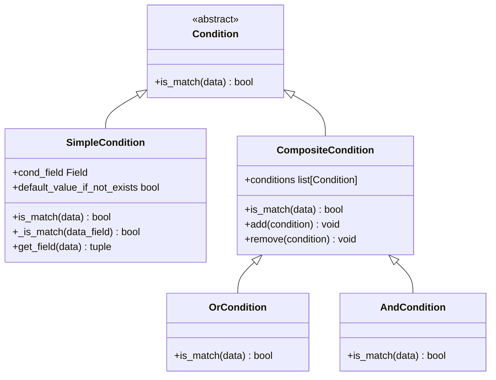
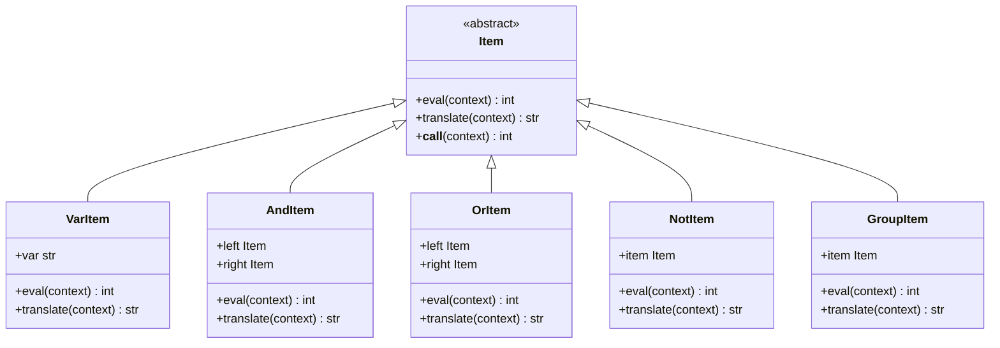
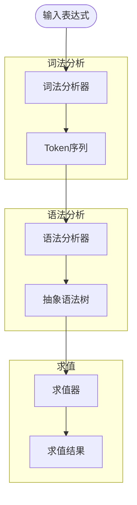
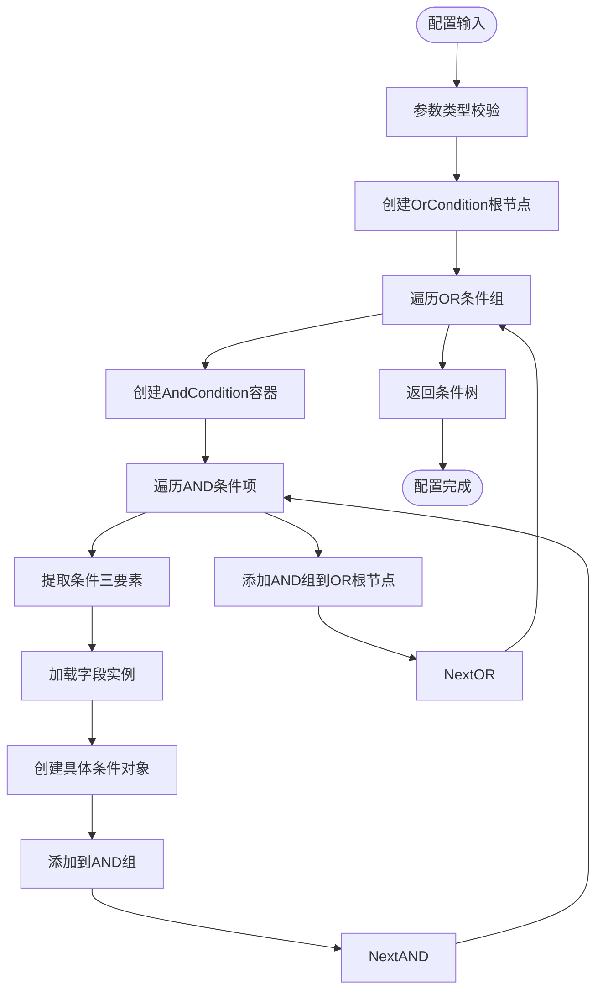
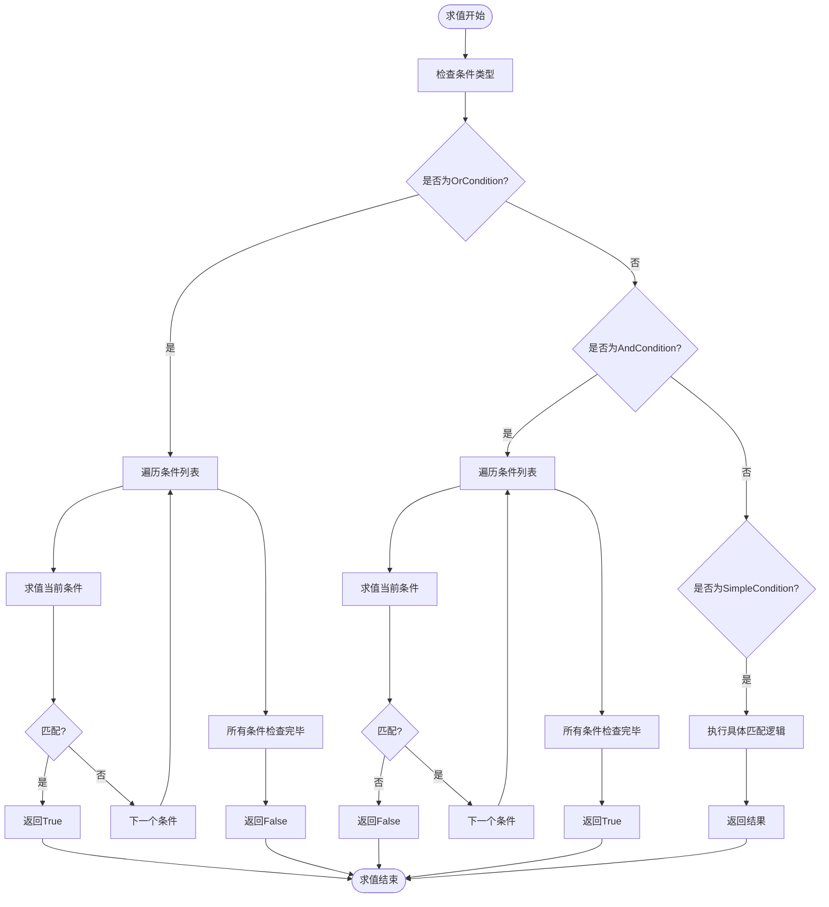
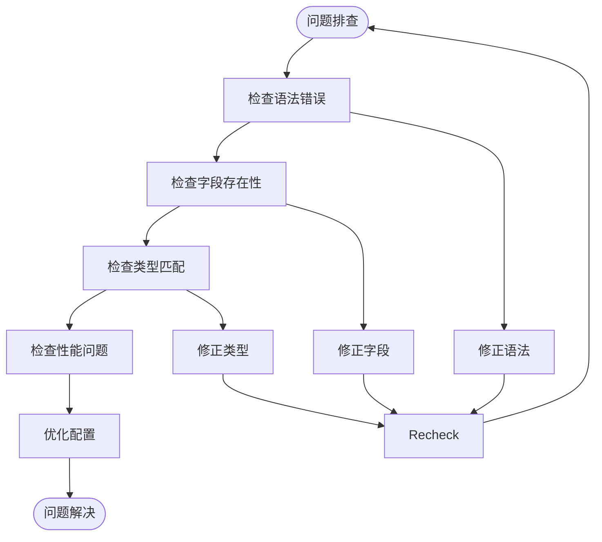

# 复合条件配置

<cite>
**本文档引用的文件**   
- [expression.py](file://bkmonitor/bkmonitor/strategy/expression.py)
- [conditions.py](file://bkmonitor/bkmonitor/utils/range/conditions.py)
- [__init__.py](file://bkmonitor/bkmonitor/utils/range/__init__.py)
- [test_conditions.py](file://bkmonitor/alarm_backends/tests/core/range/test_conditions.py)
- [test_conditions.py](file://bkmonitor/bkmonitor/data_source/tests/test_conditions.py)
</cite>

## 目录
1. [复合条件配置概述](#复合条件配置概述)
2. [核心组件分析](#核心组件分析)
3. [复合条件语法树结构](#复合条件语法树结构)
4. [复合条件配置方法](#复合条件配置方法)
5. [复合条件求值机制](#复合条件求值机制)
6. [复杂度限制与性能优化](#复杂度限制与性能优化)
7. [调试与验证技巧](#调试与验证技巧)

## 复合条件配置概述

复合条件配置是监控系统中用于定义复杂告警触发逻辑的核心功能。通过AND、OR等逻辑运算符的组合，系统能够构建多层级的条件判断树，实现对监控指标的精细化控制。本系统提供了两种主要的复合条件配置方式：基于表达式的文本配置和基于JSON结构的嵌套配置。

基于表达式的配置方式采用类似"A && (B || C) && !D"的语法，通过词法分析和语法解析构建条件树。基于JSON的配置方式则使用列表嵌套结构，每个子列表代表一个OR条件组，组内条件默认为AND关系。这两种方式都支持多级嵌套，能够满足复杂的监控需求。

**Section sources**
- [expression.py](file://bkmonitor/bkmonitor/strategy/expression.py#L1-L241)
- [conditions.py](file://bkmonitor/bkmonitor/utils/range/conditions.py#L1-L175)

## 核心组件分析

### 条件基类与继承体系

系统采用面向对象的设计模式构建复合条件体系，核心组件包括条件基类`Condition`、简单条件类`SimpleCondition`和复合条件类`CompositeCondition`。



**Diagram sources**
- [conditions.py](file://bkmonitor/bkmonitor/utils/range/conditions.py#L15-L30)

**Section sources**
- [conditions.py](file://bkmonitor/bkmonitor/utils/range/conditions.py#L15-L90)

### 表达式解析器

表达式解析器采用PLY（Python Lex-Yacc）工具实现，包含词法分析器和语法分析器两个核心组件。词法分析器将输入字符串分解为变量、逻辑运算符和括号等Token，语法分析器则根据预定义的语法规则构建抽象语法树。



**Diagram sources**
- [expression.py](file://bkmonitor/bkmonitor/strategy/expression.py#L60-L150)

**Section sources**
- [expression.py](file://bkmonitor/bkmonitor/strategy/expression.py#L60-L241)

## 复合条件语法树结构

### 语法树构建流程

复合条件的语法树构建分为三个主要步骤：词法分析、语法分析和树结构生成。词法分析器首先将输入的表达式字符串分解为Token序列，然后语法分析器根据预定义的语法规则将Token序列转换为抽象语法树。



**Diagram sources**
- [expression.py](file://bkmonitor/bkmonitor/strategy/expression.py#L30-L241)

**Section sources**
- [expression.py](file://bkmonitor/bkmonitor/strategy/expression.py#L30-L241)

### 语法树示例

以表达式"A && (B || C) && !D"为例，其对应的语法树结构如下：

```mermaid
graph TD
A[AndItem] --> B[AndItem]
A --> C[NotItem]
B --> D[VarItem(A)]
B --> E[GroupItem]
E --> F[OrItem]
F --> G[VarItem(B)]
F --> H[VarItem(C)]
C --> I[VarItem(D)]
```

**Diagram sources**
- [expression.py](file://bkmonitor/bkmonitor/strategy/expression.py#L171-L191)

## 复合条件配置方法

### JSON结构配置

系统支持通过JSON结构配置复合条件，采用列表嵌套的方式表示OR和AND逻辑关系。顶层列表的每个元素代表一个OR条件组，组内条件默认为AND关系。

```python
# 配置示例：(A AND B) OR (C AND D)
conditions_config = [
    [{"field": "A", "method": "eq", "value": "1"}, 
     {"field": "B", "method": "eq", "value": "2"}],
    [{"field": "C", "method": "eq", "value": "3"}, 
     {"field": "D", "method": "eq", "value": "4"}]
]
```

### 表达式文本配置

系统支持使用类似编程语言的表达式语法配置复合条件，支持变量、括号和逻辑运算符。

```python
# 配置示例：A && (B || C) && !D
expression = "A && (B || C) && !D"
parsed_expr = parse_expression(expression)
```

### 配置构建函数

系统提供了`load_condition_instance`函数用于将配置转换为条件对象树：



**Diagram sources**
- [__init__.py](file://bkmonitor/bkmonitor/utils/range/__init__.py#L100-L159)

**Section sources**
- [__init__.py](file://bkmonitor/bkmonitor/utils/range/__init__.py#L100-L159)

## 复合条件求值机制

### 求值顺序与短路计算

复合条件的求值遵循标准的逻辑运算规则，支持短路计算优化。AND条件在遇到第一个不匹配的条件时立即返回False，OR条件在遇到第一个匹配的条件时立即返回True。

```python
def test_or_short_circuit():
    """测试OR条件的短路计算"""
    or_condition = OrCondition()
    # 第一个条件为True，后续条件不会被求值
    or_condition.add(TrueCondition())
    or_condition.add(ErrorCondition())  # 这个条件不会被执行
    assert or_condition.is_match({}) == True

def test_and_short_circuit():
    """测试AND条件的短路计算"""
    and_condition = AndCondition()
    # 第一个条件为False，后续条件不会被求值
    and_condition.add(FalseCondition())
    and_condition.add(ErrorCondition())  # 这个条件不会被执行
    assert and_condition.is_match({}) == False
```

### 求值流程

复合条件的求值流程如下：



**Diagram sources**
- [conditions.py](file://bkmonitor/bkmonitor/utils/range/conditions.py#L90-L110)

**Section sources**
- [conditions.py](file://bkmonitor/bkmonitor/utils/range/conditions.py#L90-L130)

## 复杂度限制与性能优化

### 复杂度限制

系统对复合条件的复杂度进行了合理限制，确保性能和稳定性：

1. **嵌套深度限制**：建议最大嵌套深度不超过10层
2. **条件数量限制**：单个OR条件组内AND条件数量建议不超过50个
3. **表达式长度限制**：文本表达式长度建议不超过1000个字符

### 性能优化策略

系统采用多种策略优化复合条件的性能：

1. **短路计算**：AND和OR条件支持短路求值，避免不必要的计算
2. **条件缓存**：对频繁使用的条件对象进行缓存复用
3. **预编译优化**：对表达式进行预编译，减少重复解析开销
4. **索引优化**：对常用查询字段建立索引，加速条件匹配

```python
# 性能优化示例
class OptimizedCondition(CompositeCondition):
    def __init__(self):
        super().__init__()
        self._compiled = None
    
    def compile(self):
        """预编译条件树"""
        if self._compiled is None:
            self._compiled = self._optimize_tree()
        return self._compiled
    
    def _optimize_tree(self):
        """优化条件树结构"""
        # 1. 合并相邻的相同类型条件
        # 2. 提取公共子表达式
        # 3. 重排序条件以最大化短路效果
        pass
```

**Section sources**
- [conditions.py](file://bkmonitor/bkmonitor/utils/range/conditions.py#L1-L175)

## 调试与验证技巧

### 条件验证方法

系统提供了多种方法验证复合条件的正确性：

```python
# 方法1：使用测试数据验证
def validate_condition(condition, test_data, expected_result):
    result = condition.is_match(test_data)
    assert result == expected_result, f"期望{expected_result}，实际{result}"

# 方法2：打印条件树结构
def print_condition_tree(condition, indent=0):
    print("  " * indent + str(condition))
    if hasattr(condition, 'conditions'):
        for sub_cond in condition.conditions:
            print_condition_tree(sub_cond, indent + 1)

# 方法3：使用表达式解析器的translate方法
def debug_expression(expr_string):
    parsed = parse_expression(expr_string)
    print(f"原始表达式: {expr_string}")
    print(f"解析结果: {parsed.translate()}")
```

### 常见问题排查

1. **语法错误**：检查表达式中的括号是否匹配，运算符是否正确
2. **字段不存在**：确认条件中引用的字段在数据中存在
3. **类型不匹配**：确保比较操作的字段类型一致
4. **性能问题**：检查是否有过多的嵌套或复杂的正则表达式



**Section sources**
- [test_conditions.py](file://bkmonitor/alarm_backends/tests/core/range/test_conditions.py#L1-L214)
- [test_conditions.py](file://bkmonitor/bkmonitor/data_source/tests/test_conditions.py#L1-L113)