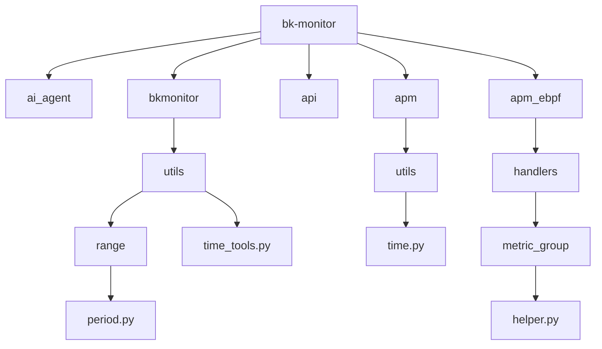
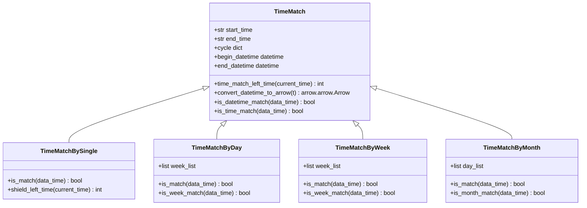
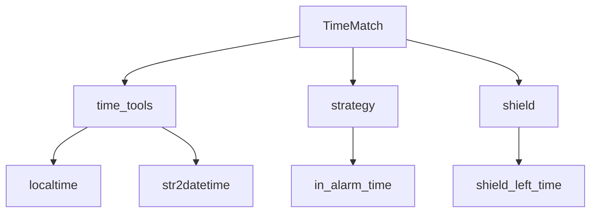

# 时间条件配置

<cite>
**本文档引用的文件**   
- [period.py](file://bkmonitor/bkmonitor/utils/range/period.py)
- [time_tools.py](file://bkmonitor/bkmonitor/utils/time_tools.py)
- [helper.py](file://bkmonitor/packages/apm_web/handlers/metric_group/helper.py)
- [time.py](file://bkmonitor/apm/utils/time.py)
- [strategy.py](file://bkmonitor/alarm_backends/core/control/strategy.py)
- [shield.py](file://bkmonitor/bkmonitor/utils/shield.py)
</cite>

## 目录
1. [引言](#引言)
2. [项目结构](#项目结构)
3. [核心组件](#核心组件)
4. [架构概述](#架构概述)
5. [详细组件分析](#详细组件分析)
6. [依赖分析](#依赖分析)
7. [性能考虑](#性能考虑)
8. [故障排除指南](#故障排除指南)
9. [结论](#结论)

## 引言
本文档详细说明了时间相关条件的配置方法，包括同比、环比、周期比较等时间序列分析功能。文档解释了时间条件的配置参数和语义含义，提供了API请求示例展示如何配置周同比、日环比等常见场景。同时说明了时间偏移量的计算逻辑和时区处理机制，记录了时间条件与数据采集周期的关联关系，以及在不同时间粒度下的表现差异。最后提供了时间条件配置的最佳实践，以避免因时间范围设置不当导致的误告警。

## 项目结构
项目结构清晰地组织了各个功能模块，主要分为AI代理、监控后端、API接口、APM（应用性能管理）、数据视图等模块。时间条件配置相关的代码主要分布在`bkmonitor`模块的`utils/range`和`utils/time_tools`中，以及`apm_web`模块的`handlers/metric_group`中。



**图示来源**
- [period.py](file://bkmonitor/bkmonitor/utils/range/period.py)
- [time_tools.py](file://bkmonitor/bkmonitor/utils/time_tools.py)
- [time.py](file://bkmonitor/apm/utils/time.py)
- [helper.py](file://bkmonitor/packages/apm_web/handlers/metric_group/helper.py)

**节来源**
- [period.py](file://bkmonitor/bkmonitor/utils/range/period.py)
- [time_tools.py](file://bkmonitor/bkmonitor/utils/time_tools.py)

## 核心组件
时间条件配置的核心组件包括时间匹配类`TimeMatch`及其子类，如`TimeMatchBySingle`、`TimeMatchByDay`、`TimeMatchByWeek`和`TimeMatchByMonth`。这些类负责判断给定时间是否符合配置的时间条件。

**节来源**
- [period.py](file://bkmonitor/bkmonitor/utils/range/period.py#L68-L180)

## 架构概述
系统通过`TimeMatch`类及其子类实现时间条件的匹配逻辑。`TimeMatch`类提供了基础的时间匹配方法，而其子类则根据不同的周期（单次、按天、按周、按月）实现了具体的匹配逻辑。此外，`shift_time_range`函数用于实现时间偏移，支持同比、环比等时间序列分析功能。



**图示来源**
- [period.py](file://bkmonitor/bkmonitor/utils/range/period.py#L68-L180)

**节来源**
- [period.py](file://bkmonitor/bkmonitor/utils/range/period.py#L68-L180)

## 详细组件分析
### 时间匹配类分析
`TimeMatch`类是时间匹配的基础类，提供了时间匹配的基本方法。其子类根据不同的周期需求实现了具体的匹配逻辑。

#### 时间匹配方法
```python
def time_match_left_time(self, current_time):
    now_time = time_tools.localtime(current_time).replace(microsecond=0).time()
    start_time = datetime.strptime(self.start_time, "%H:%M:%S").time()
    end_time = datetime.strptime(self.end_time, "%H:%M:%S").time()
    today_str = current_time.strftime("%Y-%m-%d")
    if start_time <= end_time or end_time > now_time:
        end_time = time_tools.str2datetime(end_time.strftime("{} %H:%M:%S".format(today_str)))
    elif start_time <= now_time:
        tomorrow_str = (current_time + timedelta(days=1)).strftime("%Y-%m-%d")
        end_time = time_tools.str2datetime(end_time.strftime("{} %H:%M:%S".format(tomorrow_str)))
    return end_time.timestamp() - current_time.timestamp
```

**图示来源**
- [period.py](file://bkmonitor/bkmonitor/utils/range/period.py#L68-L80)

**节来源**
- [period.py](file://bkmonitor/bkmonitor/utils/range/period.py#L68-L80)

### 时间偏移分析
`shift_time_range`函数用于实现时间偏移，支持同比、环比等时间序列分析功能。

#### 时间偏移方法
```python
@classmethod
def shift_time_range(
    cls, start_time: int | None = None, end_time: int | None = None, time_shift: str | None = None
) -> tuple[int, int]:
    start_time, end_time = MetricHelper.get_time_range(start_time, end_time, with_accuracy=False)
    if not time_shift:
        return start_time, end_time
    start_time += parse_time_compare_abbreviation(time_shift)
    end_time += parse_time_compare_abbreviation(time_shift)
    return start_time, end_time
```

**图示来源**
- [helper.py](file://bkmonitor/packages/apm_web/handlers/metric_group/helper.py#L503-L517)

**节来源**
- [helper.py](file://bkmonitor/packages/apm_web/handlers/metric_group/helper.py#L503-L517)

## 依赖分析
时间条件配置依赖于多个模块，包括`time_tools`、`strategy`和`shield`。`time_tools`模块提供了时间处理的工具函数，`strategy`模块实现了告警策略中的时间条件判断，`shield`模块则用于屏蔽时间的计算。



**图示来源**
- [period.py](file://bkmonitor/bkmonitor/utils/range/period.py)
- [time_tools.py](file://bkmonitor/bkmonitor/utils/time_tools.py)
- [strategy.py](file://bkmonitor/alarm_backends/core/control/strategy.py)
- [shield.py](file://bkmonitor/bkmonitor/utils/shield.py)

**节来源**
- [period.py](file://bkmonitor/bkmonitor/utils/range/period.py)
- [time_tools.py](file://bkmonitor/bkmonitor/utils/time_tools.py)
- [strategy.py](file://bkmonitor/alarm_backends/core/control/strategy.py)
- [shield.py](file://bkmonitor/bkmonitor/utils/shield.py)

## 性能考虑
时间条件配置在性能上主要考虑时间匹配的效率和时间偏移的准确性。通过使用`arrow`库进行时间处理，可以提高时间匹配的效率。同时，合理配置时间范围和周期，可以减少不必要的计算，提高系统性能。

## 故障排除指南
### 时间匹配失败
如果时间匹配失败，首先检查时间范围配置是否正确，确保开始时间和结束时间符合预期。其次，检查时区设置是否正确，确保时间匹配在正确的时区下进行。

### 时间偏移不准确
如果时间偏移不准确，检查`time_shift`参数是否正确，确保时间偏移量符合预期。同时，检查`parse_time_compare_abbreviation`函数的实现，确保时间偏移量的解析正确。

**节来源**
- [period.py](file://bkmonitor/bkmonitor/utils/range/period.py)
- [helper.py](file://bkmonitor/packages/apm_web/handlers/metric_group/helper.py)

## 结论
本文档详细介绍了时间条件配置的方法和实现逻辑，包括时间匹配和时间偏移。通过合理配置时间条件，可以有效支持同比、环比等时间序列分析功能，提高监控系统的准确性和可靠性。建议在实际应用中，根据具体需求合理配置时间范围和周期，避免因时间范围设置不当导致的误告警。