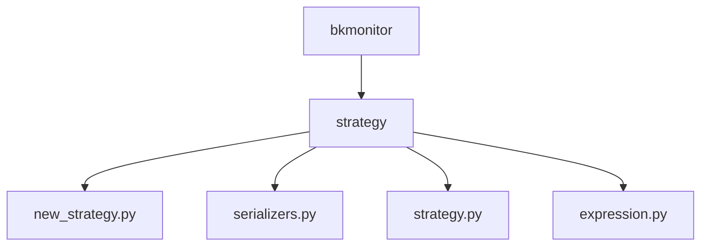
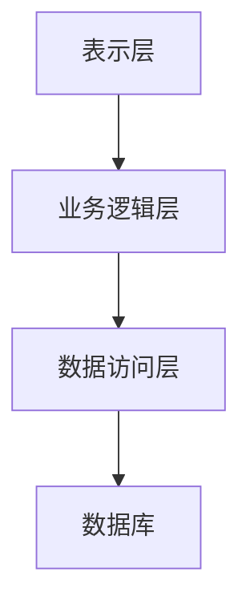
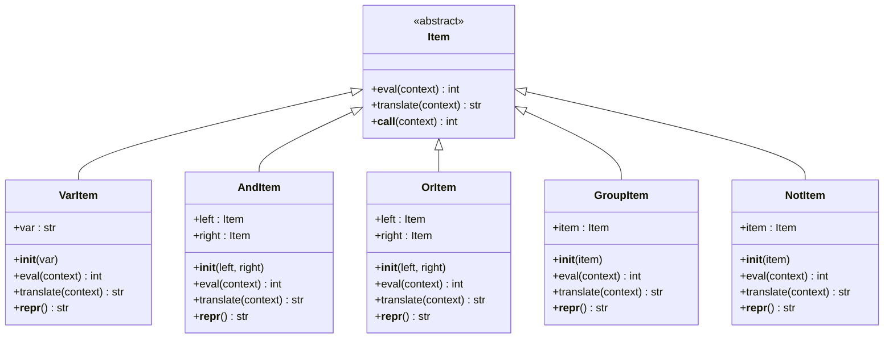
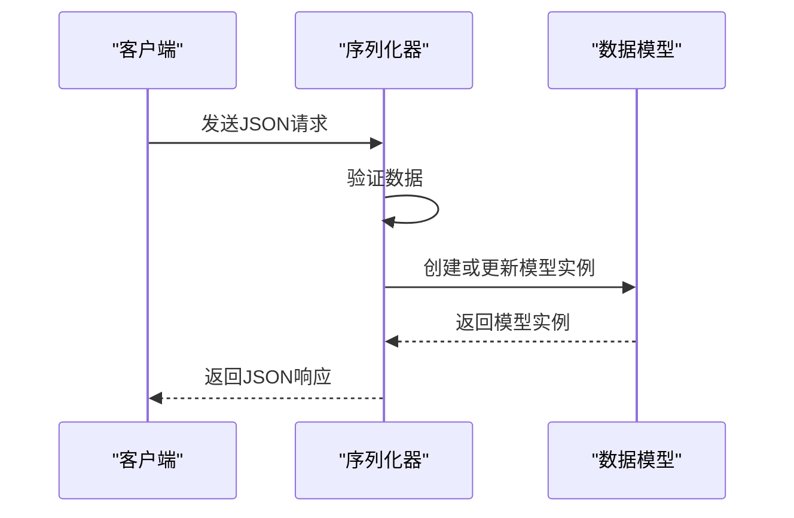
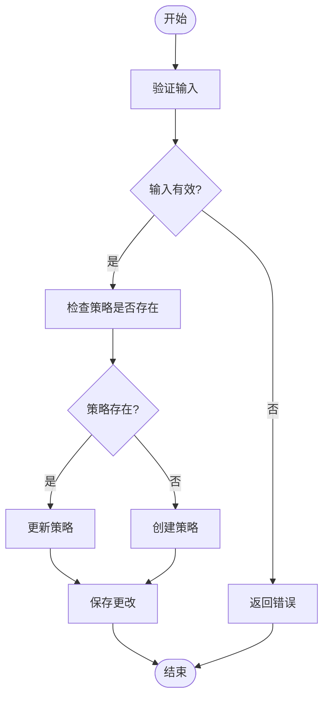
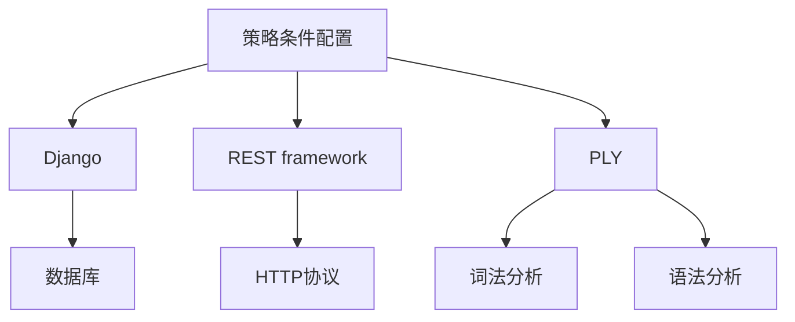

# 策略条件配置

<cite>
**本文档引用的文件**   
- [new_strategy.py](file://bkmonitor\bkmonitor\strategy\new_strategy.py)
- [serializers.py](file://bkmonitor\bkmonitor\strategy\serializers.py)
- [strategy.py](file://bkmonitor\bkmonitor\strategy\strategy.py)
- [expression.py](file://bkmonitor\bkmonitor\strategy\expression.py)
</cite>

## 目录
1. [引言](#引言)
2. [项目结构](#项目结构)
3. [核心组件](#核心组件)
4. [架构概述](#架构概述)
5. [详细组件分析](#详细组件分析)
6. [依赖分析](#依赖分析)
7. [性能考虑](#性能考虑)
8. [故障排除指南](#故障排除指南)
9. [结论](#结论)

## 引言
本文档详细阐述了蓝鲸监控平台中策略条件配置的功能实现。策略条件配置是监控系统的核心功能之一，它允许用户通过API配置各种复杂的告警触发条件，包括单指标阈值、多指标组合、同比环比等。文档深入分析了条件表达式的语法结构、解析机制、校验逻辑以及安全校验机制，旨在为开发者和用户提供全面的技术参考。

## 项目结构
蓝鲸监控平台的项目结构遵循模块化设计原则，将不同功能划分为独立的模块。策略条件配置相关的代码主要位于`bkmonitor/bkmonitor/strategy/`目录下，核心文件包括`new_strategy.py`、`serializers.py`、`strategy.py`和`expression.py`。这些文件共同构成了策略配置的完整实现。

**图示来源**
- [new_strategy.py](file://bkmonitor\bkmonitor\strategy\new_strategy.py)
- [serializers.py](file://bkmonitor\bkmonitor\strategy\serializers.py)
- [strategy.py](file://bkmonitor\bkmonitor\strategy\strategy.py)
- [expression.py](file://bkmonitor\bkmonitor\strategy\expression.py)

## 核心组件
策略条件配置的核心组件包括条件表达式解析器、序列化器和策略配置管理器。这些组件协同工作，实现了从用户输入到数据库存储的完整流程。

**组件来源**
- [new_strategy.py](file://bkmonitor\bkmonitor\strategy\new_strategy.py)
- [serializers.py](file://bkmonitor\bkmonitor\strategy\serializers.py)
- [expression.py](file://bkmonitor\bkmonitor\strategy\expression.py)

## 架构概述
策略条件配置的架构可以分为三层：表示层、业务逻辑层和数据访问层。表示层负责接收和验证用户输入，业务逻辑层处理核心的配置逻辑，数据访问层则负责与数据库交互。

**图示来源**
- [new_strategy.py](file://bkmonitor\bkmonitor\strategy\new_strategy.py)
- [strategy.py](file://bkmonitor\bkmonitor\strategy\strategy.py)

## 详细组件分析

### 条件表达式解析器分析
条件表达式解析器是策略条件配置的核心，它负责将用户输入的字符串表达式解析为可执行的逻辑树。

#### 对象导向组件

**图示来源**
- [expression.py](file://bkmonitor\bkmonitor\strategy\expression.py#L91-L239)

### 序列化器分析
序列化器负责将Python对象转换为JSON格式，以及将JSON格式转换为Python对象，是API接口与内部逻辑之间的桥梁。

#### API/服务组件

**图示来源**
- [serializers.py](file://bkmonitor\bkmonitor\strategy\serializers.py#L0-L427)

### 策略配置管理器分析
策略配置管理器负责管理策略的整个生命周期，包括创建、更新和删除。

#### 复杂逻辑组件

**图示来源**
- [new_strategy.py](file://bkmonitor\bkmonitor\strategy\new_strategy.py#L0-L799)

## 依赖分析
策略条件配置组件依赖于多个外部模块，包括Django框架、REST framework和PLY解析器库。这些依赖关系确保了组件的稳定性和可维护性。

**图示来源**
- [new_strategy.py](file://bkmonitor\bkmonitor\strategy\new_strategy.py)
- [serializers.py](file://bkmonitor\bkmonitor\strategy\serializers.py)
- [expression.py](file://bkmonitor\bkmonitor\strategy\expression.py)

## 性能考虑
在设计策略条件配置时，性能是一个重要的考虑因素。系统通过缓存机制和批量操作来优化性能，确保在高并发场景下仍能保持良好的响应速度。

## 故障排除指南
当遇到策略条件配置问题时，可以按照以下步骤进行排查：
1. 检查输入的JSON格式是否正确。
2. 验证条件表达式的语法是否正确。
3. 查看系统日志以获取详细的错误信息。

**组件来源**
- [new_strategy.py](file://bkmonitor\bkmonitor\strategy\new_strategy.py)
- [expression.py](file://bkmonitor\bkmonitor\strategy\expression.py)

## 结论
本文档详细介绍了蓝鲸监控平台中策略条件配置的实现细节。通过深入分析核心组件和架构设计，为开发者提供了全面的技术参考。未来的工作可以集中在优化性能和增强安全性方面，以进一步提升系统的稳定性和可靠性。