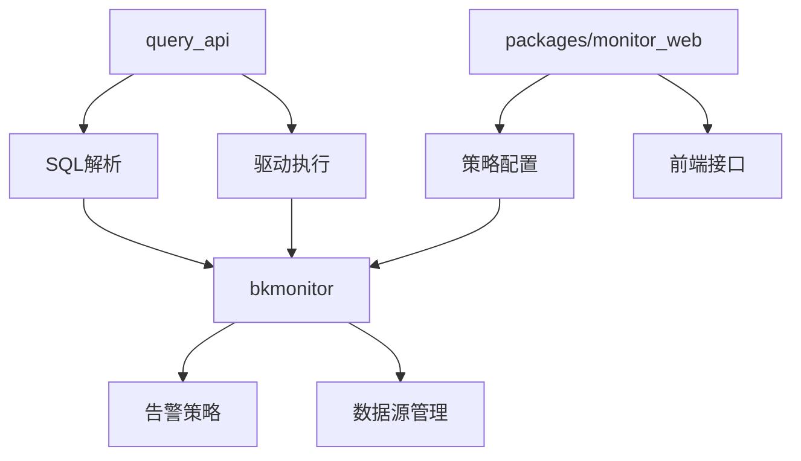
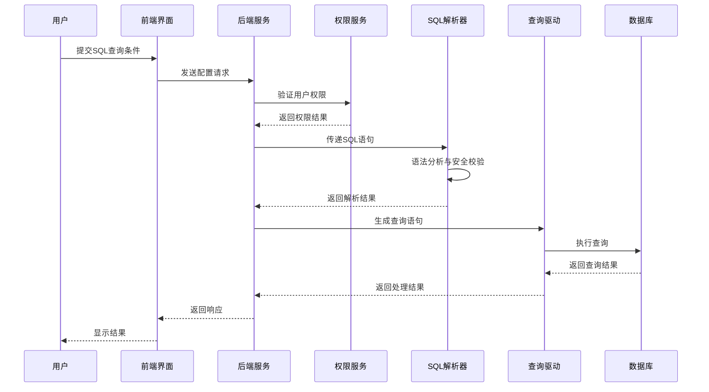
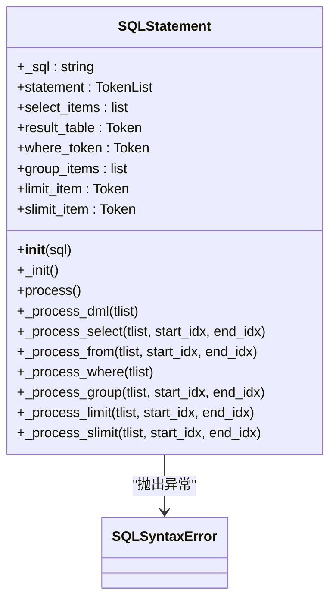
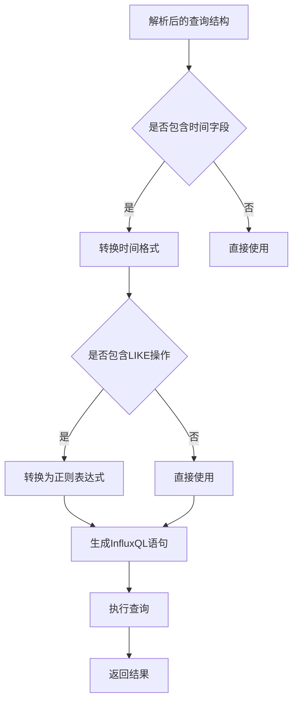
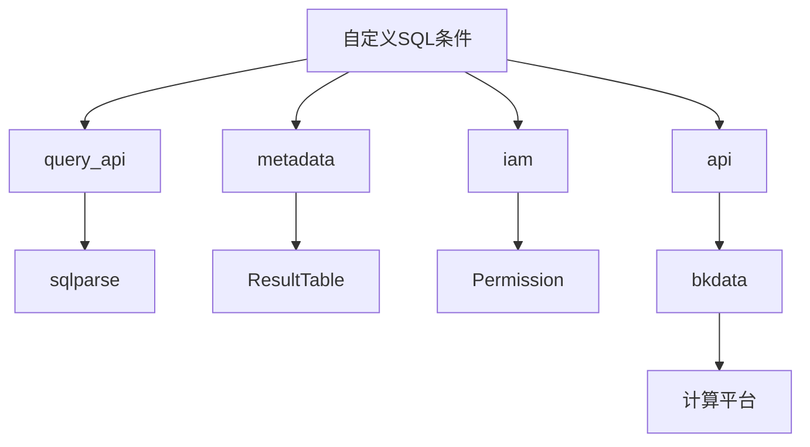
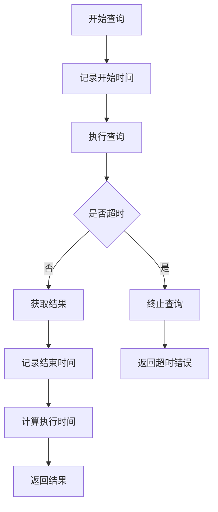

# 自定义SQL条件配置

<cite>
**本文档引用文件**  
- [save_alarm_strategy_v2.md](file://bkmonitor/docs/api/apidocs/zh_hans/save_alarm_strategy_v2.md)
- [v2.py](file://bkmonitor/packages/monitor_web/strategies/resources/v2.py)
- [__init__.py](file://bkmonitor/bkmonitor/data_source/data_source/__init__.py)
- [statement.py](file://bkmonitor/query_api/sql_parse/statement.py)
- [influxdb\__init__.py](file://bkmonitor/query_api/drivers/influxdb/__init__.py)
- [sql.py](file://bkmonitor/bkmonitor/utils/sql.py)
- [drf.py](file://bkmonitor/bkmonitor/iam/drf.py)
- [auth.py](file://bkmonitor/bkmonitor/dataflow/auth.py)
</cite>

## 目录
1. [简介](#简介)
2. [项目结构](#项目结构)
3. [核心组件](#核心组件)
4. [架构概述](#架构概述)
5. [详细组件分析](#详细组件分析)
6. [依赖分析](#依赖分析)
7. [性能考量](#性能考量)
8. [故障排除指南](#故障排除指南)
9. [结论](#结论)

## 简介
本文档详细说明了蓝鲸监控平台中自定义SQL查询条件的配置方法。文档涵盖了SQL语法支持范围、参数化查询的使用方式、安全校验机制、性能监控和权限控制策略。通过本指南，用户可以了解如何安全、高效地配置复杂的SQL查询作为告警条件，并确保查询操作符合系统安全和性能要求。

## 项目结构
蓝鲸监控平台的项目结构采用模块化设计，将不同功能划分为独立的模块。自定义SQL查询条件的相关功能主要分布在`bkmonitor`、`query_api`和`packages/monitor_web`等目录中。`query_api`模块负责SQL语句的解析和执行，`bkmonitor`模块处理告警策略和数据源配置，而`packages/monitor_web`则提供前端接口和策略资源管理。



**图示来源**
- [statement.py](file://bkmonitor/query_api/sql_parse/statement.py)
- [influxdb\__init__.py](file://bkmonitor/query_api/drivers/influxdb/__init__.py)
- [v2.py](file://bkmonitor/packages/monitor_web/strategies/resources/v2.py)

## 核心组件
自定义SQL条件配置的核心组件包括SQL解析器、查询驱动、安全校验模块和权限控制服务。SQL解析器负责将用户输入的SQL语句分解为可执行的查询结构，查询驱动则根据解析结果生成针对特定数据库的查询语句。安全校验模块确保SQL语句符合语法规范并防止注入攻击，权限控制服务则验证用户是否有权访问查询涉及的数据。

**组件来源**
- [statement.py](file://bkmonitor/query_api/sql_parse/statement.py)
- [influxdb\__init__.py](file://bkmonitor/query_api/drivers/influxdb/__init__.py)
- [drf.py](file://bkmonitor/bkmonitor/iam/drf.py)

## 架构概述
自定义SQL查询条件的处理流程遵循典型的请求-处理-响应模式。用户通过前端界面提交包含SQL条件的告警策略配置，后端服务接收请求后，首先进行权限验证，然后将SQL语句传递给SQL解析器进行语法分析和安全校验。解析后的查询结构被转换为特定数据库的查询语句，由查询驱动执行并返回结果。



**图示来源**
- [drf.py](file://bkmonitor/bkmonitor/iam/drf.py)
- [statement.py](file://bkmonitor/query_api/sql_parse/statement.py)
- [influxdb\__init__.py](file://bkmonitor/query_api/drivers/influxdb/__init__.py)

## 详细组件分析

### SQL解析与安全校验
SQL解析器是自定义SQL条件配置的核心组件，负责将用户输入的SQL语句转换为系统可执行的查询结构。解析器首先验证SQL语句的语法正确性，确保语句以`SELECT`关键字开头且不包含多个SQL语句。然后，解析器将SQL语句分解为选择字段、结果表、查询条件、分组字段等组成部分。



**图示来源**
- [statement.py](file://bkmonitor/query_api/sql_parse/statement.py)

**组件来源**
- [statement.py](file://bkmonitor/query_api/sql_parse/statement.py)

### 查询驱动与执行
查询驱动负责将解析后的查询结构转换为特定数据库的查询语句并执行。系统主要支持InfluxDB作为后端存储，查询驱动会将标准SQL语法转换为InfluxQL语法。驱动还负责处理时间字段转换、条件操作符映射和聚合函数转换等任务。



**图示来源**
- [influxdb\__init__.py](file://bkmonitor/query_api/drivers/influxdb/__init__.py)

**组件来源**
- [influxdb\__init__.py](file://bkmonitor/query_api/drivers/influxdb/__init__.py)

### 参数化查询与安全处理
系统通过参数化查询和输入转义机制防止SQL注入攻击。`sql_format_params`函数负责将参数安全地插入SQL语句中，对字符串参数进行转义处理，确保特殊字符不会被解释为SQL代码。系统还限制了SQL语句中可使用的操作符和关键字，进一步降低了安全风险。

```python
def sql_format_params(sql, params):
    # 实时计算语法与查询语法存在一定差异，需要对sql进行特殊处理
    sql = sql.replace("!=", "<>")

    def escape(obj):
        if isinstance(obj, str):
            return "'" + escape_string(obj) + "'"
        return escape_item(obj, "utf8", mapping=None)

    params = tuple(escape(arg) for arg in params)
    return sql % params
```

**组件来源**
- [sql.py](file://bkmonitor/bkmonitor/utils/sql.py)

### 复杂查询配置示例
以下示例展示了如何编写复杂的多表关联查询作为告警条件。查询从多个结果表中获取数据，通过IP地址进行关联，并应用多个过滤条件。

```json
{
  "data_source_label": "custom",
  "data_type_label": "time_series",
  "query_configs": [
    {
      "result_table_id": "system.cpu_summary",
      "metric_field": "usage",
      "agg_method": "AVG",
      "agg_interval": 60,
      "agg_dimension": ["ip", "cloud_id"],
      "agg_condition": [
        {
          "key": "ip",
          "method": "eq",
          "value": ["10.0.0.1", "10.0.0.2"]
        },
        {
          "key": "usage",
          "method": "gt",
          "value": ["80"]
        }
      ]
    },
    {
      "result_table_id": "system.memory_summary",
      "metric_field": "used_percent",
      "agg_method": "MAX",
      "agg_interval": 60,
      "agg_dimension": ["ip", "cloud_id"],
      "agg_condition": [
        {
          "key": "ip",
          "method": "eq",
          "value": ["10.0.0.1", "10.0.0.2"]
        },
        {
          "key": "used_percent",
          "method": "gt",
          "value": ["90"]
        }
      ]
    }
  ],
  "expression": "a && b"
}
```

**组件来源**
- [save_alarm_strategy_v2.md](file://bkmonitor/docs/api/apidocs/zh_hans/save_alarm_strategy_v2.md)

## 依赖分析
自定义SQL条件配置功能依赖于多个核心模块和服务。`query_api`模块提供SQL解析和查询执行功能，`metadata`模块管理结果表和存储配置信息，`iam`模块负责权限验证，`api`模块提供与其他系统的集成接口。



**图示来源**
- [influxdb\__init__.py](file://bkmonitor/query_api/drivers/influxdb/__init__.py)
- [drf.py](file://bkmonitor/bkmonitor/iam/drf.py)

**组件来源**
- [influxdb\__init__.py](file://bkmonitor/query_api/drivers/influxdb/__init__.py)
- [drf.py](file://bkmonitor/bkmonitor/iam/drf.py)

## 性能考量
系统通过多种机制确保SQL查询的性能和稳定性。查询驱动设置了严格的查询限制，包括最大返回记录数（50,000条）和查询超时时间（30秒）。系统还实现了查询性能监控，记录每个查询的执行时间和资源消耗，便于性能分析和优化。



**图示来源**
- [influxdb\__init__.py](file://bkmonitor/query_api/drivers/influxdb/__init__.py)

**组件来源**
- [influxdb\__init__.py](file://bkmonitor/query_api/drivers/influxdb/__init__.py)

## 故障排除指南
当自定义SQL查询条件配置出现问题时，可以从以下几个方面进行排查：首先检查SQL语句的语法是否正确，确保语句以`SELECT`开头且不包含多个SQL语句；其次验证用户是否有权访问查询涉及的结果表；然后检查查询条件中的字段名和值是否正确；最后查看系统日志以获取详细的错误信息。

**组件来源**
- [statement.py](file://bkmonitor/query_api/sql_parse/statement.py)
- [influxdb\__init__.py](file://bkmonitor/query_api/drivers/influxdb/__init__.py)
- [drf.py](file://bkmonitor/bkmonitor/iam/drf.py)

## 结论
自定义SQL条件配置功能为蓝鲸监控平台提供了强大的数据查询能力，使用户能够灵活地定义复杂的告警条件。通过严格的语法校验、安全防护和权限控制，系统确保了查询操作的安全性和稳定性。合理的性能限制和监控机制保证了系统的高效运行。用户在使用此功能时，应遵循最佳实践，编写高效、安全的SQL查询，以充分发挥系统的能力。