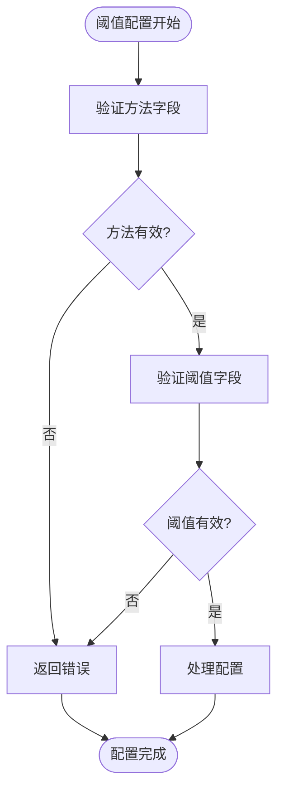
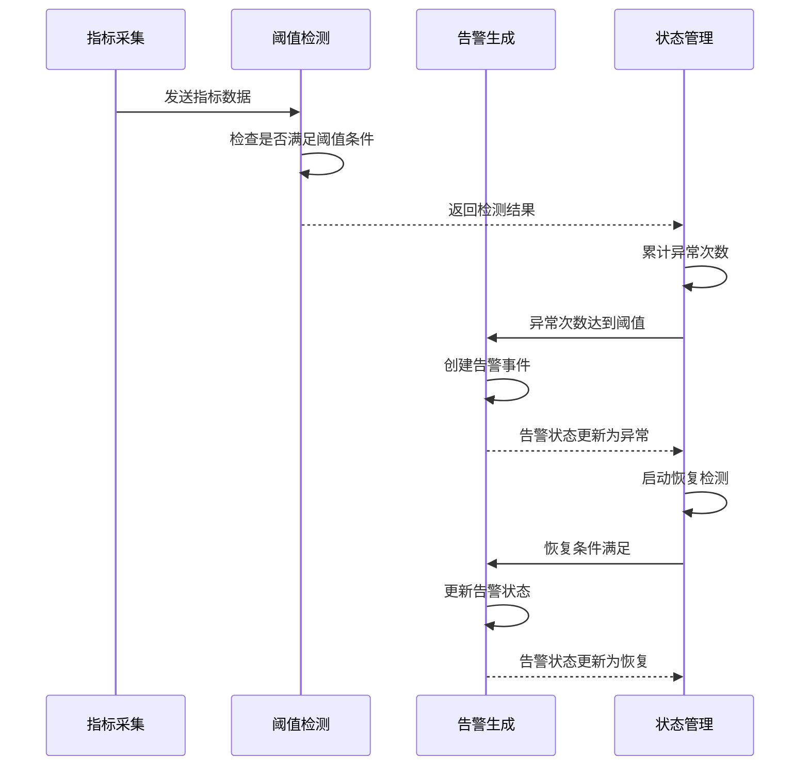
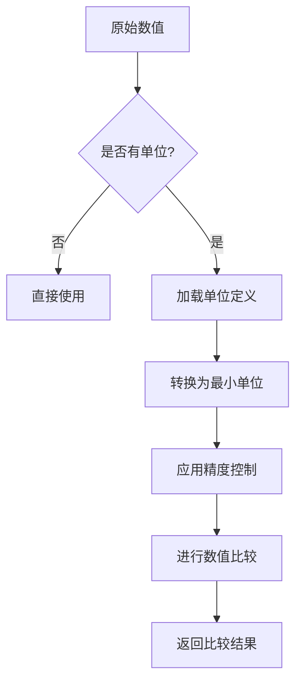
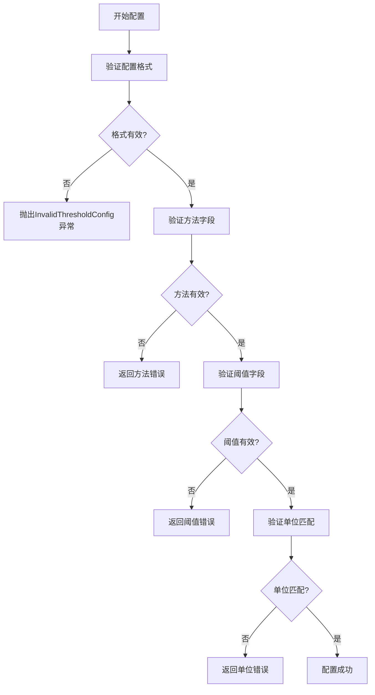

# 阈值条件配置

<cite>
**本文档引用的文件**   
- [threshold.py](file://bkmonitor/alarm_backends/service/detect/strategy/threshold.py)
- [unit.py](file://bkmonitor/alarm_backends/templatetags/unit.py)
- [common.py](file://bkmonitor/packages/monitor_web/strategies/default_settings/common.py)
- [detect.py](file://bkmonitor/core/errors/alarm_backends/detect.py)
- [__init__.py](file://bkmonitor/bkmonitor/as_code/ply/threshold/__init__.py)
</cite>

## 目录
1. [引言](#引言)
2. [阈值配置方式](#阈值配置方式)
3. [数据结构与JSON Schema](#数据结构与json-schema)
4. [API请求示例](#api请求示例)
5. [告警触发与恢复逻辑](#告警触发与恢复逻辑)
6. [单位处理与精度控制](#单位处理与精度控制)
7. [常见配置错误排查](#常见配置错误排查)

## 引言
本文档详细说明了蓝鲸监控平台中单指标阈值条件的配置方法。文档涵盖了静态阈值、动态阈值和范围阈值等多种配置方式，解释了阈值条件的数据结构和JSON Schema，并提供了完整的API请求示例。同时，文档还阐述了阈值告警的触发逻辑、恢复逻辑以及持续周期的配置方法，记录了单位处理、数据类型转换和精度控制机制，并提供了常见配置错误的排查指南。

## 阈值配置方式

### 静态阈值配置
静态阈值是最基本的阈值配置方式，通过设置一个固定的数值作为判断标准。在蓝鲸监控系统中，静态阈值配置支持多种比较操作符，包括大于、小于、等于等。

### 动态阈值配置
动态阈值是基于历史数据模式自动计算的阈值，能够适应指标的正常波动。系统会分析指标的历史数据，建立基线，并根据基线动态调整阈值范围。

### 范围阈值配置
范围阈值允许设置一个数值区间作为正常范围，当指标值超出该区间时触发告警。这种配置方式适用于需要监控指标在特定范围内波动的场景。

**Section sources**
- [threshold.py](file://bkmonitor/alarm_backends/service/detect/strategy/threshold.py)

## 数据结构与JSON Schema

### 阈值条件数据结构
阈值条件的核心数据结构包含方法（method）和阈值（threshold）两个关键字段。方法字段定义了比较操作符，阈值字段定义了比较的数值。

```json
{
  "method": "gte",
  "threshold": 50.0
}
```

### JSON Schema定义
根据代码分析，阈值配置的JSON Schema遵循以下结构：

```json
[
  [
    {
      "method": "string",
      "threshold": "number"
    }
  ]
]
```

其中，外层数组表示"或"逻辑，内层数组表示"且"逻辑。系统支持的比较操作符包括：
- `gt`: 大于
- `gte`: 大于等于
- `lt`: 小于
- `lte`: 小于等于
- `eq`: 等于
- `neq`: 不等于



**Diagram sources**
- [__init__.py](file://bkmonitor/bkmonitor/as_code/ply/threshold/__init__.py)
- [threshold.py](file://bkmonitor/alarm_backends/service/detect/strategy/threshold.py)

**Section sources**
- [threshold.py](file://bkmonitor/alarm_backends/service/detect/strategy/threshold.py)
- [__init__.py](file://bkmonitor/bkmonitor/as_code/ply/threshold/__init__.py)

## API请求示例

### 大于操作符配置
```json
{
  "algorithms": [
    {
      "type": "Threshold",
      "config": [
        [
          {
            "method": "gt",
            "threshold": 80.0
          }
        ]
      ]
    }
  ]
}
```

### 小于操作符配置
```json
{
  "algorithms": [
    {
      "type": "Threshold",
      "config": [
        [
          {
            "method": "lt",
            "threshold": 20.0
          }
        ]
      ]
    }
  ]
}
```

### 等于操作符配置
```json
{
  "algorithms": [
    {
      "type": "Threshold",
      "config": [
        [
          {
            "method": "eq",
            "threshold": 100.0
          }
        ]
      ]
    }
  ]
}
```

### 复合条件配置
```json
{
  "algorithms": [
    {
      "type": "Threshold",
      "config": [
        [
          {
            "method": "gt",
            "threshold": 90.0
          },
          {
            "method": "lt",
            "threshold": 100.0
          }
        ],
        [
          {
            "method": "lt",
            "threshold": 10.0
          }
        ]
      ]
    }
  ]
}
```

**Section sources**
- [threshold.py](file://bkmonitor/alarm_backends/service/detect/strategy/threshold.py)

## 告警触发与恢复逻辑

### 触发逻辑
告警触发逻辑基于配置的阈值条件进行判断。当监控指标的值满足阈值条件时，系统会触发告警。触发配置包含两个关键参数：
- `count`: 在检查窗口内需要满足条件的次数
- `check_window`: 检查窗口的大小（分钟）

### 恢复逻辑
告警恢复逻辑定义了告警状态从异常恢复到正常的条件。恢复配置包含以下参数：
- `check_window`: 恢复检查窗口的大小（分钟）
- `status_setter`: 恢复后的状态设置器，可选值包括"recovery"（恢复）、"close"（关闭）等

### 持续周期配置
持续周期配置通过`trigger_config`和`recovery_config`对象实现，示例如下：

```json
"detects": [
  {
    "trigger_config": {
      "count": 3,
      "check_window": 5
    },
    "recovery_config": {
      "check_window": 5,
      "status_setter": "recovery"
    }
  }
]
```

上述配置表示：在5分钟的检查窗口内，如果连续3次检测到指标值超过阈值，则触发告警；当指标值恢复正常后，需要在5分钟的恢复检查窗口内持续正常，才能将告警状态恢复。



**Diagram sources**
- [common.py](file://bkmonitor/packages/monitor_web/strategies/default_settings/common.py)
- [threshold.py](file://bkmonitor/alarm_backends/service/detect/strategy/threshold.py)

**Section sources**
- [common.py](file://bkmonitor/packages/monitor_web/strategies/default_settings/common.py)

## 单位处理与精度控制

### 单位转换机制
系统通过`unit_convert_min`函数实现单位转换，确保不同单位的数值可以正确比较。该函数将值转换为最小单位进行比较，避免单位不匹配导致的判断错误。

```python
def unit_convert_min(value, unit, suffix=None):
    unit = load_unit(unit)
    return unit.convert_to_max(value, suffix, decimal=settings.POINT_PRECISION)[0]
```

### 精度控制机制
精度控制通过`settings.POINT_PRECISION`配置项实现，确保数值比较时的精度一致性。系统在进行单位转换和数值比较时，会自动应用配置的精度设置。

### 自动单位转换
系统提供了`auto_unit`模板过滤器，用于在前端展示时自动转换单位：

```python
@register.filter(name="auto_unit")
def unit_auto_convert(value, unit):
    """
    自动单位转换
    """
    value, suffix = load_unit(unit).auto_convert(value, decimal=settings.POINT_PRECISION)
    return f"{value}{suffix}"
```



**Diagram sources**
- [unit.py](file://bkmonitor/alarm_backends/templatetags/unit.py)

**Section sources**
- [unit.py](file://bkmonitor/alarm_backends/templatetags/unit.py)

## 常见配置错误排查

### 阈值格式错误
当阈值配置格式不正确时，系统会抛出`InvalidThresholdConfig`异常。常见错误包括：
- 方法字段值不在允许范围内
- 阈值字段不是有效数值
- 配置结构不符合预期的嵌套数组格式

### 单位不匹配问题
单位不匹配会导致比较结果错误。解决方案包括：
- 确保指标单位与阈值单位一致
- 使用系统提供的单位转换功能
- 在配置中明确指定单位前缀

### 错误处理机制
系统定义了专门的错误类来处理阈值配置错误：

```python
class InvalidThresholdConfig(InvalidAlgorithmsConfig):
    code = 3352003
    name = _lazy("无效的静态阈值算法配置")
    message_tpl = _lazy("无效的静态阈值算法配置：{config}")
```

当检测到无效配置时，系统会抛出此异常，并提供详细的错误信息，帮助用户定位和修复问题。



**Diagram sources**
- [detect.py](file://bkmonitor/core/errors/alarm_backends/detect.py)
- [threshold.py](file://bkmonitor/alarm_backends/service/detect/strategy/threshold.py)

**Section sources**
- [detect.py](file://bkmonitor/core/errors/alarm_backends/detect.py)
- [threshold.py](file://bkmonitor/alarm_backends/service/detect/strategy/threshold.py)