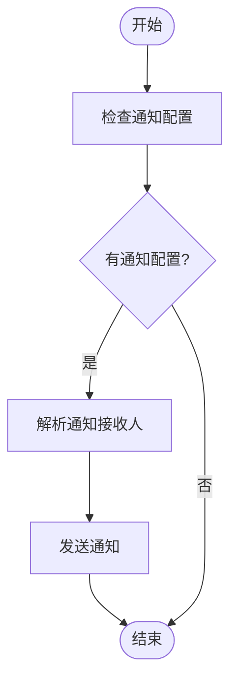
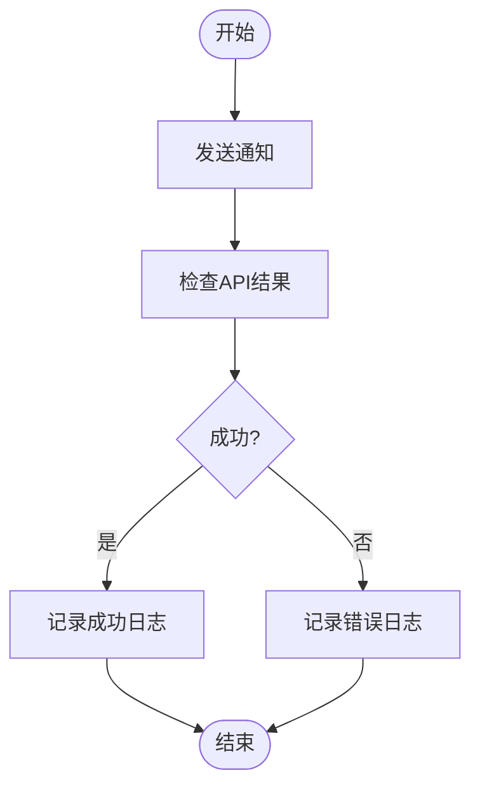

# 通知方式

<cite>
**本文档引用的文件**   
- [send.py](file://bkmonitor/bkmonitor/utils/send.py#L1-L715)
- [notice.json](file://bkmonitor/bkmonitor/as_code/json_schema/notice.json#L249-L305)
- [add_shield.md](file://bkmonitor/bkmonitor/docs/api/apidocs/zh_hans/add_shield.md#L22-L38)
- [edit_shield.md](file://bkmonitor/bkmonitor/docs/api/apidocs/zh_hans/edit_shield.md#L22-L38)
- [get_shield.md](file://bkmonitor/bkmonitor/docs/api/apidocs/zh_hans/get_shield.md#L53-L69)
- [save_alarm_strategy_v3.md](file://bkmonitor/bkmonitor/docs/api/apidocs/zh_hans/save_alarm_strategy_v3.md#L34-L61)
- [settings.py](file://bkmonitor/bkmonitor/settings.py#L1-L73)
- [constants.py](file://bkmonitor/bkmonitor/constants/action.py#L199-L245)
- [test_notice_execute.py](file://bkmonitor/alarm_backends/tests/service/fta_action/test_notice_execute.py#L854-L881)
- [shield_obj.py](file://bkmonitor/alarm_backends/service/converge/shield/shield_obj.py#L317-L354)
- [double_check.py](file://bkmonitor/alarm_backends/service/fta_action/double_check.py#L31-L62)
</cite>

## 目录
1. [通知方式概述](#通知方式概述)
2. [通知方式配置参数](#通知方式配置参数)
3. [API调用示例](#api调用示例)
4. [启用/禁用机制](#启用禁用机制)
5. [安全配置要求](#安全配置要求)
6. [送达率监控与故障排查](#送达率监控与故障排查)

## 通知方式概述

系统支持多种通知方式，包括微信、邮件、短信、语音、Webhook等，用于在告警触发、恢复或执行动作时及时通知相关人员。这些通知方式通过统一的发送器实现，支持灵活的配置和扩展。

**Section sources**
- [send.py](file://bkmonitor/bkmonitor/utils/send.py#L1-L715)

## 通知方式配置参数

### 微信通知
- **参数**: `weixin`
- **使用场景**: 实时推送告警信息到企业微信，适合需要快速响应的场景
- **配置**: 通过`send_weixin`方法实现，支持企业微信应用和机器人通知

### 邮件通知
- **参数**: `mail`
- **使用场景**: 发送详细的告警报告和附件，适合需要存档和详细分析的场景
- **配置**: 通过`send_mail`方法实现，支持HTML内容和附件

### 短信通知
- **参数**: `sms`
- **使用场景**: 在网络不稳定或需要确保接收的情况下，通过短信通知关键人员
- **配置**: 通过`send_sms`方法实现，内容限制为140字符

### 语音通知
- **参数**: `voice`
- **使用场景**: 紧急告警时通过电话直接通知，确保信息被立即接收
- **配置**: 通过`send_voice`方法实现，支持自动语音播报

### Webhook通知
- **参数**: `webhook`
- **使用场景**: 集成第三方系统，如Slack、钉钉等，实现跨平台通知
- **配置**: 通过`ChannelBkchatSender`类实现，支持多种消息类型

**Section sources**
- [add_shield.md](file://bkmonitor/bkmonitor/docs/api/apidocs/zh_hans/add_shield.md#L22-L38)
- [edit_shield.md](file://bkmonitor/bkmonitor/docs/api/apidocs/zh_hans/edit_shield.md#L22-L38)
- [get_shield.md](file://bkmonitor/bkmonitor/docs/api/apidocs/zh_hans/get_shield.md#L53-L69)

## API调用示例

### 发送微信通知
```python
sender = Sender(context=context, title_template_path="weixin_title.jinja", content_template_path="weixin_content.jinja")
result = sender.send("weixin", ["user1", "user2"])
```

### 发送邮件通知
```python
sender = Sender(context=context, title_template_path="mail_title.jinja", content_template_path="mail_content.jinja")
result = sender.send("mail", ["user1@example.com", "user2@example.com"])
```

### 发送短信通知
```python
sender = Sender(context=context, title_template_path="sms_title.jinja", content_template_path="sms_content.jinja")
result = sender.send("sms", ["user1", "user2"])
```

### 发送语音通知
```python
sender = Sender(context=context, title_template_path="voice_title.jinja", content_template_path="voice_content.jinja")
result = sender.send("voice", ["user1", "user2"])
```

**Section sources**
- [send.py](file://bkmonitor/bkmonitor/utils/send.py#L359-L396)
- [test_notice_execute.py](file://bkmonitor/alarm_backends/tests/service/fta_action/test_notice_execute.py#L854-L881)

## 启用/禁用机制

通知方式的启用和禁用通过配置文件中的`notice_way`字段控制。在策略配置中，可以指定特定时间段内的通知方式。例如，在`save_alarm_strategy_v3.md`中，`notice_way`字段可以设置为`["weixin", "mail", "sms", "voice"]`来启用多种通知方式。



**Diagram sources**
- [save_alarm_strategy_v3.md](file://bkmonitor/bkmonitor/docs/api/apidocs/zh_hans/save_alarm_strategy_v3.md#L34-L61)
- [shield_obj.py](file://bkmonitor/alarm_backends/service/converge/shield/shield_obj.py#L317-L354)

**Section sources**
- [save_alarm_strategy_v3.md](file://bkmonitor/bkmonitor/docs/api/apidocs/zh_hans/save_alarm_strategy_v3.md#L34-L61)
- [shield_obj.py](file://bkmonitor/alarm_backends/service/converge/shield/shield_obj.py#L317-L354)

## 安全配置要求

### SMTP服务器设置
- **配置文件**: `settings.py`
- **参数**: `EMAIL_HOST`, `EMAIL_PORT`, `EMAIL_HOST_USER`, `EMAIL_HOST_PASSWORD`
- **说明**: 配置SMTP服务器地址、端口、用户名和密码，用于发送邮件通知

### 短信网关认证
- **配置文件**: `settings.py`
- **参数**: `SMS_GATEWAY_URL`, `SMS_API_KEY`, `SMS_SECRET_KEY`
- **说明**: 配置短信网关的URL和API密钥，用于发送短信通知

### 企业微信机器人
- **配置文件**: `settings.py`
- **参数**: `WXWORK_BOT_WEBHOOK_URL`
- **说明**: 配置企业微信机器人的Webhook URL，用于发送群消息

**Section sources**
- [settings.py](file://bkmonitor/bkmonitor/settings.py#L1-L73)

## 送达率监控与故障排查

### 送达率监控
- **指标**: 通过`metrics.ACTION_NOTICE_API_CALL_COUNT`记录每种通知方式的成功和失败次数
- **配置**: 在`send.py`中，每次发送通知后会根据结果更新指标

### 故障排查
- **日志**: 查看`send.py`中的日志输出，特别是`logger.info`和`logger.exception`记录的信息
- **API结果**: 检查API返回的`result`和`message`字段，确定通知是否成功发送
- **网络连接**: 确认SMTP服务器、短信网关和Webhook URL的网络连接正常



**Diagram sources**
- [send.py](file://bkmonitor/bkmonitor/utils/send.py#L1-L715)
- [constants.py](file://bkmonitor/bkmonitor/constants/action.py#L199-L245)

**Section sources**
- [send.py](file://bkmonitor/bkmonitor/utils/send.py#L1-L715)
- [constants.py](file://bkmonitor/bkmonitor/constants/action.py#L199-L245)