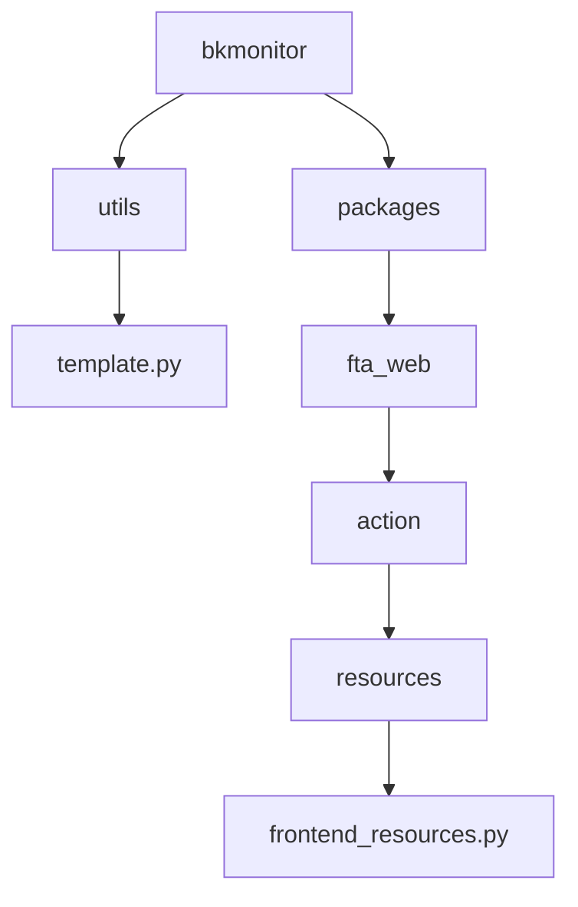
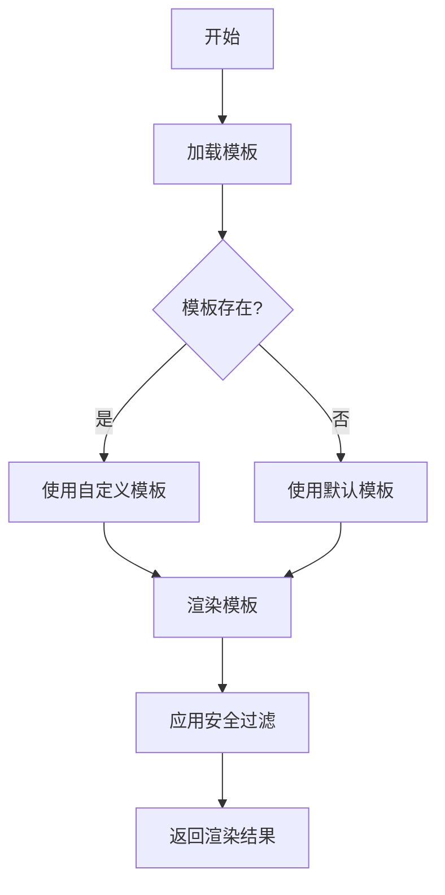
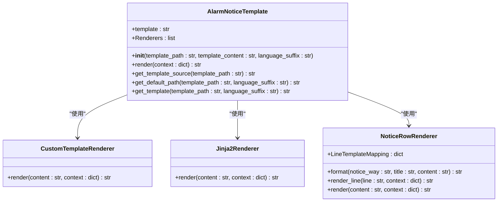
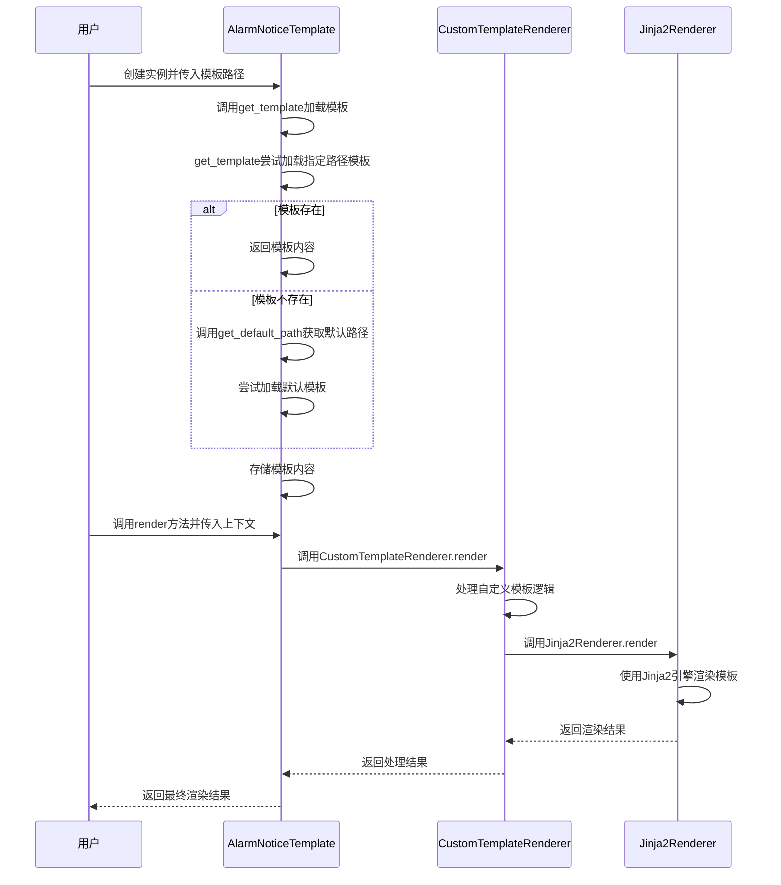
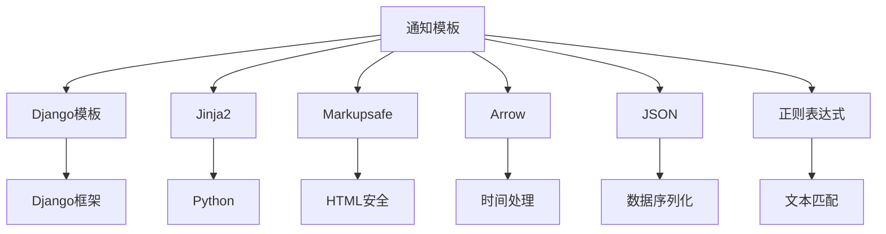

# 通知模板

<cite>
**本文档引用的文件**   
- [template.py](file://bkmonitor/bkmonitor/utils/template.py)
- [frontend_resources.py](file://bkmonitor/packages/fta_web/action/resources/frontend_resources.py)
- [template_handler.py](file://bkmonitor/bkm_ipchooser/handlers/template_handler.py)
- [template_sers.py](file://bkmonitor/bkm_ipchooser/serializers/template_sers.py)
</cite>

## 目录
1. [介绍](#介绍)
2. [项目结构](#项目结构)
3. [核心组件](#核心组件)
4. [架构概述](#架构概述)
5. [详细组件分析](#详细组件分析)
6. [依赖分析](#依赖分析)
7. [性能考虑](#性能考虑)
8. [故障排除指南](#故障排除指南)
9. [结论](#结论)

## 介绍
本文档详细说明了蓝鲸监控平台中通知模板的创建和管理机制。通知模板是告警系统的重要组成部分，用于在告警触发、恢复、处理等场景下向相关人员发送通知。文档涵盖了模板语法、变量使用、多语言支持、继承和覆盖机制、安全过滤、版本管理等方面的内容，并提供了常用的通知模板示例。

## 项目结构
通知模板功能主要分布在`bkmonitor`模块的`utils`和`packages`子目录中。核心的模板处理逻辑位于`bkmonitor/utils/template.py`文件中，而与模板相关的API接口和业务逻辑则分布在`packages/fta_web`等子模块中。



**图源**
- [template.py](file://bkmonitor/bkmonitor/utils/template.py)
- [frontend_resources.py](file://bkmonitor/packages/fta_web/action/resources/frontend_resources.py)

**节源**
- [template.py](file://bkmonitor/bkmonitor/utils/template.py)
- [frontend_resources.py](file://bkmonitor/packages/fta_web/action/resources/frontend_resources.py)

## 核心组件
通知模板的核心组件是`AlarmNoticeTemplate`类，它负责模板的加载、渲染和管理。该类使用Jinja2作为模板引擎，并支持自定义渲染器来处理特定的通知方式。

**节源**
- [template.py](file://bkmonitor/bkmonitor/utils/template.py#L191-L278)

## 架构概述
通知模板的架构基于Jinja2模板引擎，通过多层渲染器实现灵活的模板处理。系统首先尝试加载用户自定义模板，如果加载失败，则回退到默认模板。模板渲染过程中，上下文变量被注入到模板中，实现动态内容生成。



**图源**
- [template.py](file://bkmonitor/bkmonitor/utils/template.py)

## 详细组件分析

### AlarmNoticeTemplate类分析
`AlarmNoticeTemplate`类是通知模板的核心实现，它提供了模板加载、渲染和管理的功能。

#### 类图


**图源**
- [template.py](file://bkmonitor/bkmonitor/utils/template.py#L191-L278)

#### 渲染流程


**图源**
- [template.py](file://bkmonitor/bkmonitor/utils/template.py)

**节源**
- [template.py](file://bkmonitor/bkmonitor/utils/template.py)

### 模板语法和变量
通知模板使用Jinja2语法，支持变量替换、条件判断、循环等高级功能。模板中可以使用的变量包括告警信息、策略配置、时间戳等。

#### 模板语法示例
```jinja2
告警名称: {{ alarm.name }}
告警级别: {{ alarm.severity }}
触发时间: {{ alarm.begin_time }}
当前值: {{ alarm.current_value }}
```

#### 上下文变量
模板渲染时，以下变量会被注入到上下文中：
- `alarm`: 告警对象，包含告警的详细信息
- `strategy`: 策略对象，包含策略的配置信息
- `action`: 动作对象，包含处理动作的信息
- `notice_way`: 通知方式，如邮件、微信等
- `json`: JSON处理函数
- `re`: 正则表达式函数
- `arrow`: 时间处理函数

**节源**
- [template.py](file://bkmonitor/bkmonitor/utils/template.py#L166-L188)

### 多语言支持
系统通过`language_suffix`参数支持多语言模板。当加载模板时，系统会首先尝试加载带有语言后缀的模板文件，如果不存在，则回退到通用模板。

```python
def get_template(cls, template_path, language_suffix=None):
    """
    查找模板
    :param template_path: 模板路径
    :param language_suffix: 语言后缀
    """
    if not template_path:
        return ""

    try:
        return cls.get_template_source(template_path)
    except TemplateDoesNotExist:
        logger.info(f"use empty template because {template_path} not exists")
    except Exception as e:
        logger.info(f"use default template because {template_path} load fail, {e}")
    template_path = cls.get_default_path(template_path, language_suffix)
```

**节源**
- [template.py](file://bkmonitor/bkmonitor/utils/template.py#L255-L278)

### 模板继承和覆盖机制
系统通过`get_default_path`方法实现了模板的继承和覆盖机制。当用户自定义模板不存在时，系统会自动查找并使用默认模板。

```python
@staticmethod
def get_default_path(template_path, language_suffix=None):
    """
    获取默认模板路径
    :param template_path: 模板路径
    :param language_suffix: 语言后缀
    """
    if language_suffix:
        # 如果有有语言后缀的情况下，在获取默认的模版时候，需要忽略
        template_path = template_path.replace(language_suffix, "")
    dir_path, filename = path.split(template_path)
    name, ext = path.splitext(filename)
    names = name.split("_")
    name = f"default_{names[-1]}{ext}"
    return path.join(dir_path, name)
```

**节源**
- [template.py](file://bkmonitor/bkmonitor/utils/template.py#L235-L254)

### 模板安全过滤
为了防止XSS等安全风险，系统对模板变量进行了安全过滤。特别是对于Markdown格式的通知，系统会转义特殊字符。

```python
def escape_markdown(value):
    """
    markdown字符转义
    """
    if isinstance(value, Markup):
        return value

    if isinstance(value, str):
        if not value or re.match(r"^\*\*.*\*\*", value):
            return value

        value = value.replace("\\", r"\\")
        value = value.replace("*", r"\*")
        value = value.replace("`", r"\`")
        value = value.replace(" _", r" \_")

    return Markup(value)
```

**节源**
- [template.py](file://bkmonitor/bkmonitor/utils/template.py#L358-L374)

## 依赖分析
通知模板功能依赖于多个外部库和内部模块，包括Django模板系统、Jinja2模板引擎、Markupsafe等。



**图源**
- [template.py](file://bkmonitor/bkmonitor/utils/template.py)

**节源**
- [template.py](file://bkmonitor/bkmonitor/utils/template.py)

## 性能考虑
通知模板的性能主要受模板渲染速度和上下文变量复杂度的影响。建议在模板中避免复杂的计算和循环，以提高渲染效率。

## 故障排除指南
当通知模板出现问题时，可以按照以下步骤进行排查：
1. 检查模板路径是否正确
2. 验证模板语法是否符合Jinja2规范
3. 检查上下文变量是否正确注入
4. 查看日志中的错误信息

**节源**
- [template.py](file://bkmonitor/bkmonitor/utils/template.py)

## 结论
通知模板是蓝鲸监控平台的重要功能，它通过灵活的模板机制实现了告警通知的定制化。系统采用了Jinja2作为模板引擎，支持多语言、安全过滤、继承覆盖等高级特性，为用户提供了强大的通知定制能力。