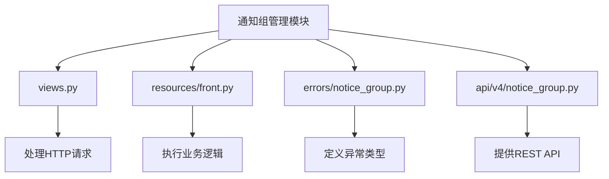
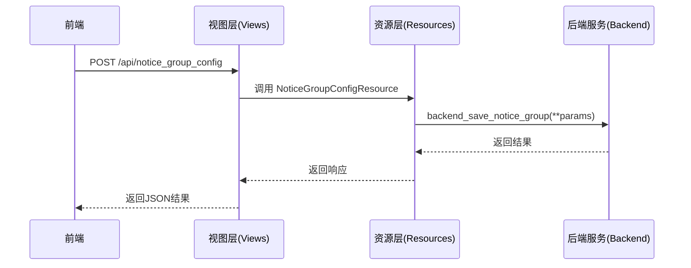
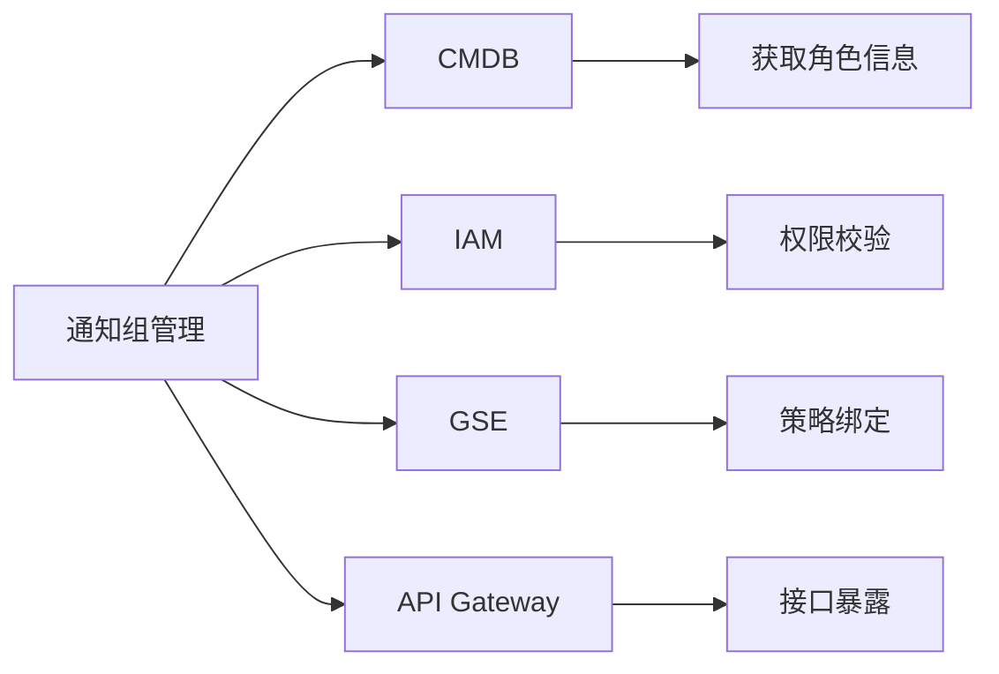

# 通知组管理

<cite>
**本文档引用的文件**  
- [notice_group.py](file://bkmonitor/packages/monitor_web/notice_group/views.py)
- [front.py](file://bkmonitor/packages/monitor_web/notice_group/resources/front.py)
- [gse_loader.py](file://bkmonitor/packages/monitor_web/strategies/loader/gse_loader.py)
- [notice_group.py](file://bkmonitor/core/errors/notice_group.py)
- [v4\notice_group.py](file://bkmonitor/kernel_api/views/v4/notice_group.py)
</cite>

## 目录
1. [简介](#简介)
2. [项目结构](#项目结构)
3. [核心组件](#核心组件)
4. [架构概述](#架构概述)
5. [详细组件分析](#详细组件分析)
6. [依赖分析](#依赖分析)
7. [性能考虑](#性能考虑)
8. [故障排除指南](#故障排除指南)
9. [结论](#结论)

## 简介
本文档详细说明了通知组管理系统的功能与实现机制，涵盖通知组的创建、编辑、删除、成员管理、权限控制及复用策略。通知组是告警系统中用于指定告警接收人员或角色的核心配置单元，支持手动添加、动态查询CMDB、跨系统同步等多种成员添加方式。同时，系统通过权限控制确保敏感告警仅被授权人员接收，并提供使用统计与维护建议。

## 项目结构
通知组管理功能主要分布在 `bkmonitor` 项目的 `packages/monitor_web/notice_group` 模块中，包含视图、资源接口和后端逻辑处理。相关错误定义位于 `core/errors/notice_group.py`，API接口由 `kernel_api/views/v4/notice_group.py` 提供。



**图示来源**  
- [views.py](file://bkmonitor/packages/monitor_web/notice_group/views.py)
- [front.py](file://bkmonitor/packages/monitor_web/notice_group/resources/front.py)

## 核心组件

通知组管理的核心功能包括：
- **创建与修改**：通过 `notice_group_config` 接口实现
- **删除**：通过 `delete_notice_group` 接口实现，需确保无关联策略
- **列表与详情查询**：支持分页获取通知组列表及详细信息
- **接收人与通知方式管理**：支持用户、角色、Webhook等多种通知目标

**组件来源**  
- [views.py](file://bkmonitor/packages/monitor_web/notice_group/views.py#L28-L43)
- [front.py](file://bkmonitor/packages/monitor_web/notice_group/resources/front.py#L131-L159)

## 架构概述

通知组管理采用前后端分离架构，前端通过API调用后端资源接口，后端通过资源层封装业务逻辑，最终调用核心服务完成数据持久化。



**图示来源**  
- [views.py](file://bkmonitor/packages/monitor_web/notice_group/views.py)
- [front.py](file://bkmonitor/packages/monitor_web/notice_group/resources/front.py)

## 详细组件分析

### 创建与修改通知组

通过 `NoticeGroupConfigResource` 实现通知组的创建与修改，接收参数包括名称、业务ID、通知接收人、通知方式等。

```python
class NoticeGroupConfigResource(Resource):
    def perform_request(self, params):
        return resource.notice_group.backend_save_notice_group(**params)
```

支持的通知接收人类型包括：
- **用户**：指定具体用户名
- **角色**：如“主负责人”、“备负责人”、“运维人员”等
- **用户组**：通过CMDB或IAM系统定义的组织结构

**组件来源**  
- [front.py](file://bkmonitor/packages/monitor_web/notice_group/resources/front.py#L214-L252)

### 删除通知组

删除操作需验证通知组是否已被策略引用，若存在关联策略则不允许删除。

```python
class DeleteNoticeGroupResource(Resource):
    def perform_request(self, params):
        return resource.notice_group.backend_delete_notice_group(ids=params["id_list"])
```

前端通过 `delete_allowed` 字段判断是否可删除：
```json
{
  "id": 1001,
  "name": "数据库告警组",
  "delete_allowed": false,
  "related_strategy": 3
}
```

**组件来源**  
- [front.py](file://bkmonitor/packages/monitor_web/notice_group/resources/front.py#L214-L252)

### 通知组成员动态加载

在策略生成过程中，系统可自动加载预设通知组。例如，在进程托管类策略中，根据配置类型选择使用“主备负责人”或“插件管理员组”。

```python
def get_notice_group(self, config_type):
    if config_type == "user":
        return [self.bk_biz_id]  # 使用主备负责人
    else:
        return [get_or_create_plugin_manager_group(self.bk_biz_id)]
```

**组件来源**  
- [gse_loader.py](file://bkmonitor/packages/monitor_web/strategies/loader/gse_loader.py#L58-L87)

### 权限控制

通知组操作受权限系统控制，仅具有 `MANAGE_NOTIFY_TEAM` 权限的用户可进行管理操作。

```python
def get_permissions(self):
    return [BusinessActionPermission([ActionEnum.MANAGE_NOTIFY_TEAM])]
```

敏感告警的通知组可通过权限隔离，确保只有授权人员接收。

**组件来源**  
- [views.py](file://bkmonitor/packages/monitor_web/notice_group/views.py#L28-L43)

## 依赖分析

通知组管理模块依赖以下核心系统：
- **CMDB**：用于获取组织架构、角色信息
- **IAM**：用于权限校验与用户组管理
- **GSE**：用于进程类告警的通知组绑定
- **API Gateway**：对外暴露REST接口



**图示来源**  
- [views.py](file://bkmonitor/packages/monitor_web/notice_group/views.py)
- [front.py](file://bkmonitor/packages/monitor_web/notice_group/resources/front.py)

## 性能考虑

- **缓存机制**：通知组信息在策略加载时进行缓存，减少重复查询
- **批量操作**：支持批量删除通知组，提升管理效率
- **异步处理**：Webhook通知采用异步发送，避免阻塞主流程

## 故障排除指南

| 问题 | 可能原因 | 解决方案 |
|------|----------|----------|
| 无法删除通知组 | 该通知组被策略引用 | 先解除策略关联或删除相关策略 |
| 通知接收人显示异常 | 用户或角色不存在或权限不足 | 检查CMDB数据同步状态及IAM权限 |
| Webhook通知失败 | URL不可达或格式错误 | 验证Webhook地址可达性及JSON格式 |

**组件来源**  
- [errors/notice_group.py](file://bkmonitor/core/errors/notice_group.py)
- [front.py](file://bkmonitor/packages/monitor_web/notice_group/resources/front.py)

## 结论

通知组管理系统提供了灵活、安全的告警通知机制，支持多种成员添加方式和权限控制策略。通过合理的层级设计和复用机制，可在不同业务场景下高效管理告警接收人。建议定期审查通知组使用情况，清理无用组，确保告警系统的准确性和可靠性。