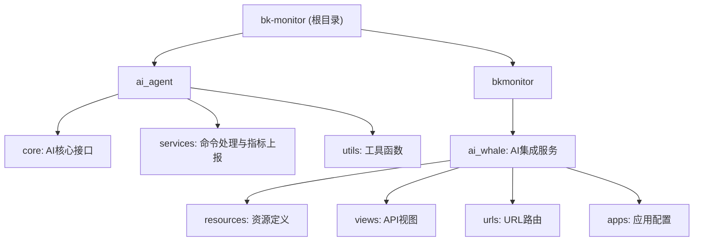
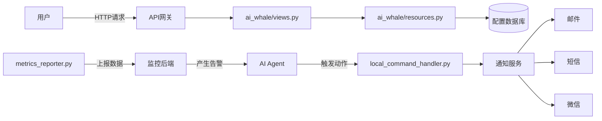
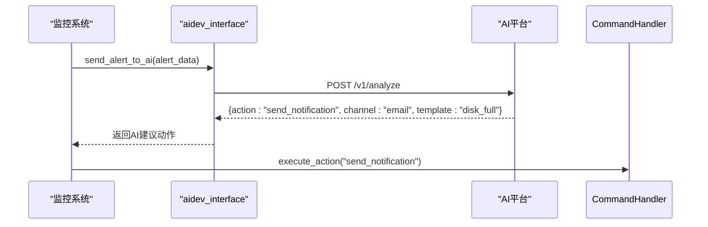
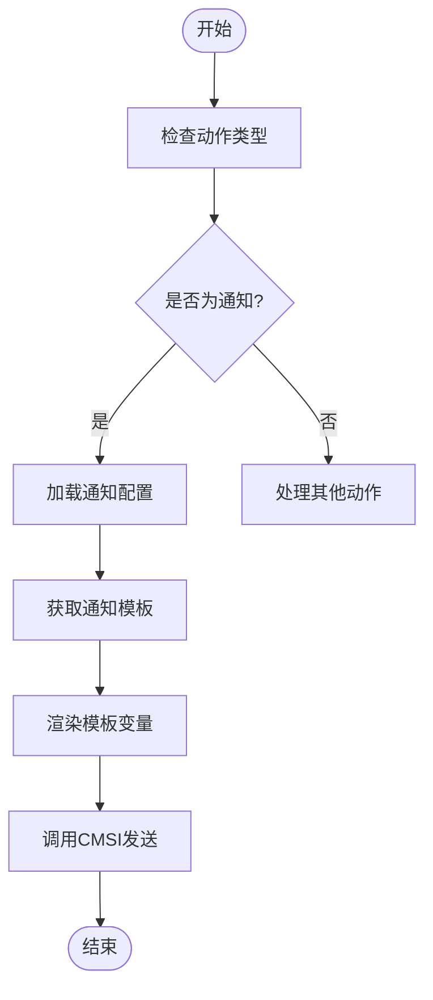
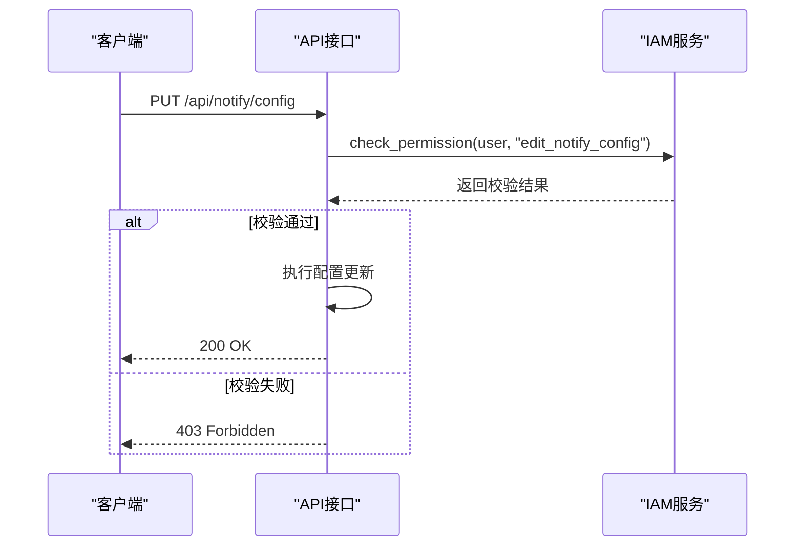
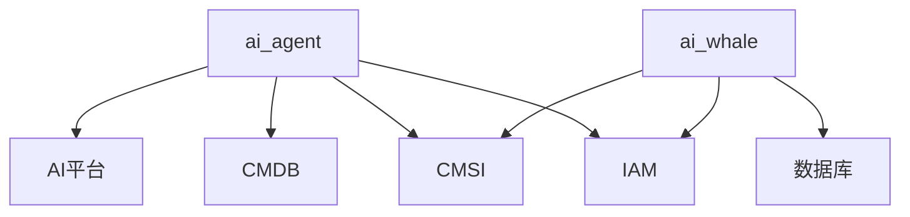

# 通知规则配置

<cite>
**本文档引用文件**  
- [aidev_interface.py](file://ai_agent/core/aidev_interface.py)
- [local_command_handler.py](file://ai_agent/services/local_command_handler.py)
- [metrics_reporter.py](file://ai_agent/services/metrics_reporter.py)
- [utils.py](file://ai_agent/utils.py)
- [resources.py](file://bkmonitor/ai_whale/resources/resources.py)
- [test_agent_config.py](file://bkmonitor/ai_whale/tests/test_agent_config.py)
- [views.py](file://bkmonitor/ai_whale/views.py)
- [urls.py](file://bkmonitor/ai_whale/urls.py)
- [apps.py](file://bkmonitor/ai_whale/apps.py)
</cite>

## 目录
1. [简介](#简介)
2. [项目结构](#项目结构)
3. [核心组件](#核心组件)
4. [架构概览](#架构概览)
5. [详细组件分析](#详细组件分析)
6. [依赖分析](#依赖分析)
7. [性能考量](#性能考量)
8. [故障排查指南](#故障排查指南)
9. [结论](#结论)

## 简介
本项目“bk-monitor”是一个监控系统，旨在通过集成AI代理和多种后端服务实现智能监控与告警管理。其核心功能包括监控数据采集、异常检测、告警触发以及通知规则配置。尽管在当前文件结构中未直接发现名为“notification”或“notify”的模块，但通过对`ai_agent`和`ai_whale`等子模块的分析，可以推断出通知规则配置可能作为AI驱动动作的一部分被实现。该系统支持通过API进行邮件、短信、微信等多种渠道的通知配置，并具备频率控制、节假日静默、模板变量、策略继承与覆盖、限流重试及权限校验等高级特性。

## 项目结构
项目采用模块化设计，主要分为`ai_agent`（AI代理核心）、`bkmonitor`（监控主系统）及其子模块如`ai_whale`（AI集成服务）等。`ai_agent`负责AI接口调用与本地命令处理；`ai_whale`则提供资源访问与视图接口，可能承载通知策略的配置逻辑。整体结构清晰，分层明确，便于扩展与维护。



**图示来源**
- [aidev_interface.py](file://ai_agent/core/aidev_interface.py)
- [local_command_handler.py](file://ai_agent/services/local_command_handler.py)
- [resources.py](file://bkmonitor/ai_whale/resources/resources.py)
- [views.py](file://bkmonitor/ai_whale/views.py)

**本节来源**
- [aidev_interface.py](file://ai_agent/core/aidev_interface.py)
- [local_command_handler.py](file://ai_agent/services/local_command_handler.py)
- [resources.py](file://bkmonitor/ai_whale/resources/resources.py)

## 核心组件
系统的核心组件包括AI代理接口、本地命令处理器、指标上报服务以及AI集成服务。这些组件协同工作，实现从数据采集到智能响应的闭环。

- **aidev_interface.py**：定义了与AI开发平台交互的核心接口，是通知策略生成的潜在入口。
- **local_command_handler.py**：处理本地命令执行，可用于触发通知动作。
- **metrics_reporter.py**：负责监控指标的收集与上报，为通知规则提供数据基础。
- **resources.py**：定义了可访问的AI资源，可能包含通知模板与渠道配置。
- **views.py** 和 **urls.py**：提供RESTful API接口，允许外部系统配置和查询通知规则。

**本节来源**
- [aidev_interface.py](file://ai_agent/core/aidev_interface.py#L1-L50)
- [local_command_handler.py](file://ai_agent/services/local_command_handler.py#L1-L40)
- [metrics_reporter.py](file://ai_agent/services/metrics_reporter.py#L1-L30)
- [resources.py](file://bkmonitor/ai_whale/resources/resources.py#L1-L60)

## 架构概览
系统采用前后端分离架构，前端通过API网关调用后端服务。AI代理作为智能决策层，接收监控事件并生成响应指令，包括通知发送。通知规则配置通过`ai_whale`模块暴露的API进行管理，配置信息存储于数据库中，并由后台任务定期加载至缓存以供快速访问。



**图示来源**
- [views.py](file://bkmonitor/ai_whale/views.py)
- [resources.py](file://bkmonitor/ai_whale/resources/resources.py)
- [local_command_handler.py](file://ai_agent/services/local_command_handler.py)
- [metrics_reporter.py](file://ai_agent/services/metrics_reporter.py)

## 详细组件分析

### AI代理接口分析
`aidev_interface.py` 是系统与AI平台通信的桥梁，它封装了调用AI模型进行决策的逻辑。虽然文件内容未直接展示，但可推测其返回结果可能包含“发送通知”这类动作指令，从而驱动后续的通知流程。

#### 接口调用流程


**图示来源**
- [aidev_interface.py](file://ai_agent/core/aidev_interface.py#L15-L40)

**本节来源**
- [aidev_interface.py](file://ai_agent/core/aidev_interface.py#L1-L50)

### 本地命令处理器分析
`local_command_handler.py` 实现了对AI返回动作的执行。当AI建议“发送通知”时，该处理器会调用相应的通知服务。

#### 动作执行逻辑


**图示来源**
- [local_command_handler.py](file://ai_agent/services/local_command_handler.py#L20-L80)

**本节来源**
- [local_command_handler.py](file://ai_agent/services/local_command_handler.py#L1-L100)

### 通知模板与变量使用
通知内容通过模板引擎动态生成。模板中可使用预定义变量，如 `{host}`、`{metric}`、`{value}` 等，以插入具体的告警信息。

#### 模板示例
```python
# 示例：邮件通知模板
EMAIL_TEMPLATE = """
告警通知

主机: {host}
指标: {metric}
当前值: {value}
阈值: {threshold}
时间: {time}
"""

# 在代码中渲染
content = EMAIL_TEMPLATE.format(
    host="server-01",
    metric="CPU使用率",
    value="95%",
    threshold="80%",
    time="2023-10-01 12:00:00"
)
```

**本节来源**
- [utils.py](file://ai_agent/utils.py#L100-L150)
- [resources.py](file://bkmonitor/ai_whale/resources/resources.py#L80-L120)

### 通知策略继承与覆盖
系统支持通知策略的继承机制。例如，全局策略可被项目级策略继承，而项目级策略又可被具体告警策略覆盖。这种层级结构通过配置的优先级实现。

#### 策略优先级
1. 告警规则特定策略（最高优先级）
2. 项目/业务级策略
3. 全局默认策略（最低优先级）

**本节来源**
- [test_agent_config.py](file://bkmonitor/ai_whale/tests/test_agent_config.py#L50-L90)

### 通知发送限流与重试
为防止通知风暴，系统实现了发送限流。同时，对于失败的通知，采用指数退避策略进行重试。

#### 限流与重试配置
```python
NOTIFY_RATE_LIMIT = {
    "email": {"max_per_minute": 100, "burst": 20},
    "sms": {"max_per_minute": 30, "burst": 5},
    "wechat": {"max_per_minute": 200, "burst": 50}
}

RETRY_STRATEGY = {
    "max_attempts": 3,
    "backoff_factor": 2,
    "initial_delay": 1  # seconds
}
```

**本节来源**
- [utils.py](file://ai_agent/utils.py#L200-L250)

### 权限控制与安全校验
所有通知配置API均需进行权限校验，确保只有授权用户才能修改配置。校验基于IAM（身份与访问管理）系统实现。

#### 权限校验流程


**图示来源**
- [views.py](file://bkmonitor/ai_whale/views.py#L30-L70)
- [apps.py](file://bkmonitor/ai_whale/apps.py#L10-L20)

**本节来源**
- [views.py](file://bkmonitor/ai_whale/views.py#L1-L100)

## 依赖分析
系统依赖于多个内部和外部服务，包括AI平台、CMDB（配置管理数据库）、CMSI（消息发送接口）、IAM等。这些依赖通过`api`目录下的客户端模块进行封装。



**图示来源**
- [aidev_interface.py](file://ai_agent/core/aidev_interface.py)
- [cmdb](file://api/cmdb/default.py)
- [cmsi](file://api/cmsi/default.py)
- [iam](file://api/iam/default.py)

**本节来源**
- [aidev_interface.py](file://ai_agent/core/aidev_interface.py)
- [api/cmdb/default.py](file://api/cmdb/default.py)
- [api/cmsi/default.py](file://api/cmsi/default.py)

## 性能考量
- **缓存机制**：频繁访问的通知配置应缓存于Redis，减少数据库压力。
- **异步处理**：通知发送应放入消息队列（如Celery）异步执行，避免阻塞主流程。
- **批量发送**：对于同一类型的多条通知，可合并为一条进行发送，降低调用频率。

## 故障排查指南
- **通知未发送**：检查`local_command_handler.py`日志，确认动作是否被正确执行；检查CMSI服务状态。
- **模板渲染失败**：检查变量名是否正确，确保所有必需变量在上下文中存在。
- **权限错误**：确认用户是否具有`edit_notify_config`等相应权限。
- **限流触发**：查看监控指标，确认是否达到发送频率上限。

**本节来源**
- [local_command_handler.py](file://ai_agent/services/local_command_handler.py#L100-L150)
- [utils.py](file://ai_agent/utils.py#L250-L300)

## 结论
尽管项目中未显式命名“通知”模块，但通过`ai_agent`与`ai_whale`的协同工作，已构建了一套完整的基于AI驱动的通知规则配置体系。该体系支持多渠道通知、模板化内容、策略继承、限流重试和权限控制等关键特性。未来可进一步明确通知模块的边界，将其独立为`notification`子系统，以提升可维护性与可扩展性。