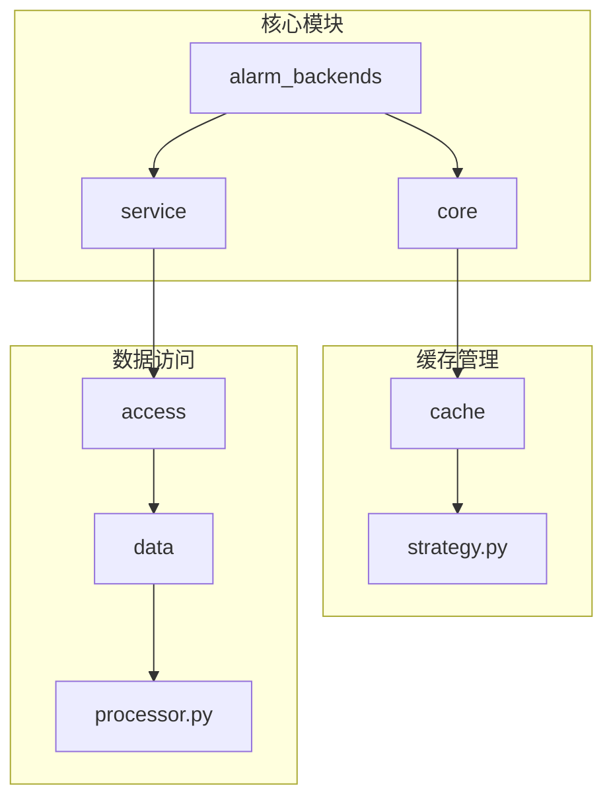
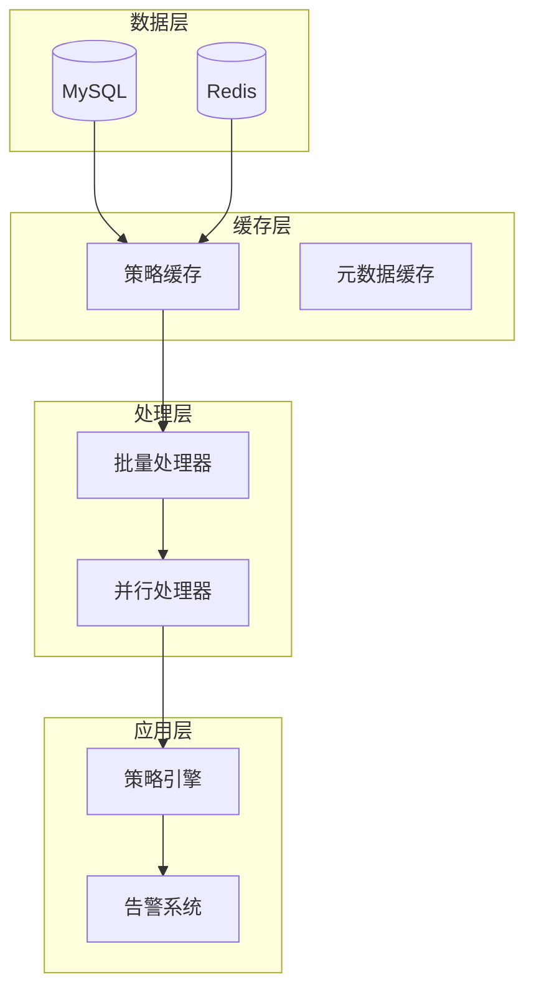
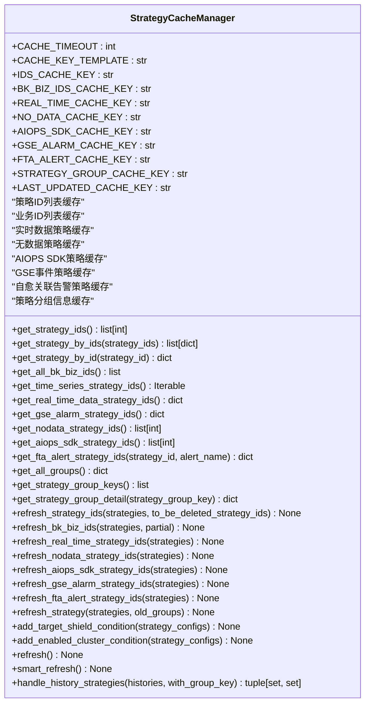
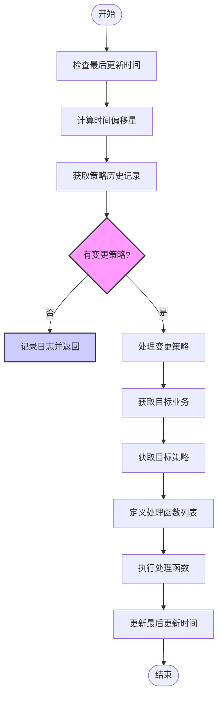
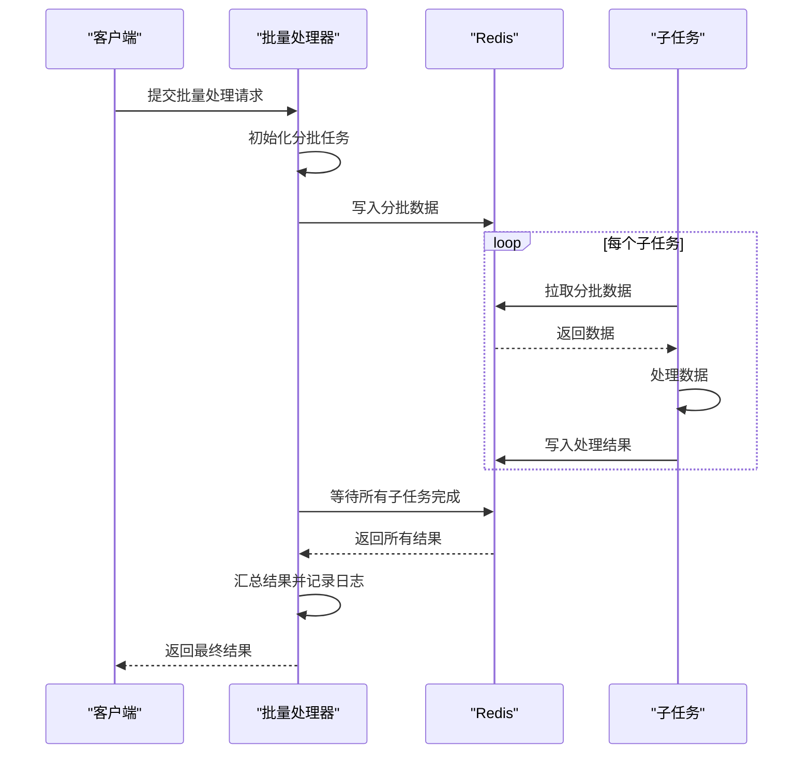
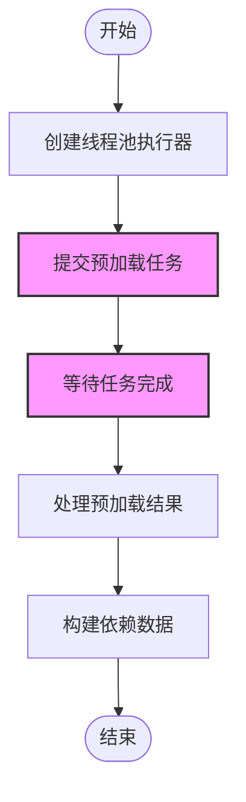

# 性能优化措施

<cite>
**本文档引用的文件**   
- [strategy.py](file://bkmonitor/alarm_backends/core/cache/strategy.py)
- [processor.py](file://bkmonitor/alarm_backends/service/access/data/processor.py)
- [aiops/processor.py](file://bkmonitor/alarm_backends/service/preparation/aiops/processor.py)
- [redis_cluster.py](file://bkmonitor/alarm_backends/core/storage/redis_cluster.py)
</cite>

## 目录
1. [引言](#引言)
2. [项目结构](#项目结构)
3. [核心组件](#核心组件)
4. [架构概述](#架构概述)
5. [详细组件分析](#详细组件分析)
6. [依赖分析](#依赖分析)
7. [性能考虑](#性能考虑)
8. [故障排除指南](#故障排除指南)
9. [结论](#结论)

## 引言
本文档旨在深入探讨蓝鲸监控平台中策略执行性能优化的详细措施。重点介绍提升策略执行效率的各种优化技术，包括缓存机制、批量处理和并行执行等。通过分析核心代码实现，为用户提供性能监控指标和优化建议，帮助识别性能瓶颈并进行调优。

## 项目结构
蓝鲸监控平台的项目结构遵循模块化设计原则，将不同功能划分为独立的模块。核心的性能优化逻辑主要集中在`alarm_backends`模块中，特别是`core/cache`和`service/access/data`子模块。

**图示来源**
- [strategy.py](file://bkmonitor/alarm_backends/core/cache/strategy.py)
- [processor.py](file://bkmonitor/alarm_backends/service/access/data/processor.py)

## 核心组件
本文档的核心组件包括策略缓存管理器、数据访问处理器和并行执行机制。这些组件共同协作，确保策略能够高效地执行。

**组件来源**
- [strategy.py](file://bkmonitor/alarm_backends/core/cache/strategy.py#L1-L200)
- [processor.py](file://bkmonitor/alarm_backends/service/access/data/processor.py#L1-L100)

## 架构概述
蓝鲸监控平台的性能优化架构采用分层设计，从数据缓存到批量处理再到并行执行，形成一个完整的优化链条。

**图示来源**
- [strategy.py](file://bkmonitor/alarm_backends/core/cache/strategy.py#L200-L400)
- [processor.py](file://bkmonitor/alarm_backends/service/access/data/processor.py#L400-L600)

## 详细组件分析

### 策略缓存管理器分析
策略缓存管理器是性能优化的核心组件，负责管理策略相关的各种缓存。

#### 缓存机制实现
策略缓存管理器实现了多种缓存机制，包括数据缓存、结果缓存和元数据缓存。

**图示来源**
- [strategy.py](file://bkmonitor/alarm_backends/core/cache/strategy.py#L400-L600)

#### 缓存更新策略和失效机制
策略缓存管理器采用增量更新和全量更新相结合的策略，确保缓存数据的实时性和一致性。

**图示来源**
- [strategy.py](file://bkmonitor/alarm_backends/core/cache/strategy.py#L1200-L1400)

### 批量处理实现分析
批量处理机制通过将多个策略或指标的执行合并处理，有效减少了系统开销。

#### 批量处理实现方式
批量处理主要通过分批任务处理器实现，将大量数据分成小批次进行处理。

**图示来源**
- [processor.py](file://bkmonitor/alarm_backends/service/access/data/processor.py#L597-L665)

### 并行执行机制分析
并行执行机制通过多线程、多进程等技术，显著提升了策略执行的效率。

#### 并行执行技术应用
并行执行机制在多个场景中得到应用，包括数据预加载和并发收敛处理。

**图示来源**
- [aiops/processor.py](file://bkmonitor/alarm_backends/service/preparation/aiops/processor.py#L182-L217)

## 依赖分析
各组件之间的依赖关系清晰，形成了一个高效的工作流。

```mermaid
graph TD
StrategyCacheManager --> RedisCluster
StrategyCacheManager --> CMDBManager
StrategyCacheManager --> BusinessManager
StrategyCacheManager --> ServiceTemplateManager
StrategyCacheManager --> SetTemplateManager
StrategyCacheManager --> TopoManager
StrategyCacheManager --> AlgorithmModel
StrategyCacheManager --> MetricListCache
StrategyCacheManager --> StrategyHistoryModel
StrategyCacheManager --> StrategyModel
StrategyCacheManager --> Strategy
StrategyCacheManager --> parse_metric_id
StrategyCacheManager --> chunks
StrategyCacheManager --> count_md5
StrategyCacheManager --> is_ipv6_biz
StrategyCacheManager --> is_k8s_target
StrategyCacheManager --> bk_biz_id_to_bk_tenant_id
StrategyCacheManager --> load_unit
```

**图示来源**
- [strategy.py](file://bkmonitor/alarm_backends/core/cache/strategy.py#L1-L200)

## 性能考虑
性能优化是蓝鲸监控平台的核心目标之一，通过多种技术手段确保系统的高效运行。

### 性能监控指标
系统提供了丰富的性能监控指标，帮助用户识别性能瓶颈。

- **缓存任务执行时间**: `ALARM_CACHE_TASK_TIME`
- **数据处理时间**: `ACCESS_DATA_PROCESS_TIME`
- **数据处理计数**: `ACCESS_DATA_PROCESS_COUNT`
- **并发收敛锁错误**: `ConvergeLockError`

### 优化建议
1. **合理设置缓存过期时间**: 根据业务需求调整`CACHE_TIMEOUT`值
2. **优化批量处理阈值**: 调整`batch_threshold`以平衡内存使用和处理效率
3. **控制并发数**: 合理设置`parallel_converge_count`避免系统过载
4. **定期清理历史数据**: 避免`StrategyHistoryModel`表过大影响查询性能

## 故障排除指南
当遇到性能问题时，可以按照以下步骤进行排查：

1. **检查缓存状态**: 确认Redis连接正常，缓存数据完整
2. **查看日志信息**: 检查`[smart_strategy_cache]`相关日志，定位问题源头
3. **监控系统指标**: 观察`ALARM_CACHE_TASK_TIME`等指标，识别性能瓶颈
4. **验证配置参数**: 确认`timeshift`、`batch_threshold`等参数设置合理

**故障排除来源**
- [strategy.py](file://bkmonitor/alarm_backends/core/cache/strategy.py#L1214-L1240)
- [processor.py](file://bkmonitor/alarm_backends/service/access/data/processor.py#L633-L665)

## 结论
蓝鲸监控平台通过精心设计的缓存机制、批量处理和并行执行技术，实现了高效的策略执行性能。这些优化措施不仅提升了系统的响应速度，还降低了资源消耗，为大规模监控场景提供了坚实的基础。建议用户根据实际业务需求，合理配置相关参数，以达到最佳的性能表现。