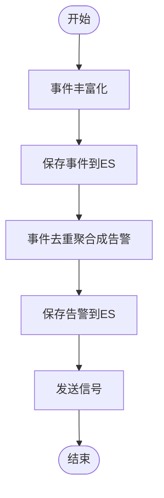
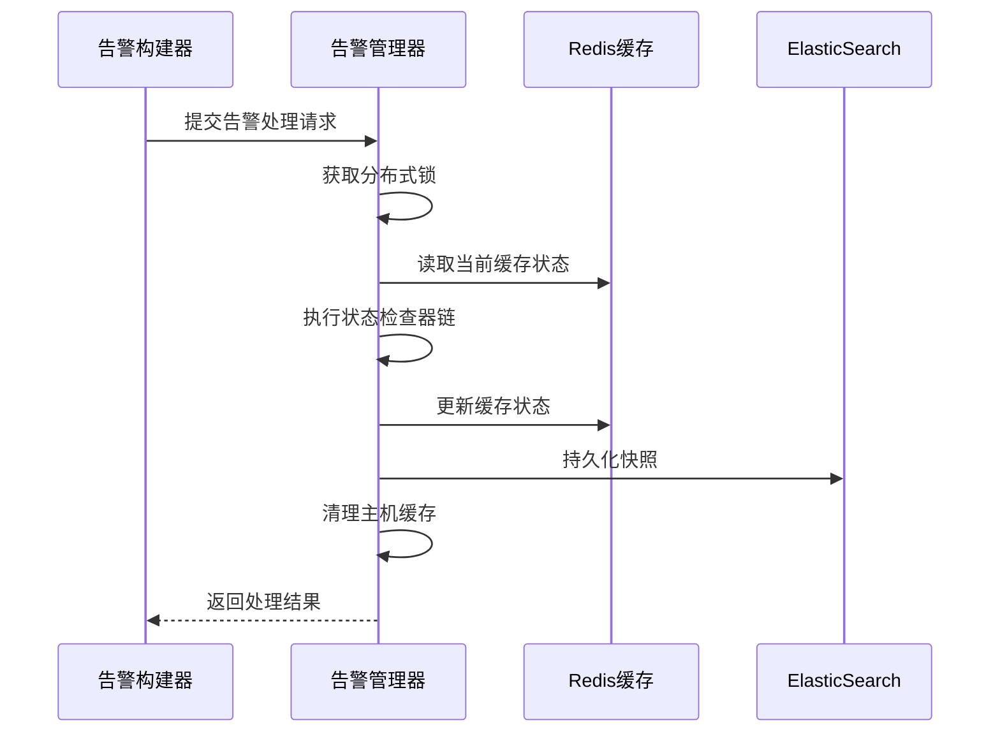
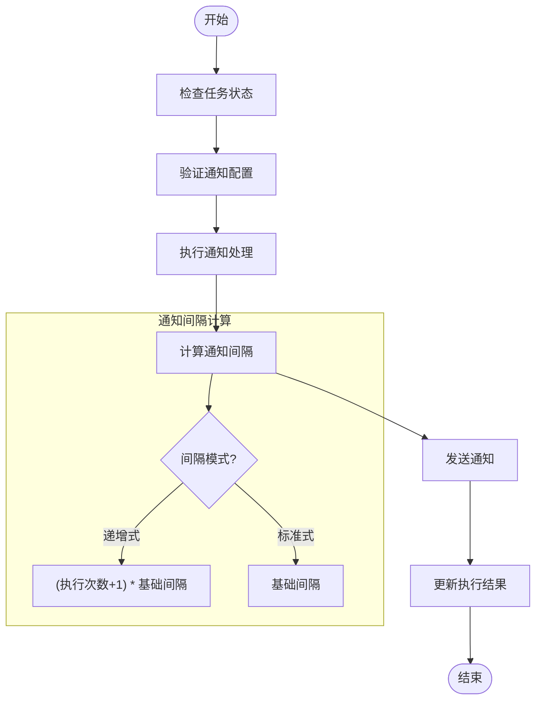

# 执行结果处理

<cite>
**本文档引用文件**   
- [processor.py](file://bkmonitor\alarm_backends\service\alert\manager\processor.py)
- [processor.py](file://bkmonitor\alarm_backends\service\alert\builder\processor.py)
- [processor.py](file://bkmonitor\alarm_backends\service\fta_action\notice\processor.py)
- [key.py](file://bkmonitor\alarm_backends\core\cache\key.py)
- [kafka.py](file://bkmonitor\alarm_backends\core\storage\kafka.py)
- [action.py](file://bkmonitor\alarm_backends\service\alert\manager\checker\action.py)
- [create_action.py](file://bkmonitor\alarm_backends\service\fta_action\tasks\create_action.py)
- [log.py](file://bkmonitor\bkmonitor\documents\log.py)
</cite>

## 目录
1. [引言](#引言)
2. [告警生成机制](#告警生成机制)
3. [状态更新流程](#状态更新流程)
4. [通知发送机制](#通知发送机制)
5. [结果数据存储策略](#结果数据存储策略)
6. [监控指标与故障排查](#监控指标与故障排查)

## 引言
本文档详细阐述了监控系统中执行结果处理的完整流程，重点介绍告警生成、状态更新、通知发送和数据存储等核心环节。通过分析系统架构和关键代码实现，为开发和运维人员提供全面的技术参考，确保告警处理的可靠性和及时性。

## 告警生成机制

告警生成是执行结果处理的第一步，系统通过一系列处理器将原始事件转换为可管理的告警对象。该过程主要由告警构建器（AlertBuilder）负责，包含事件丰富化、去重聚合和告警创建等关键步骤。



**图示来源**
- [processor.py](file://bkmonitor\alarm_backends\service\alert\builder\processor.py#L17-L36)

### 告警条件判断
系统通过事件特征（dedupe_md5）进行去重判断，确保相同事件不会重复生成告警。在`dedupe_events_to_alerts`方法中，系统首先过滤掉已过期或被丢弃的事件，然后对剩余事件进行处理。

```python
def get_unexpired_events(self, events: List[Event]):
    """
    判断关联事件是否已经过期
    """
    current_alerts = self.get_current_alerts(events)
    unexpired_events = []
    for event in events:
        alert: Alert = current_alerts.get(event.dedupe_md5)
        expired_time = alert.end_time - CONST_MINUTES if alert and alert.end_time else None
        if event.is_dropped() or event.is_expired(expired_time):
            continue
        unexpired_events.append(event)
    return unexpired_events
```

### 告警级别确定
告警级别（severity）在策略执行时确定，并作为告警对象的重要属性。系统支持多个级别，通常包括紧急、警告和提醒等。级别信息在创建动作时作为参数传递，影响通知策略和处理优先级。

### 告警内容生成
告警内容生成包含两个主要步骤：事件丰富化和告警文档创建。事件丰富化通过`AlertEnrichFactory`和`EventEnrichFactory`为原始事件添加上下文信息，如主机信息、业务拓扑等。告警文档则通过`to_document`方法将告警对象转换为ElasticSearch可存储的格式。

**本节来源**
- [processor.py](file://bkmonitor\alarm_backends\service\alert\builder\processor.py#L100-L150)

## 状态更新流程

状态更新是告警生命周期管理的核心环节，确保告警状态在数据库和缓存中保持一致。该流程由告警管理器（AlertManager）负责，通过分布式锁机制保证数据一致性。



**图示来源**
- [processor.py](file://bkmonitor\alarm_backends\service\alert\manager\processor.py#L120-L220)

### 缓存更新机制
系统采用增量更新策略，仅处理状态变更或首次出现的告警。通过`update_alert_cache`方法，系统比较当前告警与缓存中的告警，只更新发生变化的部分。

```python
update_count, finished_count = self.update_alert_cache(
    [
        alert
        for alert in alerts
        if alert.dedupe_md5 not in active_alerts_mapping or active_alerts_mapping[alert.dedupe_md5] == alert.id
    ]
)
```

### 数据库持久化
告警状态通过`save_alerts`方法持久化到ElasticSearch。系统使用批量创建（bulk_create）操作提高性能，并采用版本控制机制处理并发更新冲突。

```python
try:
    AlertDocument.bulk_create(update_alerts, action=BulkActionType.UPDATE)
except ConflictError:
    # 版本冲突重试处理
    retry_times += 1
```

### 状态检查器链
系统通过注册的检查器链（INSTALLED_CHECKERS）执行多维度状态验证，包括：
- **NextStatusChecker**: 处理状态转换
- **CloseStatusChecker**: 处理关闭状态
- **RecoverStatusChecker**: 处理恢复状态
- **ShieldStatusChecker**: 处理屏蔽状态
- **AckChecker**: 处理确认状态
- **UpgradeChecker**: 处理升级状态
- **ActionHandleChecker**: 处理动作执行

**本节来源**
- [processor.py](file://bkmonitor\alarm_backends\service\alert\manager\processor.py#L150-L220)

## 通知发送机制

通知发送机制负责将告警信息及时传达给相关人员，支持多种通知方式和复杂的收敛策略。该功能由通知处理器（ActionProcessor）实现，确保通知的可靠性和效率。



**图示来源**
- [processor.py](file://bkmonitor\alarm_backends\service\fta_action\notice\processor.py#L150-L200)

### 通知渠道选择
系统支持多种通知渠道，通过`notice_way`参数指定：
- **VOICE**: 语音通知
- **MAIL**: 邮件通知
- **WECHAT**: 企业微信通知
- **SMS**: 短信通知
- **RTX**: RTX通知

不同渠道通过`Sender`类的不同实例实现，确保通知方式的可扩展性。

### 通知内容模板
通知内容通过Jinja2模板引擎生成，支持动态变量替换。模板路径根据通知信号、类型和方式动态确定：

```python
content_template_path="notice/{signal}/{collect_type}/{notice_way}_content.jinja".format(
    signal=action_signal,
    notice_way=msg_content_type,
    collect_type=collect_type,
)
```

### 通知发送队列
系统使用Redis作为通知发送队列，通过`MESSAGE_QUEUE_DSN`配置队列连接信息。当启用消息队列时，通知任务被推送到Redis队列，由独立的消费者进程处理。

```python
settings.MESSAGE_QUEUE_DSN = f"redis://{settings.REDIS_HOST}:{settings.REDIS_PORT}/0/fta_message_queue"
```

### 汇聚通知处理
系统支持通知汇聚功能，将多个相关告警合并为一条通知。通过`FTA_NOTICE_COLLECT_KEY`缓存键管理汇聚状态，避免重复通知。

```python
collect_params = {
    "notice_way": self.context["collect_ctx"].group_notice_way,
    "action_signal": self.action.signal,
    "alert_id": "_".join(self.action.alerts or []),
}
collect_key = FTA_NOTICE_COLLECT_KEY.get_key(**collect_params)
```

**本节来源**
- [processor.py](file://bkmonitor\alarm_backends\service\fta_action\notice\processor.py#L50-L100)

## 结果数据存储策略

结果数据存储策略确保告警数据的可靠存储和高效访问，采用分层存储架构，结合短期缓存和长期归档。

### 短期存储
短期存储主要依赖Redis缓存，用于快速访问和状态管理。系统定义了多种缓存键类型：

```python
class RedisDataKey:
    """
    Redis键对象管理类，封装键模板、过期策略及存储后端配置
    """
    def __init__(self, key_tpl=None, ttl=None, backend=None, is_global=False, **extra_config):
        self.key_tpl = key_tpl
        self.ttl = ttl
        self.backend = backend
        self.is_global = is_global
```

常用缓存键包括：
- **ALERT_UPDATE_LOCK**: 告警更新锁
- **FTA_NOTICE_COLLECT_KEY**: 通知汇聚键
- **NOTICE_VOICE_COLLECT_KEY**: 语音通知汇聚键
- **ALERT_HOST_DATA_ID_KEY**: 主机数据ID键

### 长期归档
长期归档通过ElasticSearch实现，存储完整的告警文档和操作日志。系统使用`AlertDocument`类映射ES索引，支持全文搜索和复杂查询。

```python
class AlertDocument(BaseDocument):
    """
    告警文档模型，映射到ElasticSearch索引
    """
    meta = {"index": "alert_*"}
```

### 数据压缩
系统通过Kafka进行数据传输，采用批量发送和压缩机制提高传输效率。`KafkaQueue`类实现了消息批量推送功能：

```python
msg_push_batch_size = 1000

def put(self, value, topic=""):
    if not isinstance(value, list):
        value = [value]
    for i in range(0, len(value), self.msg_push_batch_size):
        batch = value[i : i + self.msg_push_batch_size]
        self._put(batch, topic)
```

### 存储后端配置
系统支持多种存储后端，通过配置文件灵活切换：
- **Redis**: 用于缓存和锁管理
- **ElasticSearch**: 用于长期存储和搜索
- **Kafka**: 用于消息队列和数据传输
- **MySQL**: 用于结构化数据存储

**本节来源**
- [key.py](file://bkmonitor\alarm_backends\core\cache\key.py#L50-L100)
- [kafka.py](file://bkmonitor\alarm_backends\core\storage\kafka.py#L50-L100)

## 监控指标与故障排查

### 监控指标
系统通过Prometheus暴露关键监控指标，帮助运维人员了解系统运行状态：

| 指标名称 | 描述 | 标签 |
|---------|------|------|
| ALERT_MANAGE_PUSH_DATA_COUNT | 告警处理量统计 | strategy_id, signal |
| ALERT_PROCESS_LATENCY | 告警处理延迟 | bk_data_id, topic |
| ACTION_CREATE_PROCESS_TIME | 动作创建处理时间 | strategy_id, signal |
| ACTION_CREATE_PROCESS_COUNT | 动作创建过程计数 | status, exception |

```python
for alert in saved_alerts:
    metrics.ALERT_MANAGE_PUSH_DATA_COUNT.labels(strategy_id=metrics.TOTAL_TAG, signal=alert.status).inc()
```

### 故障排查方法
#### 常见问题及解决方案
1. **告警未生成**
   - 检查事件是否过期：`event.is_expired(expired_time)`
   - 验证分布式锁获取：`lock.is_locked(ALERT_UPDATE_LOCK.get_key(dedupe_md5=event.dedupe_md5))`
   - 查看日志：`[event drop] event(%s) strategy(%s) is dropped or expired`

2. **通知未发送**
   - 检查通知配置：`if not self.notify_config`
   - 验证通知方式：`if not self.notice_way`
   - 查看执行状态：`if self.action.status in ActionStatus.END_STATUS`

3. **状态更新失败**
   - 检查版本冲突：`except ConflictError`
   - 验证分布式锁：`if lock.is_locked(ALERT_UPDATE_LOCK.get_key(dedupe_md5=alert.dedupe_md5))`
   - 查看日志：`[alert.manager get lock error] total(%s) is locked`

#### 日志分析
系统记录详细的处理日志，关键日志点包括：
- 告警缓存更新：`[alert.manager update alert cache]: updated(%s), finished(%s)`
- 告警快照更新：`[alert.manager update alert snapshot]: %s`
- 动作创建：`[create actions(begin)](%s) for alert(%s)`
- 通知发送：`--begin notice_action action {}({})`

#### 性能优化建议
1. **批量处理**：尽量使用批量操作（bulk_create）减少数据库交互次数
2. **缓存利用**：合理使用Redis缓存，避免重复计算
3. **异步处理**：将耗时操作（如通知发送）放入异步队列
4. **索引优化**：为常用查询字段创建ElasticSearch索引

**本节来源**
- [processor.py](file://bkmonitor\alarm_backends\service\alert\manager\processor.py#L180-L220)
- [create_action.py](file://bkmonitor\alarm_backends\service\fta_action\tasks\create_action.py#L1000-L1036)
- [log.py](file://bkmonitor\bkmonitor\documents\log.py#L70-L85)