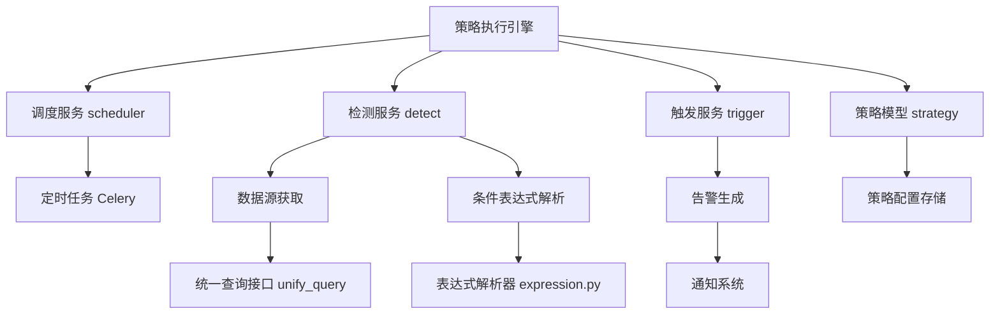
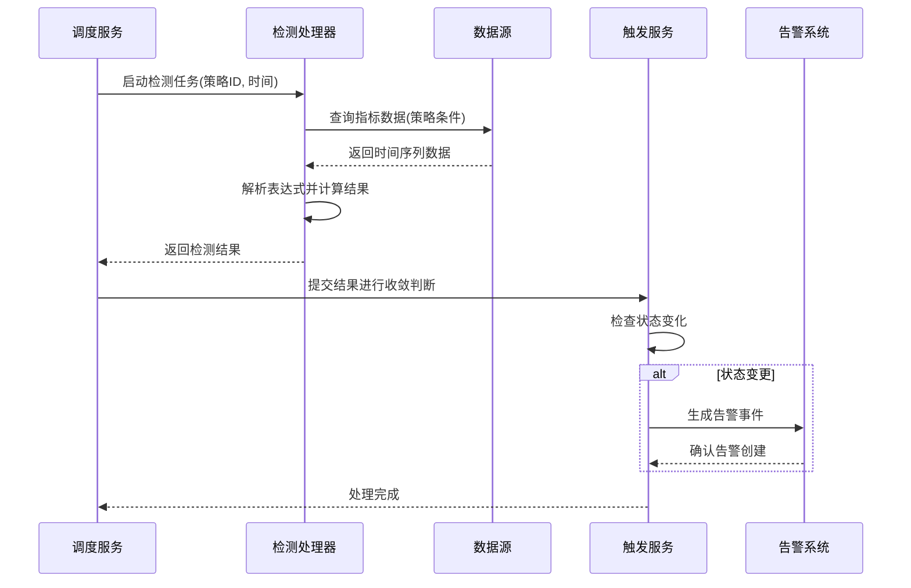
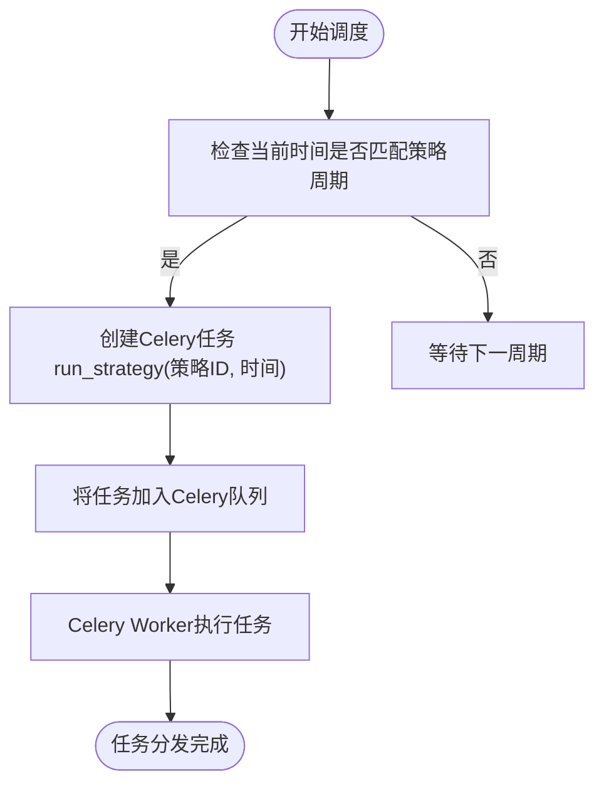
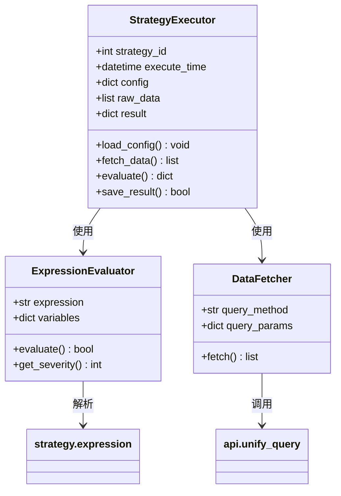
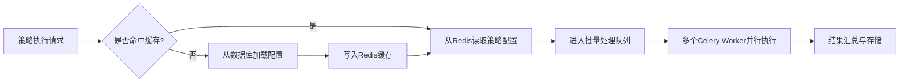
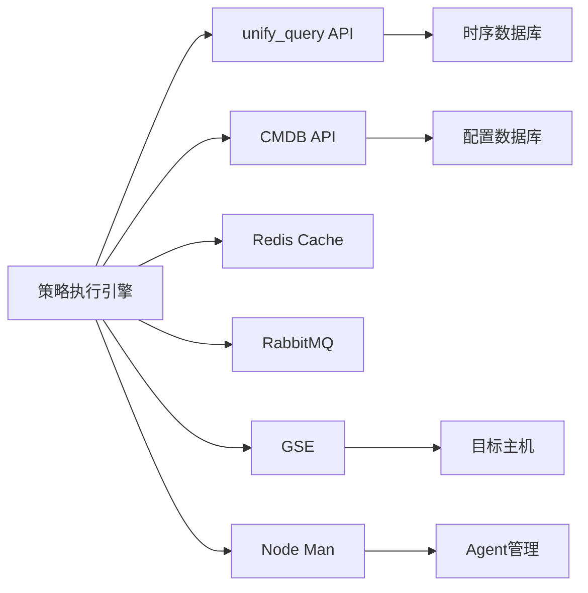

# 策略执行引擎

<cite>
**本文档引用文件**  
- [策略引擎.md](file://wiki/策略引擎.md)
- [scheduler\README.md](file://bkmonitor/alarm_backends/service/scheduler/README.md)
- [detect\README.md](file://bkmonitor/alarm_backends/service/detect/README.md)
- [trigger\README.md](file://bkmonitor/alarm_backends/service/trigger/README.md)
- [core\processor.py](file://bkmonitor/alarm_backends/core/processor.py)
- [service\scheduler\tasks.py](file://bkmonitor/alarm_backends/service/scheduler/tasks.py)
- [constants.py](file://bkmonitor/alarm_backends/constants.py)
- [strategy.py](file://bkmonitor/models/strategy.py)
- [expression.py](file://bkmonitor/strategy/expression.py)
- [utils\cache.py](file://bkmonitor/utils/cache.py)
</cite>

## 目录
1. [引言](#引言)
2. [项目结构](#项目结构)
3. [核心组件](#核心组件)
4. [架构概览](#架构概览)
5. [详细组件分析](#详细组件分析)
6. [依赖分析](#依赖分析)
7. [性能考虑](#性能考虑)
8. [故障排除指南](#故障排除指南)
9. [结论](#结论)

## 引言
本文件旨在详细阐述“策略执行引擎”的设计与实现机制，重点聚焦于监控策略的执行流程。系统通过定时调度与事件驱动相结合的方式，对预设的监控策略进行周期性评估，并根据数据变化触发告警。策略执行过程涵盖数据采集、条件判断、结果计算、状态更新及告警通知等多个环节。通过对调度机制、性能优化策略和执行流程的深入分析，本文为用户提供全面的技术理解与运维支持。

## 项目结构
项目采用模块化设计，主要功能分散在多个子目录中。策略执行相关的核心逻辑位于 `bkmonitor/alarm_backends` 模块下，特别是 `service/scheduler` 和 `service/detect` 子模块负责调度与检测任务。`wiki` 目录下的 `策略引擎.md` 提供了高层级的设计说明。整体结构清晰，职责分离明确。

**图示来源**  
- [策略引擎.md](file://wiki/策略引擎.md)
- [scheduler\README.md](file://bkmonitor/alarm_backends/service/scheduler/README.md)
- [detect\README.md](file://bkmonitor/alarm_backends/service/detect/README.md)

## 核心组件
策略执行引擎的核心组件包括策略定义、调度器、检测处理器和告警触发器。策略定义模块负责存储和管理监控规则；调度器基于Celery定时任务驱动执行周期；检测处理器负责获取数据并计算策略结果；告警触发器则根据结果变化生成告警事件。这些组件协同工作，确保监控策略能够及时、准确地被执行。

**组件来源**  
- [策略引擎.md](file://wiki/策略引擎.md)
- [strategy.py](file://bkmonitor/models/strategy.py)
- [service\scheduler\tasks.py](file://bkmonitor/alarm_backends/service/scheduler/tasks.py)

## 架构概览
整个策略执行流程遵循“调度-检测-触发”的三级架构。首先，调度服务按预设周期启动检测任务；随后，检测服务从统一数据接口获取指标数据，并结合策略中的表达式进行计算；最后，触发服务根据计算结果判断是否产生新的告警或状态变更。该架构支持高并发处理，并通过缓存机制优化性能。

**图示来源**  
- [service\scheduler\tasks.py](file://bkmonitor/alarm_backends/service/scheduler/tasks.py)
- [core\processor.py](file://bkmonitor/alarm_backends/core/processor.py)
- [trigger\README.md](file://bkmonitor/alarm_backends/service/trigger/README.md)

## 详细组件分析

### 调度机制分析
调度服务是策略执行的入口，基于Celery Beat实现定时任务调度。每个策略配置中包含执行周期（如每分钟、每5分钟），调度器会根据此周期生成对应的Celery任务。任务通过 `tasks.py` 中的 `run_strategy` 函数触发，传入策略ID和当前时间戳。

**图示来源**  
- [service\scheduler\tasks.py](file://bkmonitor/alarm_backends/service/scheduler/tasks.py)
- [constants.py](file://bkmonitor/alarm_backends/constants.py)

**组件来源**  
- [scheduler\README.md](file://bkmonitor/alarm_backends/service/scheduler/README.md)

### 检测与计算流程分析
检测处理器负责策略的具体执行。它首先从数据库加载策略配置，然后调用统一查询接口（unify_query）获取所需监控数据。获取到原始数据后，系统使用 `expression.py` 中的表达式解析引擎对策略条件进行求值。计算结果包括是否触发、严重等级、持续时间等信息。

**图示来源**  
- [core\processor.py](file://bkmonitor/alarm_backends/core/processor.py)
- [expression.py](file://bkmonitor/strategy/expression.py)
- [service\detect\README.md](file://bkmonitor/alarm_backends/service/detect/README.md)

**组件来源**  
- [core\processor.py](file://bkmonitor/alarm_backends/core/processor.py)
- [expression.py](file://bkmonitor/strategy/expression.py)

### 性能优化措施
为提升大规模策略执行的效率，系统采用了多种性能优化手段。首先是缓存机制，利用 `utils/cache.py` 对频繁访问的策略配置和元数据进行Redis缓存，减少数据库压力。其次是批量处理，调度器会将同一周期内需执行的策略打包处理，降低任务调度开销。此外，系统支持并行执行，通过Celery多Worker模式实现策略的并发检测。

**图示来源**  
- [utils\cache.py](file://bkmonitor/utils/cache.py)
- [service\scheduler\tasks.py](file://bkmonitor/alarm_backends/service/scheduler/tasks.py)

**组件来源**  
- [utils\cache.py](file://bkmonitor/utils/cache.py)

## 依赖分析
策略执行引擎依赖多个内部与外部系统。内部依赖包括统一查询服务（unify_query）、CMDB（用于主机拓扑查询）、缓存系统（Redis）和消息队列（Celery/RabbitMQ）。外部依赖则涉及GSE（通用服务引擎）用于指令下发、节点管理（node_man）用于Agent管理。这些依赖通过 `api/` 目录下的客户端模块进行封装调用。

**图示来源**  
- [api\unify_query\default.py](file://bkmonitor/api/unify_query/default.py)
- [api\cmdb\client.py](file://bkmonitor/api/cmdb/client.py)
- [config\tools\redis.py](file://bkmonitor/config/tools/redis.py)

## 性能考虑
系统的性能关键点在于高并发下的响应延迟与资源消耗。建议定期监控Celery队列长度、Redis内存使用率和数据库查询性能。对于大量策略场景，可通过调整Worker数量、优化查询语句、合理设置缓存过期时间等方式进行调优。同时，避免在策略表达式中使用过于复杂的计算逻辑，以减少单次执行耗时。

## 故障排除指南
常见问题包括策略未按时执行、数据获取失败、告警漏报等。排查时应首先检查Celery服务状态与日志，确认调度任务是否正常入队。其次查看 `detect` 服务日志，确认数据查询是否成功。若涉及表达式计算异常，可启用调试模式输出中间变量。对于缓存相关问题，可尝试清除Redis中对应策略的缓存键。

**组件来源**  
- [service\scheduler\README.md](file://bkmonitor/alarm_backends/service/scheduler/README.md)
- [service\detect\README.md](file://bkmonitor/alarm_backends/service/detect/README.md)
- [utils\cache.py](file://bkmonitor/utils/cache.py)

## 结论
策略执行引擎通过模块化设计与分布式架构，实现了高效、可靠的监控策略管理与执行。其核心优势在于灵活的调度机制、强大的表达式计算能力和完善的性能优化策略。未来可进一步增强对AI预测性告警的支持，并优化大规模场景下的资源调度效率。