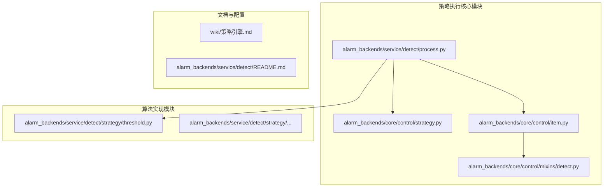
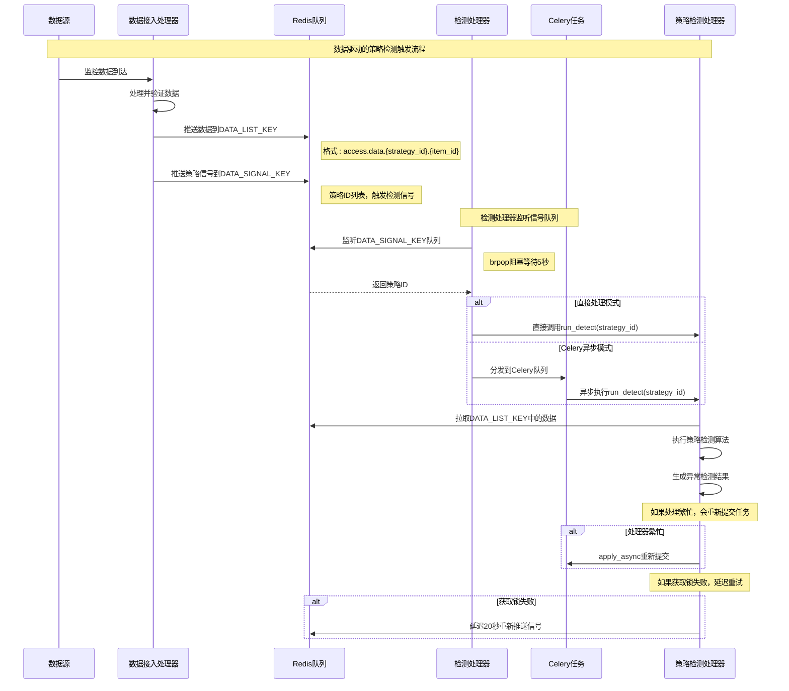
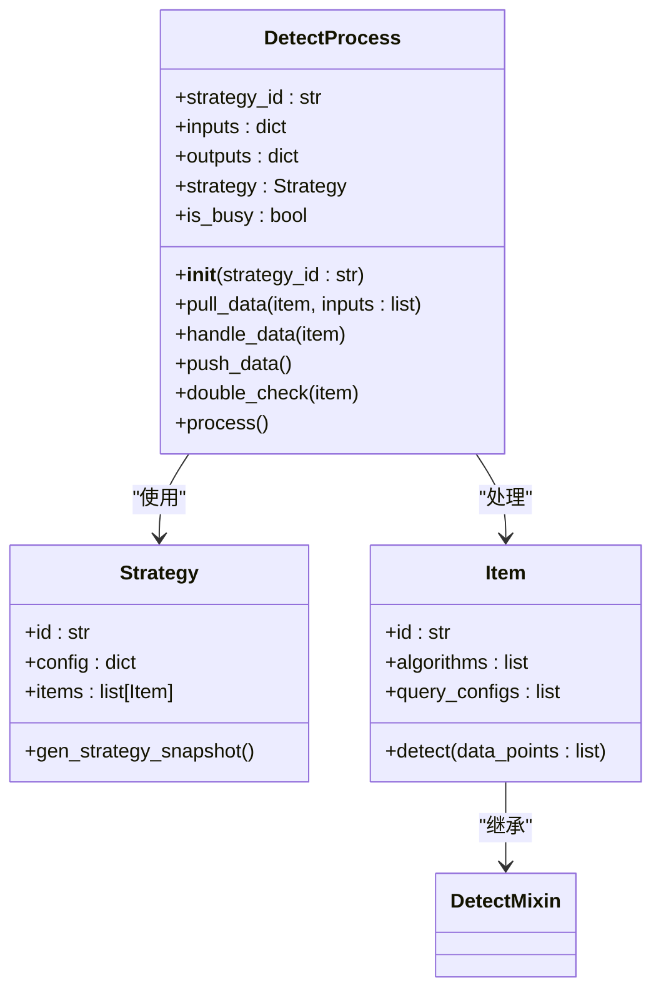
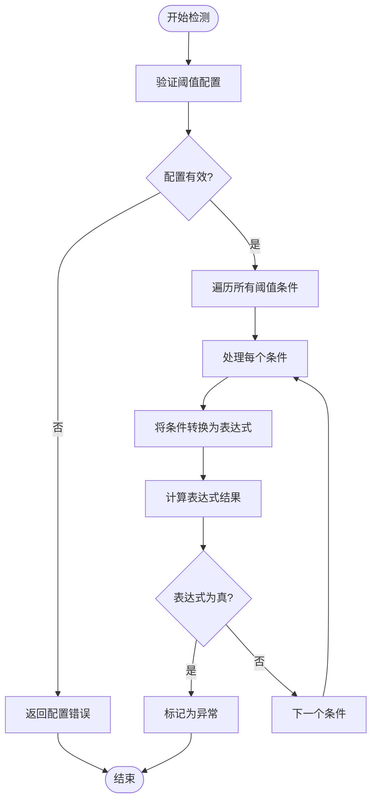
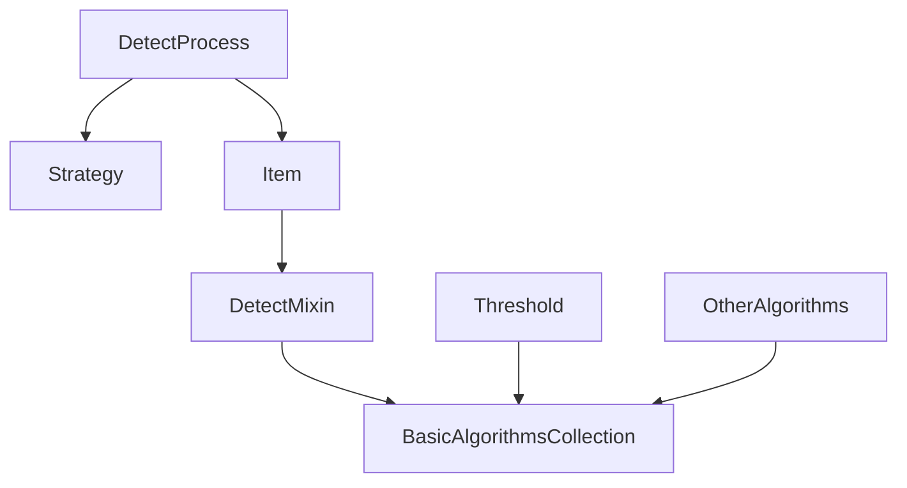

# 策略执行流程

<cite>
**本文档引用的文件**   
- [process.py](file://bkmonitor\alarm_backends\service\detect\process.py)
- [strategy.py](file://bkmonitor\alarm_backends\core\control\strategy.py)
- [item.py](file://bkmonitor\alarm_backends\core\control\item.py)
- [detect.py](file://bkmonitor\alarm_backends\core\control\mixins\detect.py)
- [threshold.py](file://bkmonitor\alarm_backends\service\detect\strategy\threshold.py)
- [README.md](file://bkmonitor\alarm_backends\service\detect\README.md)
- [策略引擎.md](file://wiki\策略引擎.md)
</cite>

## 目录
1. [引言](#引言)
2. [项目结构](#项目结构)
3. [核心组件](#核心组件)
4. [架构概述](#架构概述)
5. [详细组件分析](#详细组件分析)
6. [依赖分析](#依赖分析)
7. [性能考虑](#性能考虑)
8. [故障排除指南](#故障排除指南)
9. [结论](#结论)

## 引言
本文档详细阐述了蓝鲸监控平台中策略执行流程的完整实现机制。文档重点介绍了从策略触发到结果生成的完整执行路径，包括数据查询、条件判断、阈值检测、结果计算等关键阶段。通过分析核心代码文件和流程图，详细解释了每个阶段的输入输出和处理逻辑，并描述了策略执行过程中的异常处理机制，如超时处理、数据异常处理、服务不可用处理等。同时，通过实际代码示例展示了策略执行的关键代码片段和调用关系，为开发者和运维人员提供了全面的技术参考。

## 项目结构
蓝鲸监控平台的项目结构清晰地划分了不同的功能模块。策略执行的核心逻辑主要分布在`alarm_backends`目录下，特别是`service/detect`和`core/control`子目录。`service/detect`包含了策略检测处理的核心实现，而`core/control`则负责策略和监控项的控制逻辑。此外，`wiki`目录下的`策略引擎.md`文件提供了关于策略引擎的高层次设计和流程说明，是理解整体架构的重要参考资料。

**图源**
- [process.py](file://bkmonitor\alarm_backends\service\detect\process.py)
- [strategy.py](file://bkmonitor\alarm_backends\core\control\strategy.py)
- [item.py](file://bkmonitor\alarm_backends\core\control\item.py)
- [detect.py](file://bkmonitor\alarm_backends\core\control\mixins\detect.py)
- [threshold.py](file://bkmonitor\alarm_backends\service\detect\strategy\threshold.py)
- [策略引擎.md](file://wiki\策略引擎.md)

**节源**
- [process.py](file://bkmonitor\alarm_backends\service\detect\process.py)
- [strategy.py](file://bkmonitor\alarm_backends\core\control\strategy.py)
- [item.py](file://bkmonitor\alarm_backends\core\control\item.py)
- [detect.py](file://bkmonitor\alarm_backends\core\control\mixins\detect.py)
- [threshold.py](file://bkmonitor\alarm_backends\service\detect\strategy\threshold.py)
- [策略引擎.md](file://wiki\策略引擎.md)

## 核心组件
策略执行流程的核心组件包括策略检测处理器（DetectProcess）、策略对象（Strategy）、监控项对象（Item）和检测混入（DetectMixin）。`DetectProcess`是策略执行的入口，负责协调整个检测流程。`Strategy`对象封装了策略的配置信息，`Item`对象代表具体的监控项及其检测逻辑，而`DetectMixin`则提供了通用的检测功能。这些组件协同工作，实现了从数据拉取、处理到结果推送的完整闭环。

**节源**
- [process.py](file://bkmonitor\alarm_backends\service\detect\process.py#L28-L180)
- [strategy.py](file://bkmonitor\alarm_backends\core\control\strategy.py#L0-L199)
- [item.py](file://bkmonitor\alarm_backends\core\control\item.py#L0-L199)
- [detect.py](file://bkmonitor\alarm_backends\core\control\mixins\detect.py#L0-L199)

## 架构概述
策略执行流程采用事件驱动的架构，由数据接入模块触发。当监控数据到达时，数据接入处理器会将数据推送到Redis队列，并发送一个检测信号。检测处理器（DetectHandler）监听该信号队列，一旦收到信号，便会启动策略检测流程。该流程主要由`DetectProcess`类驱动，它会依次执行数据拉取、数据处理、二次确认和结果推送等步骤。整个流程通过Redis进行数据交换，并利用Celery实现异步处理，确保了系统的高并发和低延迟。

**图源**
- [策略引擎.md](file://wiki\策略引擎.md#L116-L162)

**节源**
- [策略引擎.md](file://wiki\策略引擎.md#L116-L162)

## 详细组件分析
### 策略检测处理器分析
`DetectProcess`类是策略执行流程的核心控制器。它通过`process`方法协调整个检测流程。该方法首先获取策略的快照，然后遍历策略中的每一个监控项（Item），依次执行`pull_data`、`handle_data`、`double_check`和`push_data`等步骤。整个过程在`service_lock`的保护下进行，确保了同一策略在同一时间只有一个实例在运行。

#### 核心方法分析

**图源**
- [process.py](file://bkmonitor\alarm_backends\service\detect\process.py#L28-L180)
- [strategy.py](file://bkmonitor\alarm_backends\core\control\strategy.py#L0-L199)
- [item.py](file://bkmonitor\alarm_backends\core\control\item.py#L0-L199)

**节源**
- [process.py](file://bkmonitor\alarm_backends\service\detect\process.py#L28-L180)

### 数据拉取阶段
`pull_data`方法负责从Redis队列中拉取待检测的监控数据。它根据策略ID和监控项ID构造出对应的Redis键（`DATA_LIST_KEY`），然后使用`lrange`命令获取数据。为了防止内存溢出，该方法会检查数据量是否超过`SQL_MAX_LIMIT`配置值。如果超过，则标记`is_busy`为True，并记录警告日志。拉取到的数据会被解析为`DataPoint`对象，并存入`inputs`字典中，供后续处理。

**节源**
- [process.py](file://bkmonitor\alarm_backends\service\detect\process.py#L45-L100)

### 数据处理阶段
`handle_data`方法是策略执行的核心逻辑所在。它调用`Item`对象的`detect`方法，对`inputs`中的数据点进行检测。`Item.detect`方法会根据配置的检测算法（如阈值、同比、环比等）对数据进行分析，并生成异常记录（anomaly_records）。这些异常记录会被存入`outputs`字典中，等待后续推送。

**节源**
- [process.py](file://bkmonitor\alarm_backends\service\detect\process.py#L102-L105)
- [item.py](file://bkmonitor\alarm_backends\core\control\item.py#L201-L246)
- [detect.py](file://bkmonitor\alarm_backends\core\control\mixins\detect.py#L0-L199)

### 阈值检测算法分析
静态阈值算法是最基础的检测方式。其实现位于`threshold.py`文件中。`AndThreshold`类负责处理单个阈值条件，它会将配置中的比较方法（如>、>=等）转换为Python表达式。`Threshold`类则继承自`AndThreshold`，并将其`expr_op`设置为"or"，从而支持多个阈值条件的"或"运算。当检测时，系统会遍历所有配置的阈值条件，只要有一个条件满足，即判定为异常。

**图源**
- [threshold.py](file://bkmonitor\alarm_backends\service\detect\strategy\threshold.py#L0-L72)

**节源**
- [threshold.py](file://bkmonitor\alarm_backends\service\detect\strategy\threshold.py#L0-L72)

## 依赖分析
策略执行流程的组件之间存在紧密的依赖关系。`DetectProcess`直接依赖于`Strategy`和`Item`对象来获取策略配置和执行检测逻辑。`Item`对象又依赖于`DetectMixin`来提供通用的检测功能。检测算法（如`Threshold`）则依赖于`BasicAlgorithmsCollection`作为基类。这种分层依赖结构使得代码具有良好的可维护性和可扩展性。

**图源**
- [process.py](file://bkmonitor\alarm_backends\service\detect\process.py)
- [strategy.py](file://bkmonitor\alarm_backends\core\control\strategy.py)
- [item.py](file://bkmonitor\alarm_backends\core\control\item.py)
- [detect.py](file://bkmonitor\alarm_backends\core\control\mixins\detect.py)
- [threshold.py](file://bkmonitor\alarm_backends\service\detect\strategy\threshold.py)

**节源**
- [process.py](file://bkmonitor\alarm_backends\service\detect\process.py)
- [strategy.py](file://bkmonitor\alarm_backends\core\control\strategy.py)
- [item.py](file://bkmonitor\alarm_backends\core\control\item.py)
- [detect.py](file://bkmonitor\alarm_backends\core\control\mixins\detect.py)
- [threshold.py](file://bkmonitor\alarm_backends\service\detect\strategy\threshold.py)

## 性能考虑
策略执行流程在设计上充分考虑了性能问题。首先，通过事件驱动和异步处理（Celery）避免了定时任务的资源浪费。其次，`pull_data`方法通过`SQL_MAX_LIMIT`限制了单次拉取的数据量，防止了内存溢出。此外，系统还通过`service_lock`机制避免了同一策略的并发执行，减少了不必要的资源竞争。最后，`DetectProcess`会记录处理延迟和数据量等指标，便于进行性能监控和优化。

## 故障排除指南
在策略执行过程中可能遇到的常见问题包括：
1.  **数据延迟**：检查`access to detect`延迟指标，如果延迟超过60秒，可能是数据接入或检测处理环节出现瓶颈。
2.  **数据积压**：当`is_busy`被标记为True时，表示待检测数据量已达到上限，需要优化检测算法或增加处理资源。
3.  **配置错误**：检查`InvalidAlgorithmsConfig`等异常日志，确保策略配置的正确性。
4.  **锁冲突**：如果`service_lock`频繁获取失败，可能是策略执行时间过长，需要优化检测逻辑。

**节源**
- [process.py](file://bkmonitor\alarm_backends\service\detect\process.py)
- [detect.py](file://bkmonitor\alarm_backends\core\control\mixins\detect.py)
- [threshold.py](file://bkmonitor\alarm_backends\service\detect\strategy\threshold.py)

## 结论
本文档详细分析了蓝鲸监控平台中策略执行流程的实现机制。该流程采用事件驱动的架构，通过`DetectProcess`协调`Strategy`、`Item`和具体的检测算法，实现了高效、可靠的异常检测。代码结构清晰，依赖关系明确，具备良好的可维护性和可扩展性。通过理解本文档的内容，开发者可以更好地掌握策略执行的内部原理，为系统的开发、维护和优化提供有力支持。