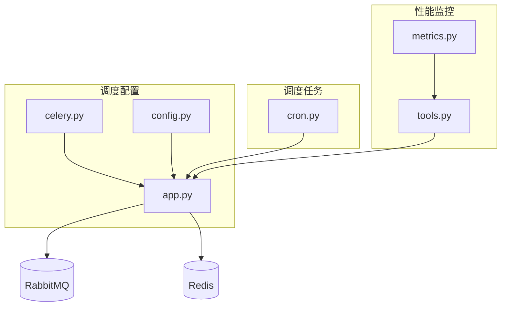
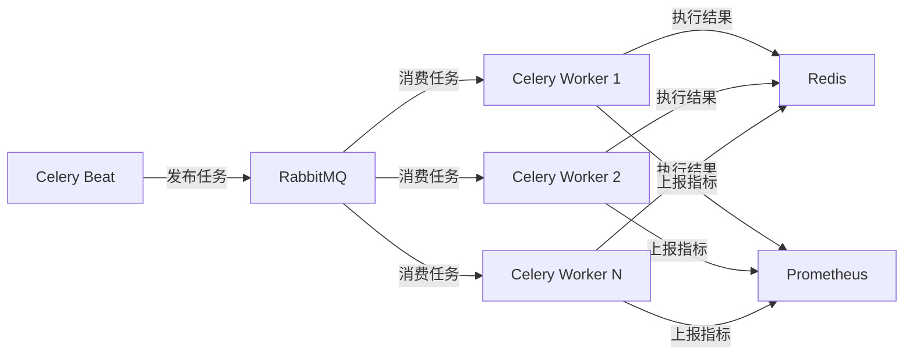
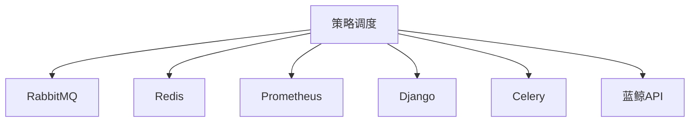

# 策略调度机制

<cite>
**本文档引用的文件**  
- [app.py](file://bkmonitor/alarm_backends/service/scheduler/app.py)
- [cron.py](file://bkmonitor/alarm_backends/service/scheduler/tasks/cron.py)
- [celery.py](file://bkmonitor/config/celery/celery.py)
- [config.py](file://bkmonitor/config/celery/config.py)
- [metrics.py](file://bkmonitor/core/prometheus/metrics.py)
- [tools.py](file://bkmonitor/core/prometheus/tools.py)
</cite>

## 目录
1. [引言](#引言)
2. [项目结构](#项目结构)
3. [核心组件](#核心组件)
4. [架构概述](#架构概述)
5. [详细组件分析](#详细组件分析)
6. [依赖分析](#依赖分析)
7. [性能考量](#性能考量)
8. [故障排查指南](#故障排查指南)
9. [结论](#结论)

## 引言
本文档详细阐述了蓝鲸监控平台中的策略调度机制，重点介绍其调度方式、周期管理、任务执行监控及高可用性保障。文档涵盖定时调度、事件驱动调度和手动触发调度等模式的实现原理与使用场景，并深入分析Celery任务调度、定时器管理、负载均衡与故障转移机制。同时，提供调度性能监控指标与调优建议，帮助用户优化调度效率。

## 项目结构
策略调度机制的核心实现位于 `bkmonitor/alarm_backends/service/scheduler/` 目录下，主要由Celery应用配置、定时任务定义和任务执行监控组成。配置文件分散在 `config/celery/` 目录中，而性能指标定义则位于 `core/prometheus/` 目录。



**图示来源**
- [app.py](file://bkmonitor/alarm_backends/service/scheduler/app.py)
- [cron.py](file://bkmonitor/alarm_backends/service/scheduler/tasks/cron.py)
- [celery.py](file://bkmonitor/config/celery/celery.py)
- [config.py](file://bkmonitor/config/celery/config.py)
- [metrics.py](file://bkmonitor/core/prometheus/metrics.py)
- [tools.py](file://bkmonitor/core/prometheus/tools.py)

## 核心组件
策略调度机制的核心组件包括Celery应用实例、定时任务调度器（Celery Beat）和任务执行监控模块。Celery应用负责管理任务队列和工作进程，定时任务调度器根据预设的Crontab表达式触发周期性任务，而监控模块则通过Prometheus收集任务执行的性能指标。

**组件来源**
- [app.py](file://bkmonitor/alarm_backends/service/scheduler/app.py#L92-L161)
- [cron.py](file://bkmonitor/alarm_backends/service/scheduler/tasks/cron.py#L62-L105)
- [metrics.py](file://bkmonitor/core/prometheus/metrics.py#L0-L1235)

## 架构概述
策略调度机制采用Celery分布式任务队列框架，结合RabbitMQ作为消息代理和Redis作为结果后端，实现高可用和可扩展的调度服务。系统通过Celery Beat进程解析Crontab表达式，将定时任务发布到RabbitMQ队列中，由多个Celery Worker进程消费并执行任务。整个过程通过Prometheus进行全方位的性能监控。



**图示来源**
- [app.py](file://bkmonitor/alarm_backends/service/scheduler/app.py)
- [config.py](file://bkmonitor/config/celery/config.py)
- [tools.py](file://bkmonitor/core/prometheus/tools.py)

## 详细组件分析

### Celery应用配置分析
Celery应用的配置定义了工作进程的并发数、消息代理（RabbitMQ）的连接信息以及结果后端（Redis）的设置。配置中还包含了RedBeat的锁超时和心跳间隔，确保在多节点部署时调度器的高可用性。

```python
# app.py 片段
def rabbitmq_conf():
    redis_celery_conf = settings.REDIS_CELERY_CONF
    # ... 获取Redis配置
    class RabbitmqConf:
        worker_concurrency = int(getattr(settings, "CELERY_WORKERS", 0)) or default_celery_worker_num()
        broker_url = "amqp://{}:{}@{}:{}/{}".format(
            settings.RABBITMQ_USER,
            settings.RABBITMQ_PASS,
            settings.RABBITMQ_HOST,
            settings.RABBITMQ_PORT,
            settings.RABBITMQ_VHOST,
        )
        beat_max_loop_interval = 60
        redbeat_lock_timeout = 300
        # ... RedBeat Redis配置
```

**组件来源**
- [app.py](file://bkmonitor/alarm_backends/service/scheduler/app.py#L92-L161)

### 定时任务调度分析
定时任务通过解析配置中的Crontab表达式来定义执行周期。系统为不同类型的周期任务（如默认任务、动作任务、长时任务）分配了独立的队列，以实现资源隔离和优先级管理。

```python
# cron.py 片段
queue_define = {
    "celery_cron": settings.DEFAULT_CRONTAB,
    "celery_action_cron": settings.ACTION_TASK_CRONTAB,
    "celery_long_task_cron": settings.LONG_TASK_CRONTAB,
}

for queue, crontab_tasks in queue_define.items():
    for module_name, cron_expr, run_type in crontab_tasks:
        func = _get_func(module_name, queue=queue)
        run_every = crontab(*cron_expr.split())
        locals()[func_name] = periodic_task(
            run_every=run_every,
            ignore_result=True,
            queue=queue,
            expires=min(3600, max(get_interval(run_every), 300)),
        )(func)
```

**组件来源**
- [cron.py](file://bkmonitor/alarm_backends/service/scheduler/tasks/cron.py#L62-L105)
- [config.py](file://bkmonitor/config/celery/config.py#L28-L60)

### 任务执行监控分析
系统通过装饰器为所有Celery任务添加了执行时间监控功能。`task_timer` 装饰器在任务执行前后记录时间，并将执行耗时、任务名称、队列和异常信息作为指标上报给Prometheus。

```python
# tools.py 片段
def task_timer(queue: str = None) -> typing.Callable[[typing.Callable], typing.Callable]:
    def actual_timer(func) -> typing.Callable:
        @wraps(func)
        def wrapper(*args, **kwargs):
            start_time = time.time()
            try:
                result = func(*args, **kwargs)
            except Exception as e:
                exception = e
            # 记录执行时间
            metrics.CELERY_TASK_EXECUTE_TIME.labels(
                task_name=func.__name__,
                queue=queue,
                exception=exception_name,
            ).observe(time.time() - start_time)
            # ... 上报指标
            if exception:
                raise exception
            return result
        return wrapper
    return actual_timer
```

**组件来源**
- [tools.py](file://bkmonitor/core/prometheus/tools.py#L248-L303)
- [metrics.py](file://bkmonitor/core/prometheus/metrics.py#L0-L1235)

## 依赖分析
策略调度机制依赖于多个外部组件和内部模块。外部依赖包括RabbitMQ（消息代理）、Redis（结果后端和缓存）和Prometheus（监控系统）。内部依赖则包括Django框架（提供配置和ORM）、Celery框架（任务队列）以及蓝鲸平台的API。



**图示来源**
- [app.py](file://bkmonitor/alarm_backends/service/scheduler/app.py)
- [config.py](file://bkmonitor/config/celery/config.py)
- [tools.py](file://bkmonitor/core/prometheus/tools.py)

## 性能考量
系统通过多种方式优化调度性能。首先，通过`worker_concurrency`参数动态计算工作进程的并发数，以充分利用CPU资源。其次，为长时任务分配独立队列，避免阻塞核心调度流程。最后，通过Prometheus的`CELERY_TASK_EXECUTE_TIME`直方图指标，可以监控任务执行耗时的分布，及时发现性能瓶颈。

## 故障排查指南
当调度系统出现异常时，可按以下步骤排查：
1.  **检查Celery Worker状态**：确认Worker进程是否正常运行。
2.  **检查RabbitMQ队列**：通过`rabbitmq_story.py`中的监控逻辑，检查队列中的消息积压情况。
3.  **检查Redis连接**：确认Redis作为结果后端和RedBeat存储是否可访问。
4.  **查看Prometheus指标**：重点关注`CELERY_TASK_EXECUTE_TIME`、`CELERY_TASK_EXECUTE_COUNT`和`bkmonitor_process_overflow`等指标，分析任务执行的成功率、耗时和积压情况。
5.  **检查日志**：查看Celery Worker和Beat进程的日志，定位具体的错误信息。

**组件来源**
- [app.py](file://bkmonitor/alarm_backends/service/scheduler/app.py)
- [rabbitmq_story.py](file://bkmonitor/alarm_backends/management/story/rabbitmq_story.py#L60-L92)
- [metrics.py](file://bkmonitor/core/prometheus/metrics.py)

## 结论
本文档全面分析了蓝鲸监控平台的策略调度机制。该机制基于Celery构建，实现了灵活的定时调度、高效的负载均衡和可靠的故障转移。通过与Prometheus的深度集成，提供了完善的性能监控能力。用户可通过调整配置参数和监控关键指标，持续优化调度系统的性能和稳定性。