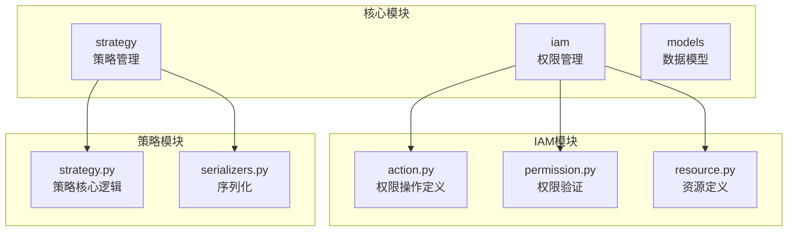
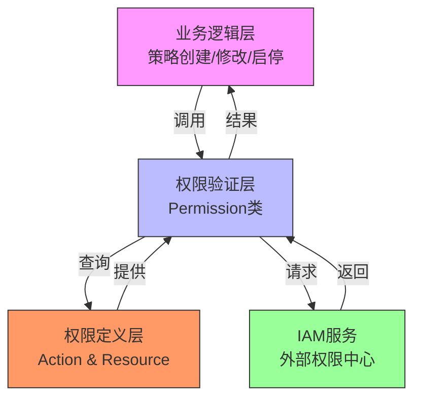
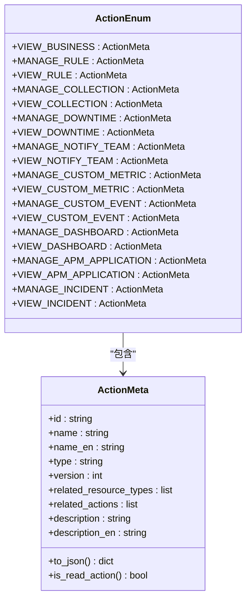
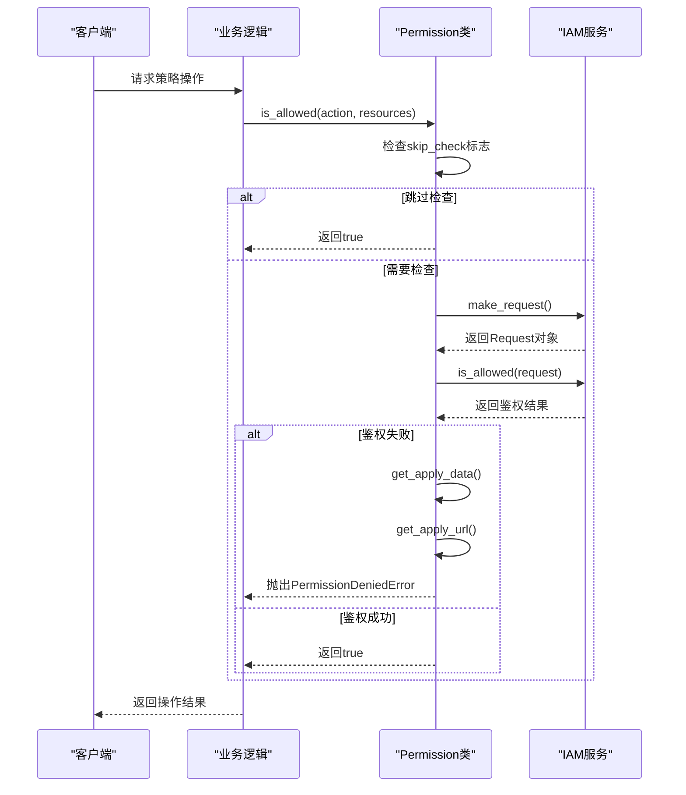
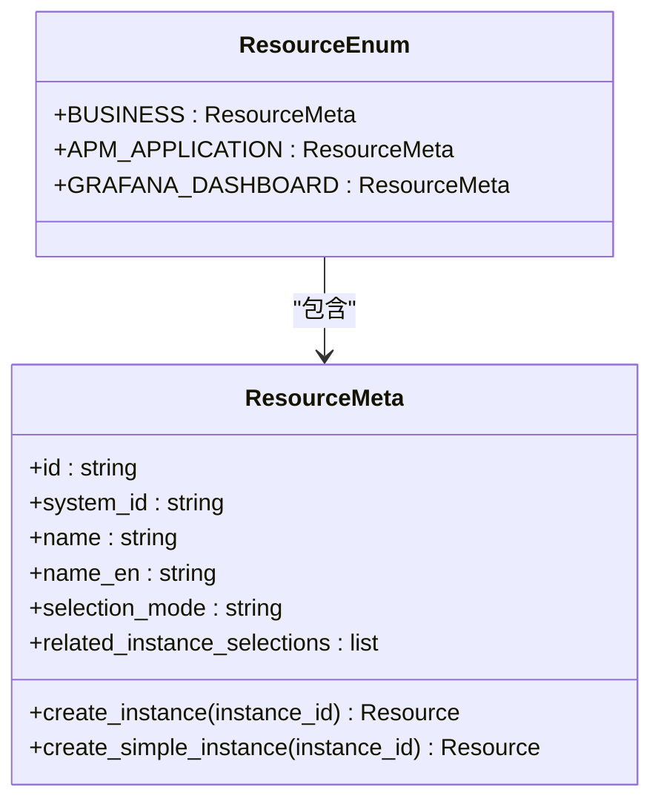
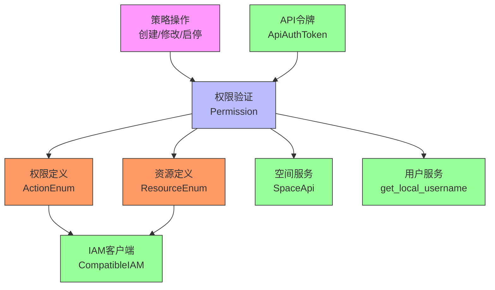

# 策略权限控制

<cite>
**本文档引用的文件**   
- [action.py](file://bkmonitor\bkmonitor\iam\action.py)
- [permission.py](file://bkmonitor\bkmonitor\iam\permission.py)
- [resource.py](file://bkmonitor\bkmonitor\iam\resource.py)
- [strategy.py](file://bkmonitor\bkmonitor\strategy\strategy.py)
- [constants.py](file://bkmonitor\constants\strategy.py)
</cite>

## 目录
1. [引言](#引言)
2. [项目结构](#项目结构)
3. [核心组件](#核心组件)
4. [架构概述](#架构概述)
5. [详细组件分析](#详细组件分析)
6. [依赖分析](#依赖分析)
7. [性能考虑](#性能考虑)
8. [故障排除指南](#故障排除指南)
9. [结论](#结论)

## 引言
本文档详细阐述了蓝鲸监控平台中策略权限控制的实现机制。重点介绍基于IAM（身份与访问管理）的权限模型，涵盖策略操作的权限管理体系，包括创建、修改、启用、停用、删除等操作的权限控制机制。文档详细说明了权限模型的定义、权限验证的实现流程以及权限异常的处理方式，并提供权限配置的最佳实践。

## 项目结构
蓝鲸监控平台的项目结构清晰，核心功能模块位于`bkmonitor/bkmonitor`目录下。与策略权限控制直接相关的模块主要分布在`iam`和`strategy`子目录中。

**图示来源**
- [action.py](file://bkmonitor\bkmonitor\iam\action.py)
- [permission.py](file://bkmonitor\bkmonitor\iam\permission.py)
- [resource.py](file://bkmonitor\bkmonitor\iam\resource.py)
- [strategy.py](file://bkmonitor\bkmonitor\strategy\strategy.py)

**本节来源**
- [action.py](file://bkmonitor\bkmonitor\iam\action.py)
- [permission.py](file://bkmonitor\bkmonitor\iam\permission.py)

## 核心组件
策略权限控制的核心组件包括权限操作定义、资源实例定义和权限验证服务。这些组件共同构成了基于IAM的权限管理体系。

**本节来源**
- [action.py](file://bkmonitor\bkmonitor\iam\action.py#L0-L199)
- [resource.py](file://bkmonitor\bkmonitor\iam\resource.py#L0-L200)
- [permission.py](file://bkmonitor\bkmonitor\iam\permission.py#L0-L200)

## 架构概述
策略权限控制采用分层架构，由权限定义层、权限验证层和业务逻辑层组成。权限定义层负责定义操作和资源，权限验证层提供统一的鉴权接口，业务逻辑层在执行策略操作前调用鉴权服务。

**图示来源**
- [action.py](file://bkmonitor\bkmonitor\iam\action.py)
- [permission.py](file://bkmonitor\bkmonitor\iam\permission.py)
- [resource.py](file://bkmonitor\bkmonitor\iam\resource.py)

## 详细组件分析

### 权限操作定义分析
权限操作定义模块（`action.py`）通过`ActionMeta`类和`ActionEnum`枚举类来定义系统中的所有权限操作。

#### 权限操作类图

**图示来源**
- [action.py](file://bkmonitor\bkmonitor\iam\action.py#L0-L621)

**本节来源**
- [action.py](file://bkmonitor\bkmonitor\iam\action.py#L0-L621)

### 权限验证流程分析
权限验证流程由`Permission`类实现，提供统一的鉴权接口。验证流程包括初始化、权限检查、申请URL生成等步骤。

#### 权限验证序列图

**图示来源**
- [permission.py](file://bkmonitor\bkmonitor\iam\permission.py#L0-L517)

**本节来源**
- [permission.py](file://bkmonitor\bkmonitor\iam\permission.py#L0-L517)

### 资源实例定义分析
资源实例定义模块（`resource.py`）负责定义系统中的各种资源类型，如业务、APM应用、仪表盘等。

#### 资源定义类图

**图示来源**
- [resource.py](file://bkmonitor\bkmonitor\iam\resource.py)

**本节来源**
- [resource.py](file://bkmonitor\bkmonitor\iam\resource.py)

## 依赖分析
策略权限控制模块依赖于多个核心组件，形成清晰的依赖关系。

**图示来源**
- [action.py](file://bkmonitor\bkmonitor\iam\action.py)
- [permission.py](file://bkmonitor\bkmonitor\iam\permission.py)
- [resource.py](file://bkmonitor\bkmonitor\iam\resource.py)

**本节来源**
- [action.py](file://bkmonitor\bkmonitor\iam\action.py)
- [permission.py](file://bkmonitor\bkmonitor\iam\permission.py)
- [resource.py](file://bkmonitor\bkmonitor\iam\resource.py)

## 性能考虑
权限验证系统在设计时考虑了性能优化，主要体现在以下几个方面：
1. **缓存机制**：对读权限操作使用缓存，减少对IAM服务的频繁调用。
2. **批量操作**：提供批量鉴权接口`batch_is_allowed`，减少网络请求次数。
3. **本地跳过检查**：在特定环境下（如后台任务）可配置跳过权限检查，提升性能。
4. **资源预加载**：通过`setup_meta`方法预加载权限元数据，避免重复初始化。

## 故障排除指南
当遇到权限相关问题时，可参考以下排查步骤：

**本节来源**
- [permission.py](file://bkmonitor\bkmonitor\iam\permission.py#L200-L400)
- [action.py](file://bkmonitor\bkmonitor\iam\action.py#L400-L621)

## 结论
蓝鲸监控平台的策略权限控制系统基于IAM实现了细粒度的权限管理。系统通过清晰的权限操作定义、资源实例定义和统一的权限验证服务，为策略的创建、修改、启用、停用、删除等操作提供了安全可靠的权限控制机制。该系统具有良好的扩展性和可维护性，能够满足复杂场景下的权限管理需求。