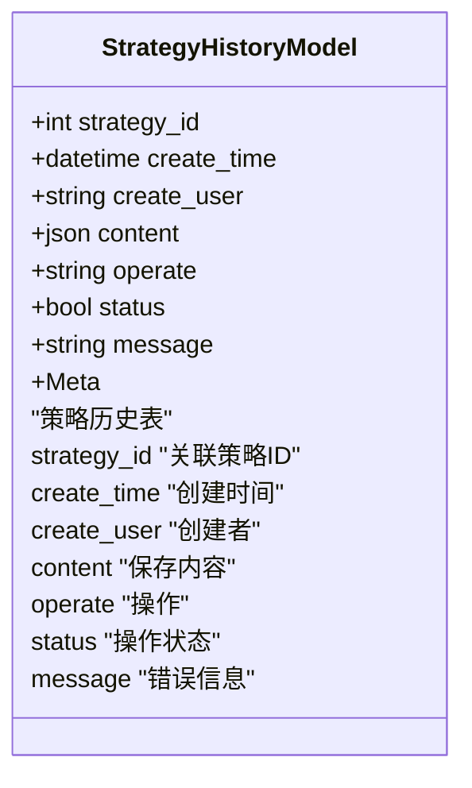
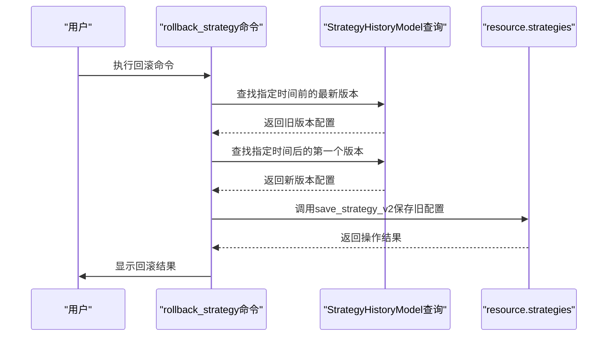
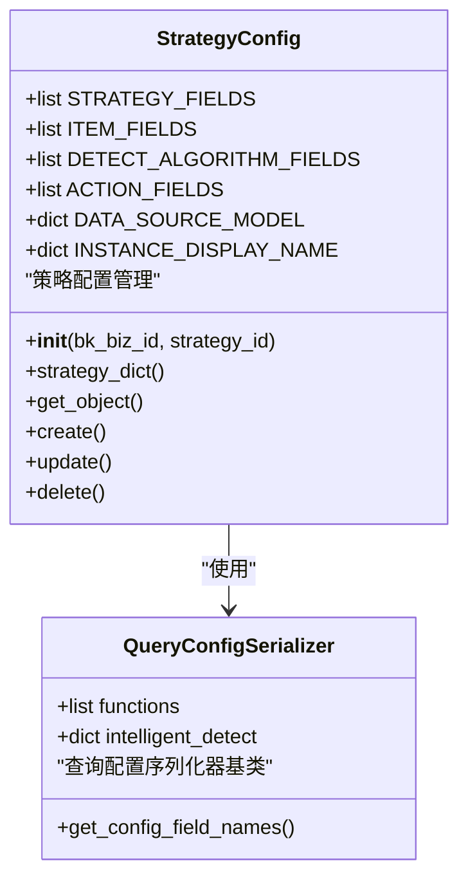
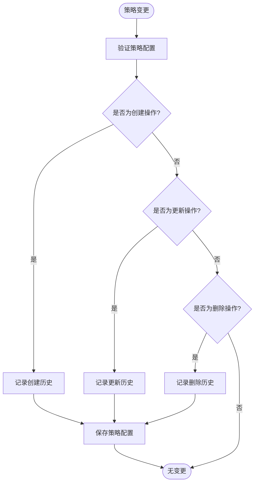

# 策略版本控制

<cite>
**本文档引用的文件**   
- [strategy.py](file://bkmonitor\bkmonitor\models\strategy.py#L425-L451)
- [strategy.py](file://bkmonitor\bkmonitor\strategy\strategy.py#L0-L930)
- [rollback_strategy.py](file://bkmonitor\bkmonitor\management\commands\rollback_strategy.py#L0-L63)
- [serializers.py](file://bkmonitor\bkmonitor\strategy\serializers.py#L0-L427)
- [v4\strategy_v2.py](file://bkmonitor\kernel_api\views\v4\strategy_v2.py#L114)
</cite>

## 目录
1. [引言](#引言)
2. [核心数据结构](#核心数据结构)
3. [版本创建与记录](#版本创建与记录)
4. [版本回滚机制](#版本回滚机制)
5. [策略序列化与验证](#策略序列化与验证)
6. [版本控制集成](#版本控制集成)
7. [最佳实践](#最佳实践)

## 引言
策略版本控制是监控平台中确保策略变更安全性和可追溯性的关键机制。该系统通过记录策略的每一次变更历史，支持版本对比和回滚操作，有效防止配置错误导致的系统问题。本文档详细阐述了策略版本控制的实现原理、核心组件和操作流程，为用户提供全面的技术指导。

## 核心数据结构
策略版本控制的核心是`StrategyHistoryModel`模型，它负责存储策略的所有历史版本和变更记录。

**图示来源**
- [strategy.py](file://bkmonitor\bkmonitor\models\strategy.py#L425-L451)

**本节来源**
- [strategy.py](file://bkmonitor\bkmonitor\models\strategy.py#L425-L451)

## 版本创建与记录
当策略发生变更时，系统会自动创建新的版本记录。`StrategyHistoryModel`中的`operate`字段标识了操作类型，包括"create"（创建）、"update"（更新）和"delete"（删除）。每次策略的创建、更新或删除操作都会生成一条历史记录，其中`content`字段以JSON格式存储策略的完整配置内容。

版本标识的生成基于时间戳和操作类型，`create_time`字段精确记录了变更发生的时间。系统通过`strategy_id`字段将历史记录与具体的策略关联，确保每个策略的变更历史都能被完整追溯。这种设计实现了策略变更的完整审计跟踪，为后续的版本对比和回滚提供了数据基础。

## 版本回滚机制
版本回滚功能通过`rollback_strategy`命令实现，允许用户将策略恢复到指定时间点的配置状态。

**图示来源**
- [rollback_strategy.py](file://bkmonitor\bkmonitor\management\commands\rollback_strategy.py#L26-L62)

**本节来源**
- [rollback_strategy.py](file://bkmonitor\bkmonitor\management\commands\rollback_strategy.py#L26-L62)

回滚操作首先查询指定时间戳之前的最新版本和之后的第一个版本。如果两个版本都存在，则提取旧版本的配置内容，并通过`save_strategy_v2`接口重新应用该配置。特别地，当旧版本是创建操作时，系统会将配置中的ID设置为当前策略ID，确保正确关联。回滚成功后，系统会生成新的历史记录，标记为更新操作，保持了完整的变更历史。

## 策略序列化与验证
策略的序列化和验证通过`StrategyConfig`类和相应的序列化器实现，确保版本控制过程中的数据完整性和一致性。

**图示来源**
- [strategy.py](file://bkmonitor\bkmonitor\strategy\strategy.py#L0-L199)
- [serializers.py](file://bkmonitor\bkmonitor\strategy\serializers.py#L0-L427)

**本节来源**
- [strategy.py](file://bkmonitor\bkmonitor\strategy\strategy.py#L0-L930)
- [serializers.py](file://bkmonitor\bkmonitor\strategy\serializers.py#L0-L427)

`StrategyConfig`类封装了策略的完整配置信息，包括策略基本信息、监控项、检测算法和告警动作等。`strategy_dict`属性方法将策略对象转换为字典格式，便于JSON序列化和存储。在版本创建和回滚过程中，系统通过`create`和`update`方法处理策略的持久化，确保所有相关联的配置项（如检测算法、告警动作等）都被正确保存和更新。

## 版本控制集成
版本控制机制深度集成到策略的整个生命周期中，从创建、更新到删除的每个环节都自动生成历史记录。

**图示来源**
- [strategy.py](file://bkmonitor\bkmonitor\strategy\strategy.py#L400-L600)

**本节来源**
- [strategy.py](file://bkmonitor\bkmonitor\strategy\strategy.py#L400-L600)

当通过`save_strategy_v2`接口保存策略时，系统会自动触发版本记录逻辑。该接口位于`kernel_api\views\v4\strategy_v2.py`中，是策略版本控制的主要入口点。每次策略保存都会在`alarm_strategy_history`表中创建一条新记录，包含完整的策略配置快照。这种设计确保了即使在复杂的策略变更场景下，也能保持完整的版本历史，支持精确的回滚操作。

## 最佳实践
为确保策略版本控制的有效性，建议遵循以下最佳实践：

1. **版本命名规范**：虽然系统自动生成版本标识，但建议在策略描述中包含版本信息，便于人工识别和管理。

2. **变更记录管理**：每次重要变更都应在策略描述或相关文档中记录变更原因和预期影响，增强变更的可追溯性。

3. **回滚策略制定**：建立明确的回滚流程和审批机制，避免随意回滚导致的配置混乱。建议在生产环境执行回滚前进行充分测试。

4. **定期审计**：定期审查策略的历史记录，识别频繁变更的策略，优化其设计以减少不必要的变更。

5. **备份与归档**：对于重要的策略配置，建议定期导出并归档，作为数据库历史记录的补充备份。

通过遵循这些最佳实践，可以最大化策略版本控制系统的价值，确保监控策略的稳定性和可靠性。