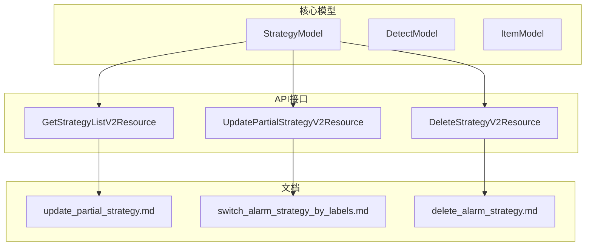
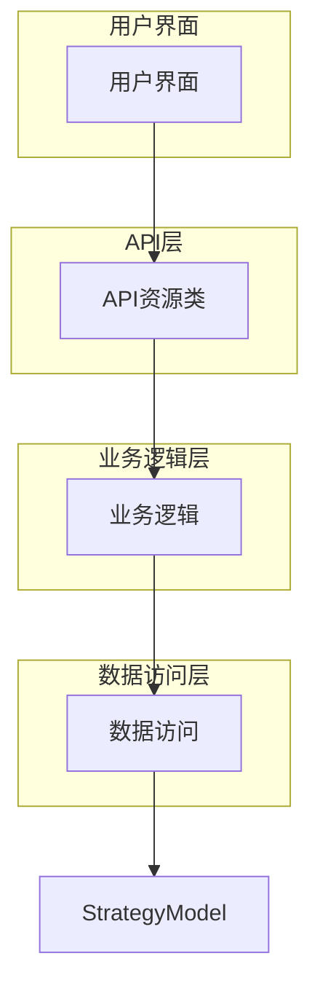
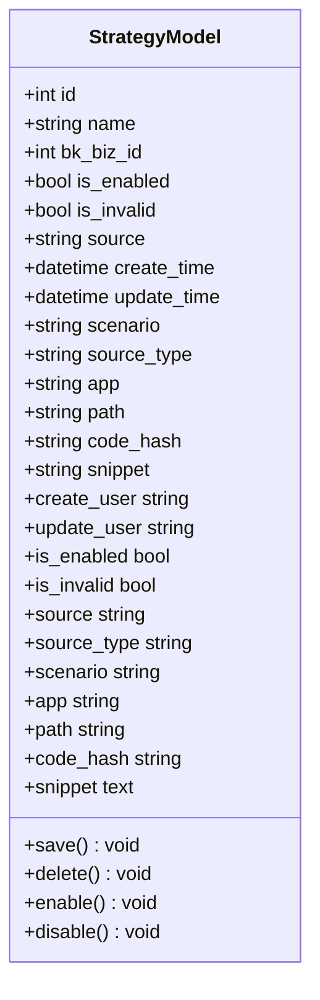
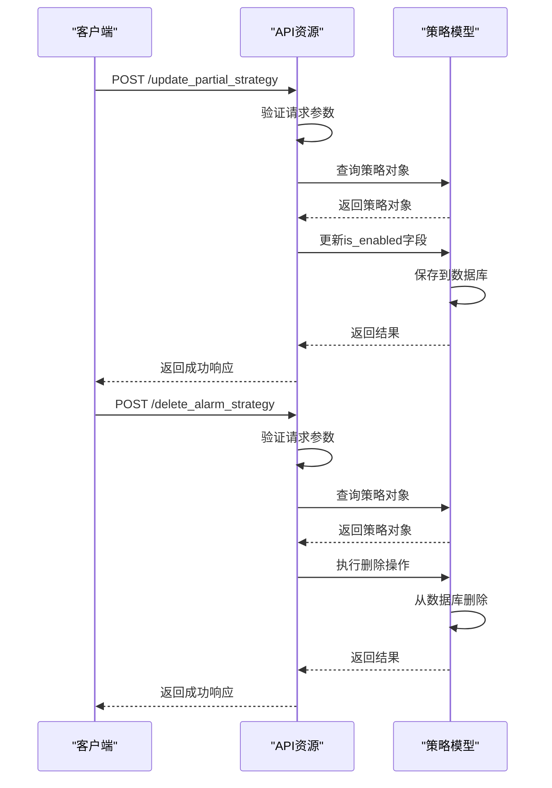
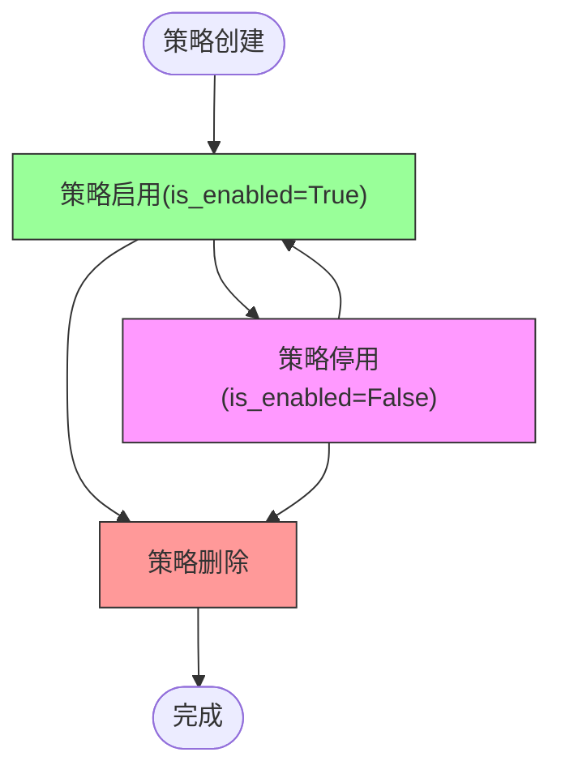
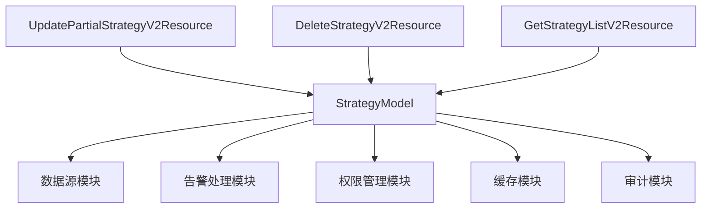

# 策略状态管理

<cite>
**本文档引用的文件**   
- [strategy.py](file://bkmonitor\bkmonitor\models\strategy.py)
- [v2.py](file://bkmonitor\packages\monitor_web\strategies\resources\v2.py)
- [update_partial_strategy.md](file://bkmonitor\support-files\apigw\docs\zh\update_partial_strategy.md)
- [switch_alarm_strategy_by_labels.md](file://bkmonitor\support-files\apigw\docs\zh\switch_alarm_strategy_by_labels.md)
- [delete_alarm_strategy.md](file://bkmonitor\support-files\apigw\docs\zh\delete_alarm_strategy.md)
- [save_alarm_strategy.md](file://bkmonitor\support-files\apigw\docs\zh\save_alarm_strategy.md)
- [策略引擎.md](file://wiki\策略引擎.md)
</cite>

## 目录
1. [引言](#引言)
2. [项目结构](#项目结构)
3. [核心组件](#核心组件)
4. [架构概述](#架构概述)
5. [详细组件分析](#详细组件分析)
6. [依赖分析](#依赖分析)
7. [性能考虑](#性能考虑)
8. [故障排除指南](#故障排除指南)
9. [结论](#结论)

## 引言
本文档详细阐述了监控系统中策略状态管理的实现机制，重点介绍策略的创建、启用、停用、删除等状态及其转换机制。文档详细说明了每个状态的含义、触发条件和操作方法，包括状态转换的API接口和管理命令。同时解释了状态变更时的系统行为，如告警检测的启停、资源释放等，并提供了状态管理的最佳实践，包括状态监控、异常处理和自动化运维方案。

## 项目结构
策略状态管理功能主要分布在`bkmonitor`模块下的多个子目录中，核心逻辑位于`models/strategy.py`文件中，API接口定义在`packages/monitor_web/strategies/resources/v2.py`文件中。系统通过Django ORM模型定义策略状态，通过DRF资源类提供RESTful API接口。

**图示来源**
- [strategy.py](file://bkmonitor\bkmonitor\models\strategy.py)
- [v2.py](file://bkmonitor\packages\monitor_web\strategies\resources\v2.py)
- [update_partial_strategy.md](file://bkmonitor\support-files\apigw\docs\zh\update_partial_strategy.md)
- [switch_alarm_strategy_by_labels.md](file://bkmonitor\support-files\apigw\docs\zh\switch_alarm_strategy_by_labels.md)
- [delete_alarm_strategy.md](file://bkmonitor\support-files\apigw\docs\zh\delete_alarm_strategy.md)

## 核心组件
策略状态管理的核心组件包括策略模型`StrategyModel`和相关的API资源类。`StrategyModel`定义了策略的基本属性和状态字段，而API资源类提供了对策略状态的操作接口。

**组件来源**
- [strategy.py](file://bkmonitor\bkmonitor\models\strategy.py#L333-L422)
- [v2.py](file://bkmonitor\packages\monitor_web\strategies\resources\v2.py)

## 架构概述
策略状态管理采用分层架构，底层是Django模型层，中间是API资源层，上层是文档和用户界面。这种架构实现了关注点分离，使得状态管理逻辑清晰且易于维护。

**图示来源**
- [v2.py](file://bkmonitor\packages\monitor_web\strategies\resources\v2.py)
- [strategy.py](file://bkmonitor\bkmonitor\models\strategy.py)

## 详细组件分析
### 策略模型分析
策略模型`StrategyModel`是策略状态管理的核心数据结构，它定义了策略的各种属性和状态。

**图示来源**
- [strategy.py](file://bkmonitor\bkmonitor\models\strategy.py#L333-L422)

### API接口分析
API接口提供了对策略状态的创建、更新、删除等操作，主要通过`UpdatePartialStrategyV2Resource`和`DeleteStrategyV2Resource`等资源类实现。

**图示来源**
- [v2.py](file://bkmonitor\packages\monitor_web\strategies\resources\v2.py)
- [update_partial_strategy.md](file://bkmonitor\support-files\apigw\docs\zh\update_partial_strategy.md)
- [delete_alarm_strategy.md](file://bkmonitor\support-files\apigw\docs\zh\delete_alarm_strategy.md)

### 状态转换分析
策略状态管理涉及多种状态转换，包括启用、停用、删除等操作，每种操作都有相应的API接口和业务逻辑。

**图示来源**
- [strategy.py](file://bkmonitor\bkmonitor\models\strategy.py)
- [v2.py](file://bkmonitor\packages\monitor_web\strategies\resources\v2.py)

## 依赖分析
策略状态管理组件依赖于多个其他模块，包括数据源模块、告警处理模块和权限管理模块。这些依赖关系确保了策略状态变更时能够正确地影响相关系统组件。

**图示来源**
- [strategy.py](file://bkmonitor\bkmonitor\models\strategy.py)
- [v2.py](file://bkmonitor\packages\monitor_web\strategies\resources\v2.py)

## 性能考虑
策略状态管理在设计时考虑了性能因素，通过数据库索引、缓存机制和批量操作来优化性能。特别是对策略列表查询进行了优化，使用了分页和条件过滤来减少数据库负载。

## 故障排除指南
当策略状态管理出现问题时，可以检查以下几个方面：数据库连接、API参数验证、权限配置和日志记录。系统提供了详细的日志信息，可以帮助快速定位和解决问题。

**组件来源**
- [v2.py](file://bkmonitor\packages\monitor_web\strategies\resources\v2.py)
- [strategy.py](file://bkmonitor\bkmonitor\models\strategy.py)

## 结论
策略状态管理是监控系统的核心功能之一，通过清晰的状态定义和API接口，实现了对策略生命周期的全面管理。系统设计考虑了可扩展性、性能和易用性，为用户提供了一个稳定可靠的策略管理平台。