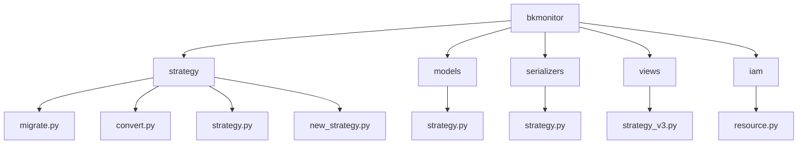
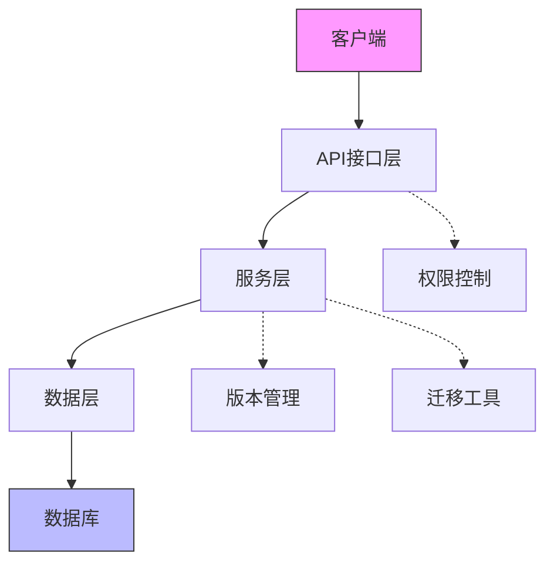
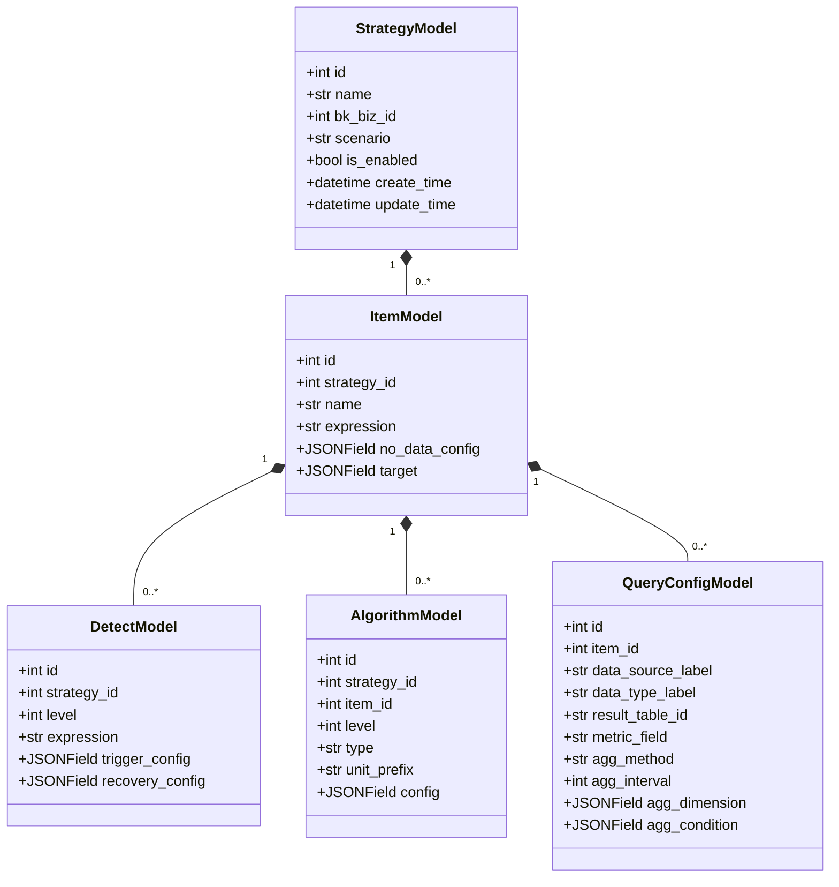
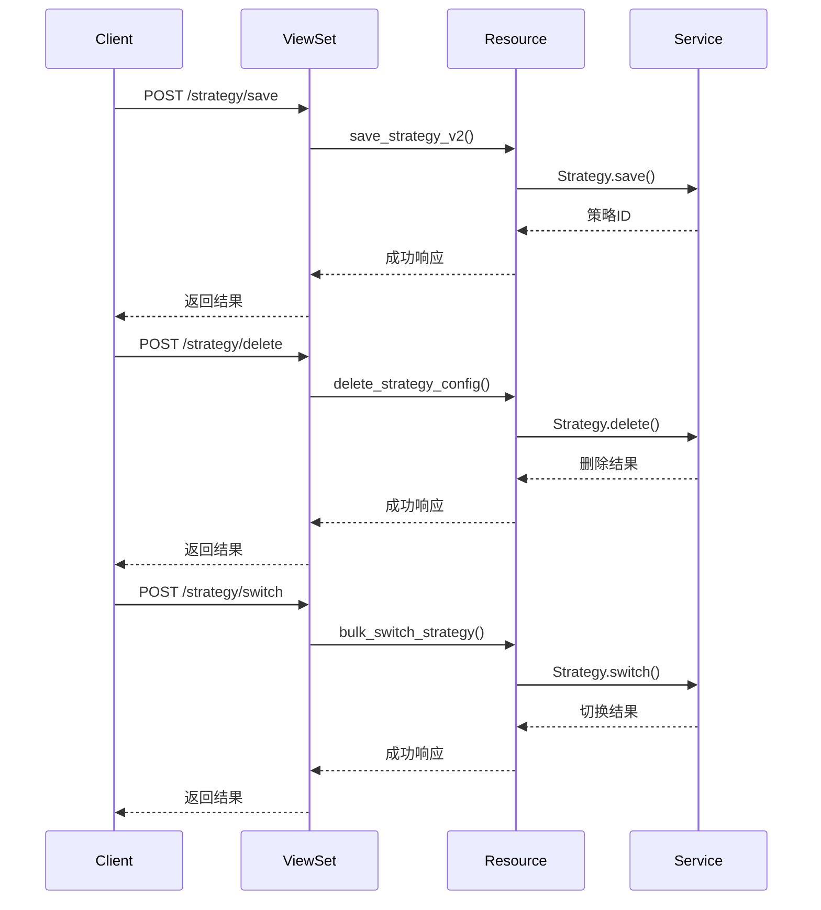
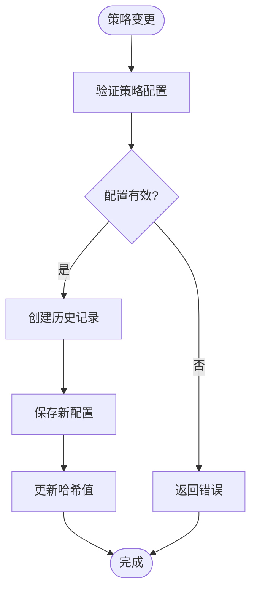
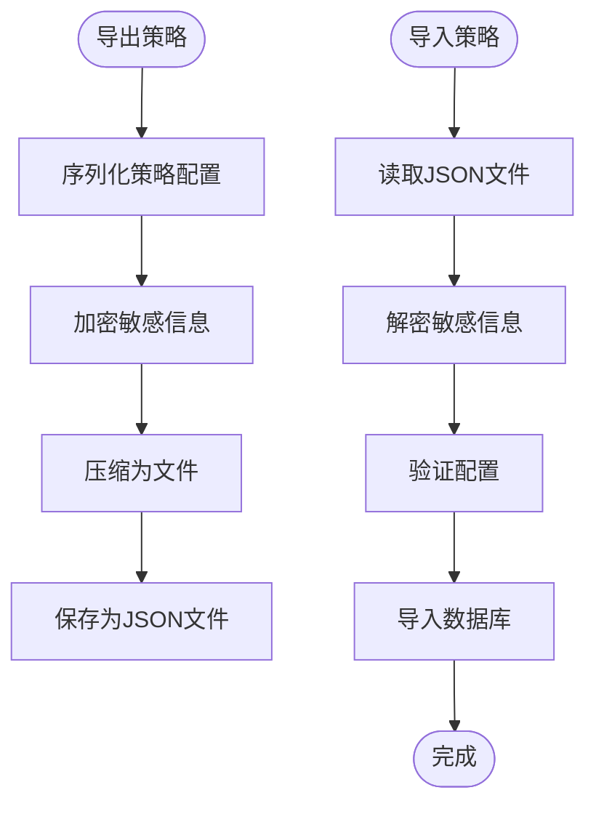
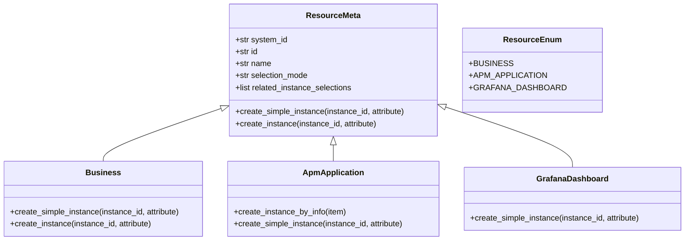
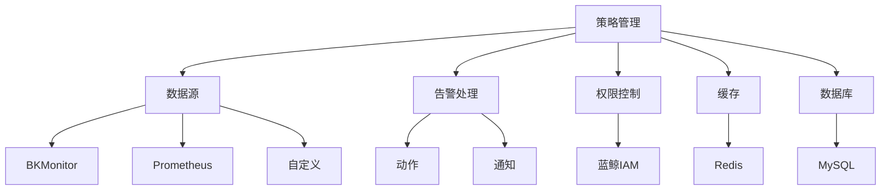

# 策略生命周期管理

<cite>
**本文档引用文件**  
- [migrate.py](file://bkmonitor\bkmonitor\strategy\migrate.py)
- [convert.py](file://bkmonitor\bkmonitor\strategy\convert.py)
- [resource.py](file://bkmonitor\bkmonitor\iam\resource.py)
- [serializers.py](file://bkmonitor\bkmonitor\strategy\serializers.py)
- [strategy_v3.py](file://bkmonitor\kernel_api\views\v4\strategy_v3.py)
- [strategy.py](file://bkmonitor\bkmonitor\strategy\strategy.py)
- [new_strategy.py](file://bkmonitor\bkmonitor\strategy\new_strategy.py)
- [strategy.py](file://bkmonitor\bkmonitor\models\strategy.py)
</cite>

## 目录
1. [引言](#引言)
2. [项目结构](#项目结构)
3. [核心组件](#核心组件)
4. [架构概述](#架构概述)
5. [详细组件分析](#详细组件分析)
6. [依赖分析](#依赖分析)
7. [性能考虑](#性能考虑)
8. [故障排除指南](#故障排除指南)
9. [结论](#结论)

## 引言
本文档旨在全面阐述蓝鲸监控平台中策略的全生命周期管理机制。涵盖策略的创建、修改、启用、停用、删除等操作，以及版本控制、迁移、权限管理等高级功能。通过深入分析代码结构和实现逻辑，为开发者和运维人员提供详尽的技术参考。

## 项目结构
蓝鲸监控平台的项目结构清晰，采用模块化设计。策略管理功能主要集中在`bkmonitor`模块下的`strategy`子模块中，相关文件包括模型定义、序列化器、视图、权限控制等。

**图示来源**
- [migrate.py](file://bkmonitor\bkmonitor\strategy\migrate.py)
- [convert.py](file://bkmonitor\bkmonitor\strategy\convert.py)
- [strategy.py](file://bkmonitor\bkmonitor\strategy\strategy.py)
- [new_strategy.py](file://bkmonitor\bkmonitor\strategy\new_strategy.py)
- [models/strategy.py](file://bkmonitor\bkmonitor\models\strategy.py)
- [serializers/strategy.py](file://bkmonitor\bkmonitor\strategy\serializers.py)
- [views/strategy_v3.py](file://bkmonitor\kernel_api\views\v4\strategy_v3.py)
- [iam/resource.py](file://bkmonitor\bkmonitor\iam\resource.py)

## 核心组件

策略生命周期管理的核心组件包括策略模型、序列化器、视图、权限管理器和迁移工具。这些组件协同工作，实现了策略的完整生命周期管理。

**组件来源**
- [models/strategy.py](file://bkmonitor\bkmonitor\models\strategy.py)
- [serializers/strategy.py](file://bkmonitor\bkmonitor\strategy\serializers.py)
- [views/strategy_v3.py](file://bkmonitor\kernel_api\views\v4\strategy_v3.py)
- [iam/resource.py](file://bkmonitor\bkmonitor\iam\resource.py)

## 架构概述

策略管理系统的架构分为数据层、服务层和接口层。数据层由Django模型构成，服务层封装了业务逻辑，接口层提供RESTful API。

**图示来源**
- [views/strategy_v3.py](file://bkmonitor\kernel_api\views\v4\strategy_v3.py)
- [strategy.py](file://bkmonitor\bkmonitor\strategy\strategy.py)
- [new_strategy.py](file://bkmonitor\bkmonitor\strategy\new_strategy.py)
- [models/strategy.py](file://bkmonitor\bkmonitor\models\strategy.py)

## 详细组件分析

### 策略模型分析

策略模型定义了策略的核心数据结构，包括策略、监控项、检测算法等。

**图示来源**
- [models/strategy.py](file://bkmonitor\bkmonitor\models\strategy.py#L0-L200)

**组件来源**
- [models/strategy.py](file://bkmonitor\bkmonitor\models\strategy.py#L0-L200)

### API接口分析

策略API接口提供了策略的增删改查和状态切换功能。

**图示来源**
- [views/strategy_v3.py](file://bkmonitor\kernel_api\views\v4\strategy_v3.py#L0-L104)
- [new_strategy.py](file://bkmonitor\bkmonitor\strategy\new_strategy.py#L0-L300)

**组件来源**
- [views/strategy_v3.py](file://bkmonitor\kernel_api\views\v4\strategy_v3.py#L0-L104)

### 策略版本管理

策略版本管理通过`StrategyHistoryModel`实现，每次策略变更都会创建历史记录。

**图示来源**
- [new_strategy.py](file://bkmonitor\bkmonitor\strategy\new_strategy.py#L0-L300)

**组件来源**
- [new_strategy.py](file://bkmonitor\bkmonitor\strategy\new_strategy.py#L0-L300)

### 策略迁移功能

策略迁移功能支持策略在不同环境间的导入导出。

**图示来源**
- [convert.py](file://bkmonitor\bkmonitor\strategy\convert.py#L0-L200)
- [migrate.py](file://bkmonitor\bkmonitor\strategy\migrate.py#L0-L126)

**组件来源**
- [convert.py](file://bkmonitor\bkmonitor\strategy\convert.py#L0-L200)
- [migrate.py](file://bkmonitor\bkmonitor\strategy\migrate.py#L0-L126)

### 权限管理分析

权限管理通过IAM系统实现，定义了策略相关的资源类型和操作权限。

**图示来源**
- [iam/resource.py](file://bkmonitor\bkmonitor\iam\resource.py#L0-L200)

**组件来源**
- [iam/resource.py](file://bkmonitor\bkmonitor\iam\resource.py#L0-L200)

## 依赖分析

策略管理模块依赖于多个核心组件，包括数据源、告警处理、权限控制等。

**图示来源**
- [models/strategy.py](file://bkmonitor\bkmonitor\models\strategy.py)
- [serializers/strategy.py](file://bkmonitor\bkmonitor\strategy\serializers.py)
- [new_strategy.py](file://bkmonitor\bkmonitor\strategy\new_strategy.py)

**组件来源**
- [models/strategy.py](file://bkmonitor\bkmonitor\models\strategy.py)
- [serializers/strategy.py](file://bkmonitor\bkmonitor\strategy\serializers.py)
- [new_strategy.py](file://bkmonitor\bkmonitor\strategy\new_strategy.py)

## 性能考虑

策略管理系统的性能主要受数据库查询和序列化操作影响。建议采用以下优化措施：

1. 使用分页查询避免全量拉取
2. 合理使用缓存减少数据库访问
3. 批量操作减少网络往返
4. 优化查询条件避免全表扫描

## 故障排除指南

### 常见问题

1. **策略无法启用**：检查策略配置是否完整，权限是否足够
2. **导入失败**：检查文件格式是否正确，敏感信息是否已解密
3. **性能下降**：检查是否有大量策略同时触发，数据库连接是否正常

### 调试方法

1. 查看系统日志定位错误
2. 使用调试工具逐步执行
3. 检查数据库状态和索引

**组件来源**
- [new_strategy.py](file://bkmonitor\bkmonitor\strategy\new_strategy.py)
- [strategy.py](file://bkmonitor\bkmonitor\strategy\strategy.py)

## 结论

本文档详细介绍了蓝鲸监控平台中策略生命周期管理的各个方面。通过深入分析代码结构和实现逻辑，为开发者提供了全面的技术参考。策略管理功能完善，支持完整的生命周期操作、版本控制、迁移和权限管理，能够满足复杂的监控需求。