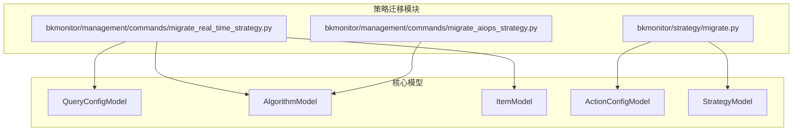
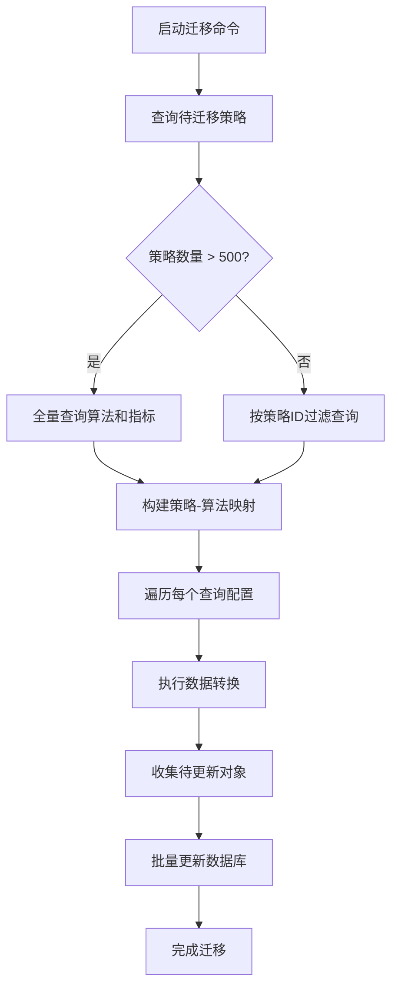
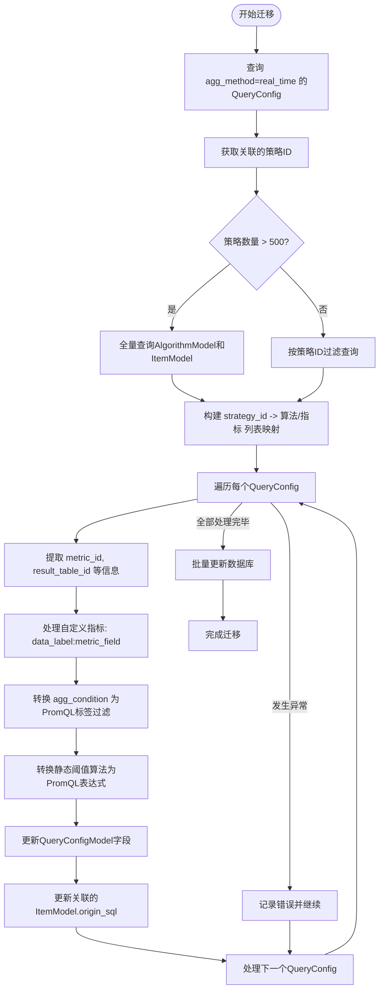
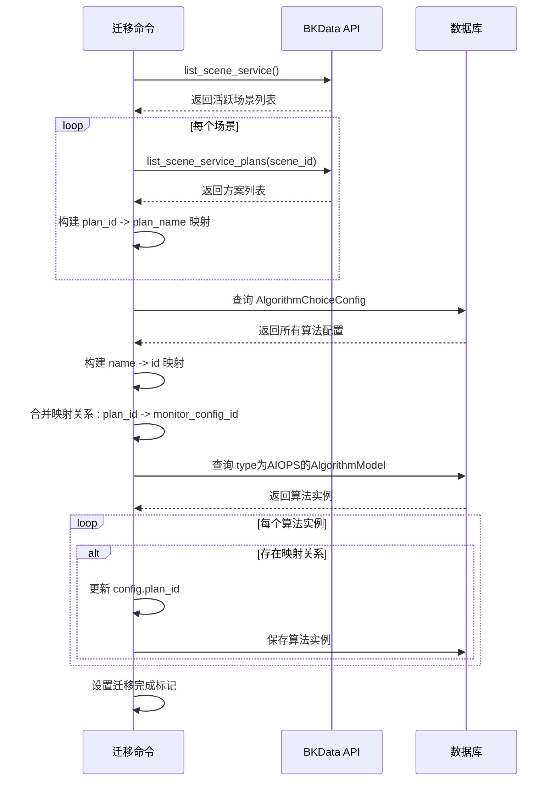
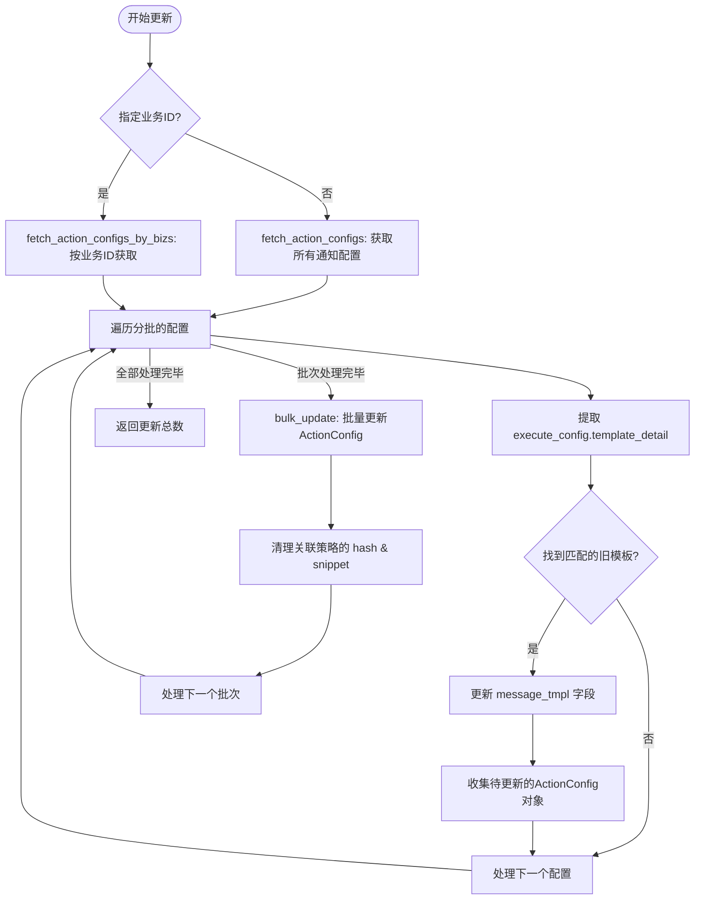
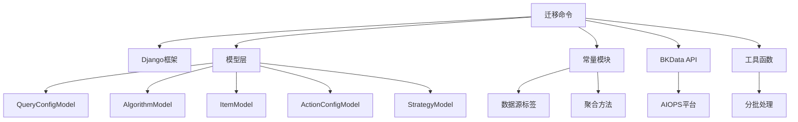

# 策略迁移管理

<cite>
**本文档引用文件**  
- [bkmonitor\bkmonitor\strategy\migrate.py](file://bkmonitor/bkmonitor/strategy/migrate.py)
- [bkmonitor\bkmonitor\management\commands\migrate_real_time_strategy.py](file://bkmonitor/bkmonitor/management/commands/migrate_real_time_strategy.py)
- [bkmonitor\bkmonitor\management\commands\migrate_aiops_strategy.py](file://bkmonitor/bkmonitor/management/commands/migrate_aiops_strategy.py)
</cite>

## 目录
1. [引言](#引言)
2. [项目结构](#项目结构)
3. [核心组件](#核心组件)
4. [架构概览](#架构概览)
5. [详细组件分析](#详细组件分析)
6. [依赖分析](#依赖分析)
7. [性能考量](#性能考量)
8. [异常处理与回退机制](#异常处理与回退机制)
9. [最佳实践](#最佳实践)
10. [结论](#结论)

## 引言
本文档旨在全面阐述蓝鲸监控平台中策略迁移管理的实现机制。重点介绍策略在不同环境间的迁移流程，包括迁移命令的使用方法、数据转换规则、一致性校验、异常处理及回退方案。详细说明实时策略迁移和AIOPS策略迁移的实现原理，支持跨业务、跨集群的策略迁移场景。

## 项目结构
蓝鲸监控平台的项目结构遵循模块化设计，策略迁移功能主要分布在`bkmonitor`模块下的`strategy`和`management/commands`子模块中。核心迁移逻辑位于`bkmonitor/strategy/migrate.py`，而具体的迁移命令则作为Django管理命令实现于`management/commands`目录下。

**图示来源**
- [bkmonitor\bkmonitor\strategy\migrate.py](file://bkmonitor/bkmonitor/strategy/migrate.py)
- [bkmonitor\bkmonitor\management\commands\migrate_real_time_strategy.py](file://bkmonitor/bkmonitor/management/commands/migrate_real_time_strategy.py)

## 核心组件
策略迁移管理的核心组件包括：
- **策略迁移模块** (`migrate.py`)：提供基础的迁移工具函数，如批量更新告警通知模板。
- **实时策略迁移命令** (`migrate_real_time_strategy.py`)：将旧版实时监控策略迁移到Prometheus数据源。
- **AIOPS策略迁移命令** (`migrate_aiops_strategy.py`)：同步AIOPS平台的智能算法方案到监控平台。

这些组件共同构成了一个完整的策略迁移体系，支持从基础配置到智能算法的全面迁移。

**节来源**
- [bkmonitor\bkmonitor\strategy\migrate.py](file://bkmonitor/bkmonitor/strategy/migrate.py)
- [bkmonitor\bkmonitor\management\commands\migrate_real_time_strategy.py](file://bkmonitor/bkmonitor/management/commands/migrate_real_time_strategy.py)
- [bkmonitor\bkmonitor\management\commands\migrate_aiops_strategy.py](file://bkmonitor/bkmonitor/management/commands/migrate_aiops_strategy.py)

## 架构概览
策略迁移的架构采用命令驱动模式，通过Django管理命令触发迁移流程。迁移过程分为数据读取、转换处理和批量更新三个阶段，确保数据一致性和操作的原子性。

**图示来源**
- [bkmonitor\bkmonitor\management\commands\migrate_real_time_strategy.py](file://bkmonitor/bkmonitor/management/commands/migrate_real_time_strategy.py)

## 详细组件分析

### 实时策略迁移分析
实时策略迁移命令负责将基于旧数据源的实时监控策略转换为Prometheus数据源格式。

#### 数据转换流程

**图示来源**
- [bkmonitor\bkmonitor\management\commands\migrate_real_time_strategy.py](file://bkmonitor/bkmonitor/management/commands/migrate_real_time_strategy.py)

**节来源**
- [bkmonitor\bkmonitor\management\commands\migrate_real_time_strategy.py](file://bkmonitor/bkmonitor/management/commands/migrate_real_time_strategy.py)

### AIOPS策略迁移分析
AIOPS策略迁移命令实现了跨平台的策略同步，将AIOPS平台的智能检测方案映射到监控平台的算法配置。

#### 跨平台迁移流程

**图示来源**
- [bkmonitor\bkmonitor\management\commands\migrate_aiops_strategy.py](file://bkmonitor/bkmonitor/management/commands/migrate_aiops_strategy.py)

**节来源**
- [bkmonitor\bkmonitor\management\commands\migrate_aiops_strategy.py](file://bkmonitor/bkmonitor/management/commands/migrate_aiops_strategy.py)

### 通知模板迁移分析
策略迁移模块还提供了通用的工具函数，用于批量更新告警通知模板。

#### 通知模板更新流程

**图示来源**
- [bkmonitor\bkmonitor\strategy\migrate.py](file://bkmonitor/bkmonitor/strategy/migrate.py)

**节来源**
- [bkmonitor\bkmonitor\strategy\migrate.py](file://bkmonitor/bkmonitor/strategy/migrate.py)

## 依赖分析
策略迁移功能依赖于多个核心模块和外部服务：

**图示来源**
- [bkmonitor\bkmonitor\management\commands\migrate_real_time_strategy.py](file://bkmonitor/bkmonitor/management/commands/migrate_real_time_strategy.py)
- [bkmonitor\bkmonitor\management\commands\migrate_aiops_strategy.py](file://bkmonitor/bkmonitor/management/commands/migrate_aiops_strategy.py)

**节来源**
- [bkmonitor\bkmonitor\management\commands\migrate_real_time_strategy.py](file://bkmonitor/bkmonitor/management/commands/migrate_real_time_strategy.py)
- [bkmonitor\bkmonitor\management\commands\migrate_aiops_strategy.py](file://bkmonitor/bkmonitor/management/commands/migrate_aiops_strategy.py)

## 性能考量
策略迁移在设计时充分考虑了性能问题：
1. **分批处理**：使用`chunks`工具函数对大量数据进行分批查询和更新，避免内存溢出。
2. **批量操作**：采用`bulk_update`进行数据库批量更新，显著减少数据库交互次数。
3. **查询优化**：当策略数量超过500时，采用全量查询+内存映射的方式，避免大量IN查询导致的SQL性能退化。
4. **生成器模式**：使用生成器`fetch_action_configs_generator`逐批返回数据，降低内存占用。

## 异常处理与回退机制
### 异常处理
迁移过程实现了完善的异常处理机制：
- **细粒度异常捕获**：在处理每个策略时使用`try-except`，确保单个策略的失败不会中断整个迁移流程。
- **错误日志记录**：详细记录每个失败策略的ID和错误信息，便于问题排查。
- **幂等性设计**：迁移命令具有幂等性，可安全地重复执行。

### 回退方案
虽然迁移操作本身不可逆，但系统提供了以下保护措施：
1. **数据备份**：建议在执行迁移前对相关数据库表进行备份。
2. **配置标识重置**：更新配置后会重置`hash`和`snippet`字段，确保asCode模块能正确识别配置变更。
3. **分阶段执行**：迁移过程分为查询、转换、更新三个阶段，可在任一阶段中断并检查数据。

## 最佳实践

### 迁移前准备
1. **环境检查**：确认目标环境已正确配置Prometheus数据源。
2. **数据备份**：备份`QueryConfigModel`、`AlgorithmModel`和`ItemModel`相关数据。
3. **影响评估**：评估迁移对现有监控策略的影响范围。

### 迁移过程监控
1. **日志监控**：关注命令输出日志，特别是错误信息。
2. **进度跟踪**：通过`[done] process strategy`日志跟踪迁移进度。
3. **资源监控**：监控数据库连接数、CPU和内存使用情况。

### 迁移后验证
1. **数量校验**：确认迁移的策略数量与预期一致。
2. **功能测试**：随机选取迁移后的策略，验证其告警功能是否正常。
3. **数据一致性检查**：核对PromQL表达式是否正确转换了原有的聚合条件和阈值规则。

## 结论
蓝鲸监控平台的策略迁移管理提供了一套完整、可靠的解决方案，支持从基础监控策略到AIOPS智能算法的全面迁移。通过模块化的设计和健壮的异常处理机制，确保了迁移过程的安全性和稳定性。建议在生产环境执行迁移前，先在测试环境充分验证，并遵循最佳实践中的准备、监控和验证步骤。