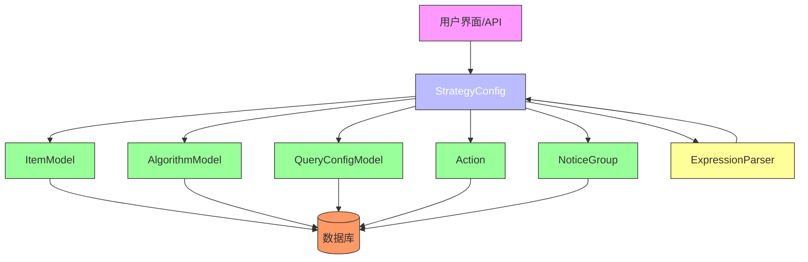
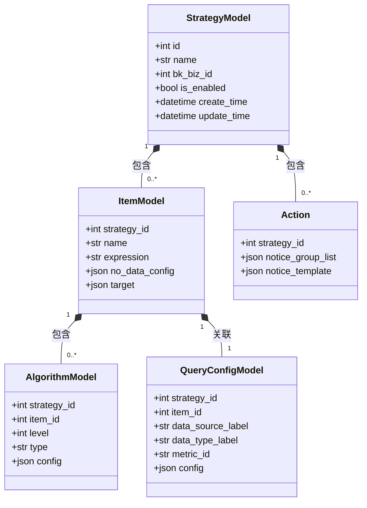
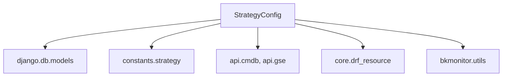

# 策略管理

<cite>
**本文档引用文件**  
- [bkmonitor\bkmonitor\strategy\strategy.py](file://bkmonitor\bkmonitor\strategy\strategy.py)
- [bkmonitor\bkmonitor\models\strategy.py](file://bkmonitor\bkmonitor\models\strategy.py)
- [bkmonitor\bkmonitor\strategy\expression.py](file://bkmonitor\bkmonitor\strategy\expression.py)
- [bkmonitor\constants\strategy.py](file://bkmonitor\constants\strategy.py)
</cite>

## 目录
1. [引言](#引言)
2. [项目结构](#项目结构)
3. [核心组件](#核心组件)
4. [架构概述](#架构概述)
5. [详细组件分析](#详细组件分析)
6. [依赖分析](#依赖分析)
7. [性能考虑](#性能考虑)
8. [故障排除指南](#故障排除指南)
9. [结论](#结论)

## 引言
本文档旨在为“蓝鲸智云 - 监控平台”中的策略管理功能提供一份全面、深入的技术文档。该功能是整个监控系统的核心，负责定义、配置、存储和执行监控策略，以实现对IT基础设施和业务应用的自动化、智能化监控。文档将详细阐述策略的创建、配置、生命周期管理、表达式解析以及与数据源的关联机制，帮助用户和开发者深入理解其内部工作原理。

## 项目结构
策略管理功能的代码主要分布在`bkmonitor/bkmonitor/strategy/`和`bkmonitor/bkmonitor/models/`两个目录下。`strategy/`目录包含了策略配置的业务逻辑、表达式解析器和序列化器，而`models/`目录则定义了策略相关的所有数据库模型。

```mermaid
graph TD
subgraph "策略管理模块"
Strategy[策略配置<br/>strategy.py]
Expression[表达式解析<br/>expression.py]
Models[数据模型<br/>models/strategy.py]
Constants[常量定义<br/>constants/strategy.py]
end
Strategy --> Models : "依赖"
Expression --> Strategy : "被调用"
Constants --> Strategy : "提供常量"
Constants --> Models : "提供常量"
```

**图源**
- [bkmonitor\bkmonitor\strategy\strategy.py](file://bkmonitor\bkmonitor\strategy\strategy.py)
- [bkmonitor\bkmonitor\strategy\expression.py](file://bkmonitor\bkmonitor\strategy\expression.py)
- [bkmonitor\bkmonitor\models\strategy.py](file://bkmonitor\bkmonitor\models\strategy.py)
- [bkmonitor\constants\strategy.py](file://bkmonitor\constants\strategy.py)

**本节源**
- [bkmonitor\bkmonitor\strategy\strategy.py](file://bkmonitor\bkmonitor\strategy\strategy.py)
- [bkmonitor\bkmonitor\models\strategy.py](file://bkmonitor\bkmonitor\models\strategy.py)

## 核心组件
策略管理功能的核心组件包括`StrategyConfig`类、`ItemModel`、`AlgorithmModel`、`QueryConfigModel`以及`expression.py`中的表达式解析器。`StrategyConfig`是策略配置的入口，封装了创建、更新、删除等所有操作。`ItemModel`、`AlgorithmModel`和`QueryConfigModel`是数据库模型，分别代表监控项、检测算法和查询配置。`expression.py`则负责解析和执行策略表达式。

**本节源**
- [bkmonitor\bkmonitor\strategy\strategy.py](file://bkmonitor\bkmonitor\strategy\strategy.py)
- [bkmonitor\bkmonitor\models\strategy.py](file://bkmonitor\bkmonitor\models\strategy.py)
- [bkmonitor\bkmonitor\strategy\expression.py](file://bkmonitor\bkmonitor\strategy\expression.py)

## 架构概述
策略管理功能采用分层架构，上层是业务逻辑层（`StrategyConfig`），中层是数据访问层（Django Models），底层是数据库。`StrategyConfig`类作为协调者，接收外部请求，调用相应的模型进行数据操作，并处理复杂的业务逻辑，如表达式解析和数据校验。



**图源**
- [bkmonitor\bkmonitor\strategy\strategy.py](file://bkmonitor\bkmonitor\strategy\strategy.py)
- [bkmonitor\bkmonitor\models\strategy.py](file://bkmonitor\bkmonitor\models\strategy.py)
- [bkmonitor\bkmonitor\strategy\expression.py](file://bkmonitor\bkmonitor\strategy\expression.py)

## 详细组件分析

### 策略配置分析
`StrategyConfig`类是策略管理的核心，它通过一个统一的接口来管理策略的整个生命周期。

#### 策略创建与更新
策略的创建和更新操作由`StrategyConfig`类的`save`方法统一处理。该方法首先获取策略的原始配置，然后根据传入的新配置进行更新。如果在更新过程中发生任何验证错误或异常，系统会自动回滚到更新前的状态，确保数据的一致性。

```python
def save(self):
    try:
        old_strategy_dict = self.strategy_dict
        # ... 执行更新操作 ...
    except ValidationError as e:
        self.update_strategy(old_strategy_dict) # 回滚
        raise UpdateStrategyError({"msg": ",".join(e.detail)})
    except Exception as e:
        self.update_strategy(old_strategy_dict) # 回滚
        raise UpdateStrategyError({"msg": str(e)})
```

**图源**
- [bkmonitor\bkmonitor\strategy\strategy.py](file://bkmonitor\bkmonitor\strategy\strategy.py#L500-L520)

**本节源**
- [bkmonitor\bkmonitor\strategy\strategy.py](file://bkmonitor\bkmonitor\strategy\strategy.py)

#### 策略删除
策略的删除是一个级联操作，需要删除与该策略相关的所有子对象，包括监控项、检测算法、查询配置、动作和通知组等。`StrategyConfig.delete()`方法通过遍历一个预定义的模型列表，依次删除所有关联对象，最后删除策略本身。

```python
def delete(self):
    related_model_list = [
        self.action_notice_mappings,
        self.notice_template_data,
        self.action_data,
        self.detect_algorithm_data,
        self.data_source_data,
        self.item_data,
    ]
    for model_data in related_model_list:
        for obj in list(model_data.values()):
            obj.delete()
    self.strategy.delete()
```

**图源**
- [bkmonitor\bkmonitor\strategy\strategy.py](file://bkmonitor\bkmonitor\strategy\strategy.py#L600-L615)

**本节源**
- [bkmonitor\bkmonitor\strategy\strategy.py](file://bkmonitor\bkmonitor\strategy\strategy.py)

### 数据模型分析
策略管理功能的数据模型定义了策略、监控项、算法等核心实体的结构。

#### 核心数据模型
以下是策略管理功能的核心数据模型及其关系。



**图源**
- [bkmonitor\bkmonitor\models\strategy.py](file://bkmonitor\bkmonitor\models\strategy.py)

**本节源**
- [bkmonitor\bkmonitor\models\strategy.py](file://bkmonitor\bkmonitor\models\strategy.py)

### 表达式解析分析
策略表达式用于定义多个监控项之间的逻辑关系，其解析过程分为词法分析和语法分析两个阶段。

#### 表达式解析流程
表达式解析器使用PLY（Python Lex-Yacc）库，将字符串形式的表达式（如"A && (B || C)"）解析为一个由`Item`对象构成的抽象语法树（AST）。

```mermaid
flowchart TD
Start([输入表达式<br/>"A && (B || C)"]) --> Lexer["词法分析器<br/>(lex)"]
Lexer --> Tokens["输出Token流<br/>[VAR:A, AND, LPAREN, VAR:B, OR, VAR:C, RPAREN]"]
Tokens --> Parser["语法分析器<br/>(yacc)"]
Parser --> AST["构建抽象语法树<br/>AndItem(VarItem(A), OrItem(VarItem(B), VarItem(C)))"]
AST --> Eval["执行eval(context)"]
Eval --> Result["返回计算结果"]
```

**图源**
- [bkmonitor\bkmonitor\strategy\expression.py](file://bkmonitor\bkmonitor\strategy\expression.py)

**本节源**
- [bkmonitor\bkmonitor\strategy\expression.py](file://bkmonitor\bkmonitor\strategy\expression.py)

## 依赖分析
策略管理功能依赖于多个内部和外部组件。内部依赖包括Django框架、数据库模型和常量定义。外部依赖则通过`api`模块与其他系统（如CMDB、GSE、BK-Login）进行交互，以获取主机信息、执行命令和进行用户认证。



**图源**
- [bkmonitor\bkmonitor\strategy\strategy.py](file://bkmonitor\bkmonitor\strategy\strategy.py)
- [bkmonitor\bkmonitor\models\strategy.py](file://bkmonitor\bkmonitor\models\strategy.py)

**本节源**
- [bkmonitor\bkmonitor\strategy\strategy.py](file://bkmonitor\bkmonitor\strategy\strategy.py)

## 性能考虑
策略管理功能在设计时考虑了性能因素。例如，`UserGroup`模型使用了`@cached_property`装饰器来缓存`duty_plans`和`duty_arranges`属性，避免了重复的数据库查询。此外，数据库表上定义了适当的索引（如`alarm_strategy_v2`表上的`is_enabled, bk_biz_id, scenario`联合索引），以加速常见的查询操作。

## 故障排除指南
当策略配置出现问题时，可以按照以下步骤进行排查：
1.  **检查数据源**：确认`QueryConfigModel`中的`data_source_label`和`data_type_label`是否正确，以及`metric_id`是否存在。
2.  **检查监控目标**：确认`ItemModel`中的`target`字段是否正确配置了需要监控的主机或服务。
3.  **检查表达式语法**：如果使用了策略表达式，确保其语法正确，没有非法字符或括号不匹配。
4.  **查看操作历史**：查询`StrategyHistoryModel`表，查看最近的操作记录和错误信息，以定位问题发生的时间点和原因。

**本节源**
- [bkmonitor\bkmonitor\models\strategy.py](file://bkmonitor\bkmonitor\models\strategy.py)
- [bkmonitor\bkmonitor\strategy\strategy.py](file://bkmonitor\bkmonitor\strategy\strategy.py)

## 结论
本文档详细分析了“蓝鲸智云 - 监控平台”中策略管理功能的实现。该功能通过清晰的分层架构和模块化设计，实现了对监控策略的全生命周期管理。理解其核心组件、数据模型和工作流程，对于有效配置和维护监控系统至关重要。