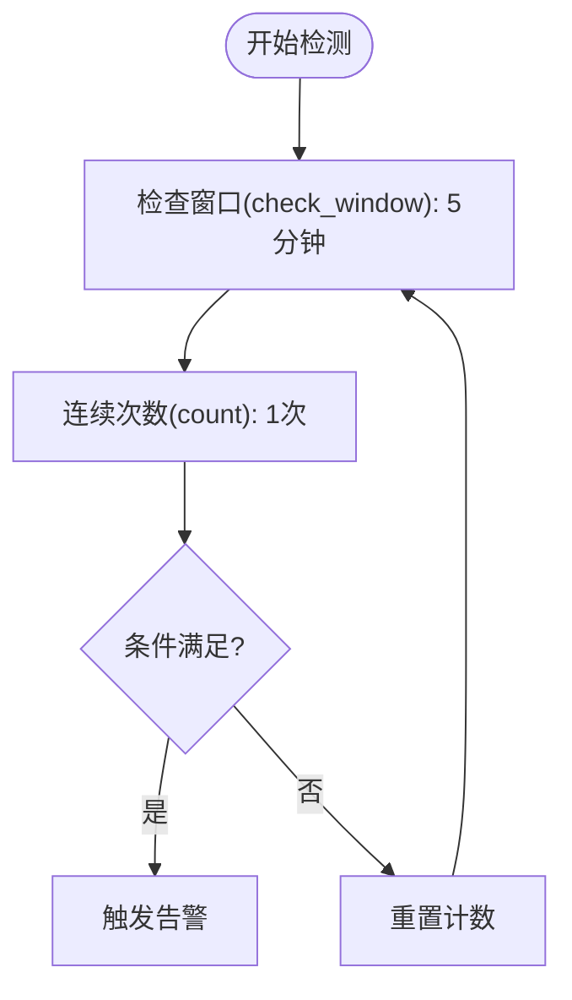

# 告警规则设置

<cite>
**本文档引用的文件**   
- [strategy.py](file://bkmonitor/bkmonitor/strategy/strategy.py)
- [models/strategy.py](file://bkmonitor/bkmonitor/models/strategy.py)
- [save_alarm_strategy_v3.md](file://bkmonitor/docs/api/apidocs/zh_hans/save_alarm_strategy_v3.md)
- [save_rule_group.md](file://bkmonitor/docs/api/apidocs/zh_hans/save_rule_group.md)
- [test_notice_execute.py](file://bkmonitor/alarm_backends/tests/service/fta_action/test_notice_execute.py)
</cite>

## 目录
1. [引言](#引言)
2. [告警规则核心参数](#告警规则核心参数)
3. [多条件组合规则配置](#多条件组合规则配置)
4. [告警级别与通知策略](#告警级别与通知策略)
5. [实际配置案例](#实际配置案例)
6. [验证与测试机制](#验证与测试机制)

## 引言
告警规则设置是监控系统中的关键功能，用于定义在何种条件下触发告警。本文档详细阐述了告警规则的配置方法，包括阈值条件、比较运算符、触发条件、持续时间等核心参数的含义和配置方式。通过深入分析代码实现和实际案例，帮助用户理解和掌握复杂的告警规则配置。

## 告警规则核心参数

### 阈值条件与比较运算符
阈值条件是告警规则中最基本的判断依据，通过比较运算符与阈值进行对比来决定是否触发告警。在系统中，比较运算符通过`method`字段进行配置，支持多种运算方式。

```json
"algorithms": [
    {
        "level": 1,
        "type": "Threshold",
        "config": [
            [
                {
                    "method": "gte",
                    "threshold": "80"
                }
            ]
        ],
        "unit_prefix": "%"
    }
]
```

**比较运算符类型**：
- `gt`：大于
- `gte`：大于等于
- `lt`：小于
- `lte`：小于等于
- `eq`：等于
- `neq`：不等于

这些运算符在代码中通过字典映射实现，例如在`promql_import/resources.py`文件中可以看到：
```python
"method": self.allowed_threshold_method.get(rule.get("operator", ">"), "gt")
```

**Section sources**
- [save_alarm_strategy_v3.md](file://bkmonitor/docs/api/apidocs/zh_hans/save_alarm_strategy_v3.md#L417-L554)
- [resources.py](file://bkmonitor/packages/monitor_web/promql_import/resources.py#L390-L418)

### 触发条件与持续时间
触发条件定义了告警被触发的逻辑，包括检查窗口和连续次数。持续时间参数控制告警在满足条件后需要持续多久才会真正触发。



**触发配置参数**：
- `check_window`：检查窗口，单位为分钟，表示在多长时间内进行检测
- `count`：连续次数，表示需要连续满足条件的次数
- `timedelta`：防御窗口大小，单位为秒，用于防止告警风暴

在代码实现中，这些参数通过`trigger_config`和`recovery_config`对象进行管理：
```json
"trigger_config": {
    "count": 1,
    "check_window": 5
},
"recovery_config": {
    "check_window": 5
}
```

**Diagram sources**
- [save_alarm_strategy_v3.md](file://bkmonitor/docs/api/apidocs/zh_hans/save_alarm_strategy_v3.md#L417-L554)

**Section sources**
- [save_alarm_strategy_v3.md](file://bkmonitor/docs/api/apidocs/zh_hans/save_alarm_strategy_v3.md#L417-L554)

## 多条件组合规则配置
多条件组合规则允许用户通过逻辑运算符（AND/OR）将多个条件组合起来，形成更复杂的告警判断逻辑。

### 逻辑组合方式
系统支持通过`connector`字段配置条件之间的逻辑关系：
- `and`：所有条件都必须满足
- `or`：任意一个条件满足即可

```json
"detects": [
    {
        "level": 2,
        "expression": "",
        "trigger_config": {
            "count": 1,
            "check_window": 5
        },
        "recovery_config": {
            "check_window": 5
        },
        "connector": "and"
    }
]
```

### 条件连接配置
在更复杂的场景中，可以通过`condition`字段进行条件连接配置，支持`and`连接条件。

```json
"condition": {
    "field": "status",
    "value": ["error", "critical"],
    "method": "include",
    "condition": "and"
}
```

这种配置方式允许用户构建复杂的条件树，实现精细化的告警控制。

**Section sources**
- [save_alarm_strategy_v3.md](file://bkmonitor/docs/api/apidocs/zh_hans/save_alarm_strategy_v3.md#L417-L554)
- [search_rule_groups.md](file://bkmonitor/docs/api/apidocs/zh_hans/search_rule_groups.md#L70-L94)

## 告警级别与通知策略

### 告警级别设置
告警级别用于区分告警的严重程度，在系统中通过`level`字段进行配置，支持三个级别：

```python
level = models.IntegerField(
    "告警级别",
    default=3,
    choices=(
        (1, _lazy("致命")),
        (2, _lazy("预警")),
        (3, _lazy("提醒")),
    ),
)
```

- **致命(1)**：最高级别，表示系统出现严重故障，需要立即处理
- **预警(2)**：中级级别，表示系统出现潜在问题，需要关注
- **提醒(3)**：最低级别，表示系统出现一般性问题，可后续处理

告警级别不仅影响通知的紧急程度，还会影响通知策略的执行方式。

### 通知策略配置
通知策略定义了告警触发后如何通知相关人员，包括通知组、通知方式和通知频率等配置。

```json
"notice": {
    "user_groups": [1, 2],
    "signal": ["abnormal", "recovered"],
    "options": {
        "converge_config": {
            "need_biz_converge": true
        },
        "noise_reduce_config": {
            "is_enabled": true,
            "count": 10,
            "dimensions": ["ip"]
        },
        "start_time": "00:00:00",
        "end_time": "23:59:59"
    },
    "config": {
        "interval_notify_mode": "standard",
        "notify_interval": 7200,
        "template": [...]
    }
}
```

**通知策略关键参数**：
- `user_groups`：告警组ID列表，指定接收通知的用户组
- `signal`：触发信号，包括异常、恢复、关闭等状态
- `converge_config`：收敛配置，用于防止告警风暴
- `noise_reduce_config`：降噪配置，减少重复告警
- `notify_interval`：通知间隔，单位为秒

告警级别直接影响通知策略的执行，高级别告警通常会触发更紧急的通知方式和更短的通知间隔。

**Section sources**
- [models/strategy.py](file://bkmonitor/bkmonitor/models/strategy.py#L200-L400)
- [save_alarm_strategy_v3.md](file://bkmonitor/docs/api/apidocs/zh_hans/save_alarm_strategy_v3.md#L417-L554)

## 实际配置案例
以下是一个完整的告警规则配置案例，展示了如何设置复杂的告警条件。

### CPU使用率过高告警
```json
{
    "id": 36,
    "bk_biz_id": 7,
    "scenario": "host_process",
    "name": "CPU使用率过高",
    "is_enabled": true,
    "items": [
        {
            "name": "AVG(CPU使用率)",
            "query_configs": [
                {
                    "data_source_label": "bk_monitor",
                    "data_type_label": "time_series",
                    "result_table_id": "system.cpu_summary",
                    "agg_method": "AVG",
                    "agg_interval": 60,
                    "metric_field": "usage",
                    "unit": "percent"
                }
            ],
            "algorithms": [
                {
                    "level": 1,
                    "type": "Threshold",
                    "config": [
                        [
                            {
                                "method": "gte",
                                "threshold": "80"
                            }
                        ]
                    ]
                }
            ]
        }
    ],
    "detects": [
        {
            "level": 1,
            "trigger_config": {
                "count": 3,
                "check_window": 5
            },
            "recovery_config": {
                "check_window": 5
            },
            "connector": "and"
        }
    ],
    "notice": {
        "user_groups": [1],
        "signal": ["abnormal", "recovered"],
        "options": {
            "converge_config": {
                "need_biz_converge": true
            },
            "notify_interval": 3600
        }
    }
}
```

**配置说明**：
1. 监控项：平均CPU使用率
2. 数据源：BK监控采集器的时序数据
3. 告警条件：CPU使用率大于等于80%
4. 触发条件：连续3个5分钟检查窗口都满足条件
5. 告警级别：致命(1级)
6. 通知策略：通知用户组1，异常和恢复时通知，通知间隔1小时

这个案例展示了如何将多个参数组合起来，创建一个实用的生产环境告警规则。

**Section sources**
- [save_alarm_strategy_v3.md](file://bkmonitor/docs/api/apidocs/zh_hans/save_alarm_strategy_v3.md#L417-L554)

## 验证与测试机制
为了确保告警规则配置的准确性和有效性，系统提供了多种验证和测试机制。

### 配置验证
系统在创建和更新告警规则时会进行严格的参数验证，确保配置的合法性。

```python
def create(cls, strategy_dict):
    try:
        strategy = Strategy.objects.create(**strategy_dict)
        # 创建items表记录
        for item in item_list:
            instance.create_item(item)
        # 其他创建逻辑...
    except ValidationError as e:
        # 创建失败，删除该策略所有的关联配置
        if instance:
            instance.delete()
        raise CreateStrategyError({"msg": ",".join(e.detail)})
```

验证机制包括：
- 参数类型验证
- 必填字段验证
- 业务逻辑验证
- 数据一致性验证

### 测试执行
系统提供了测试执行功能，允许用户在正式启用前测试告警规则的有效性。

```python
def update(self, strategy_dict):
    old_strategy_dict = copy.deepcopy(self.strategy_dict)
    try:
        self.update_strategy(strategy_dict)
        # 执行其他更新逻辑...
    except Exception as e:
        # 如果修改失败，回退之前的配置
        self.update_strategy(old_strategy_dict)
        raise UpdateStrategyError({"msg": str(e)})
```

测试机制特点：
- 支持配置回滚
- 提供详细的错误信息
- 支持预览告警效果
- 可以模拟不同场景的测试

通过这些验证和测试机制，可以确保告警规则在生产环境中的稳定性和可靠性。

**Section sources**
- [strategy.py](file://bkmonitor/bkmonitor/strategy/strategy.py#L600-L800)