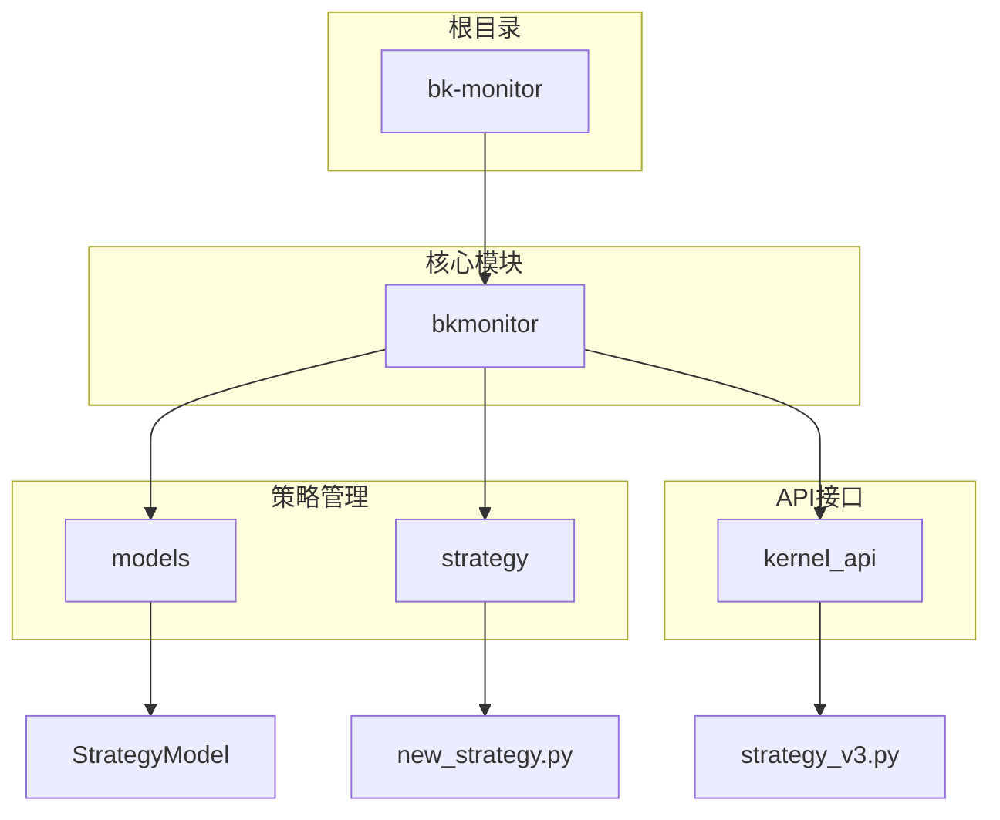
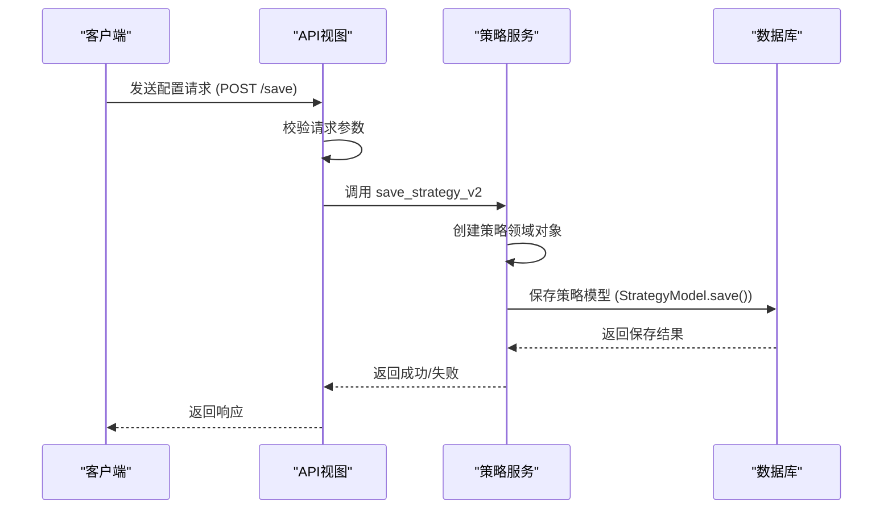
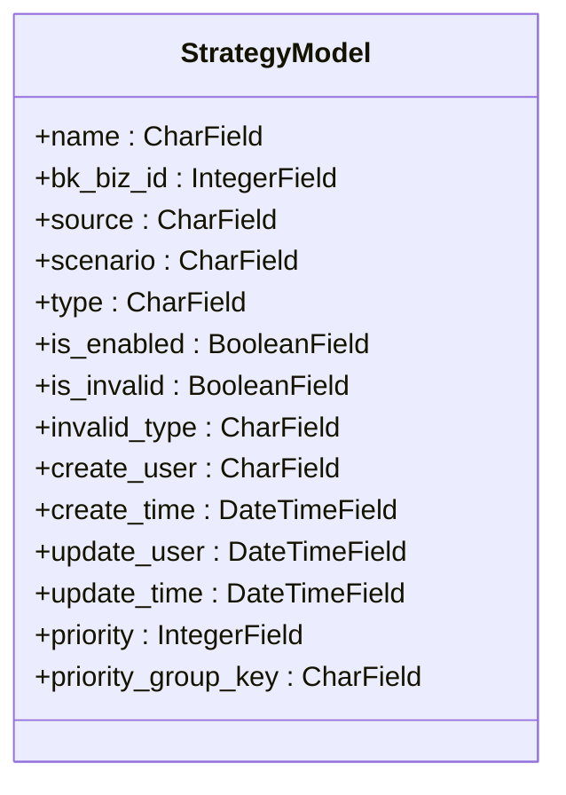
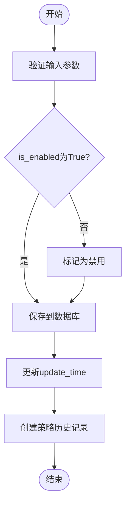
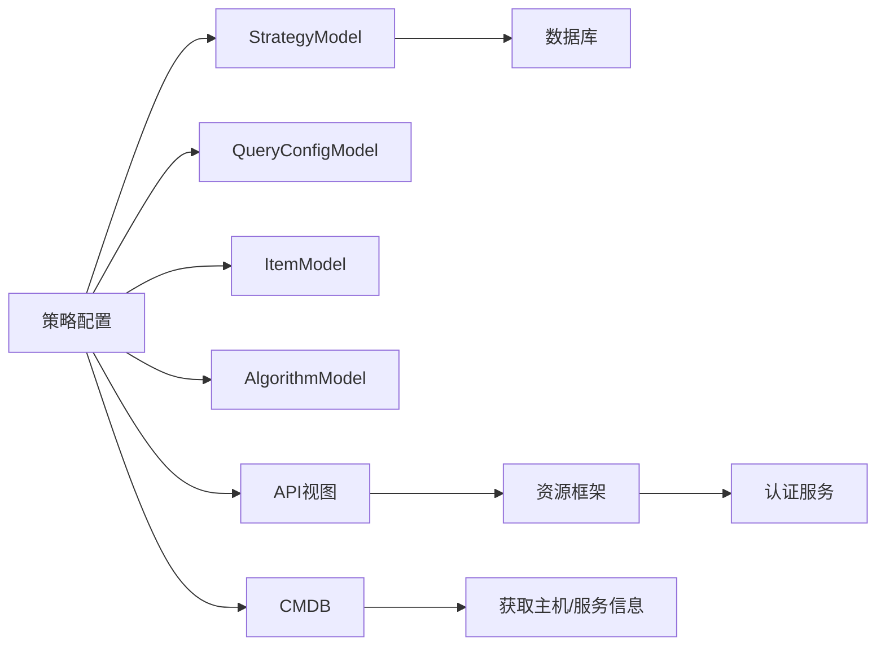

# 基础配置

<cite>
**本文档引用的文件**   
- [strategy.py](file://bkmonitor\bkmonitor\models\strategy.py#L333-L422)
- [v4\strategy_v3.py](file://bkmonitor\kernel_api\views\v4\strategy_v3.py#L0-L104)
- [v2.py](file://bkmonitor\packages\monitor_web\strategies\resources\v2.py#L2999-L3039)
</cite>

## 目录
1. [简介](#简介)
2. [项目结构](#项目结构)
3. [核心组件](#核心组件)
4. [架构概述](#架构概述)
5. [详细组件分析](#详细组件分析)
6. [依赖分析](#依赖分析)
7. [性能考虑](#性能考虑)
8. [故障排除指南](#故障排除指南)
9. [结论](#结论)
10. [附录](#附录)（如有必要）

## 简介
本文档旨在为监控策略的基础配置提供全面的指导。文档重点介绍策略名称、监控目标类型（主机、服务、容器等）、监控周期、策略启用状态等基础字段的含义和配置方法。通过详细的字段说明、数据类型、取值范围和验证规则，帮助用户理解如何正确配置监控策略。同时，文档还提供了通过API创建和修改基础配置的方法，并分享了最佳实践，如命名规范和目标选择策略，以帮助用户快速完成策略的基础设置。

## 项目结构
项目`bk-monitor`是一个复杂的监控系统，其核心模块位于`bkmonitor`目录下。该系统采用模块化设计，将不同的功能划分为独立的子模块，如`alarm_backends`（告警后端）、`api`（API接口）、`apm`（应用性能管理）和`strategy`（策略管理）。策略管理的核心逻辑和数据模型主要集中在`bkmonitor/bkmonitor`目录中，特别是`models/strategy.py`文件定义了策略相关的所有数据结构，而`strategy`子目录则包含了策略的业务逻辑处理。

**图示来源**
- [strategy.py](file://bkmonitor\bkmonitor\models\strategy.py#L333-L422)
- [v4\strategy_v3.py](file://bkmonitor\kernel_api\views\v4\strategy_v3.py#L0-L104)

**本节来源**
- [strategy.py](file://bkmonitor\bkmonitor\models\strategy.py#L333-L422)
- [v4\strategy_v3.py](file://bkmonitor\kernel_api\views\v4\strategy_v3.py#L0-L104)

## 核心组件
监控策略的基础配置由几个核心组件构成：**策略模型**（`StrategyModel`）定义了配置的数据库结构；**策略领域对象**（`Strategy`）封装了业务逻辑和数据转换；**API视图**（`AlarmStrategyV3ViewSet`）提供了外部访问接口。这些组件协同工作，实现了策略的创建、读取、更新和删除（CRUD）操作。

**本节来源**
- [strategy.py](file://bkmonitor\bkmonitor\models\strategy.py#L333-L422)
- [v4\strategy_v3.py](file://bkmonitor\kernel_api\views\v4\strategy_v3.py#L0-L104)

## 架构概述
整个监控策略的配置流程遵循典型的分层架构。用户或外部系统通过API接口（如`/api/v3/alarm_strategy/search/`）发起请求。API视图层接收请求，进行参数校验和权限控制。随后，业务逻辑层（`Strategy`类）被调用，它负责将数据库模型（`StrategyModel`）转换为包含完整业务逻辑的领域对象。最后，数据访问层与数据库交互，完成数据的持久化。这种分层设计确保了代码的可维护性和可扩展性。

**图示来源**
- [v4\strategy_v3.py](file://bkmonitor\kernel_api\views\v4\strategy_v3.py#L0-L104)
- [strategy.py](file://bkmonitor\bkmonitor\models\strategy.py#L333-L422)

## 详细组件分析
### 策略模型分析
`StrategyModel`是策略基础配置的核心数据模型，它定义了所有持久化字段。

#### 基础字段定义

**图示来源**
- [strategy.py](file://bkmonitor\bkmonitor\models\strategy.py#L333-L422)

**本节来源**
- [strategy.py](file://bkmonitor\bkmonitor\models\strategy.py#L333-L422)

#### 字段详解
**策略名称 (name)**
- **数据类型**: `CharField`
- **最大长度**: 128
- **含义**: 策略的唯一标识名称，用于在用户界面中识别和搜索。
- **验证规则**: 必填，不能为空。

**监控目标类型 (scenario)**
- **数据类型**: `CharField`
- **最大长度**: 32
- **含义**: 定义了策略监控的对象类型。常见的值包括：
  - `os`: 操作系统/主机
  - `service`: 服务
  - `kubernetes`: 容器（Kubernetes）
- **获取方式**: 该字段的值决定了监控的场景，系统会根据此值来确定监控目标的类型。

**监控周期**
- **说明**: 监控周期并非直接在`StrategyModel`中定义，而是通过关联的`QueryConfigModel`中的`config`字段来配置。`config`是一个JSON字段，其中包含了如`agg_interval`（聚合间隔）等参数，这些参数共同决定了数据采集和聚合的频率。

**策略启用状态 (is_enabled)**
- **数据类型**: `BooleanField`
- **默认值**: `True`
- **含义**: 控制策略是否处于激活状态。`True`表示策略正在运行并会触发告警；`False`表示策略被禁用。
- **使用场景**: 在维护或测试期间，可以临时禁用策略以避免产生不必要的告警。

**其他重要字段**
- **业务ID (bk_biz_id)**: 整数类型，标识该策略所属的业务。
- **创建/更新时间 (create_time/update_time)**: `DateTimeField`，自动记录策略的创建和最后修改时间。
- **优先级 (priority)**: 整数类型，用于在多个策略匹配时确定执行顺序。

### API接口分析
API接口是创建和修改基础配置的主要途径。

#### API端点
根据`AlarmStrategyV3ViewSet`的定义，主要的API端点包括：
- **保存/创建**: `POST /api/v3/alarm_strategy/save/` (对应 `save_strategy_v2`)
- **批量更新**: `POST /api/v3/alarm_strategy/update_bulk/` (对应 `update_partial_strategy_v2`)
- **删除**: `POST /api/v3/alarm_strategy/delete/` (对应 `delete_strategy_config`)
- **查询**: `POST /api/v3/alarm_strategy/search/` (对应 `get_strategy_list_v2`)

**图示来源**
- [v4\strategy_v3.py](file://bkmonitor\kernel_api\views\v4\strategy_v3.py#L0-L104)

**本节来源**
- [v4\strategy_v3.py](file://bkmonitor\kernel_api\views\v4\strategy_v3.py#L0-L104)

#### 保存和更新机制
1.  **API调用**: 客户端调用`save_strategy_v2` API，并传入包含策略配置的JSON数据。
2.  **反序列化与验证**: API视图层接收到数据后，会使用`Strategy.Serializer`对数据进行反序列化和验证。
3.  **领域对象创建**: 验证通过后，系统会创建一个`Strategy`领域对象，该对象包含了所有业务逻辑。
4.  **模型转换与保存**: `Strategy`对象会将其内部状态转换为一个或多个`Model`实例（如`StrategyModel`, `ItemModel`等），并调用Django ORM的`save()`方法将数据持久化到数据库。
5.  **历史记录**: 每次成功的创建或更新操作都会在`StrategyHistoryModel`表中生成一条记录，用于审计和回滚。

## 依赖分析
策略配置功能依赖于多个内部和外部组件。

**图示来源**
- [strategy.py](file://bkmonitor\bkmonitor\models\strategy.py#L333-L422)
- [v4\strategy_v3.py](file://bkmonitor\kernel_api\views\v4\strategy_v3.py#L0-L104)

**本节来源**
- [strategy.py](file://bkmonitor\bkmonitor\models\strategy.py#L333-L422)
- [v4\strategy_v3.py](file://bkmonitor\kernel_api\views\v4\strategy_v3.py#L0-L104)

## 性能考虑
对于大规模部署，频繁的策略查询和保存操作可能会对数据库造成压力。建议：
- 利用API的分页功能（`page`和`page_size`参数）来避免一次性加载过多数据。
- 批量操作（如`update_bulk`）比单个操作更高效。
- 确保`StrategyModel`上的索引（如`is_enabled`, `bk_biz_id`, `scenario`的联合索引）被有效利用，以加速查询。

## 故障排除指南
- **策略未生效**: 检查`is_enabled`字段是否为`True`，并确认`scenario`（监控场景）配置正确。
- **API调用失败**: 检查请求参数是否符合`RequestSerializer`的定义，特别是`name`和`bk_biz_id`等必填字段。
- **数据不一致**: 查看`StrategyHistoryModel`表中的记录，可以追溯到每一次配置变更的历史，便于定位问题。

**本节来源**
- [strategy.py](file://bkmonitor\bkmonitor\models\strategy.py#L333-L422)
- [v4\strategy_v3.py](file://bkmonitor\kernel_api\views\v4\strategy_v3.py#L0-L104)

## 结论
本文档详细阐述了监控策略基础配置的各个方面。从`StrategyModel`的数据结构到`API`的调用方式，为用户提供了完整的配置指南。理解这些核心概念和机制，是有效管理和维护监控策略的基础。

## 附录
### 最佳实践
- **命名规范**: 使用清晰、一致的命名规则，例如`[业务简称]-[监控对象]-[指标]-[级别]`，如`finance-db-cpu_usage-high`。
- **目标选择策略**: 对于主机监控，优先使用动态分组或拓扑节点，避免手动指定IP，以提高策略的可维护性。
- **版本控制**: 利用策略历史记录功能，可以在配置出错时快速回滚到之前的稳定版本。