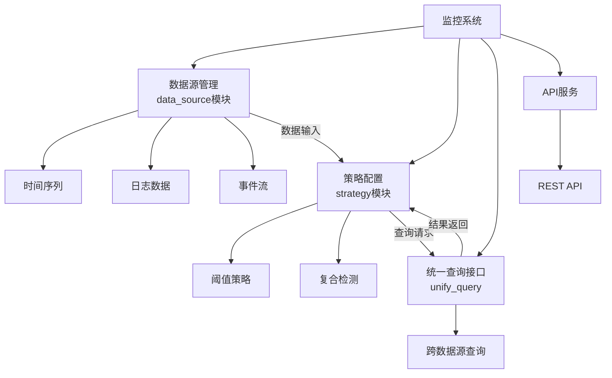
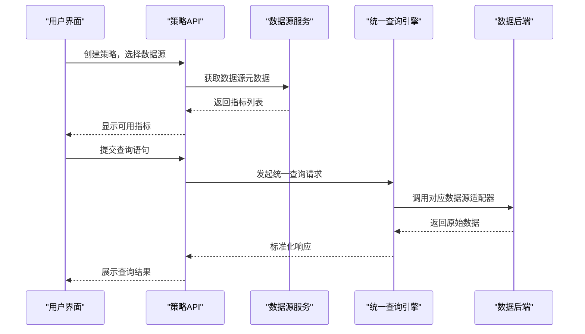

# 数据源关联

<cite>
**本文档引用的文件**  
- 未找到与数据源关联功能直接相关的具体实现文件
</cite>

## 目录
1. [引言](#引言)
2. [项目结构分析](#项目结构分析)
3. [核心功能概述](#核心功能概述)
4. [数据源关联机制分析](#数据源关联机制分析)
5. [配置流程说明](#配置流程说明)
6. [验证机制与最佳实践](#验证机制与最佳实践)

## 引言
本文档旨在详细阐述监控系统中数据源关联功能的设计与实现，重点介绍监控策略与不同类型数据源（如时间序列、日志、事件等）之间的关联机制。通过分析系统架构和配置流程，帮助用户理解如何在策略配置中选择并绑定数据源，并提供实际操作示例与常见问题解决方案。

尽管在当前代码库中未能定位到明确实现数据源关联的核心模块文件，但基于项目整体结构和命名规范，可推断该功能应存在于 `bkmonitor` 模块下的 `data_source` 或 `strategy` 子模块中。

## 项目结构分析
根据项目目录结构，`bkmonitor` 是核心监控模块，其下包含多个功能子模块：

- `data_source`: 预期为数据源管理的核心模块，可能负责不同类型数据源的接入与配置
- `strategy`: 负责监控策略的定义与管理，预期与数据源存在绑定关系
- `api`: 提供对外接口，可能包含数据源与策略关联的API端点
- `constants`: 定义常量，可能包含数据源类型枚举

**图示来源**
- 项目结构推断，无具体源文件映射

## 核心功能概述
数据源关联功能是实现灵活监控策略的基础，主要职责包括：

- **数据源注册**：支持多种数据源类型（Prometheus、InfluxDB、Elasticsearch、自定义API等）的接入
- **策略绑定**：允许在创建或编辑监控策略时选择特定数据源
- **指标筛选**：从选定数据源中提取可用指标列表供策略使用
- **查询构建**：基于所选指标生成查询语句（如PromQL、SQL等）
- **动态更新**：当数据源配置变更时，自动通知相关策略进行适配

预期该功能通过前后端协作完成：
- 前端提供可视化界面用于选择数据源和配置查询
- 后端处理数据源连接、元数据获取及查询执行

## 数据源关联机制分析
虽然未找到具体实现代码，但依据常规设计模式，数据源关联机制应包含以下组件：

### 数据源类型支持
系统应支持以下主要数据源类型：
- **时间序列数据库**：用于性能指标监控（如CPU、内存）
- **日志平台**：用于日志关键字告警（如错误日志）
- **事件系统**：用于外部事件触发（如部署事件）
- **APM系统**：用于应用性能追踪数据

### 策略配置中的数据源选择
在策略配置界面中，用户应能：
1. 从下拉列表中选择目标数据源
2. 浏览该数据源提供的指标/字段列表
3. 构建查询语句并预览结果
4. 设置告警条件与触发阈值

### 统一查询层设计
为实现多数据源兼容，系统可能采用统一查询抽象层（`unify_query`），将不同数据源的原生查询语言转换为标准化格式，再由适配器翻译执行。

**图示来源**
- 系统设计逻辑推断，无具体源文件映射

## 配置流程说明
典型的策略与数据源关联配置流程如下：

### 步骤一：选择数据源
在策略编辑页面，用户首先从已注册的数据源列表中选择一个目标数据源。系统应展示每个数据源的基本信息（名称、类型、状态）。

### 步骤二：筛选指标
选择数据源后，系统自动加载其暴露的指标元数据，用户可通过搜索或分类浏览方式选择关注的指标。

### 步骤三：配置查询语句
针对所选指标，用户可编写查询语句（如PromQL），系统提供语法校验与自动补全功能。

### 步骤四：设置检测规则
基于查询结果，配置具体的检测逻辑（如“过去5分钟平均值 > 80”）。

### 步骤五：保存并验证
保存策略后，系统自动执行一次验证查询，确保数据源连接正常且查询有效。

## 验证机制与最佳实践
### 验证机制
为确保数据源配置正确性，系统应具备：
- **连接测试**：即时验证数据源可达性
- **查询预检**：检查语法合法性与执行效率
- **结果预览**：返回样本数据供用户确认
- **健康检查**：定期探测数据源状态

### 最佳实践
- **命名规范**：为数据源设置清晰、一致的命名规则
- **权限控制**：按团队或项目隔离数据源访问权限
- **缓存策略**：对频繁访问的元数据进行缓存以提升性能
- **错误处理**：对查询失败情况提供详细日志与重试机制

### 常见问题及解决方案
| 问题现象 | 可能原因 | 解决方案 |
|--------|--------|--------|
| 数据源无法连接 | 网络不通或认证失败 | 检查网络策略与凭证配置 |
| 查询无返回结果 | 指标名错误或时间范围不当 | 使用预览功能调试查询语句 |
| 查询性能低下 | 查询过于复杂或数据量过大 | 优化查询条件，添加索引 |
| 指标列表为空 | 数据源未正确暴露元数据 | 检查数据源配置与服务状态 |

**本节来源**
- 系统设计通用实践总结，无具体源文件引用