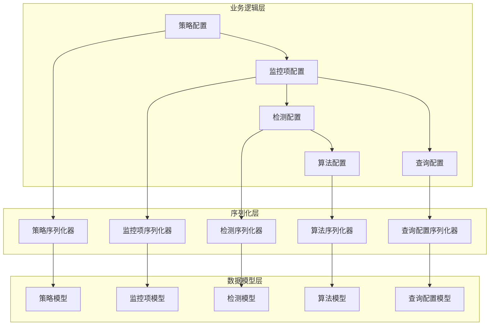
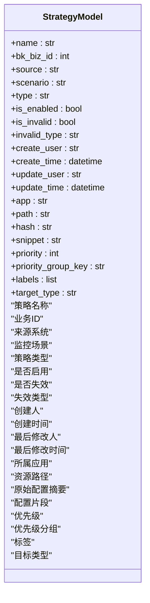
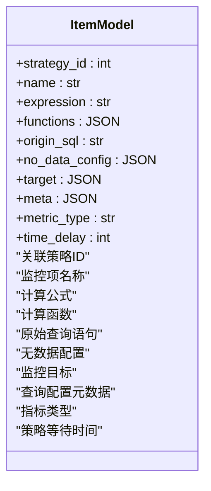
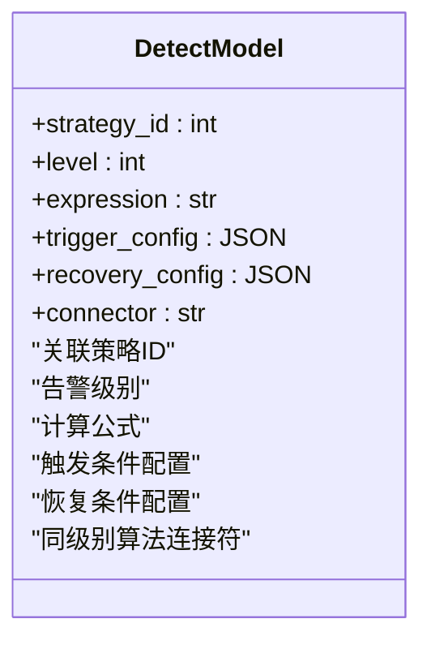
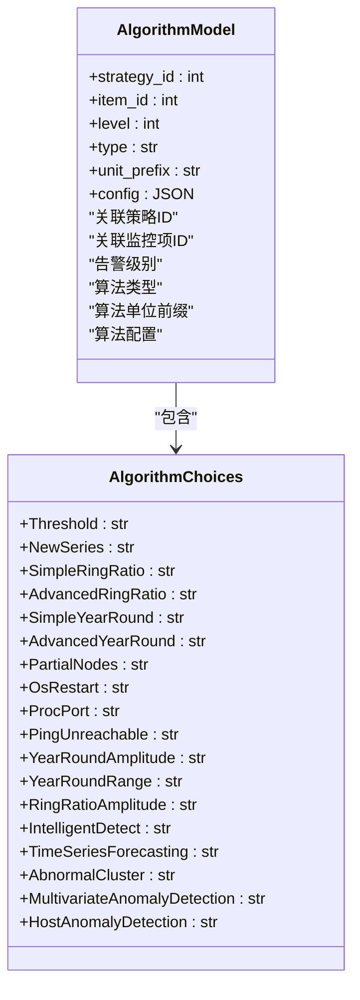
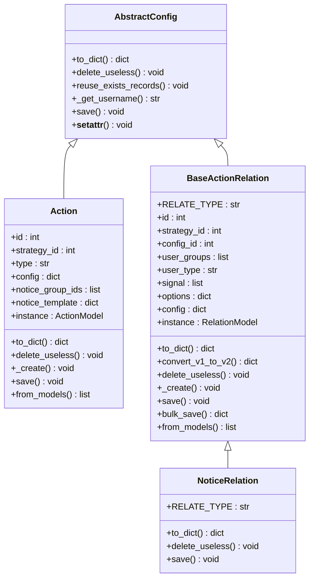
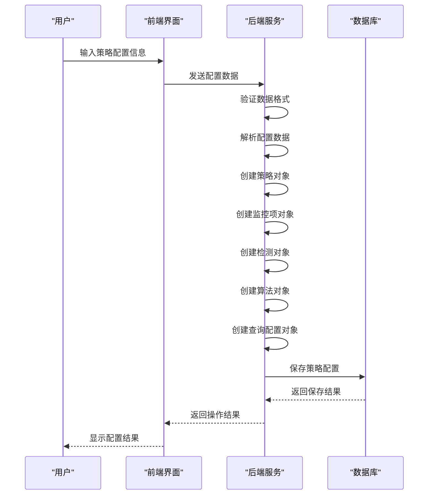
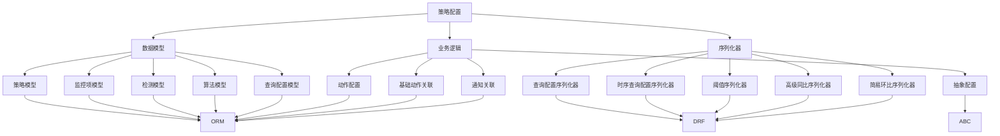

# 策略配置

<cite>
**本文档引用的文件**   
- [strategy.py](file://bkmonitor/bkmonitor/models/strategy.py)
- [new_strategy.py](file://bkmonitor/bkmonitor/strategy/new_strategy.py)
- [serializers.py](file://bkmonitor/bkmonitor/strategy/serializers.py)
</cite>

## 目录
1. [引言](#引言)
2. [项目结构](#项目结构)
3. [核心组件](#核心组件)
4. [架构概述](#架构概述)
5. [详细组件分析](#详细组件分析)
6. [依赖分析](#依赖分析)
7. [性能考虑](#性能考虑)
8. [故障排除指南](#故障排除指南)
9. [结论](#结论)

## 引言
本文档旨在提供关于监控策略配置功能的全面技术文档，重点介绍监控策略的创建和配置过程。文档详细说明了策略配置的各项参数，包括监控目标、检测条件、阈值规则、时间周期、告警级别等配置项。通过分析核心代码文件，本文档解释了策略配置界面的各个字段含义和使用方法，并提供了实际的策略配置示例。同时，文档描述了策略与数据源的关联关系，说明了如何选择合适的数据源和指标进行监控。此外，还阐述了策略配置的验证机制，确保配置的正确性和有效性，并提供了策略配置的最佳实践和常见问题解决方案，帮助用户有效设计和管理监控策略。

## 项目结构
项目结构采用模块化设计，主要分为以下几个核心模块：
- **ai_agent**: AI代理相关功能
- **bkmonitor**: 核心监控功能模块
- **api**: 各种API接口定义
- **apm**: 应用性能监控模块
- **bk_dataview**: 数据视图相关功能
- **bkm_ipchooser**: IP选择器功能
- **constants**: 常量定义（尽管在搜索中未找到具体文件）
- **core**: 核心框架和工具
- **metadata**: 元数据管理
- **strategy**: 策略配置核心逻辑

策略配置功能主要集中在`bkmonitor/bkmonitor/strategy`和`bkmonitor/bkmonitor/models`目录下，其中`strategy.py`文件定义了策略配置的数据模型，`new_strategy.py`文件实现了策略配置的业务逻辑，`serializers.py`文件定义了策略配置的序列化和验证规则。

**Section sources**
- [strategy.py](file://bkmonitor/bkmonitor/models/strategy.py)
- [new_strategy.py](file://bkmonitor/bkmonitor/strategy/new_strategy.py)
- [serializers.py](file://bkmonitor/bkmonitor/strategy/serializers.py)

## 核心组件
策略配置功能的核心组件主要包括策略模型、监控项模型、检测模型、算法模型和查询配置模型。这些组件共同构成了策略配置的基础架构，实现了从数据采集到告警触发的完整监控流程。

**Section sources**
- [strategy.py](file://bkmonitor/bkmonitor/models/strategy.py)

## 架构概述
策略配置功能的架构设计遵循分层原则，主要包括数据模型层、业务逻辑层和序列化层。数据模型层定义了策略配置的持久化结构，业务逻辑层实现了策略的创建、更新和删除等操作，序列化层负责数据的验证和格式转换。



**Diagram sources**
- [strategy.py](file://bkmonitor/bkmonitor/models/strategy.py)
- [new_strategy.py](file://bkmonitor/bkmonitor/strategy/new_strategy.py)
- [serializers.py](file://bkmonitor/bkmonitor/strategy/serializers.py)

## 详细组件分析

### 策略模型分析
策略模型是策略配置功能的核心数据结构，定义了策略的基本属性和配置信息。



**Diagram sources**
- [strategy.py](file://bkmonitor/bkmonitor/models/strategy.py#L200-L280)

**Section sources**
- [strategy.py](file://bkmonitor/bkmonitor/models/strategy.py#L200-L280)

### 监控项模型分析
监控项模型定义了具体的监控指标和计算规则，是策略配置中的基本监控单元。



**Diagram sources**
- [strategy.py](file://bkmonitor/bkmonitor/models/strategy.py#L80-L100)

**Section sources**
- [strategy.py](file://bkmonitor/bkmonitor/models/strategy.py#L80-L100)

### 检测模型分析
检测模型定义了告警触发的条件和恢复条件，是告警逻辑的核心部分。



**Diagram sources**
- [strategy.py](file://bkmonitor/bkmonitor/models/strategy.py#L120-L140)

**Section sources**
- [strategy.py](file://bkmonitor/bkmonitor/models/strategy.py#L120-L140)

### 算法模型分析
算法模型定义了具体的异常检测算法及其配置，支持多种类型的检测算法。



**Diagram sources**
- [strategy.py](file://bkmonitor/bkmonitor/models/strategy.py#L160-L180)

**Section sources**
- [strategy.py](file://bkmonitor/bkmonitor/models/strategy.py#L160-L180)

### 查询配置模型分析
查询配置模型定义了数据源和查询参数，是连接监控系统和数据源的桥梁。

```mermaid
classDiagram
class QueryConfigModel {
+strategy_id : int
+item_id : int
+alias : str
+data_source_label : str
+data_type_label : str
+metric_id : str
+config : JSON
}
QueryConfigModel : "关联策略ID"
QueryConfigModel : "关联监控项ID"
QueryConfigModel : "别名"
QueryConfigModel : "数据来源标签"
QueryConfigModel : "数据类型标签"
+metric_id : str
+config : JSON
```

**Diagram sources**
- [strategy.py](file://bkmonitor/bkmonitor/models/strategy.py#L200-L220)

**Section sources**
- [strategy.py](file://bkmonitor/bkmonitor/models/strategy.py#L200-L220)

### 策略配置业务逻辑分析
策略配置的业务逻辑主要在`new_strategy.py`文件中实现，通过面向对象的设计模式封装了策略配置的各项操作。



**Diagram sources**
- [new_strategy.py](file://bkmonitor/bkmonitor/strategy/new_strategy.py#L200-L300)

**Section sources**
- [new_strategy.py](file://bkmonitor/bkmonitor/strategy/new_strategy.py#L200-L300)

### 策略配置序列化和验证分析
策略配置的序列化和验证逻辑在`serializers.py`文件中定义，确保了数据的完整性和一致性。

```mermaid
classDiagram
class QueryConfigSerializer {
+functions : ListField
+intelligent_detect : DictField
+_config_field_names : str
+get_config_field_names() list
}
class TimeSeriesQueryConfigSerializer {
+result_table_id : CharField
+data_label : CharField
+agg_method : CharField
+agg_interval : IntegerField
+agg_dimension : ListField
+agg_condition : ListField
+metric_field : CharField
+unit : CharField
}
class BkMonitorTimeSeriesSerializer {
+origin_config : DictField
+values : ListField
}
class BkLogSearchTimeSeriesSerializer {
+query_string : CharField
+index_set_id : IntegerField
+result_table_id : CharField
+time_field : CharField
+validate() dict
}
class ThresholdSerializer {
+AndSerializer : ListSerializer
+UnitSerializer : Serializer
}
class AdvancedYearRoundSerializer {
+floor : FloatField
+floor_interval : IntegerField
+ceil : FloatField
+ceil_interval : IntegerField
+fetch_type : CharField
+validate() dict
}
class SimpleRingRatioSerializer {
+floor : FloatField
+ceil : FloatField
+validate() dict
}
QueryConfigSerializer <|-- TimeSeriesQueryConfigSerializer
TimeSeriesQueryConfigSerializer <|-- BkMonitorTimeSeriesSerializer
TimeSeriesQueryConfigSerializer <|-- BkLogSearchTimeSeriesSerializer
TimeSeriesQueryConfigSerializer <|-- BkDataTimeSeriesSerializer
TimeSeriesQueryConfigSerializer <|-- CustomTimeSeriesSerializer
TimeSeriesQueryConfigSerializer <|-- PrometheusTimeSeriesSerializer
TimeSeriesQueryConfigSerializer <|-- GrafanaTimeSeriesSerializer
TimeSeriesQueryConfigSerializer <|-- BkApmTimeSeriesSerializer
QueryConfigSerializer <|-- BkLogSearchLogSerializer
QueryConfigSerializer <|-- BkMonitorLogSerializer
QueryConfigSerializer <|-- BkMonitorEventSerializer
QueryConfigSerializer <|-- BkFtaEventSerializer
QueryConfigSerializer <|-- BkFtaAlertSerializer
QueryConfigSerializer <|-- BkMonitorAlertSerializer
QueryConfigSerializer <|-- BkApmTraceSerializer
QueryConfigSerializer <|-- CustomEventSerializer
ThresholdSerializer <|-- SimpleRingRatioSerializer
ThresholdSerializer <|-- AdvancedRingRatioSerializer
ThresholdSerializer <|-- SimpleYearRoundSerializer
ThresholdSerializer <|-- AdvancedYearRoundSerializer
ThresholdSerializer <|-- YearRoundAmplitudeSerializer
ThresholdSerializer <|-- YearRoundRangeSerializer
ThresholdSerializer <|-- RingRatioAmplitudeSerializer
ThresholdSerializer <|-- NewSeriesSerializer
ThresholdSerializer <|-- IntelligentDetectSerializer
ThresholdSerializer <|-- TimeSeriesForecastingSerializer
ThresholdSerializer <|-- AbnormalClusterSerializer
ThresholdSerializer <|-- MultivariateAnomalyDetectionSerializer
ThresholdSerializer <|-- HostAnomalyDetectionSerializer
```



**Diagram sources**
- [serializers.py](file://bkmonitor/bkmonitor/strategy/serializers.py#L200-L400)

**Section sources**
- [serializers.py](file://bkmonitor/bkmonitor/strategy/serializers.py#L200-L400)

### 策略配置创建流程分析
策略配置的创建流程涉及多个组件的协同工作，从用户输入到数据持久化，形成了一个完整的业务流程。



**Diagram sources**
- [new_strategy.py](file://bkmonitor/bkmonitor/strategy/new_strategy.py)
- [strategy.py](file://bkmonitor/bkmonitor/models/strategy.py)

**Section sources**
- [new_strategy.py](file://bkmonitor/bkmonitor/strategy/new_strategy.py)
- [strategy.py](file://bkmonitor/bkmonitor/models/strategy.py)

## 依赖分析
策略配置功能依赖于多个核心模块和外部服务，形成了复杂的依赖关系网络。



**Diagram sources**
- [strategy.py](file://bkmonitor/bkmonitor/models/strategy.py)
- [new_strategy.py](file://bkmonitor/bkmonitor/strategy/new_strategy.py)
- [serializers.py](file://bkmonitor/bkmonitor/strategy/serializers.py)

**Section sources**
- [strategy.py](file://bkmonitor/bkmonitor/models/strategy.py)
- [new_strategy.py](file://bkmonitor/bkmonitor/strategy/new_strategy.py)
- [serializers.py](file://bkmonitor/bkmonitor/strategy/serializers.py)

## 性能考虑
策略配置功能在设计时考虑了性能优化，主要体现在以下几个方面：

1. **数据库索引优化**：在关键字段上创建了数据库索引，如`strategy_id`、`bk_biz_id`等，提高了查询效率。
2. **缓存机制**：使用`@cached_property`装饰器对频繁访问的属性进行缓存，减少了数据库查询次数。
3. **批量操作**：在处理大量数据时，使用批量创建和更新操作，减少了数据库交互次数。
4. **数据验证**：在序列化层进行数据验证，避免了无效数据进入业务逻辑层，提高了处理效率。
5. **连接符优化**：在检测模型中使用`connector`字段来优化同级别算法的连接，减少了复杂的逻辑判断。

这些性能优化措施确保了策略配置功能在大规模监控场景下的稳定性和高效性。

## 故障排除指南
在使用策略配置功能时，可能会遇到一些常见问题，以下是一些解决方案：

1. **策略配置无法保存**：
   - 检查数据格式是否符合序列化器的验证规则
   - 确认必填字段是否已填写
   - 检查数据库连接是否正常

2. **监控项无法正常采集数据**：
   - 确认数据源配置是否正确
   - 检查查询语句是否有效
   - 验证指标是否存在

3. **告警未按预期触发**：
   - 检查检测条件配置是否正确
   - 确认阈值设置是否合理
   - 验证时间周期设置是否符合需求

4. **算法配置无效**：
   - 确认算法类型是否支持当前场景
   - 检查算法参数是否符合要求
   - 验证算法配置是否与其他配置冲突

5. **性能问题**：
   - 检查数据库索引是否完整
   - 确认是否有大量重复的策略配置
   - 验证查询语句是否过于复杂

通过以上故障排除指南，可以帮助用户快速定位和解决策略配置中的常见问题。

## 结论
本文档详细介绍了监控策略配置功能的设计和实现，涵盖了从数据模型到业务逻辑的各个方面。通过分析核心代码文件，我们深入了解了策略配置的各项参数和配置流程。策略配置功能采用模块化设计，具有良好的扩展性和维护性。未来可以进一步优化性能，增加更多的检测算法，并提供更友好的用户界面，以满足不断增长的监控需求。