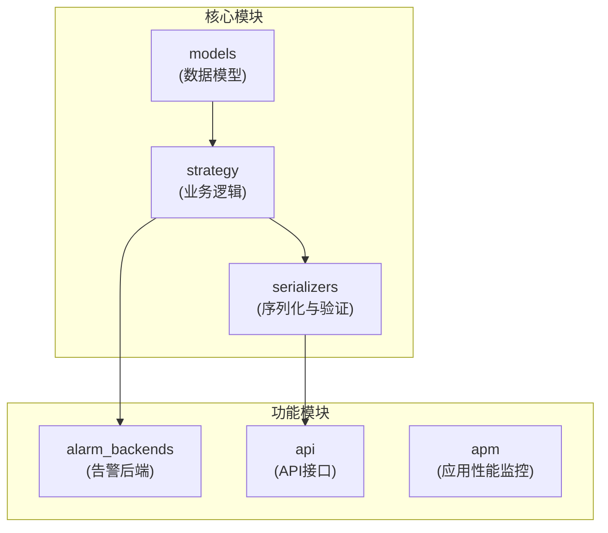
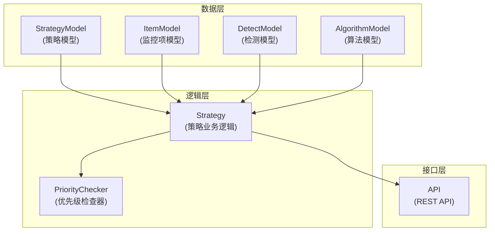
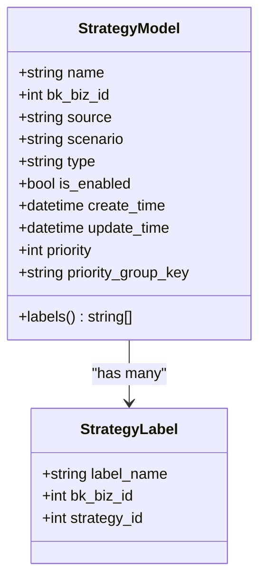
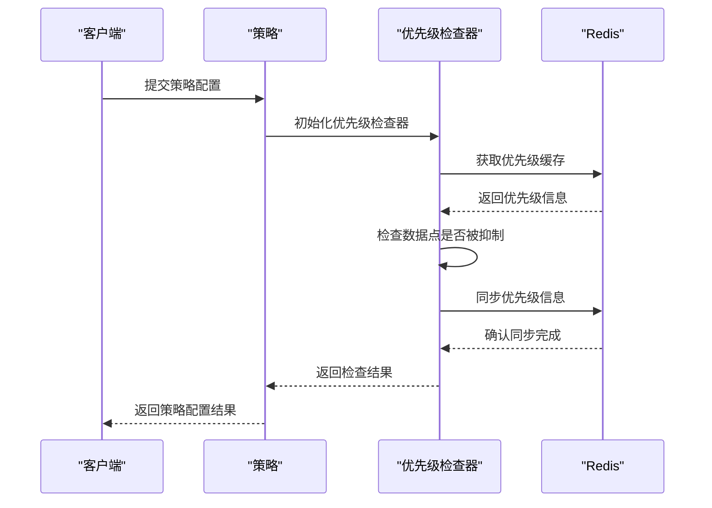
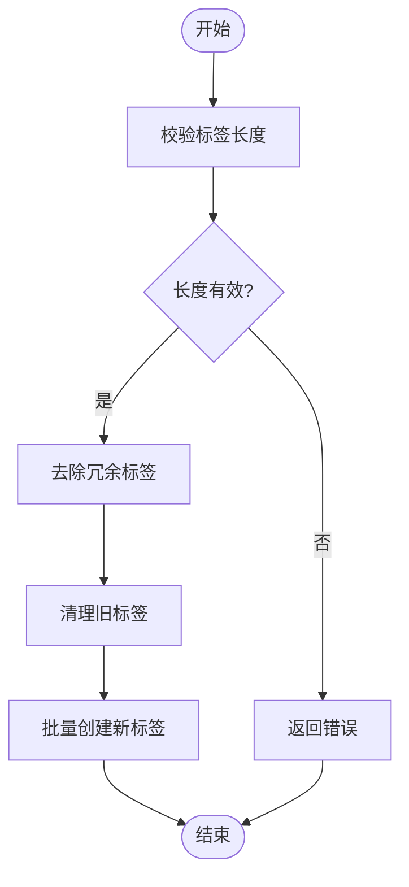
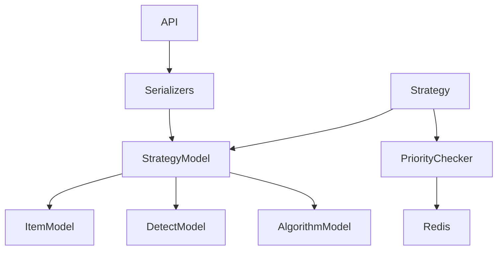

# 高级配置

<cite>
**本文档引用的文件**   
- [strategy.py](file://bkmonitor\bkmonitor\models\strategy.py)
- [new_strategy.py](file://bkmonitor\bkmonitor\strategy\new_strategy.py)
- [serializers.py](file://bkmonitor\bkmonitor\strategy\serializers.py)
- [priority.py](file://bkmonitor\alarm_backends\service\access\priority.py)
</cite>

## 目录
1. [引言](#引言)
2. [项目结构](#项目结构)
3. [核心组件](#核心组件)
4. [架构概述](#架构概述)
5. [详细组件分析](#详细组件分析)
6. [依赖分析](#依赖分析)
7. [性能考虑](#性能考虑)
8. [故障排除指南](#故障排除指南)
9. [结论](#结论)

## 引言
本文档旨在详细阐述监控策略的高级配置功能，重点介绍策略的执行计划、调度规则、优先级设置、标签管理等高级功能。通过深入分析代码实现，本文将解释复杂调度表达式的配置方法，如Cron表达式、周期性执行规则等，并描述策略优先级对告警处理的影响。同时，文档还将说明标签在策略分类和管理中的应用，提供高级配置的实际案例，并阐述高级配置的验证和测试方法，以确保配置的正确性。

## 项目结构
项目结构清晰地划分了不同的功能模块，其中与策略高级配置相关的代码主要集中在`bkmonitor`目录下的`models`、`strategy`和`serializers`子目录中。`models`目录包含了策略、监控项、检测配置等核心数据模型的定义；`strategy`目录包含了策略的业务逻辑实现；`serializers`目录则包含了策略配置的序列化和验证逻辑。

**图源**
- [strategy.py](file://bkmonitor\bkmonitor\models\strategy.py)
- [new_strategy.py](file://bkmonitor\bkmonitor\strategy\new_strategy.py)
- [serializers.py](file://bkmonitor\bkmonitor\strategy\serializers.py)

**章节源**
- [strategy.py](file://bkmonitor\bkmonitor\models\strategy.py)
- [new_strategy.py](file://bkmonitor\bkmonitor\strategy\new_strategy.py)

## 核心组件
策略高级配置的核心组件主要包括策略模型（StrategyModel）、监控项模型（ItemModel）、检测模型（DetectModel）和算法模型（AlgorithmModel）。这些模型共同定义了策略的执行计划、调度规则、优先级和标签等高级配置。

**章节源**
- [strategy.py](file://bkmonitor\bkmonitor\models\strategy.py)

## 架构概述
系统架构采用分层设计，从数据模型到业务逻辑再到API接口，各层之间通过清晰的接口进行交互。策略高级配置的实现主要依赖于数据模型层的定义和业务逻辑层的处理。

**图源**
- [strategy.py](file://bkmonitor\bkmonitor\models\strategy.py)
- [new_strategy.py](file://bkmonitor\bkmonitor\strategy\new_strategy.py)

## 详细组件分析
### 策略模型分析
策略模型（StrategyModel）是高级配置的核心，它包含了策略的名称、业务ID、来源系统、监控场景、策略类型、启用状态、创建和更新信息等基本属性。此外，它还定义了优先级（priority）和优先级分组键（priority_group_key）等高级配置字段。

**图源**
- [strategy.py](file://bkmonitor\bkmonitor\models\strategy.py)

**章节源**
- [strategy.py](file://bkmonitor\bkmonitor\models\strategy.py)

### 优先级配置分析
优先级配置通过`PriorityChecker`类实现，该类负责检查数据点是否被抑制，并同步优先级信息。优先级信息存储在Redis中，以哈希表的形式保存，键为维度分组，值为优先级/时间戳的组合字段。

**图源**
- [priority.py](file://bkmonitor\alarm_backends\service\access\priority.py)

**章节源**
- [priority.py](file://bkmonitor\alarm_backends\service\access\priority.py)

### 标签管理分析
标签管理通过`StrategyLabel`模型实现，每个策略可以关联多个标签。标签以路径形式存储，如`/a/b/c/`，支持多级标签结构。标签的保存和清理通过`save_labels`方法实现，该方法会校验标签长度，并去除冗余标签。

**图源**
- [new_strategy.py](file://bkmonitor\bkmonitor\strategy\new_strategy.py)

**章节源**
- [new_strategy.py](file://bkmonitor\bkmonitor\strategy\new_strategy.py)

## 依赖分析
策略高级配置的实现依赖于多个组件，包括数据模型、业务逻辑、序列化器和外部服务。各组件之间的依赖关系如下图所示：

**图源**
- [strategy.py](file://bkmonitor\bkmonitor\models\strategy.py)
- [new_strategy.py](file://bkmonitor\bkmonitor\strategy\new_strategy.py)
- [serializers.py](file://bkmonitor\bkmonitor\strategy\serializers.py)

**章节源**
- [strategy.py](file://bkmonitor\bkmonitor\models\strategy.py)
- [new_strategy.py](file://bkmonitor\bkmonitor\strategy\new_strategy.py)
- [serializers.py](file://bkmonitor\bkmonitor\strategy\serializers.py)

## 性能考虑
在实现策略高级配置时，需要考虑性能问题。例如，优先级信息的存储和查询应尽量高效，避免频繁的数据库操作。此外，标签的校验和去重也应优化算法，以减少计算开销。

## 故障排除指南
在配置策略高级功能时，可能会遇到各种问题。以下是一些常见问题及其解决方案：
- **优先级配置无效**：检查`priority_group_key`是否正确设置，确保Redis服务正常运行。
- **标签保存失败**：检查标签长度是否超过128个字符，确保没有冗余标签。
- **调度规则不生效**：检查时间范围配置是否正确，确保时区设置无误。

**章节源**
- [strategy.py](file://bkmonitor\bkmonitor\models\strategy.py)
- [new_strategy.py](file://bkmonitor\bkmonitor\strategy\new_strategy.py)

## 结论
本文档详细介绍了监控策略的高级配置功能，包括执行计划、调度规则、优先级设置和标签管理。通过深入分析代码实现，我们了解了这些功能的具体实现方式和注意事项。在实际应用中，合理配置这些高级功能可以显著提升监控系统的灵活性和效率。