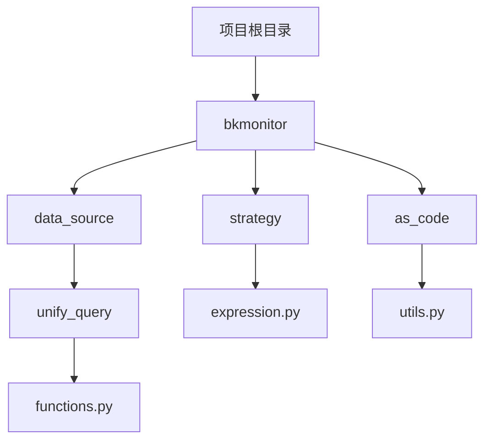
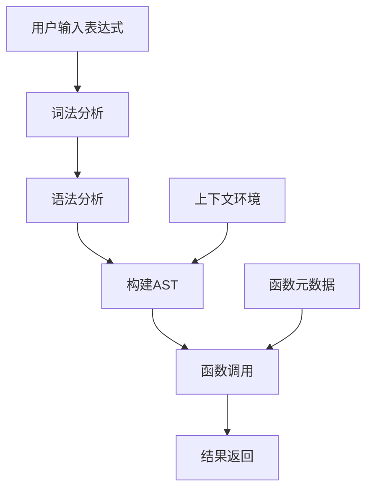
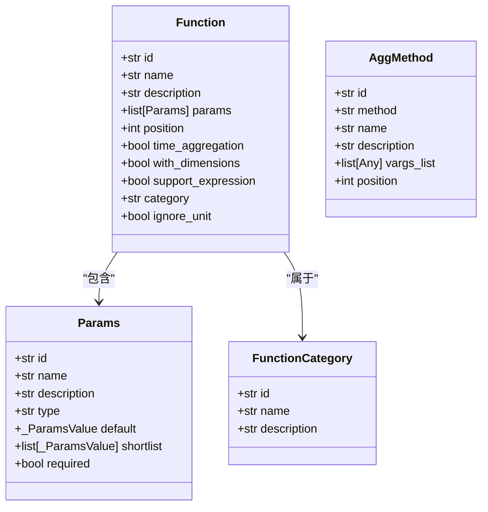
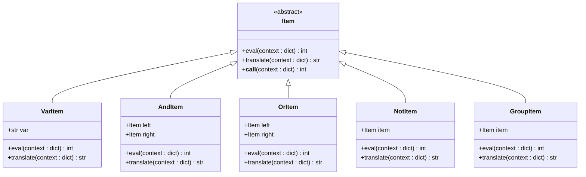
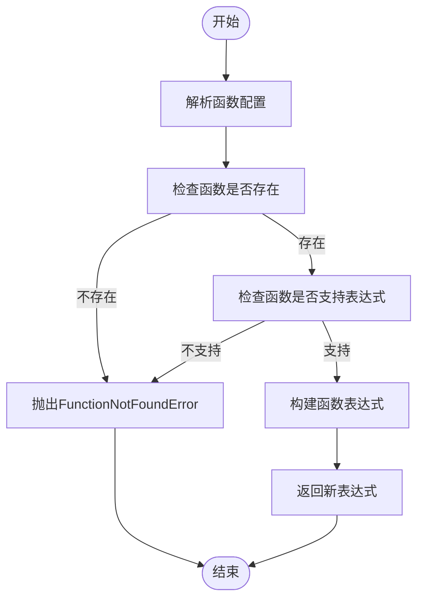
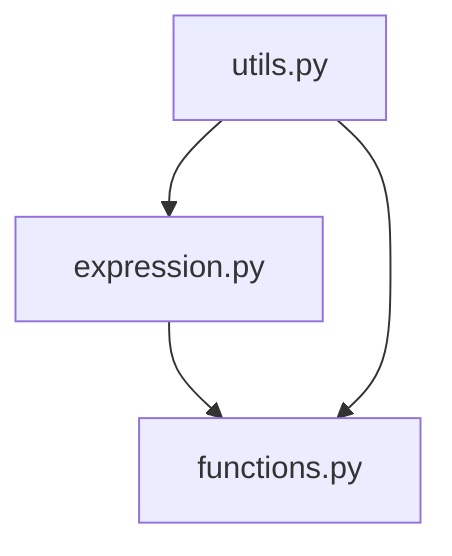

# 内置函数

<cite>
**本文档中引用的文件**   
- [expression.py](file://bkmonitor/bkmonitor/strategy/expression.py)
- [functions.py](file://bkmonitor/bkmonitor/data_source/unify_query/functions.py)
- [utils.py](file://bkmonitor/bkmonitor/as_code/utils.py)
</cite>

## 目录
1. [简介](#简介)
2. [项目结构](#项目结构)
3. [核心组件](#核心组件)
4. [架构概述](#架构概述)
5. [详细组件分析](#详细组件分析)
6. [依赖分析](#依赖分析)
7. [性能考虑](#性能考虑)
8. [故障排除指南](#故障排除指南)
9. [结论](#结论)

## 简介
本文档系统介绍了监控平台中表达式支持的各种内置函数及其应用场景。详细说明了聚合函数（如sum、avg、max、min等）、时间函数（如time_range、window等）、数学函数（如abs、round、sqrt等）和条件函数（如if、case等）的参数定义、返回值和使用方法。文档还解释了函数的调用语法和参数传递规则，提供了各类函数的具体使用示例，涵盖了常见的监控分析需求。此外，文档描述了函数在表达式执行过程中的调用机制和性能特征，并说明了自定义函数的扩展方法和限制条件。

## 项目结构
项目结构显示了内置函数相关的模块主要分布在`bkmonitor`目录下的`data_source/unify_query`和`strategy`子目录中。`functions.py`文件定义了所有内置函数的元数据，而`expression.py`文件实现了表达式的解析和执行逻辑。

**图示来源**
- [functions.py](file://bkmonitor/bkmonitor/data_source/unify_query/functions.py)
- [expression.py](file://bkmonitor/bkmonitor/strategy/expression.py)
- [utils.py](file://bkmonitor/bkmonitor/as_code/utils.py)

## 核心组件
核心组件包括`functions.py`中定义的函数元数据和`expression.py`中实现的表达式解析器。`functions.py`文件使用`dataclass`定义了`Function`、`AggMethod`等类，用于描述函数的ID、名称、参数、分类等信息。`expression.py`文件使用PLY（Python Lex-Yacc）库实现了表达式的词法和语法解析。

**组件来源**
- [functions.py](file://bkmonitor/bkmonitor/data_source/unify_query/functions.py#L1-L510)
- [expression.py](file://bkmonitor/bkmonitor/strategy/expression.py#L1-L241)

## 架构概述
系统架构采用分层设计，上层是表达式解析和执行层，下层是函数定义和管理层。表达式解析器将用户输入的表达式字符串解析为抽象语法树（AST），然后根据上下文环境求值。函数管理层通过`Functions`字典集中管理所有内置函数的元数据。

**图示来源**
- [expression.py](file://bkmonitor/bkmonitor/strategy/expression.py#L1-L241)
- [functions.py](file://bkmonitor/bkmonitor/data_source/unify_query/functions.py#L1-L510)

## 详细组件分析
### 函数元数据组件分析
`functions.py`文件定义了`Function`类，用于描述内置函数的元数据。每个函数都有唯一的ID、名称、描述、参数列表、分类等属性。函数按功能分为多个类别，如"指标变化"、"数学计算"、"排序"和"时间偏移"。

**图示来源**
- [functions.py](file://bkmonitor/bkmonitor/data_source/unify_query/functions.py#L1-L510)

### 表达式解析组件分析
`expression.py`文件实现了表达式的词法和语法解析。词法分析器将输入字符串分解为Token流，语法分析器根据预定义的语法规则构建抽象语法树（AST）。AST的节点类型包括`VarItem`（变量）、`AndItem`（与操作）、`OrItem`（或操作）、`NotItem`（非操作）和`GroupItem`（分组）。

**图示来源**
- [expression.py](file://bkmonitor/bkmonitor/strategy/expression.py#L1-L241)

### 函数调用机制分析
函数调用机制通过`add_expression_functions`函数实现。该函数接收一个表达式字符串和一个函数配置列表，将函数应用到表达式上。函数调用遵循特定的语法格式，如`function(expression, param1, param2)`或`function(param1, param2, expression)`，具体取决于函数的`position`属性。

**图示来源**
- [functions.py](file://bkmonitor/bkmonitor/data_source/unify_query/functions.py#L479-L508)

## 依赖分析
系统依赖关系清晰，`expression.py`依赖于`functions.py`中的函数元数据，`utils.py`中的工具函数依赖于`functions.py`和`expression.py`。这种分层依赖结构确保了代码的模块化和可维护性。

**图示来源**
- [expression.py](file://bkmonitor/bkmonitor/strategy/expression.py)
- [functions.py](file://bkmonitor/bkmonitor/data_source/unify_query/functions.py)
- [utils.py](file://bkmonitor/bkmonitor/as_code/utils.py)

## 性能考虑
函数执行性能主要受表达式复杂度和数据量影响。简单的数学函数（如abs、round）执行速度快，而涉及大量数据聚合的函数（如sum_over_time）可能需要较长时间。建议在编写表达式时尽量简化逻辑，避免嵌套过深的函数调用。

## 故障排除指南
常见问题包括函数名拼写错误、参数数量不匹配、不支持的函数组合等。错误处理机制会抛出相应的异常，如`FunctionNotFoundError`、`ParamRequiredError`等。调试时应检查函数名是否正确、参数是否完整、函数是否支持在当前上下文中使用。

**组件来源**
- [functions.py](file://bkmonitor/bkmonitor/data_source/unify_query/functions.py#L26-L49)
- [expression.py](file://bkmonitor/bkmonitor/strategy/expression.py#L1-L241)

## 结论
本文档全面介绍了监控平台中表达式内置函数的设计和实现。通过分析核心组件和架构，我们了解了函数的定义、解析和执行机制。文档还提供了详细的使用示例和故障排除指南，为开发者和用户提供了一个完整的参考。未来可以考虑支持自定义函数扩展，以满足更复杂的监控需求。