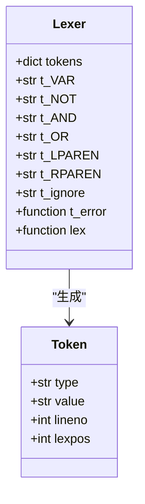
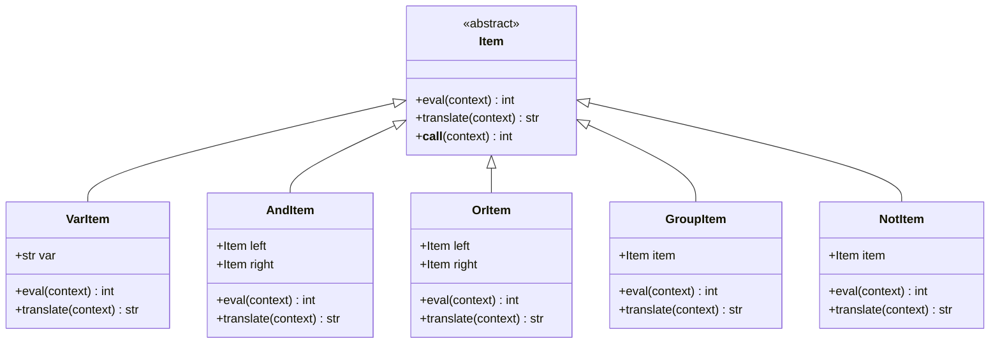
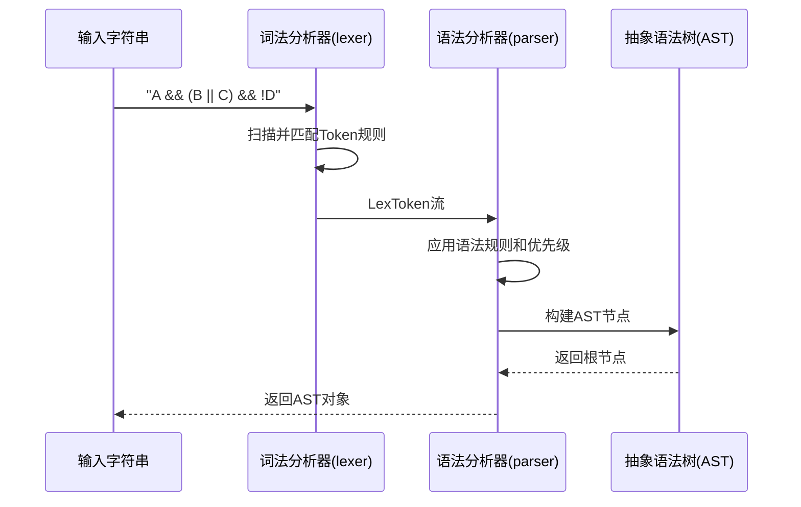

# 基础语法

<cite>
**本文档中引用的文件**   
- [expression.py](file://bkmonitor\bkmonitor\strategy\expression.py)
- [parsetab.py](file://bkmonitor\bkmonitor\strategy\parsetab.py)
</cite>

## 目录
1. [简介](#简介)
2. [词法结构](#词法结构)
3. [语法规则](#语法规则)
4. [运算符优先级与结合性](#运算符优先级与结合性)
5. [表达式解析过程](#表达式解析过程)
6. [书写格式要求](#书写格式要求)
7. [使用示例](#使用示例)
8. [错误处理](#错误处理)
9. [正确与错误使用示例](#正确与错误使用示例)

## 简介

本文档详细介绍了蓝鲸监控平台中多告警关联策略所使用的表达式基础语法。该表达式语法用于定义告警关联规则，通过逻辑运算符组合多个告警条件。表达式语法基于PLY（Python Lex-Yacc）库实现，包含词法分析和语法分析两个阶段。文档将从词法结构、语法规则、优先级规则、书写格式等方面全面解析表达式语法，并提供使用示例和错误处理机制说明。

**Section sources**
- [expression.py](file://bkmonitor\bkmonitor\strategy\expression.py#L1-L20)

## 词法结构

表达式的词法结构定义了构成表达式的最基本元素，即词法单元（Token）。词法分析器将输入的表达式字符串分解为一系列Token，供后续的语法分析使用。

### 标识符（VAR）

标识符用于表示变量或告警条件，对应Token类型为`VAR`。在表达式中，标识符通常代表一个具体的告警项或监控指标。

- **匹配规则**：`r"\w+"`，即一个或多个字母、数字或下划线组成的字符串。
- **示例**：`A`、`CPU_USAGE`、`memory`等都是合法的标识符。

### 常量

在当前表达式语法中，没有显式的数值常量或字符串常量，但通过上下文（context）字典提供变量的值。这些值在求值阶段被解释为状态值。

### 分隔符与运算符

表达式语法定义了以下分隔符和运算符：

- **非运算符 (NOT)**：`!`，用于逻辑取反。
- **与运算符 (AND)**：`&&`，用于逻辑与操作。
- **或运算符 (OR)**：`||`，用于逻辑或操作。
- **左括号 (LPAREN)**：`(`，用于改变运算优先级。
- **右括号 (RPAREN)**：`)`，用于改变运算优先级。

### 空白字符处理

- **忽略空格**：词法分析器通过`t_ignore = " "`规则明确忽略所有空格字符。这意味着在表达式中添加空格不会影响其语法结构，仅用于提高可读性。
- **其他空白字符**：制表符、换行符等未在`t_ignore`中定义，因此会被视为非法字符并触发词法错误。



**Diagram sources**
- [expression.py](file://bkmonitor\bkmonitor\strategy\expression.py#L30-L50)

**Section sources**
- [expression.py](file://bkmonitor\bkmonitor\strategy\expression.py#L30-L65)

## 语法规则

表达式的语法规则定义了如何将词法单元组合成合法的表达式。语法规则采用BNF（巴科斯-诺尔范式）风格的规则定义，由一系列产生式组成。

### 基本结构

表达式的基本结构由以下产生式定义：

```ebnf
expression : NOT expression
         | expression OR expression
         | expression AND expression
         | VAR
         | LPAREN expression RPAREN
```

这表示一个表达式可以是：
1. 一个`NOT`后跟另一个表达式（逻辑非）
2. 两个表达式用`OR`连接（逻辑或）
3. 两个表达式用`AND`连接（逻辑与）
4. 一个变量标识符（VAR）
5. 一个用括号包围的表达式

### 语法产生式详解

根据`parsetab.py`文件中的`_lr_productions`列表，可以明确看到所有语法产生式：

- **S' -> expression**：起始符号，表示整个输入必须是一个表达式。
- **expression -> NOT expression**：定义了逻辑非操作，对应`p_expression_not`函数。
- **expression -> expression OR expression**：定义了逻辑或操作，对应`p_expression_or`函数。
- **expression -> expression AND expression**：定义了逻辑与操作，对应`p_expression_and`函数。
- **expression -> VAR**：定义了变量引用，对应`p_expression_var`函数。
- **expression -> LPAREN expression RPAREN**：定义了括号分组，对应`p_expression_group`函数。

### 抽象语法树（AST）

语法分析器将合法的表达式字符串解析为一个抽象语法树（AST）。AST的节点由`Item`类及其子类表示：



**Diagram sources**
- [expression.py](file://bkmonitor\bkmonitor\strategy\expression.py#L68-L148)

**Section sources**
- [expression.py](file://bkmonitor\bkmonitor\strategy\expression.py#L68-L148)
- [parsetab.py](file://bkmonitor\bkmonitor\strategy\parsetab.py#L182-L187)

## 运算符优先级与结合性

运算符的优先级和结合性决定了表达式中运算的执行顺序，避免了歧义。

### 优先级规则

在`expression.py`文件中，通过`precedence`元组定义了运算符的优先级：

```python
precedence = (
    ("left", "AND", "OR"),
    ("right", "N_NOT"),
)
```

该定义表示：
1. **第一级（最低优先级）**：`AND`和`OR`具有相同的优先级，且为左结合（left associative）。
2. **第二级（最高优先级）**：`N_NOT`（即`NOT`）具有更高的优先级，且为右结合（right associative）。

这意味着：
- `NOT`运算符的优先级高于`AND`和`OR`。
- `AND`和`OR`的优先级相同，但低于`NOT`。
- 当`AND`和`OR`同时出现时，由于它们优先级相同且左结合，表达式从左到右计算。

### 结合性规则

- **左结合 (left)**：对于`AND`和`OR`，左结合意味着`A && B && C`被解释为`(A && B) && C`，而不是`A && (B && C)`。虽然对于逻辑与和或运算，这两种分组在数学上是等价的，但左结合性定义了明确的计算顺序。
- **右结合 (right)**：对于`NOT`，右结合意味着`!!A`被解释为`!( !A )`，这符合逻辑非的常规理解。

### 优先级示例

考虑表达式 `A || B && !C`：
1. 首先，`!C`具有最高优先级，最先计算。
2. 然后，`B && (!C)`次之。
3. 最后，`A || (B && (!C))`。

如果没有优先级规则，这个表达式可能会产生歧义。括号可以显式地改变优先级，例如 `(A || B) && !C` 会先计算 `A || B`。

**Section sources**
- [expression.py](file://bkmonitor\bkmonitor\strategy\expression.py#L150-L155)

## 表达式解析过程

表达式的解析过程分为两个阶段：词法分析和语法分析。

### 词法分析阶段

词法分析阶段将输入的字符串转换为标记流（Token Stream）。这个过程由`lexer`对象完成。

1. **输入**：一个字符串，例如 `"A && (B || C) && !D"`。
2. **处理**：词法分析器根据预定义的规则（`t_VAR`, `t_AND`等）扫描字符串。
3. **输出**：一系列`LexToken`对象，每个对象包含类型（type）、值（value）、行号（lineno）和位置（lexpos）。

例如，输入 `"A && (B || C) && !D"` 会被解析为：
- `LexToken(VAR,'A',1,0)`
- `LexToken(AND,'&&',1,2)`
- `LexToken(LPAREN,'(',1,5)`
- ... (依此类推)

如果遇到无法匹配的字符（如`@`），`t_error`函数会被调用，抛出`ValueError`异常。

### 语法分析阶段

语法分析阶段将标记流构造成抽象语法树（AST）。

1. **输入**：来自词法分析器的标记流。
2. **处理**：语法分析器（`yacc.yacc`创建的`parser`）根据语法规则和优先级表，使用LALR(1)算法进行分析。
3. **输出**：一个`Item`类的实例，代表整个表达式的AST。

语法分析器通过调用预定义的`p_`开头的函数（如`p_expression_and`）来构建AST节点。例如，当解析器识别出`expression AND expression`模式时，会调用`p_expression_and`函数，创建一个`AndItem`对象。



**Diagram sources**
- [expression.py](file://bkmonitor\bkmonitor\strategy\expression.py#L1-L240)

**Section sources**
- [expression.py](file://bkmonitor\bkmonitor\strategy\expression.py#L1-L240)

## 书写格式要求

### 大小写敏感性

- **标识符大小写**：表达式中的标识符（VAR）是**不区分大小写**的。在`VarItem.eval`方法中，代码将上下文（context）中的所有键转换为小写，并将变量名也转换为小写进行匹配。
- **运算符大小写**：运算符（`&&`, `||`, `!`）是固定的符号，不涉及大小写问题。

### 空白字符处理

- **空格**：如前所述，空格字符被完全忽略。`A&&B`和`A && B`是等价的。
- **其他空白字符**：制表符（\t）、换行符（\n）等未被`t_ignore`规则处理，因此被视为非法字符，会导致词法分析错误。

### 注释语法

当前表达式语法**不支持**任何形式的注释（如`//`或`/* */`）。任何非定义的字符都会导致解析错误。

**Section sources**
- [expression.py](file://bkmonitor\bkmonitor\strategy\expression.py#L50-L55)
- [expression.py](file://bkmonitor\bkmonitor\strategy\expression.py#L85-L95)

## 使用示例

### 基本使用

通过`parse_expression`函数可以解析一个表达式字符串，返回一个可调用的AST对象。

```python
# 解析表达式
expr = parse_expression("A && B || !C")

# 定义上下文（变量值）
context = {"A": 20, "B": 10, "C": 20}  # 20: 异常, 10: 正常

# 求值
result = expr.eval(context)  # 或者直接调用 expr(context)
print(result)  # 输出结果
```

### 状态值定义

表达式求值的结果是基于`AlertExpressionValue`类定义的状态值：
- `ABNORMAL = 20` (异常)
- `NORMAL = 10` (正常)
- `NO_DATA = 0` (无数据)

运算规则：
- `AND` (`AndItem.eval`)：取两个操作数的**最小值**（最差状态）。
- `OR` (`OrItem.eval`)：取两个操作数的**最大值**（最好状态）。
- `NOT` (`NotItem.eval`)：状态转换，异常变正常，正常变异常，无数据保持不变。

**Section sources**
- [expression.py](file://bkmonitor\bkmonitor\strategy\expression.py#L200-L240)

## 错误处理

表达式解析和求值过程中可能遇到多种错误，系统提供了相应的错误处理机制。

### 词法错误

当输入字符串包含无法识别的字符时，会触发词法错误。

- **触发点**：`t_error`函数。
- **错误类型**：`ValueError`。
- **错误信息**：包含非法字符及其位置，例如 `"Illegal character '@' at position 5"`。

### 语法错误

当输入的字符串不符合语法规则时，会触发语法错误。

- **触发点**：`p_error`函数。
- **错误类型**：`ValueError`。
- **错误信息**：
  - 如果在解析过程中遇到错误Token：`"Syntax error at '非法Token' at position X"`。
  - 如果在输入结束时仍有未完成的表达式（如缺少右括号）：`"Syntax error at EOF"`。

### 运行时错误

在求值阶段可能遇到的错误。

- **未定义变量**：当上下文（context）中不存在表达式引用的变量时。
  - **触发点**：`VarItem.eval`方法中的`KeyError`。
  - **错误类型**：`ValueError`。
  - **错误信息**：`"variable 'X' is not defined"`。

**Section sources**
- [expression.py](file://bkmonitor\bkmonitor\strategy\expression.py#L58-L63)
- [expression.py](file://bkmonitor\bkmonitor\strategy\expression.py#L215-L220)
- [expression.py](file://bkmonitor\bkmonitor\strategy\expression.py#L85-L95)

## 正确与错误使用示例

### 正确使用示例

| 表达式 | 说明 |
| :--- | :--- |
| `A && B` | A和B都为真时结果为真。 |
| `A || B` | A或B任一为真时结果为真。 |
| `!A` | A为假时结果为真。 |
| `(A || B) && C` | A或B为真，且C为真时结果为真。括号确保了正确的运算顺序。 |
| `A && B && C` | A、B、C都为真时结果为真。左结合性确保了从左到右计算。 |
| `A || B || C` | A、B、C任一为真时结果为真。 |

### 错误使用示例

| 表达式 | 错误原因 |
| :--- | :--- |
| `A & B` | 使用了错误的与运算符。正确应为`&&`，`&`是非法字符。 |
| `A | B` | 使用了错误的或运算符。正确应为`||`，单个`|`是非法字符。 |
| `NOT A` | 使用了错误的非运算符。正确应为`!A`，`NOT`是非法字符。 |
| `A && (B || C` | 缺少右括号，导致语法错误（EOF错误）。 |
| `()` | 空括号，内部没有表达式，不符合`LPAREN expression RPAREN`的语法规则。 |
| `A @ B` | 包含非法字符`@`，触发词法错误。 |
| `expr.eval({"X": 10})` (当表达式含`A`) | 运行时错误，变量`A`在上下文中未定义。 |