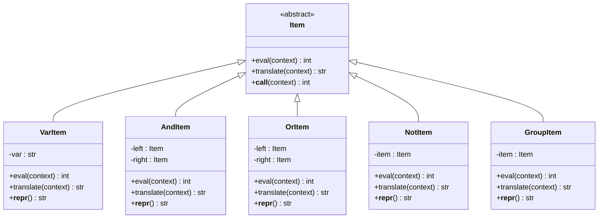

# 表达式示例

<cite>
**本文档中引用的文件**   
- [expression.py](file://bkmonitor/bkmonitor/strategy/expression.py)
- [__init__.py](file://bkmonitor/bkmonitor/as_code/ply/expression/__init__.py)
- [parsetab.py](file://bkmonitor/bkmonitor/strategy/parsetab.py)
- [dashboard_panel_to_query_config.md](file://bkmonitor/packages/monitor_web/strategies/docs/dashboard_panel_to_query_config.md)
</cite>

## 目录
1. [表达式语法基础](#表达式语法基础)
2. [常见监控场景表达式](#常见监控场景表达式)
3. [复合条件表达式](#复合条件表达式)
4. [表达式调试技巧](#表达式调试技巧)
5. [表达式优化建议](#表达式优化建议)

## 表达式语法基础

监控系统中的表达式用于定义告警触发条件，其语法基于PLY（Python Lex-Yacc）实现，支持逻辑运算、函数调用和复杂条件组合。表达式语法定义了变量、操作符和函数的使用规则。



**图示来源**
- [expression.py](file://bkmonitor/bkmonitor/strategy/expression.py#L100-L200)

**本节来源**
- [expression.py](file://bkmonitor/bkmonitor/strategy/expression.py#L1-L240)

## 常见监控场景表达式

### 阈值告警

阈值告警是最常见的监控场景，当某个指标超过预设阈值时触发告警。例如，CPU使用率超过80%时触发告警。

**场景描述**：监控服务器CPU使用率，当使用率持续高于80%时发出告警通知，防止系统过载。

**表达式代码**：
```python
cpu_usage > 80
```

**执行结果解释**：当CPU使用率指标值大于80时，表达式返回True，触发告警；否则返回False，不触发告警。

**适用条件**：适用于需要对单一指标设置硬性阈值的场景，如CPU、内存、磁盘使用率等资源监控。

### 趋势分析

趋势分析用于检测指标的持续变化趋势，而不仅仅是瞬时值。例如，内存使用率持续上升。

**场景描述**：监控应用内存使用情况，当内存使用率在连续多个采样周期内持续上升时发出预警，提前发现内存泄漏问题。

**表达式代码**：
```python
trend(memory_usage, "upward", 5)
```

**执行结果解释**：`trend`函数检测内存使用率在过去5个周期内的变化趋势，当趋势为"upward"（上升）时返回True，触发预警。

**适用条件**：适用于需要预测未来问题的场景，如内存泄漏、存储空间耗尽等缓慢恶化的问题。

### 异常检测

异常检测用于识别不符合正常模式的行为，如请求错误率突增。

**场景描述**：监控Web服务的请求错误率，当错误率突然从正常水平（如1%）飙升至10%以上时立即告警，快速响应服务故障。

**表达式代码**：
```python
error_rate > 10 AND delta(error_rate, 1) > 5
```

**执行结果解释**：表达式包含两个条件：当前错误率大于10%，且与1分钟前相比错误率增加了5个百分点以上。只有当两个条件同时满足时才触发告警。

**适用条件**：适用于需要检测突发性异常的场景，如服务故障、网络攻击等。

## 复合条件表达式

复合条件表达式结合多个监控指标和逻辑运算符，实现更复杂的告警策略。

### 磁盘空间不足且IO等待时间过长

**场景描述**：当服务器磁盘空间不足（低于20%）且磁盘IO等待时间过长（超过100ms）时触发告警，这种情况可能导致系统性能严重下降甚至服务中断。

**表达式代码**：
```python
(disk_usage > 80 AND io_wait_time > 100) OR (disk_usage > 90)
```

**执行结果解释**：表达式使用了逻辑或（OR）和逻辑与（AND）运算符。当磁盘使用率超过80%且IO等待时间超过100ms，或者磁盘使用率超过90%时，表达式返回True，触发告警。这种设计确保了在极端情况下（磁盘几乎满）即使IO正常也会告警。

**适用条件**：适用于需要综合多个相关指标进行判断的场景，提高告警的准确性和实用性。

### 多服务关联告警

**场景描述**：在微服务架构中，当核心服务A异常且其依赖的服务B也异常时触发告警，避免因单点故障导致的误报。

**表达式代码**：
```python
(service_a_status == "abnormal") AND (service_b_status == "abnormal")
```

**执行结果解释**：只有当服务A和服务B的状态都为"abnormal"（异常）时，表达式才返回True。这种关联告警可以减少因网络抖动等临时问题导致的误报。

**适用条件**：适用于复杂的分布式系统，需要考虑服务间依赖关系的场景。

## 表达式调试技巧

### 逐步验证法

对于复杂的表达式，建议采用逐步验证的方法来确保其正确性。

**技巧说明**：将复杂表达式分解为多个简单的子表达式，逐个测试每个子表达式的输出，确保每个部分都按预期工作。

**示例**：
```python
# 复杂表达式
(cpu_usage > 80 AND memory_usage > 70) OR (disk_io_wait > 200 AND network_latency > 100)

# 分解验证
# 1. 验证CPU和内存条件
cpu_memory_condition = cpu_usage > 80 AND memory_usage > 70

# 2. 验证IO和网络条件  
io_network_condition = disk_io_wait > 200 AND network_latency > 100

# 3. 验证最终逻辑
final_condition = cpu_memory_condition OR io_network_condition
```

通过这种方式，可以快速定位表达式中的问题所在。

### 上下文模拟测试

使用模拟的上下文数据测试表达式，确保其在各种情况下都能正确评估。

**技巧说明**：创建包含各种可能值的测试上下文，运行表达式并验证输出是否符合预期。

**示例**：
```python
# 测试上下文
test_contexts = [
    {"cpu_usage": 85, "memory_usage": 75, "disk_io_wait": 50, "network_latency": 30},
    {"cpu_usage": 70, "memory_usage": 60, "disk_io_wait": 250, "network_latency": 150},
    {"cpu_usage": 90, "memory_usage": 80, "disk_io_wait": 300, "network_latency": 200},
]

# 测试表达式
for context in test_contexts:
    result = parse_expression("...").eval(context)
    print(f"Context: {context}, Result: {result}")
```

**本节来源**
- [expression.py](file://bkmonitor/bkmonitor/strategy/expression.py#L200-L240)

## 表达式优化建议

### 避免过度复杂的表达式

虽然系统支持复杂的表达式，但应尽量保持表达式的简洁性。过于复杂的表达式不仅难以维护，还可能影响性能。

**建议**：将复杂的逻辑拆分为多个简单的告警策略，或者使用专门的分析规则来处理复杂逻辑。

### 合理使用括号

在表达式中合理使用括号可以明确运算优先级，提高表达式的可读性。

**建议**：即使运算符优先级已知，也建议使用括号来明确表达意图，避免因优先级误解导致的错误。

### 考虑性能影响

复杂的表达式可能需要更多的计算资源，特别是在高频率采样的情况下。

**建议**：对于计算密集型的表达式（如涉及大量历史数据的趋势分析），适当降低采样频率或使用预计算的指标。

**本节来源**
- [expression.py](file://bkmonitor/bkmonitor/strategy/expression.py#L1-L240)
- [__init__.py](file://bkmonitor/bkmonitor/as_code/ply/expression/__init__.py#L1-L60)