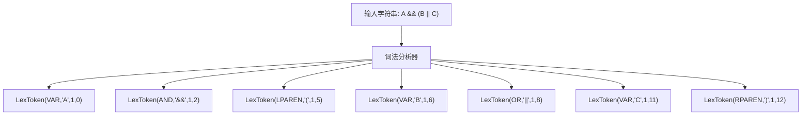
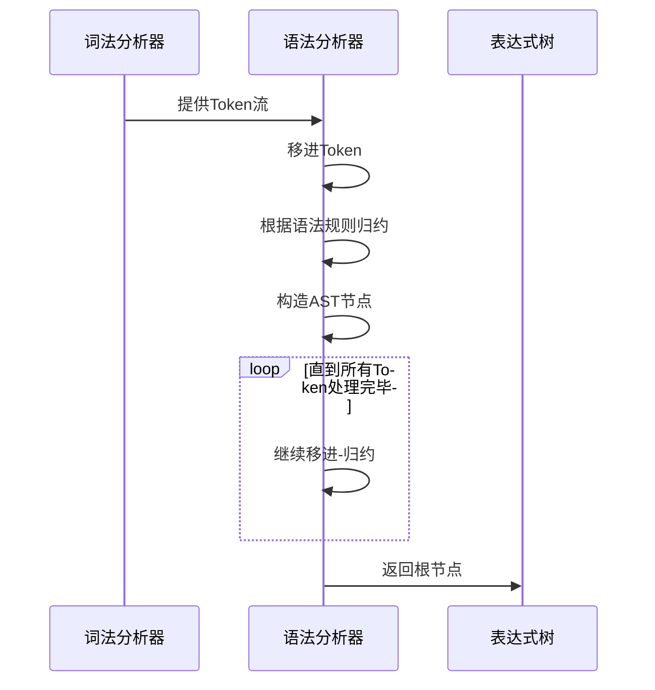
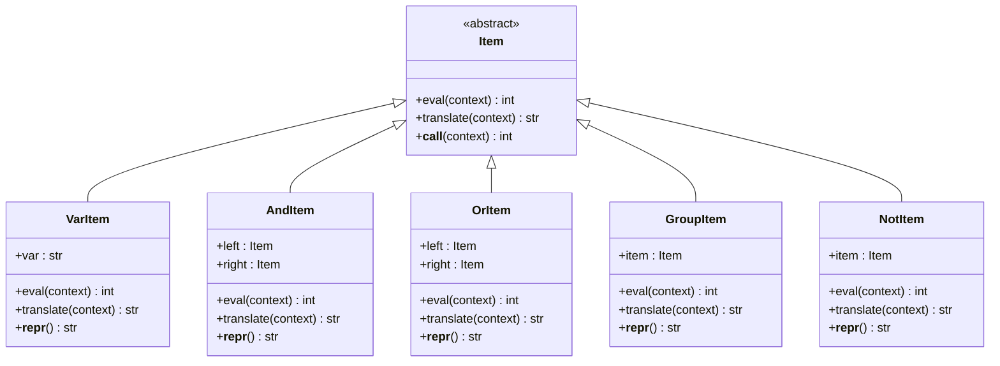

# 表达式语法

<cite>
**本文档中引用的文件**  
- [expression.py](file://bkmonitor\bkmonitor\strategy\expression.py)
</cite>

## 目录
1. [简介](#简介)
2. [表达式语法结构](#表达式语法结构)
3. [运算符支持](#运算符支持)
4. [表达式解析机制](#表达式解析机制)
5. [表达式树结构](#表达式树结构)
6. [变量引用与上下文](#变量引用与上下文)
7. [表达式求值逻辑](#表达式求值逻辑)
8. [错误处理](#错误处理)
9. [使用示例](#使用示例)
10. [最佳实践](#最佳实践)

## 简介
蓝鲸监控平台的策略表达式语法用于定义多告警关联规则，支持逻辑运算和复杂条件判断。该表达式系统基于PLY（Python Lex-Yacc）实现，采用经典的词法分析和语法分析流程，将字符串形式的表达式转换为可执行的表达式树结构。本文档详细说明表达式语法的结构、解析过程、执行机制及使用方法。

**Section sources**
- [expression.py](file://bkmonitor\bkmonitor\strategy\expression.py#L1-L20)

## 表达式语法结构
策略表达式采用类C语言的逻辑表达式语法，支持变量、括号、逻辑非、逻辑与、逻辑或等基本元素。表达式由原子项（变量）和操作符构成，通过括号控制运算优先级。

### 基本语法示例
```text
A && (B || C) && !D
```
此表达式表示：A为真，且（B或C为真），且D为假。

### 语法规则
表达式遵循以下BNF范式：
- expression → NOT expression
- expression → expression OR expression  
- expression → expression AND expression
- expression → VAR
- expression → LPAREN expression RPAREN

其中：
- **VAR**：变量标识符，匹配正则表达式 `\w+`
- **NOT**：逻辑非操作符，符号为 `!`
- **AND**：逻辑与操作符，符号为 `&&`
- **OR**：逻辑或操作符，符号为 `||`
- **LPAREN**：左括号，符号为 `(`
- **RPAREN**：右括号，符号为 `)`

**Section sources**
- [expression.py](file://bkmonitor\bkmonitor\strategy\expression.py#L70-L75)

## 运算符支持
表达式系统支持以下逻辑运算符，具有明确的优先级和结合性。

### 运算符优先级
| 优先级 | 运算符 | 结合性 | 说明 |
|--------|--------|--------|------|
| 高 | `!` | 右结合 | 逻辑非 |
| 中 | `&&` | 左结合 | 逻辑与 |
| 低 | `\|\|` | 左结合 | 逻辑或 |

### 运算符说明
- **逻辑非（!）**：一元运算符，对操作数取反
- **逻辑与（&&）**：二元运算符，当且仅当两个操作数均为真时结果为真
- **逻辑或（\|\|）**：二元运算符，当至少一个操作数为真时结果为真

运算符优先级通过`precedence`元组定义：
```python
precedence = (
    ("left", "AND", "OR"),
    ("right", "N_NOT"),
)
```

**Section sources**
- [expression.py](file://bkmonitor\bkmonitor\strategy\expression.py#L171-L175)

## 表达式解析机制
表达式解析采用两阶段处理：词法分析（Lexing）和语法分析（Parsing）。

### 词法分析
词法分析器将输入字符串分解为Token流。每个Token包含类型、值、行号和位置信息。



**Diagram sources**
- [expression.py](file://bkmonitor\bkmonitor\strategy\expression.py#L77-L95)

### 语法分析
语法分析器根据预定义的语法规则，将Token流构造成表达式树。采用LALR(1)分析算法，通过移进-归约过程构建抽象语法树。



**Diagram sources**
- [expression.py](file://bkmonitor\bkmonitor\strategy\expression.py#L171-L191)

## 表达式树结构
解析后的表达式被构造成一棵树形数据结构，每个节点对应一个表达式元素。

### 节点类型


**Diagram sources**
- [expression.py](file://bkmonitor\bkmonitor\strategy\expression.py#L98-L218)

### 示例表达式树
表达式 `A && (B || C) && !D` 的树结构：
```text
AndItem(
  AndItem(
    VarItem(A),
    GroupItem(
      OrItem(
        VarItem(B), 
        VarItem(C)
      )
    )
  ),
  NotItem(VarItem(D))
)
```

## 变量引用与上下文
表达式中的变量通过上下文字典进行求值，支持大小写不敏感的变量查找。

### 变量求值规则
- 变量名在上下文中查找时忽略大小写
- 如果变量未定义，抛出`ValueError`异常
- 上下文字典提供变量到状态值的映射

```python
class VarItem(Item):
    def eval(self, context: dict = None) -> int:
        try:
            context = context or {}
            lower_context = {k.lower(): v for k, v in context.items()}
            return lower_context[self.var.lower()]
        except KeyError:
            raise ValueError("variable '%s' is not defined" % self.var)
```

**Section sources**
- [expression.py](file://bkmonitor\bkmonitor\strategy\expression.py#L108-L117)

## 表达式求值逻辑
表达式求值采用递归方式，从根节点开始计算整个表达式的值。

### 状态值定义
```python
class AlertExpressionValue:
    ABNORMAL = 20  # 异常
    NORMAL = 10    # 正常
    NO_DATA = 0    # 无数据
```

### 运算规则
- **AND运算**：取两个操作数的最小状态值
- **OR运算**：取两个操作数的最大状态值
- **NOT运算**：
  - 异常 ↔ 正常
  - 无数据保持不变

```python
class AndItem(Item):
    def eval(self, context: dict = None) -> int:
        return min(self.left.eval(context), self.right.eval(context))

class OrItem(Item):
    def eval(self, context: dict = None) -> int:
        return max(self.left.eval(context), self.right.eval(context))
```

**Section sources**
- [expression.py](file://bkmonitor\bkmonitor\strategy\expression.py#L63-L66)
- [expression.py](file://bkmonitor\bkmonitor\strategy\expression.py#L128-L167)

## 错误处理
系统提供完善的错误处理机制，捕获并报告表达式解析和求值过程中的错误。

### 错误类型
- **词法错误**：遇到非法字符时抛出`ValueError`
- **语法错误**：表达式结构不符合语法规则时抛出`ValueError`
- **运行时错误**：变量未定义时抛出`ValueError`

### 错误处理代码
```python
def t_error(t):
    raise ValueError("Illegal character '%s' at position %d" % (t.value, t.lexpos))

def p_error(p):
    if p:
        raise ValueError("Syntax error at '%s' at position %d" % (p.value, p.lexpos))
    else:
        raise ValueError("Syntax error at EOF")
```

**Section sources**
- [expression.py](file://bkmonitor\bkmonitor\strategy\expression.py#L97-L100)
- [expression.py](file://bkmonitor\bkmonitor\strategy\expression.py#L219-L225)

## 使用示例
### 基本使用
```python
# 解析表达式
expr = parse_expression("A && B")

# 求值
result = expr.eval({"A": 20, "B": 10})  # 返回 10 (NORMAL)
result = expr({"A": 20, "B": 10})       # 等价于上一行
```

### 复杂表达式
```python
# 解析复杂表达式
expr = parse_expression("A && (B || C) && !D")

# 在上下文中求值
context = {
    "A": 20,  # 异常
    "B": 0,   # 无数据
    "C": 20,  # 异常
    "D": 10   # 正常
}
result = expr(context)  # 返回 20 (ABNORMAL)
```

### 表达式转换
```python
# 将表达式转换为字符串（可进行变量替换）
translated = expr.translate({"A": "主机CPU使用率过高"})
# 结果: "主机CPU使用率过高 && (B || C) && !D"
```

**Section sources**
- [expression.py](file://bkmonitor\bkmonitor\strategy\expression.py#L238-L239)

## 最佳实践
### 1. 括号明确优先级
即使运算符有优先级，也建议使用括号明确表达意图：
```python
# 推荐
expr = "A && (B || C)"

# 不推荐（虽然语法正确，但可读性差）
expr = "A && B || C"
```

### 2. 变量命名规范
- 使用有意义的变量名
- 建议使用大写字母或驼峰命名
- 避免使用单个字母（除简单测试外）

### 3. 错误处理
在生产环境中使用时，应捕获可能的异常：
```python
try:
    expr = parse_expression(user_input)
    result = expr(context)
except ValueError as e:
    logger.error(f"表达式解析失败: {e}")
    # 处理错误情况
```

### 4. 性能考虑
- 解析器是线程安全的，可以共享`parser`实例
- 对于频繁使用的表达式，建议缓存解析结果
- 避免在循环中重复解析相同的表达式